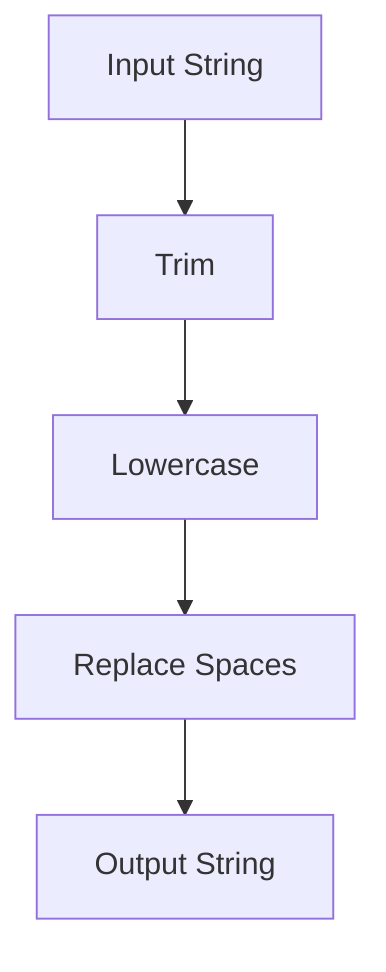

## 3.4. Higher-Order Functions and Function Composition

In the realm of functional programming, higher-order functions and function composition are foundational concepts that empower developers to write concise, reusable, and expressive code. Clojure, as a functional language, embraces these principles, providing a rich set of tools to manipulate functions and data seamlessly. In this section, we will delve into the intricacies of higher-order functions and function composition, exploring their significance and application in Clojure.

### Understanding Higher-Order Functions

Higher-order functions are functions that can take other functions as arguments or return them as results. This capability allows for a high degree of abstraction and modularity in code. In Clojure, higher-order functions are ubiquitous, enabling developers to build complex operations from simple, reusable components.

#### Key Characteristics of Higher-Order Functions

1. **Function as Argument**: A higher-order function can accept one or more functions as parameters.
2. **Function as Return Value**: It can return a function as its result.
3. **Abstraction and Reusability**: By abstracting common patterns, higher-order functions promote code reuse and reduce redundancy.

#### Common Higher-Order Functions in Clojure

Clojure provides several built-in higher-order functions that are essential for data processing and transformation. Let's explore some of these functions with examples.

##### `map`

The `map` function applies a given function to each element of a collection, returning a new collection of results.

```clojure
;; Example: Using map to square each number in a list
(def numbers [1 2 3 4 5])

(defn square [x]
  (* x x))

(def squared-numbers (map square numbers))
;; => (1 4 9 16 25)

;; Using an anonymous function
(def squared-numbers-anon (map #( * % %) numbers))
;; => (1 4 9 16 25)
```

##### `filter`

The `filter` function selects elements from a collection that satisfy a predicate function, returning a new collection of those elements.

```clojure
;; Example: Filtering even numbers from a list
(defn even? [x]
  (zero? (mod x 2)))

(def even-numbers (filter even? numbers))
;; => (2 4)

;; Using an anonymous function
(def even-numbers-anon (filter #(zero? (mod % 2)) numbers))
;; => (2 4)
```

##### `reduce`

The `reduce` function processes elements of a collection using a binary function, accumulating a single result.

```clojure
;; Example: Summing numbers in a list
(def sum (reduce + numbers))
;; => 15

;; Using a custom function
(defn sum-fn [acc x]
  (+ acc x))

(def sum-custom (reduce sum-fn 0 numbers))
;; => 15
```

### Function Composition in Clojure

Function composition is the process of combining two or more functions to produce a new function. This technique is invaluable for creating complex operations from simpler ones, enhancing code readability and maintainability.

#### The `comp` Function

The `comp` function in Clojure is used to compose multiple functions into a single function. The composed function applies the rightmost function first and the leftmost function last.

```clojure
;; Example: Composing functions to convert a string to uppercase and then reverse it
(defn uppercase [s]
  (.toUpperCase s))

(defn reverse-str [s]
  (apply str (reverse s)))

(def transform (comp reverse-str uppercase))

(def result (transform "clojure"))
;; => "ERUJOLC"
```

#### The `partial` Function

The `partial` function creates a new function by pre-filling some arguments of an existing function. This is useful for creating specialized versions of more general functions.

```clojure
;; Example: Creating a partially applied function to add 10 to a number
(def add (partial + 10))

(def result (add 5))
;; => 15
```

### Advantages of Function Composition

1. **Code Reusability**: By composing functions, we can reuse existing functions to create new functionality without rewriting code.
2. **Improved Readability**: Composed functions often express the intent of the code more clearly, making it easier to understand.
3. **Modularity**: Function composition encourages breaking down complex tasks into smaller, manageable functions.

### Practical Examples

Let's explore some practical examples to solidify our understanding of higher-order functions and function composition in Clojure.

#### Example 1: Data Transformation Pipeline

Suppose we have a list of numbers, and we want to filter out odd numbers, square the remaining numbers, and then sum them up.

```clojure
(def numbers [1 2 3 4 5 6 7 8 9 10])

(defn process-numbers [nums]
  (->> nums
       (filter even?)
       (map square)
       (reduce +)))

(def result (process-numbers numbers))
;; => 220
```

In this example, we use the threading macro `->>` to create a pipeline that processes the numbers step by step.

#### Example 2: Composing String Manipulations

Let's create a composed function that trims whitespace, converts a string to lowercase, and then replaces spaces with hyphens.

```clojure
(defn trim [s]
  (.trim s))

(defn lowercase [s]
  (.toLowerCase s))

(defn replace-spaces [s]
  (clojure.string/replace s " " "-"))

(def transform-string (comp replace-spaces lowercase trim))

(def result (transform-string "  Hello World  "))
;; => "hello-world"
```

### Visualizing Function Composition

To better understand function composition, let's visualize the process using a flowchart.



This flowchart represents the sequence of transformations applied to the input string, resulting in the final output.

### Try It Yourself

Experiment with the code examples provided. Try modifying the functions or creating new compositions to see how they behave. For instance, you could:

- Change the predicate in the `filter` function to select odd numbers instead.
- Create a new composed function that first reverses a string and then converts it to uppercase.
- Use `partial` to create a function that multiplies a number by a fixed factor.

### References and Further Reading

- [Clojure Documentation](https://clojure.org/reference)
- [Functional Programming Concepts](https://en.wikipedia.org/wiki/Functional_programming)
- [Higher-Order Functions](https://en.wikipedia.org/wiki/Higher-order_function)

### Knowledge Check

To reinforce your understanding, let's test your knowledge with some questions.

## **Ready to Test Your Knowledge?**



### What is a higher-order function?

- [x] A function that takes other functions as arguments or returns them as results.
- [ ] A function that only performs arithmetic operations.
- [ ] A function that cannot be composed with other functions.
- [ ] A function that is always recursive.

> **Explanation:** Higher-order functions can take other functions as arguments or return them as results, allowing for greater abstraction and code reuse.

### Which function is used to apply a function to each element of a collection?

- [x] map
- [ ] filter
- [ ] reduce
- [ ] comp

> **Explanation:** The `map` function applies a given function to each element of a collection, returning a new collection of results.

### What does the `comp` function do in Clojure?

- [x] Composes multiple functions into a single function.
- [ ] Filters elements from a collection.
- [ ] Reduces a collection to a single value.
- [ ] Partially applies a function.

> **Explanation:** The `comp` function composes multiple functions into a single function, applying the rightmost function first.

### How does the `partial` function work?

- [x] It creates a new function by pre-filling some arguments of an existing function.
- [ ] It filters elements from a collection.
- [ ] It reduces a collection to a single value.
- [ ] It composes multiple functions into one.

> **Explanation:** The `partial` function creates a new function by pre-filling some arguments of an existing function, allowing for specialization.

### What is the result of `(reduce + [1 2 3 4])`?

- [x] 10
- [ ] 24
- [ ] 0
- [ ] 1

> **Explanation:** The `reduce` function processes elements of a collection using a binary function, accumulating a single result. In this case, it sums the numbers, resulting in 10.

### Which of the following is NOT a higher-order function?

- [ ] map
- [ ] filter
- [ ] reduce
- [x] println

> **Explanation:** `println` is not a higher-order function because it does not take other functions as arguments or return them as results.

### What is the advantage of function composition?

- [x] Code reusability and improved readability.
- [ ] It makes code more complex.
- [ ] It reduces the number of functions needed.
- [ ] It eliminates the need for higher-order functions.

> **Explanation:** Function composition promotes code reusability and improves readability by allowing complex operations to be built from simpler functions.

### What does `(comp inc dec)` return when applied to 5?

- [x] 5
- [ ] 6
- [ ] 4
- [ ] 10

> **Explanation:** `(comp inc dec)` first applies `dec` to 5, resulting in 4, and then applies `inc`, resulting in 5.

### How can you create a function that multiplies a number by 2 using `partial`?

- [x] `(partial * 2)`
- [ ] `(partial + 2)`
- [ ] `(partial / 2)`
- [ ] `(partial - 2)`

> **Explanation:** `(partial * 2)` creates a function that multiplies its argument by 2.

### True or False: Function composition can only be used with higher-order functions.

- [ ] True
- [x] False

> **Explanation:** Function composition can be used with any functions, not just higher-order functions.



Remember, mastering higher-order functions and function composition is a journey. As you continue to explore these concepts, you'll discover new ways to write elegant and efficient Clojure code. Keep experimenting, stay curious, and enjoy the journey!
