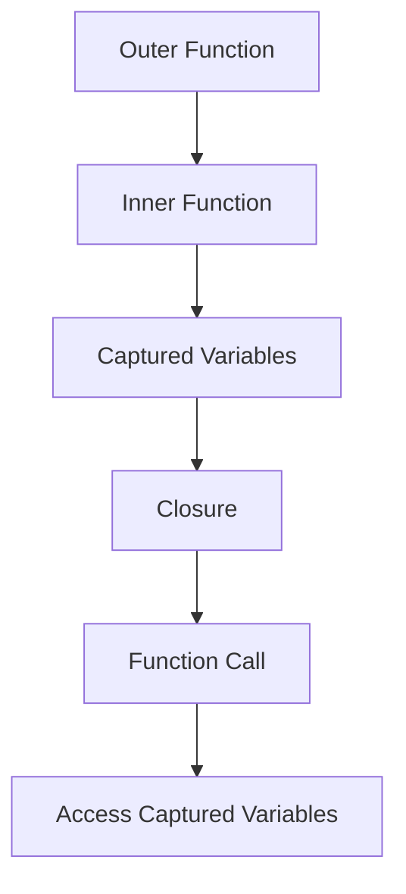

## 3.5. Closures and Lexical Scope

Closures and lexical scope are foundational concepts in functional programming, particularly in Clojure. Understanding these concepts is crucial for mastering Clojure's functional programming paradigm, allowing you to write more efficient, elegant, and maintainable code. In this section, we will explore what closures and lexical scope are, how they work in Clojure, and how they can be used to manage state and encapsulate functionality.

### What Are Closures?

A closure is a function that captures the lexical scope in which it was defined. This means that a closure can access variables from its surrounding environment even after that environment has finished executing. Closures are a powerful tool in functional programming because they allow functions to maintain state across invocations without relying on global variables.

### Understanding Lexical Scope

Lexical scope, also known as static scope, refers to the region in the source code where a variable is defined and can be accessed. In Clojure, as in many other programming languages, the scope of a variable is determined by its position in the source code. This means that a function defined within another function can access the variables of the outer function, even after the outer function has completed execution.

### Creating Closures in Clojure

In Clojure, closures are created when a function is defined within another function. The inner function can access the variables of the outer function, and this access is preserved even after the outer function has returned. Let's look at an example:

```clojure
(defn make-counter []
  (let [count (atom 0)]
    (fn []
      (swap! count inc)
      @count)))

(def counter (make-counter))

(println (counter)) ; Output: 1
(println (counter)) ; Output: 2
(println (counter)) ; Output: 3
```

In this example, `make-counter` returns a closure that increments and returns a private `count` variable each time it is called. The `count` variable is captured by the closure, allowing it to maintain state across invocations.

### Maintaining Private State with Closures

Closures are particularly useful for maintaining private state. Since the variables captured by a closure are not accessible from outside the closure, they provide a way to encapsulate state and prevent it from being modified by other parts of the program.

#### Example: A Simple Bank Account

Consider a simple bank account implementation using closures:

```clojure
(defn create-account [initial-balance]
  (let [balance (atom initial-balance)]
    {:deposit (fn [amount]
                (swap! balance + amount)
                @balance)
     :withdraw (fn [amount]
                 (swap! balance - amount)
                 @balance)
     :get-balance (fn []
                    @balance)}))

(def account (create-account 100))

(println (:deposit account 50))   ; Output: 150
(println (:withdraw account 30))  ; Output: 120
(println (:get-balance account))  ; Output: 120
```

In this example, the `balance` variable is private to the closure returned by `create-account`. The only way to interact with the balance is through the functions provided in the map, ensuring that the balance cannot be modified directly.

### Implications for Encapsulation and State Management

Closures provide a powerful mechanism for encapsulation in Clojure. By capturing variables from their lexical scope, closures allow you to create functions with private state, reducing the risk of unintended side effects and making your code more modular and easier to maintain.

#### Best Practices for Using Closures

1. **Limit the Scope of Variables**: Use closures to limit the scope of variables and prevent them from being accessed or modified by other parts of the program.

2. **Encapsulate State**: Use closures to encapsulate state and provide controlled access to it through functions.

3. **Avoid Overuse**: While closures are powerful, they can also make your code harder to understand if overused. Use them judiciously to maintain clarity.

4. **Document Your Code**: When using closures to encapsulate state, make sure to document your code clearly to explain how the state is managed and accessed.

### Visualizing Closures and Lexical Scope

To better understand how closures capture lexical scope, let's visualize the process using a diagram:



**Diagram Description**: This diagram illustrates how an inner function captures variables from its outer function, forming a closure. The closure can then be called, accessing the captured variables.

### Try It Yourself

Experiment with closures by modifying the examples provided. Try creating a closure that maintains a list of items, allowing you to add and remove items while keeping the list private. Consider how you might use closures to implement a simple shopping cart or to manage user sessions in a web application.

### References and Further Reading

- [Clojure Documentation](https://clojure.org/reference)
- [Functional Programming in Clojure](https://www.braveclojure.com/functional-programming/)
- [Lexical Scope and Closures](https://developer.mozilla.org/en-US/docs/Web/JavaScript/Closures)

### Knowledge Check

To reinforce your understanding of closures and lexical scope, try answering the following questions:

## **Ready to Test Your Knowledge?**



### What is a closure in Clojure?

- [x] A function that captures the lexical scope in which it was defined.
- [ ] A function that modifies global variables.
- [ ] A function that does not return a value.
- [ ] A function that is defined outside of any other function.

> **Explanation:** A closure is a function that captures the lexical scope in which it was defined, allowing it to access variables from its surrounding environment.

### How does lexical scope work in Clojure?

- [x] It determines the region in the source code where a variable is defined and can be accessed.
- [ ] It allows variables to be accessed from any part of the program.
- [ ] It restricts variables to be used only within loops.
- [ ] It is the same as dynamic scope.

> **Explanation:** Lexical scope determines the region in the source code where a variable is defined and can be accessed, based on its position in the source code.

### What is the main benefit of using closures for state management?

- [x] They allow functions to maintain private state across invocations.
- [ ] They make functions run faster.
- [ ] They allow global variables to be modified.
- [ ] They prevent functions from being called.

> **Explanation:** Closures allow functions to maintain private state across invocations, providing a mechanism for encapsulation and controlled access to state.

### In the provided bank account example, how is the balance variable protected?

- [x] It is encapsulated within a closure and accessed only through specific functions.
- [ ] It is stored in a global variable.
- [ ] It is protected by a password.
- [ ] It is not protected at all.

> **Explanation:** The balance variable is encapsulated within a closure and can only be accessed through the functions provided in the map, ensuring controlled access.

### What is a best practice when using closures?

- [x] Limit the scope of variables to prevent unintended access.
- [ ] Use closures for every function.
- [ ] Avoid using closures altogether.
- [ ] Always use closures with global variables.

> **Explanation:** Limiting the scope of variables using closures helps prevent unintended access and modification, making your code more modular and maintainable.

### What does the `swap!` function do in the counter example?

- [x] It updates the value of an atom by applying a function.
- [ ] It swaps two variables.
- [ ] It deletes a variable.
- [ ] It creates a new atom.

> **Explanation:** The `swap!` function updates the value of an atom by applying a function to its current value, in this case incrementing the count.

### How can closures improve encapsulation in Clojure?

- [x] By capturing variables from their lexical scope and providing controlled access through functions.
- [ ] By making all variables global.
- [ ] By preventing any access to variables.
- [ ] By using dynamic scope.

> **Explanation:** Closures improve encapsulation by capturing variables from their lexical scope and providing controlled access through functions, reducing the risk of unintended side effects.

### What is a potential downside of overusing closures?

- [x] They can make code harder to understand.
- [ ] They make code run slower.
- [ ] They prevent code from compiling.
- [ ] They increase memory usage.

> **Explanation:** Overusing closures can make code harder to understand, so it's important to use them judiciously to maintain clarity.

### What is the role of the `atom` in the counter example?

- [x] It provides a way to manage mutable state in a controlled manner.
- [ ] It makes the function run faster.
- [ ] It prevents the function from being called.
- [ ] It is used for error handling.

> **Explanation:** The `atom` provides a way to manage mutable state in a controlled manner, allowing the closure to maintain state across invocations.

### True or False: Closures in Clojure can only capture variables from their immediate lexical scope.

- [x] True
- [ ] False

> **Explanation:** Closures in Clojure capture variables from their immediate lexical scope, allowing them to access these variables even after the outer function has returned.



Remember, mastering closures and lexical scope is a journey. As you continue to explore Clojure, you'll find new ways to leverage these concepts to write more robust and efficient code. Keep experimenting, stay curious, and enjoy the journey!

---
