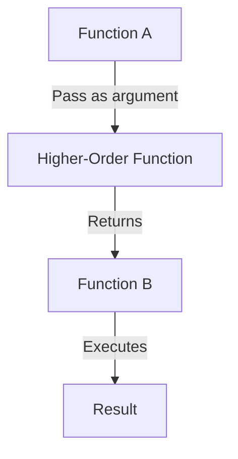

## 3.5 Higher-Order Functions

Higher-order functions are a fundamental concept in functional programming and are central to Clojure's design philosophy. They allow functions to be passed as arguments, returned from other functions, and stored in data structures. This capability enables powerful abstractions and promotes code reuse, making programs more modular and expressive.

### Introduction

Higher-order functions (HOFs) are functions that can take other functions as arguments or return them as results. This concept is a cornerstone of functional programming paradigms, allowing developers to write more abstract, reusable, and concise code. In Clojure, higher-order functions are used extensively to manipulate data, control flow, and build complex operations from simpler ones.

### Detailed Explanation

#### Passing Functions as Arguments

One of the most common uses of higher-order functions is to pass functions as arguments to other functions. This allows for flexible and dynamic behavior, as the function being passed can be changed without modifying the higher-order function itself.

```clojure
(defn apply-twice [f x]
  (f (f x)))

(apply-twice inc 5) ; => 7
```

In the example above, `apply-twice` takes a function `f` and an argument `x`, applying `f` to `x` twice. This demonstrates how functions can be treated as first-class citizens in Clojure.

#### Returning Functions from Functions

Higher-order functions can also return other functions. This is useful for creating function factories that generate customized functions based on parameters.

```clojure
(defn make-adder [n]
  (fn [x] (+ x n)))

(def add10 (make-adder 10))
(add10 5) ; => 15
```

Here, `make-adder` returns a new function that adds `n` to its argument. This pattern is often used to create specialized functions on the fly.

#### Using Built-in Higher-Order Functions

Clojure provides several built-in higher-order functions that are essential for functional programming:

- **`map`:** Applies a function to each element of a collection, returning a new collection of results.

  ```clojure
  (map inc [1 2 3]) ; => (2 3 4)
  ```

- **`filter`:** Selects elements from a collection that satisfy a predicate function.

  ```clojure
  (filter even? [1 2 3 4]) ; => (2 4)
  ```

- **`reduce`:** Accumulates a result by applying a function to each element of a collection, carrying forward an accumulator.

  ```clojure
  (reduce + [1 2 3 4]) ; => 10
  ```

These functions enable concise and expressive data transformations, often replacing loops and imperative code with declarative expressions.

#### Creating Function Factories

Function factories are higher-order functions that return other functions, allowing for the creation of parameterized functions.

```clojure
(defn multiplier [n]
  (fn [x] (* x n)))

((multiplier 3) 4) ; => 12
```

In this example, `multiplier` generates a function that multiplies its input by `n`. This pattern is useful for creating reusable and configurable operations.

#### Encouraging Declarative Code

Higher-order functions encourage a declarative style of programming, where the focus is on describing what should be done rather than how to do it. This leads to more readable and maintainable code.

### Visual Aids

To illustrate the concept of higher-order functions, consider the following diagram that shows how functions can be composed and passed around:



This diagram depicts a higher-order function receiving another function as an argument and returning a new function, which is then executed to produce a result.

### Use Cases

Higher-order functions are widely used in various scenarios:

- **Data Transformation:** Using `map`, `filter`, and `reduce` to process collections.
- **Event Handling:** Passing callback functions to handle events in UI programming.
- **Configuration:** Creating configurable functions with factories that return specialized functions.
- **Middleware:** Implementing middleware patterns where functions wrap other functions to add behavior.

### Advantages and Disadvantages

#### Advantages

- **Abstraction:** Simplifies complex operations by abstracting repetitive patterns.
- **Reusability:** Promotes code reuse by allowing functions to be composed and reused in different contexts.
- **Expressiveness:** Enhances expressiveness by enabling concise and declarative code.

#### Disadvantages

- **Complexity:** Can introduce complexity if overused or used inappropriately.
- **Performance:** May have performance implications if not used judiciously, especially with deeply nested function calls.

### Best Practices

- **Keep Functions Small:** Write small, focused functions that do one thing well.
- **Use Built-in Functions:** Leverage Clojure's rich set of built-in higher-order functions for common tasks.
- **Avoid Overuse:** Use higher-order functions judiciously to avoid unnecessary complexity.
- **Document Intent:** Clearly document the purpose and behavior of higher-order functions to aid understanding.

### Comparisons

Higher-order functions are often compared to other functional programming constructs like closures and currying. While closures capture the environment in which they are defined, higher-order functions focus on the manipulation and composition of functions themselves.

### Conclusion

Higher-order functions are a powerful tool in the Clojure programmer's toolkit, enabling abstraction, code reuse, and expressive programming. By understanding and leveraging these functions, developers can write more modular and maintainable code.

## Quiz Time!



### What is a higher-order function?

- [x] A function that takes other functions as arguments or returns them.
- [ ] A function that only performs arithmetic operations.
- [ ] A function that cannot be passed as an argument.
- [ ] A function that is only used for recursion.

> **Explanation:** Higher-order functions can take other functions as arguments or return them, which is a key feature of functional programming.

### Which of the following is an example of passing a function as an argument?

- [x] `(apply-twice inc 5)`
- [ ] `(defn add [x y] (+ x y))`
- [ ] `(let [x 5] x)`
- [ ] `(println "Hello, World!")`

> **Explanation:** `apply-twice` takes `inc` as an argument, demonstrating the concept of passing functions as arguments.

### What does the `map` function do?

- [x] Applies a function to each element of a collection.
- [ ] Filters elements based on a predicate.
- [ ] Reduces a collection to a single value.
- [ ] Sorts a collection in ascending order.

> **Explanation:** The `map` function applies a given function to each element of a collection, returning a new collection of results.

### How does `filter` differ from `map`?

- [x] `filter` selects elements based on a predicate, while `map` transforms each element.
- [ ] `filter` transforms each element, while `map` selects elements based on a predicate.
- [ ] Both `filter` and `map` perform the same operation.
- [ ] `filter` is used for sorting, while `map` is used for arithmetic.

> **Explanation:** `filter` selects elements that satisfy a predicate, whereas `map` applies a function to each element.

### What is the result of `(reduce + [1 2 3 4])`?

- [x] 10
- [ ] 24
- [ ] 0
- [ ] 4

> **Explanation:** `reduce` accumulates values using the `+` function, resulting in the sum of the elements, which is 10.

### What is a function factory?

- [x] A higher-order function that returns other functions.
- [ ] A function that only performs arithmetic operations.
- [ ] A function that cannot be passed as an argument.
- [ ] A function that is only used for recursion.

> **Explanation:** A function factory is a higher-order function that generates and returns other functions based on parameters.

### Which of the following is a benefit of higher-order functions?

- [x] They promote code reuse and abstraction.
- [ ] They make code harder to understand.
- [ ] They are only useful for mathematical operations.
- [ ] They cannot be used with collections.

> **Explanation:** Higher-order functions enhance code reuse and abstraction, making programs more modular and expressive.

### What does the `make-adder` function return?

- [x] A function that adds a specified number to its argument.
- [ ] A number that is the sum of two arguments.
- [ ] A string representation of a number.
- [ ] A list of numbers.

> **Explanation:** `make-adder` returns a function that adds the specified number `n` to its argument `x`.

### Why should higher-order functions be used judiciously?

- [x] To avoid unnecessary complexity and performance issues.
- [ ] Because they are not supported in Clojure.
- [ ] Because they are only useful in imperative programming.
- [ ] To ensure that code is always verbose.

> **Explanation:** While powerful, higher-order functions can introduce complexity and performance issues if overused or used inappropriately.

### True or False: Higher-order functions can only be used with numeric data.

- [ ] True
- [x] False

> **Explanation:** Higher-order functions can be used with any data type, not just numeric data, as they operate on functions rather than specific data types.


