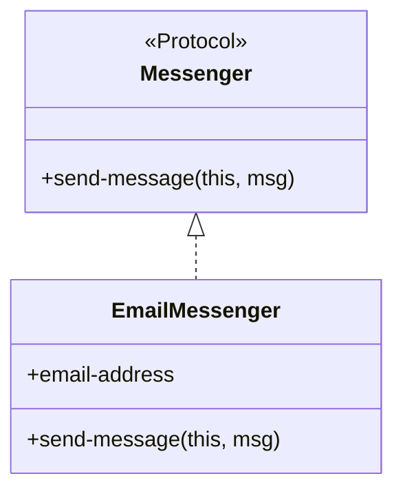

## 3.6 Protocols and Records

In the realm of Clojure, protocols and records are powerful constructs that facilitate polymorphism and efficient data handling. They allow developers to define flexible interfaces and create immutable data structures with fixed keys, respectively. This section delves into the intricacies of protocols and records, illustrating their usage with practical examples and best practices.

### Introduction

Protocols and records in Clojure provide a means to achieve polymorphism and structure data efficiently. Protocols define a set of functions without implementations, akin to interfaces in object-oriented languages, while records offer a way to create map-like, immutable data structures with fixed keys. Together, they enable developers to write modular, reusable, and performant code.

### Detailed Explanation

#### Protocols

Protocols in Clojure are a way to define a set of functions that can be implemented by different data types. They allow for polymorphic behavior, where the same function can operate differently based on the type of the data it is applied to.

**Defining a Protocol:**

A protocol is defined using the `defprotocol` macro. Here's an example of a simple protocol:

```clojure
(defprotocol Messenger
  (send-message [this msg]))
```

In this example, `Messenger` is a protocol with a single function `send-message`. Any data type that implements this protocol must provide an implementation for `send-message`.

#### Records

Records in Clojure are a way to define immutable data structures with a fixed set of keys. They are more efficient than maps for certain operations because they provide direct access to fields.

**Creating a Record:**

A record is defined using the `defrecord` macro. Here is how you can create a record that implements the `Messenger` protocol:

```clojure
(defrecord EmailMessenger [email-address]
  Messenger
  (send-message [this msg]
    (println "Sending email to" email-address "with message:" msg)))
```

In this example, `EmailMessenger` is a record with a single field `email-address`. It implements the `Messenger` protocol by providing an implementation for the `send-message` function.

### Visual Aids

#### Protocol and Record Interaction Diagram



This diagram illustrates how the `EmailMessenger` record implements the `Messenger` protocol, providing a concrete implementation for the `send-message` method.

### Code Examples

#### Instantiating Records and Calling Protocol Methods

Once a record is defined, you can create instances of it and call the protocol methods:

```clojure
(def messenger (->EmailMessenger "user@example.com"))
(send-message messenger "Hello!")
```

This code snippet creates an instance of `EmailMessenger` and sends a message using the `send-message` function.

#### Extending Protocols to Existing Types

Protocols can also be extended to existing types, allowing you to add behavior to types you don't control:

```clojure
(extend-type String
  Messenger
  (send-message [this msg]
    (println "Logging message for" this ":" msg)))
```

In this example, the `Messenger` protocol is extended to the `String` type, enabling strings to log messages.

#### Using Records as Efficient Maps

Records can be used like maps, allowing you to access fields using keywords:

```clojure
(:email-address messenger) ; => "user@example.com"
```

This demonstrates how you can access the `email-address` field of an `EmailMessenger` instance as if it were a map.

### Use Cases

- **Polymorphic Interfaces:** Protocols are ideal for defining polymorphic interfaces that can be implemented by various data types, promoting code reuse and flexibility.
- **Efficient Data Structures:** Records provide a more efficient alternative to maps when dealing with fixed keys, offering faster field access and reduced memory usage.

### Advantages and Disadvantages

#### Advantages

- **Polymorphism:** Protocols enable polymorphic behavior, allowing the same function to operate on different data types.
- **Efficiency:** Records offer efficient data handling with fixed keys, providing faster access and reduced memory overhead.
- **Immutability:** Both protocols and records align with Clojure's emphasis on immutability, promoting safer and more predictable code.

#### Disadvantages

- **Fixed Structure:** Records have a fixed set of keys, which can be limiting if dynamic keys are required.
- **Complexity:** Introducing protocols and records can add complexity to the codebase, especially for developers unfamiliar with these constructs.

### Best Practices

- **Use Protocols for Polymorphism:** Leverage protocols to define interfaces that can be implemented by multiple types, enhancing code modularity.
- **Prefer Records for Fixed Structures:** Opt for records when dealing with data structures that have a known set of keys, benefiting from their efficiency.
- **Extend Protocols Judiciously:** When extending protocols to existing types, ensure that the added behavior is coherent and does not introduce unexpected side effects.

### Comparisons

#### Protocols vs. Multimethods

While both protocols and multimethods provide polymorphic behavior, protocols are generally more efficient and suited for cases where the dispatch is based on the type of the first argument. Multimethods offer more flexibility in dispatching based on arbitrary criteria.

### Conclusion

Protocols and records are fundamental tools in Clojure for achieving polymorphism and efficient data handling. By understanding and leveraging these constructs, developers can write more modular, reusable, and performant code. As you explore these patterns, consider how they can be applied to your projects to enhance code quality and maintainability.

## Quiz Time!



### What is a protocol in Clojure?

- [x] A set of functions without implementations that can be implemented by different data types.
- [ ] A mutable data structure with fixed keys.
- [ ] A way to define global variables.
- [ ] A mechanism for asynchronous programming.

> **Explanation:** A protocol in Clojure defines a set of functions without implementations, allowing different data types to implement these functions.

### How do you define a record in Clojure?

- [x] Using the `defrecord` macro.
- [ ] Using the `defstruct` macro.
- [ ] Using the `defmap` macro.
- [ ] Using the `defclass` macro.

> **Explanation:** Records in Clojure are defined using the `defrecord` macro, which creates immutable data structures with fixed keys.

### What is the primary advantage of using records over maps in Clojure?

- [x] Records provide faster field access and reduced memory usage.
- [ ] Records allow dynamic keys.
- [ ] Records are mutable.
- [ ] Records support asynchronous operations.

> **Explanation:** Records offer more efficient field access and reduced memory usage compared to maps, especially when dealing with fixed keys.

### How can you extend a protocol to an existing type in Clojure?

- [x] Using the `extend-type` function.
- [ ] Using the `implement-type` function.
- [ ] Using the `add-type` function.
- [ ] Using the `create-type` function.

> **Explanation:** The `extend-type` function is used to extend a protocol to an existing type in Clojure.

### What is a disadvantage of using records in Clojure?

- [x] Records have a fixed set of keys.
- [ ] Records are mutable.
- [ ] Records cannot implement protocols.
- [ ] Records are slower than maps.

> **Explanation:** A disadvantage of records is that they have a fixed set of keys, which can be limiting if dynamic keys are needed.

### Which of the following is true about protocols in Clojure?

- [x] Protocols enable polymorphic behavior.
- [ ] Protocols are mutable.
- [ ] Protocols are used for asynchronous programming.
- [ ] Protocols are only for numeric operations.

> **Explanation:** Protocols enable polymorphic behavior by allowing different data types to implement the same set of functions.

### What is the purpose of the `send-message` function in the `Messenger` protocol?

- [x] To define a polymorphic interface for sending messages.
- [ ] To create a new record.
- [ ] To extend a protocol.
- [ ] To perform asynchronous operations.

> **Explanation:** The `send-message` function in the `Messenger` protocol defines a polymorphic interface that can be implemented by different data types to send messages.

### How do you access a field in a record as if it were a map?

- [x] Using a keyword, e.g., `(:field-name record)`.
- [ ] Using a function, e.g., `(get-field record)`.
- [ ] Using a method, e.g., `(record.getField())`.
- [ ] Using an index, e.g., `(record[0])`.

> **Explanation:** You can access a field in a record using a keyword, similar to accessing a value in a map.

### What is the result of calling `(send-message messenger "Hello!")` if `messenger` is an instance of `EmailMessenger`?

- [x] It prints "Sending email to user@example.com with message: Hello!".
- [ ] It throws an error.
- [ ] It returns `nil`.
- [ ] It logs the message to a file.

> **Explanation:** Calling `(send-message messenger "Hello!")` on an `EmailMessenger` instance prints the message to the console.

### Protocols in Clojure are similar to interfaces in object-oriented languages.

- [x] True
- [ ] False

> **Explanation:** Protocols in Clojure are similar to interfaces in object-oriented languages as they define a set of functions without implementations that can be implemented by different data types.


