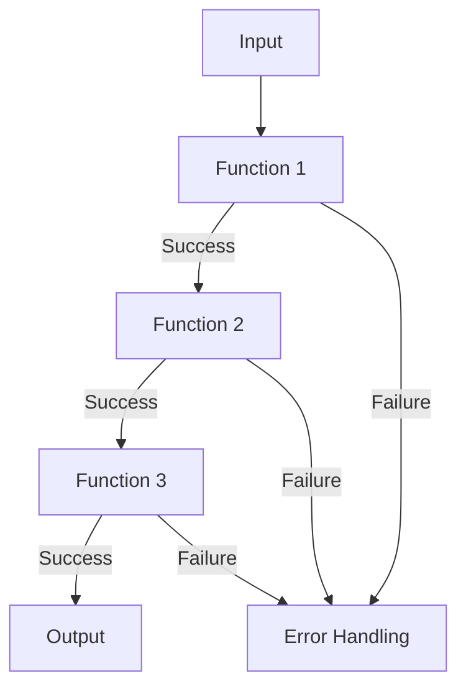

## 3.6. Functional Error Handling with Monads

In the realm of functional programming, monads are a powerful abstraction that help manage side effects, including error handling. In this section, we will explore how monads can be used in Clojure to handle errors gracefully, focusing on the `Maybe` and `Either` monads. We will also delve into how these constructs can lead to more robust and composable code.

### Understanding Monads in Functional Programming

Monads are a design pattern used in functional programming to handle side effects, such as state, I/O, or exceptions, in a pure functional way. They provide a way to sequence computations and manage side effects without compromising the purity of functions.

#### What is a Monad?

A monad is essentially a type that implements two operations: `bind` (often represented as `>>=`) and `return` (or `unit`). These operations must satisfy three laws: left identity, right identity, and associativity. In simpler terms, a monad allows you to chain operations together, passing the result of one operation as the input to the next, while handling any side effects in a controlled manner.

### Challenges of Error Handling in Pure Functions

In functional programming, functions are expected to be pure, meaning they should not have side effects and should return the same output for the same input. This can make error handling challenging, as traditional error handling mechanisms like exceptions introduce side effects.

#### The Need for Monads in Error Handling

Monads provide a way to handle errors without breaking the purity of functions. By encapsulating errors within a monadic structure, we can propagate errors through a computation chain without using exceptions.

### Common Monads for Error Handling

Two common monads used for error handling are the `Maybe` monad and the `Either` monad. Let's explore each of these in detail.

#### The Maybe Monad

The `Maybe` monad represents a computation that might fail. It can either contain a value (`Just` or `Some`) or no value (`Nothing` or `None`). This is useful for computations where a result may not be available.

```clojure
(require '[cats.monad.maybe :as maybe])

(defn safe-divide [numerator denominator]
  (if (zero? denominator)
    (maybe/nothing)
    (maybe/just (/ numerator denominator))))

;; Usage
(let [result (safe-divide 10 0)]
  (maybe/maybe result
               (fn [value] (println "Result:" value))
               (println "Division by zero!")))
```

In this example, `safe-divide` returns a `Maybe` monad. If the denominator is zero, it returns `nothing`, otherwise, it returns `just` the result of the division.

#### The Either Monad

The `Either` monad is similar to `Maybe`, but it can carry information about the error. It has two constructors: `Left` for errors and `Right` for successful computations.

```clojure
(require '[cats.monad.either :as either])

(defn parse-int [s]
  (try
    (either/right (Integer/parseInt s))
    (catch Exception e
      (either/left (str "Error parsing integer: " (.getMessage e))))))

;; Usage
(let [result (parse-int "abc")]
  (either/either result
                 (fn [error] (println "Failed:" error))
                 (fn [value] (println "Parsed value:" value))))
```

Here, `parse-int` attempts to parse a string into an integer. If it fails, it returns a `Left` with an error message; otherwise, it returns a `Right` with the parsed integer.

### Using the Cats Library in Clojure

The [Cats](https://github.com/funcool/cats) library provides a comprehensive set of tools for working with monads in Clojure. It includes implementations for common monads like `Maybe` and `Either`, making it easier to incorporate functional error handling into your Clojure applications.

#### Installing Cats

To use Cats, add it to your `project.clj` dependencies:

```clojure
:dependencies [[funcool/cats "2.3.0"]]
```

#### Example: Composing Functions with Monads

Let's see how we can compose functions using monads to handle errors gracefully.

```clojure
(require '[cats.core :as m])
(require '[cats.monad.maybe :as maybe])
(require '[cats.monad.either :as either])

(defn safe-root [x]
  (if (neg? x)
    (maybe/nothing)
    (maybe/just (Math/sqrt x))))

(defn safe-reciprocal [x]
  (if (zero? x)
    (maybe/nothing)
    (maybe/just (/ 1 x))))

(defn safe-root-reciprocal [x]
  (m/mlet [root (safe-root x)
           reciprocal (safe-reciprocal root)]
    (m/return reciprocal)))

;; Usage
(let [result (safe-root-reciprocal 4)]
  (maybe/maybe result
               (fn [value] (println "Result:" value))
               (println "Computation failed!")))
```

In this example, `safe-root-reciprocal` composes `safe-root` and `safe-reciprocal` using the `mlet` macro from Cats, which allows for monadic binding. This ensures that if any computation fails, the entire chain fails gracefully.

### Benefits of Using Monads for Error Handling

Monads provide several benefits for error handling in functional programming:

- **Composability**: Monads allow you to compose functions in a way that handles errors seamlessly.
- **Purity**: By encapsulating side effects, monads maintain the purity of functions.
- **Readability**: Code using monads can be more readable, as error handling logic is separated from the main computation logic.

### Visualizing Monad Operations

To better understand how monads work, let's visualize the flow of data through monadic operations.



In this diagram, each function represents a step in a computation chain. If a function succeeds, the result is passed to the next function. If it fails, error handling is triggered.

### Try It Yourself

Experiment with the provided code examples by modifying them to handle different types of errors or by chaining additional computations. Consider how the use of monads affects the readability and robustness of your code.

### References and Further Reading

- [Cats Library Documentation](https://funcool.github.io/cats/latest/)
- [Learn You a Haskell for Great Good!](http://learnyouahaskell.com/a-fistful-of-monads) - A great resource for understanding monads in functional programming.
- [ClojureDocs](https://clojuredocs.org/) - A community-powered documentation and examples repository for Clojure.

### Knowledge Check

Before moving on, let's test your understanding of functional error handling with monads.

## **Ready to Test Your Knowledge?**



### What is a monad in functional programming?

- [x] A design pattern for handling side effects in a pure functional way
- [ ] A type of data structure for storing values
- [ ] A method for optimizing performance
- [ ] A tool for debugging code

> **Explanation:** Monads are a design pattern used in functional programming to handle side effects, such as state, I/O, or exceptions, in a pure functional way.

### Which monad is used to represent computations that might fail?

- [x] Maybe Monad
- [ ] List Monad
- [ ] State Monad
- [ ] IO Monad

> **Explanation:** The Maybe Monad is used to represent computations that might fail, encapsulating a value or no value.

### What are the two constructors of the Either Monad?

- [x] Left and Right
- [ ] Some and None
- [ ] Just and Nothing
- [ ] True and False

> **Explanation:** The Either Monad has two constructors: Left for errors and Right for successful computations.

### How does the Cats library help in Clojure?

- [x] It provides tools for working with monads
- [ ] It optimizes Clojure code for performance
- [ ] It is a testing framework
- [ ] It is a GUI library

> **Explanation:** The Cats library provides a comprehensive set of tools for working with monads in Clojure.

### What is the purpose of the `mlet` macro in Cats?

- [x] To allow for monadic binding and composition
- [ ] To define new monads
- [ ] To handle exceptions
- [ ] To optimize performance

> **Explanation:** The `mlet` macro in Cats allows for monadic binding and composition, enabling chaining of computations.

### Which of the following is a benefit of using monads for error handling?

- [x] Composability
- [x] Purity
- [ ] Increased complexity
- [ ] Reduced readability

> **Explanation:** Monads provide composability and maintain the purity of functions, making error handling more seamless.

### What does the `safe-divide` function return when the denominator is zero?

- [x] Nothing
- [ ] Just the result
- [ ] An exception
- [ ] A string error message

> **Explanation:** The `safe-divide` function returns `nothing` when the denominator is zero, indicating a failed computation.

### What is the main advantage of using the Either Monad over the Maybe Monad?

- [x] It can carry information about the error
- [ ] It is faster
- [ ] It is simpler to use
- [ ] It supports more data types

> **Explanation:** The Either Monad can carry information about the error, unlike the Maybe Monad, which only indicates success or failure.

### True or False: Monads can help maintain the purity of functions.

- [x] True
- [ ] False

> **Explanation:** Monads encapsulate side effects, helping to maintain the purity of functions in functional programming.

### Which library in Clojure provides implementations for common monads like Maybe and Either?

- [x] Cats
- [ ] Ring
- [ ] Compojure
- [ ] Pedestal

> **Explanation:** The Cats library provides implementations for common monads like Maybe and Either in Clojure.



Remember, mastering monads and functional error handling is a journey. Keep experimenting, stay curious, and enjoy the process of writing more robust and elegant Clojure code!
