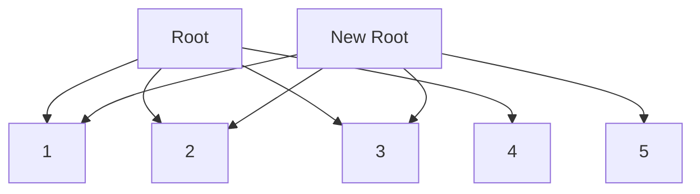

## 3.7. Persistent Data Structures and Structural Sharing

In the realm of functional programming, immutability is a cornerstone principle that ensures data cannot be altered once created. Clojure, a functional language that runs on the Java Virtual Machine (JVM), embraces this principle through its use of persistent data structures. These structures allow developers to work with immutable data efficiently, thanks to a concept known as structural sharing. In this section, we will delve into the mechanics of persistent data structures, explore how structural sharing minimizes memory overhead, and discuss the performance benefits and implications for concurrency.

### What Are Persistent Data Structures?

Persistent data structures are a type of data structure that preserve the previous version of themselves when modified. Instead of altering the original structure, they create a new version that reflects the changes. This characteristic is crucial in functional programming, where immutability is a key tenet.

#### Importance of Persistent Data Structures

1. **Immutability**: By ensuring that data structures are immutable, persistent data structures prevent unintended side effects, making code easier to reason about and debug.
2. **Concurrency**: In a concurrent environment, immutable data structures eliminate the need for locks, as multiple threads can safely read from the same data structure without risk of data corruption.
3. **Efficiency**: Despite their immutability, persistent data structures are designed to be efficient in terms of both time and space, often outperforming their mutable counterparts in certain scenarios.

### Structural Sharing: The Key to Efficiency

Structural sharing is the technique that allows persistent data structures to be both immutable and efficient. Instead of duplicating the entire data structure when a change is made, structural sharing reuses parts of the existing structure that remain unchanged.

#### How Structural Sharing Works

Consider a simple example: a list. When you add an element to a persistent list, rather than copying the entire list, the new list shares the structure of the original list up to the point of modification. This is achieved by creating a new node for the added element and pointing it to the existing structure.

```clojure
(def original-list [1 2 3])
(def new-list (conj original-list 4))

;; original-list remains [1 2 3]
;; new-list is [1 2 3 4]
```

In this example, `new-list` shares the nodes `[1 2 3]` with `original-list`, and only the node containing `4` is new.

#### Visualizing Structural Sharing

To better understand structural sharing, let's visualize how a persistent vector might be structured:



In this diagram, the original vector `[1, 2, 3, 4]` is represented by the nodes connected to `Root`. When a new element `5` is added, a new root `New Root` is created, but the nodes `[1, 2, 3, 4]` are shared between the original and new vectors.

### Performance Considerations

Persistent data structures are designed to be efficient, but understanding their performance characteristics is crucial for making informed decisions in your code.

#### Time Complexity

- **Access**: Accessing an element in a persistent vector is typically O(log32 N) due to its underlying tree structure, which is efficient enough for most practical purposes.
- **Modification**: Adding or removing elements also operates in O(log32 N) time, thanks to structural sharing.

#### Space Complexity

- **Memory Usage**: While persistent data structures use more memory than their mutable counterparts due to the need to maintain multiple versions, structural sharing significantly reduces the overhead by reusing existing nodes.

### Practical Implications

1. **Concurrency**: The immutability of persistent data structures makes them inherently thread-safe, allowing for safe concurrent reads without the need for synchronization mechanisms.
2. **Functional Programming**: Persistent data structures align perfectly with functional programming paradigms, enabling developers to write pure functions that are free from side effects.
3. **Garbage Collection**: Since persistent data structures create new versions rather than modifying existing ones, they can lead to increased garbage collection activity. However, the benefits of immutability and concurrency often outweigh this cost.

### Benefits for Concurrency and Immutability

The combination of immutability and structural sharing in persistent data structures provides several advantages:

- **Thread Safety**: Immutable data structures can be shared across threads without risk of data races, simplifying concurrent programming.
- **Predictability**: With immutable data, functions become more predictable and easier to test, as they always produce the same output for the same input.
- **Simplified Debugging**: Since data cannot change unexpectedly, debugging becomes more straightforward, as developers can be confident that data remains consistent throughout the program's execution.

### Try It Yourself

To truly grasp the power of persistent data structures and structural sharing, try experimenting with the following code snippets. Modify them to see how changes affect the structures:

```clojure
;; Experiment with vectors
(def vec1 [1 2 3])
(def vec2 (conj vec1 4))
(def vec3 (assoc vec2 1 5))

;; Experiment with maps
(def map1 {:a 1 :b 2})
(def map2 (assoc map1 :c 3))
(def map3 (dissoc map2 :a))
```

### Knowledge Check

- How does structural sharing contribute to the efficiency of persistent data structures?
- What are the time complexities for accessing and modifying elements in a persistent vector?
- Why are persistent data structures beneficial for concurrency?

### Summary

Persistent data structures and structural sharing are fundamental concepts in Clojure that enable efficient immutability. By reusing existing structure, these data structures minimize memory overhead while providing the benefits of immutability, such as thread safety and predictability. As you continue your journey with Clojure, understanding and leveraging these concepts will be crucial for writing robust, efficient, and elegant code.

## **Ready to Test Your Knowledge?**



### What is a persistent data structure?

- [x] A data structure that preserves previous versions when modified
- [ ] A data structure that is always stored in memory
- [ ] A data structure that cannot be changed
- [ ] A data structure that is only used in databases

> **Explanation:** Persistent data structures create new versions instead of modifying existing ones, preserving previous states.

### How does structural sharing reduce memory overhead?

- [x] By reusing parts of the existing structure that remain unchanged
- [ ] By compressing data
- [ ] By storing data on disk
- [ ] By using smaller data types

> **Explanation:** Structural sharing reuses unchanged parts of the data structure, minimizing the need for duplication.

### What is the time complexity for accessing an element in a persistent vector?

- [x] O(log32 N)
- [ ] O(1)
- [ ] O(N)
- [ ] O(N^2)

> **Explanation:** Persistent vectors use a tree structure, allowing access in O(log32 N) time.

### Why are persistent data structures beneficial for concurrency?

- [x] They are inherently thread-safe
- [ ] They are faster than mutable structures
- [ ] They use less memory
- [ ] They are easier to write

> **Explanation:** Immutability ensures that persistent data structures can be safely shared across threads without synchronization.

### What is the main advantage of immutability in functional programming?

- [x] Predictability and lack of side effects
- [ ] Faster execution
- [ ] Less memory usage
- [ ] Easier syntax

> **Explanation:** Immutability leads to predictable functions and eliminates side effects, aligning with functional programming principles.

### What happens when you add an element to a persistent list?

- [x] A new list is created sharing the structure of the original
- [ ] The original list is modified
- [ ] The list is duplicated entirely
- [ ] The list is compressed

> **Explanation:** A new list is created that shares the unchanged structure of the original list.

### How does immutability simplify debugging?

- [x] Data remains consistent throughout execution
- [ ] It reduces code size
- [ ] It eliminates all bugs
- [ ] It speeds up execution

> **Explanation:** Immutability ensures data consistency, making it easier to trace and debug.

### What is a potential downside of persistent data structures?

- [x] Increased garbage collection activity
- [ ] They are slower than mutable structures
- [ ] They cannot be used in concurrent programming
- [ ] They are difficult to understand

> **Explanation:** Creating new versions of data structures can lead to more garbage collection, though the benefits often outweigh this cost.

### What is the role of structural sharing in persistent data structures?

- [x] It allows efficient immutability by reusing unchanged parts
- [ ] It compresses data for storage
- [ ] It encrypts data for security
- [ ] It duplicates data for redundancy

> **Explanation:** Structural sharing reuses unchanged parts of the data structure, enabling efficient immutability.

### True or False: Persistent data structures in Clojure are always slower than mutable ones.

- [ ] True
- [x] False

> **Explanation:** While persistent data structures may have some overhead, their design often allows them to be competitive with or even outperform mutable structures in certain scenarios.



Remember, this is just the beginning. As you progress, you'll build more complex and interactive applications using Clojure's powerful features. Keep experimenting, stay curious, and enjoy the journey!
