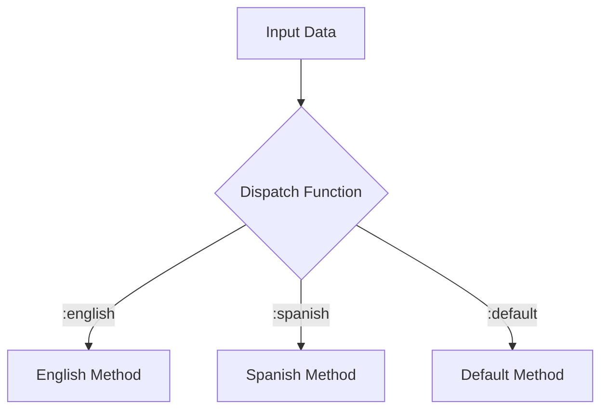

## 3.7 Multimethods

In the realm of functional programming with Clojure, multimethods offer a powerful mechanism for achieving flexible polymorphism. Unlike traditional object-oriented languages that rely on class-based inheritance for polymorphism, Clojure's multimethods allow method selection based on arbitrary dispatch functions. This flexibility enables developers to dispatch on multiple attributes or types, providing a more dynamic and adaptable approach to method resolution.

### Introduction to Multimethods

Multimethods in Clojure are a form of polymorphism that allows you to define a function that can have different implementations based on the result of a dispatch function. This dispatch function can evaluate any logic, making multimethods highly versatile and suitable for complex decision-making scenarios.

### Defining a Multimethod with a Dispatch Function

To define a multimethod, you use the `defmulti` macro, specifying a dispatch function that determines which method implementation to invoke. Here's a simple example:

```clojure
(defmulti greet (fn [person] (:language person)))
```

In this example, the `greet` multimethod uses a dispatch function that extracts the `:language` key from a `person` map to determine which greeting method to call.

### Implementing Methods for Different Dispatch Values

Once a multimethod is defined, you can implement specific methods for different dispatch values using the `defmethod` macro:

```clojure
(defmethod greet :english [person]
  (println "Hello," (:name person)))

(defmethod greet :spanish [person]
  (println "¡Hola," (:name person) "!"))
```

Here, we define two methods for the `greet` multimethod: one for English and one for Spanish. Each method prints a greeting based on the language.

### Using the Multimethod

To use the multimethod, simply call it with the appropriate data structure:

```clojure
(greet {:name "Alice" :language :english})
(greet {:name "Carlos" :language :spanish})
```

This will output:

```
Hello, Alice
¡Hola, Carlos!
```

### Providing a Default Method

Multimethods can also have a default method that is invoked when no specific method matches the dispatch value. This is done by defining a method for the `:default` dispatch value:

```clojure
(defmethod greet :default [person]
  (println "Hello," (:name person)))
```

### Dispatch on Complex Criteria

One of the strengths of multimethods is their ability to dispatch on complex criteria. The dispatch function can incorporate any logic necessary to determine the appropriate method:

```clojure
(defmulti calculate-price (fn [order]
                            (let [{:keys [customer-type amount]} order]
                              [customer-type (>= amount 1000)])))

(defmethod calculate-price [:regular false] [order]
  (* (:amount order) 1.0))

(defmethod calculate-price [:regular true] [order]
  (* (:amount order) 0.9))

(defmethod calculate-price [:vip false] [order]
  (* (:amount order) 0.85))

(defmethod calculate-price [:vip true] [order]
  (* (:amount order) 0.8))
```

In this example, the `calculate-price` multimethod uses a vector of `[customer-type (>= amount 1000)]` as the dispatch value, allowing for nuanced pricing strategies based on customer type and order amount.

### Visualizing Multimethod Dispatch

To better understand how multimethods work, let's visualize the dispatch process using a conceptual diagram:



This diagram illustrates how the dispatch function routes input data to the appropriate method based on the dispatch value.

### Advantages and Disadvantages

**Advantages:**
- **Flexibility:** Multimethods provide flexible method dispatch based on any criteria, not just type.
- **Extensibility:** New methods can be added without modifying existing code.
- **Decoupling:** Logic for method selection is decoupled from method implementation.

**Disadvantages:**
- **Complexity:** Overuse of complex dispatch logic can make the code harder to understand.
- **Performance:** Dispatching on complex criteria may introduce performance overhead.

### Best Practices

- **Keep Dispatch Functions Simple:** Aim for simplicity in dispatch functions to maintain readability and performance.
- **Use Default Methods Wisely:** Provide sensible defaults to handle unexpected dispatch values gracefully.
- **Document Dispatch Logic:** Clearly document the logic behind dispatch functions to aid in code maintenance.

### Comparisons with Other Patterns

Multimethods can be compared to other polymorphic patterns like protocols and interfaces. While protocols offer type-based polymorphism, multimethods provide more flexibility by allowing dispatch based on arbitrary criteria.

### Conclusion

Multimethods in Clojure offer a powerful tool for achieving flexible and dynamic polymorphism. By leveraging arbitrary dispatch functions, developers can create adaptable systems that respond to complex decision-making scenarios. Whether you're building a multilingual application or implementing intricate business logic, multimethods provide the versatility needed to handle diverse requirements.

## Quiz Time!



### What is the primary purpose of multimethods in Clojure?

- [x] To achieve flexible polymorphism through arbitrary dispatch functions.
- [ ] To enforce strict type-based polymorphism.
- [ ] To replace all uses of protocols in Clojure.
- [ ] To simplify function composition.

> **Explanation:** Multimethods allow for flexible polymorphism by using arbitrary dispatch functions to determine method selection.

### How do you define a multimethod in Clojure?

- [x] Using the `defmulti` macro with a dispatch function.
- [ ] Using the `defprotocol` macro with a dispatch function.
- [ ] Using the `defmethod` macro directly.
- [ ] Using the `defn` macro with multiple arities.

> **Explanation:** The `defmulti` macro is used to define a multimethod with a dispatch function.

### What is the role of the dispatch function in a multimethod?

- [x] It determines which method implementation to invoke.
- [ ] It defines the default behavior for the multimethod.
- [ ] It initializes the multimethod with default values.
- [ ] It composes multiple methods into a single function.

> **Explanation:** The dispatch function evaluates logic to determine which method implementation should be invoked.

### How can you provide a default method for a multimethod?

- [x] By defining a method for the `:default` dispatch value.
- [ ] By using the `defdefault` macro.
- [ ] By setting a global default variable.
- [ ] By overriding the `defmulti` definition.

> **Explanation:** A default method is provided by defining a method for the `:default` dispatch value.

### Which of the following is a valid dispatch value for a multimethod?

- [x] A keyword like `:english`.
- [x] A vector like `[:vip true]`.
- [ ] A number like `42`.
- [ ] A string like `"default"`.

> **Explanation:** Dispatch values can be keywords or vectors, allowing for complex criteria.

### What is a potential disadvantage of using multimethods?

- [x] Complexity in dispatch logic can make code harder to understand.
- [ ] They enforce strict type checking.
- [ ] They cannot handle default cases.
- [ ] They are limited to single dispatch criteria.

> **Explanation:** Complex dispatch logic can introduce readability and maintenance challenges.

### How do multimethods compare to protocols in Clojure?

- [x] Multimethods allow dispatch based on arbitrary criteria, while protocols are type-based.
- [ ] Multimethods are faster than protocols.
- [ ] Multimethods are a subset of protocols.
- [ ] Multimethods cannot have default methods.

> **Explanation:** Multimethods provide more flexible dispatch options compared to type-based protocols.

### What is the `defmethod` macro used for?

- [x] To define specific implementations for a multimethod.
- [ ] To create a new multimethod.
- [ ] To dispatch on multiple criteria simultaneously.
- [ ] To override existing methods in a protocol.

> **Explanation:** The `defmethod` macro is used to define specific implementations for a multimethod.

### Can multimethods dispatch on multiple attributes?

- [x] Yes, by using a dispatch function that returns a composite value like a vector.
- [ ] No, they can only dispatch on a single attribute.
- [ ] Yes, but only if the attributes are of the same type.
- [ ] No, multimethods are limited to single attribute dispatch.

> **Explanation:** Multimethods can dispatch on multiple attributes by returning a composite value from the dispatch function.

### True or False: Multimethods in Clojure can only dispatch based on the type of the first argument.

- [ ] True
- [x] False

> **Explanation:** Multimethods can dispatch based on any criteria, not just the type of the first argument.


