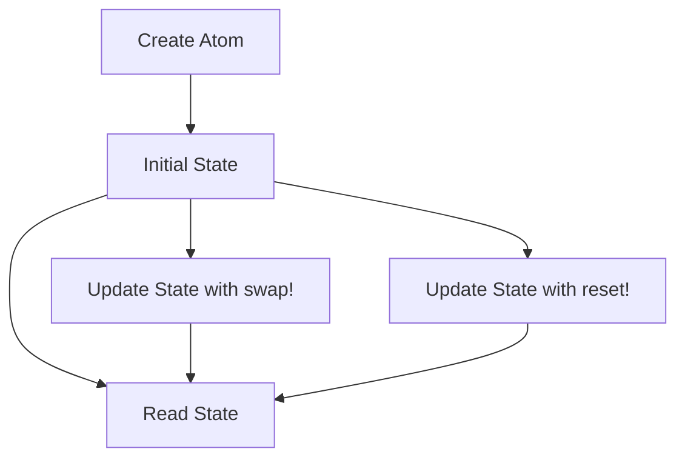
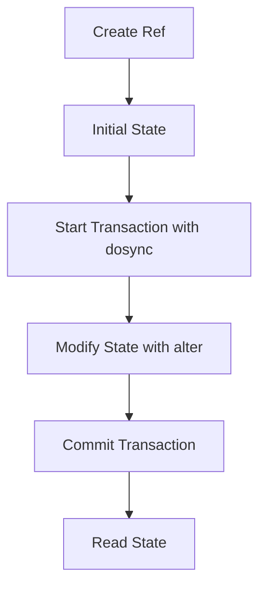
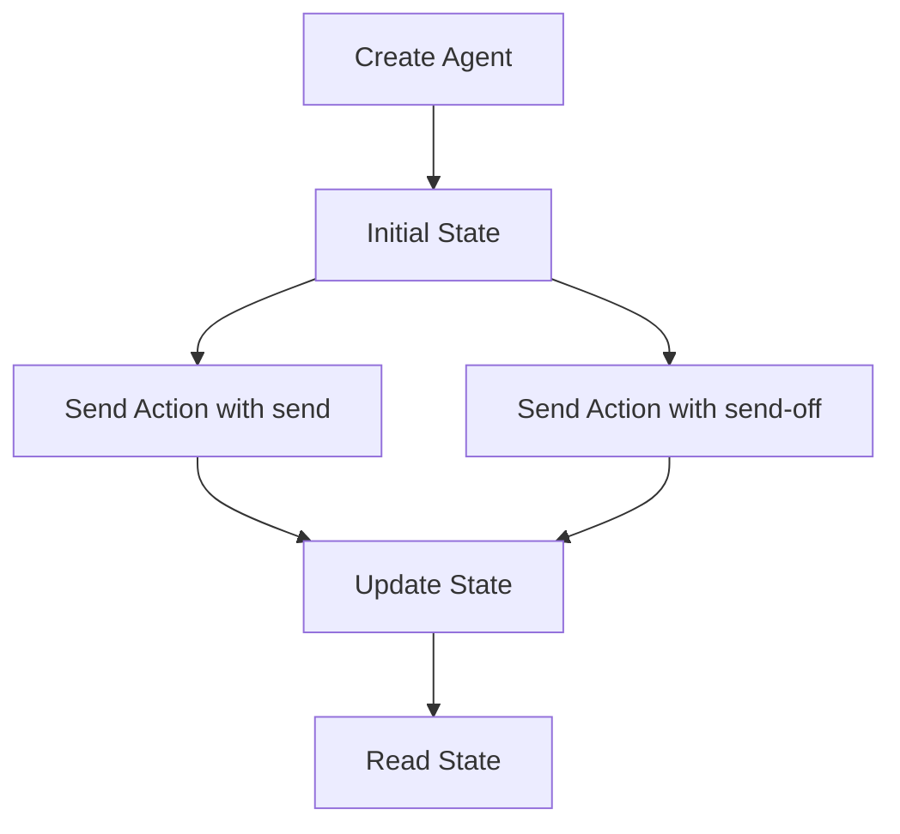

## 3.8 Atoms, Refs, and Agents

State management is a crucial aspect of programming, especially in functional languages like Clojure, which emphasize immutability. Clojure provides powerful abstractions for managing state changes: Atoms, Refs, and Agents. Each serves a unique purpose and is suited to different scenarios, whether you need synchronous, coordinated, or asynchronous state changes.

### Introduction

In Clojure, state management is handled through immutable data structures. However, when you need to manage mutable state, Clojure offers Atoms, Refs, and Agents. These constructs allow you to handle state changes in a controlled manner, ensuring consistency and thread safety.

- **Atoms** are used for synchronous, uncoordinated state changes.
- **Refs** are designed for synchronous, coordinated state changes with transactions.
- **Agents** facilitate asynchronous state changes.

Let's delve deeper into each of these constructs, exploring their usage, benefits, and best practices.

### Atoms: Synchronous, Uncoordinated State Changes

Atoms provide a way to manage state that can be changed synchronously and independently. They are ideal for cases where state changes do not need to be coordinated with other state changes.

#### Creating and Using Atoms

To create an Atom, you use the `atom` function, passing the initial state as an argument.

```clojure
(def counter (atom 0))
```

Updating an Atom's state can be done using `swap!` or `reset!`.

- **Using `swap!`:** Applies a function to the current state.

```clojure
(swap! counter inc)
```

- **Using `reset!`:** Sets the state directly.

```clojure
(reset! counter 10)
```

Reading the state of an Atom is straightforward:

```clojure
@counter ; => 10
```

#### Visualizing Atom Operations



### Refs: Synchronous, Coordinated State Changes

Refs are used when you need to coordinate changes across multiple pieces of state. They leverage Software Transactional Memory (STM) to ensure consistency.

#### Creating and Using Refs

To create a Ref, use the `ref` function:

```clojure
(def balance (ref 1000))
```

Modifying Refs requires the use of transactions, which are defined using `dosync`.

```clojure
(dosync
  (alter balance - 100))
```

When working with multiple Refs, STM ensures that all changes are consistent:

```clojure
(def account-a (ref 500))
(def account-b (ref 300))

(dosync
  (alter account-a - 50)
  (alter account-b + 50))
```

STM automatically handles conflicts by retrying transactions when necessary.

#### Visualizing Ref Transactions



### Agents: Asynchronous State Changes

Agents are designed for managing state changes asynchronously. They are particularly useful for tasks that can be performed in the background without blocking the main thread.

#### Creating and Using Agents

To create an Agent, use the `agent` function:

```clojure
(def logger (agent []))
```

You can send actions to an Agent asynchronously using `send` or `send-off`.

- **Using `send`:** For non-blocking actions.

```clojure
(send logger conj "Log entry")
```

- **Using `send-off`:** For potentially blocking actions.

```clojure
(send-off logger #(do (Thread/sleep 1000) (conj % "Delayed log")))
```

Agents can handle errors using `set-error-handler!` and `set-error-mode!`. You can check for errors with `agent-error`.

```clojure
(agent-error logger)
```

#### Visualizing Agent Operations



### Use Cases

- **Atoms:** Ideal for counters, flags, or any state that can be updated independently.
- **Refs:** Suitable for banking transactions, inventory management, or any scenario requiring coordinated updates.
- **Agents:** Perfect for logging, background processing, or any task that can be deferred.

### Advantages and Disadvantages

#### Atoms
- **Advantages:** Simple, efficient for independent state changes.
- **Disadvantages:** Not suitable for coordinated updates.

#### Refs
- **Advantages:** Ensures consistency across multiple state changes.
- **Disadvantages:** Overhead of STM, not suitable for asynchronous tasks.

#### Agents
- **Advantages:** Asynchronous, non-blocking state changes.
- **Disadvantages:** Error handling can be complex, not suitable for coordinated updates.

### Best Practices

- Use Atoms for simple, independent state changes.
- Use Refs when you need transactional consistency.
- Use Agents for tasks that can be performed asynchronously.
- Always handle errors in Agents to prevent silent failures.

### Comparisons

- **Atoms vs. Refs:** Atoms are simpler and faster for independent updates, while Refs provide transactional guarantees.
- **Refs vs. Agents:** Refs are synchronous and transactional, whereas Agents are asynchronous and non-blocking.

### Conclusion

Atoms, Refs, and Agents are powerful tools in Clojure for managing state changes. By understanding their differences and use cases, you can choose the right tool for your specific needs, ensuring efficient and reliable state management in your applications.

## Quiz Time!



### What is the primary use case for Atoms in Clojure?

- [x] Synchronous, uncoordinated state changes
- [ ] Asynchronous state changes
- [ ] Coordinated state changes with transactions
- [ ] Handling errors in state changes

> **Explanation:** Atoms are used for synchronous, uncoordinated state changes, allowing independent updates without transactions.

### How do you update the state of an Atom?

- [x] Using `swap!` or `reset!`
- [ ] Using `alter`
- [ ] Using `send`
- [ ] Using `dosync`

> **Explanation:** Atoms are updated using `swap!` to apply a function or `reset!` to set a new value directly.

### What is the purpose of Refs in Clojure?

- [ ] Asynchronous state changes
- [x] Synchronous, coordinated state changes with transactions
- [ ] Error handling in state changes
- [ ] Independent state changes

> **Explanation:** Refs are used for synchronous, coordinated state changes, ensuring consistency through transactions.

### How do you modify the state of a Ref?

- [ ] Using `swap!`
- [x] Using `alter` within a `dosync` block
- [ ] Using `send`
- [ ] Using `reset!`

> **Explanation:** Refs are modified using `alter` within a `dosync` block to ensure transactional consistency.

### What is the primary advantage of using Agents?

- [ ] Synchronous state changes
- [x] Asynchronous, non-blocking state changes
- [ ] Coordinated state changes
- [ ] Error handling

> **Explanation:** Agents facilitate asynchronous, non-blocking state changes, making them ideal for background tasks.

### How do you send an action to an Agent?

- [ ] Using `swap!`
- [ ] Using `alter`
- [x] Using `send` or `send-off`
- [ ] Using `reset!`

> **Explanation:** Actions are sent to an Agent using `send` for non-blocking tasks or `send-off` for potentially blocking tasks.

### What is the difference between `send` and `send-off`?

- [x] `send` is for non-blocking actions, `send-off` is for potentially blocking actions
- [ ] `send` is for blocking actions, `send-off` is for non-blocking actions
- [ ] Both are used for synchronous actions
- [ ] Both are used for transactional actions

> **Explanation:** `send` is used for non-blocking actions, while `send-off` is used for actions that may block.

### How can you handle errors in Agents?

- [ ] Using `swap!`
- [ ] Using `dosync`
- [x] Using `set-error-handler!` and `set-error-mode!`
- [ ] Using `reset!`

> **Explanation:** Errors in Agents can be handled using `set-error-handler!` and `set-error-mode!` to manage exceptions.

### What happens if a transaction in Refs conflicts?

- [x] STM retries the transaction automatically
- [ ] The transaction fails permanently
- [ ] The transaction is ignored
- [ ] An error is thrown

> **Explanation:** STM automatically retries transactions in case of conflicts to ensure consistency.

### True or False: Atoms are suitable for coordinated state changes.

- [ ] True
- [x] False

> **Explanation:** Atoms are not suitable for coordinated state changes; Refs should be used for such scenarios.


