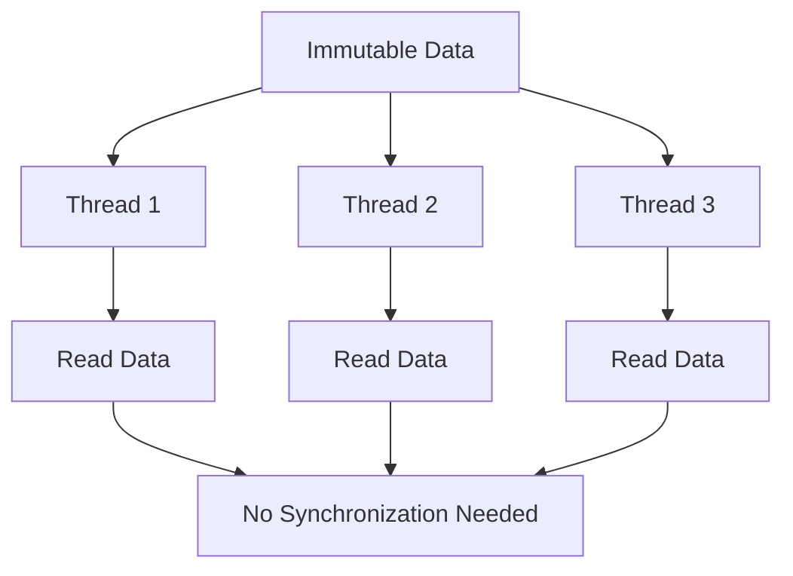

## 3.8. The Role of Immutability in Concurrency

Concurrency is a fundamental aspect of modern software development, enabling applications to perform multiple tasks simultaneously. However, managing concurrency can be challenging, especially when dealing with mutable shared state. In this section, we will explore how immutability simplifies concurrent programming in Clojure by eliminating issues related to shared mutable state. We will discuss how Clojure's immutable data structures enable safer concurrent code and provide best practices for writing concurrent code in Clojure.

### Understanding the Challenges of Mutable Shared State

In traditional programming paradigms, mutable shared state is a common source of concurrency issues. When multiple threads access and modify shared data, it can lead to race conditions, deadlocks, and other synchronization problems. These issues arise because the state of the data can change unexpectedly, leading to inconsistent or incorrect results.

#### Problems Caused by Mutable Shared State

1. **Race Conditions**: Occur when multiple threads access shared data simultaneously, and the final outcome depends on the order of execution. This can lead to unpredictable behavior and bugs that are difficult to reproduce and fix.

2. **Deadlocks**: Happen when two or more threads are waiting for each other to release resources, causing the program to hang indefinitely.

3. **Complex Synchronization**: Managing access to shared mutable state often requires complex synchronization mechanisms, such as locks, which can be error-prone and difficult to implement correctly.

4. **Inconsistent State**: Mutable shared state can lead to inconsistent data if not properly synchronized, resulting in incorrect program behavior.

### How Immutability Alleviates Concurrency Issues

Immutability is a core principle of functional programming that addresses the challenges of mutable shared state. By ensuring that data cannot be modified after it is created, immutability eliminates the possibility of race conditions and simplifies concurrent programming.

#### Benefits of Immutability in Concurrency

1. **Elimination of Race Conditions**: Since immutable data cannot be changed, there is no risk of race conditions. Multiple threads can safely read the same data without the need for synchronization.

2. **Simplified Synchronization**: Immutability removes the need for complex synchronization mechanisms, as there is no shared mutable state to protect.

3. **Predictable Behavior**: Immutable data ensures that the state of the program is consistent and predictable, making it easier to reason about and debug.

4. **Thread Safety**: Immutable data structures are inherently thread-safe, allowing multiple threads to access them concurrently without risk of data corruption.

### Clojure's Immutable Data Structures

Clojure is a functional programming language that embraces immutability as a fundamental concept. It provides a rich set of immutable data structures, including lists, vectors, maps, and sets, which are designed to be efficient and easy to use in concurrent programming.

#### Key Features of Clojure's Immutable Data Structures

1. **Persistent Data Structures**: Clojure's data structures are persistent, meaning they preserve previous versions of themselves when modified. This allows for efficient updates and access to historical data.

2. **Structural Sharing**: Clojure's data structures use structural sharing to minimize memory usage and improve performance. When a data structure is modified, only the changed parts are copied, while the rest is shared with the original structure.

3. **Efficient Operations**: Clojure's data structures are optimized for common operations, such as adding, removing, and updating elements, making them suitable for use in concurrent applications.

### Comparing Mutable and Immutable Approaches

To illustrate the benefits of immutability in concurrency, let's compare mutable and immutable approaches using a simple example.

#### Mutable Approach

Consider a scenario where we have a shared counter that multiple threads increment concurrently.

```clojure
;; Mutable approach using Java's AtomicInteger
(import java.util.concurrent.atomic.AtomicInteger)

(def counter (AtomicInteger. 0))

(defn increment-counter []
  (.incrementAndGet counter))

;; Simulate concurrent increments
(dotimes [_ 1000]
  (future (increment-counter)))

(println "Final counter value:" (.get counter))
```

In this example, we use Java's `AtomicInteger` to manage the shared counter. While this approach works, it requires careful synchronization to ensure thread safety.

#### Immutable Approach

Now, let's see how we can achieve the same result using Clojure's immutable data structures.

```clojure
;; Immutable approach using Clojure's atoms
(def counter (atom 0))

(defn increment-counter []
  (swap! counter inc))

;; Simulate concurrent increments
(dotimes [_ 1000]
  (future (increment-counter)))

(println "Final counter value:" @counter)
```

In this example, we use Clojure's `atom` to manage the counter. The `swap!` function ensures that updates are applied atomically, eliminating the need for explicit synchronization.

### Best Practices for Writing Concurrent Code in Clojure

To write efficient and safe concurrent code in Clojure, consider the following best practices:

1. **Prefer Immutability**: Use immutable data structures whenever possible to simplify concurrency and ensure thread safety.

2. **Leverage Clojure's Concurrency Primitives**: Clojure provides several concurrency primitives, such as atoms, refs, and agents, which are designed to work seamlessly with immutable data structures.

3. **Avoid Shared Mutable State**: Minimize the use of shared mutable state to reduce the risk of race conditions and synchronization issues.

4. **Use Higher-Order Functions**: Take advantage of Clojure's higher-order functions to express concurrency patterns in a concise and declarative manner.

5. **Test Concurrent Code Thoroughly**: Concurrent code can be difficult to test, so ensure that you have comprehensive test coverage and use tools like `core.async` to simulate concurrent scenarios.

### Visualizing Immutability and Concurrency

To better understand how immutability simplifies concurrency, let's visualize the process using a diagram.



**Diagram Description**: This diagram illustrates how multiple threads can safely access immutable data without the need for synchronization. Each thread reads the same data independently, ensuring thread safety and eliminating race conditions.

### Try It Yourself

To deepen your understanding of immutability and concurrency in Clojure, try modifying the code examples provided. Experiment with different concurrency primitives and observe how they affect the behavior of the program. Consider implementing a concurrent data processing pipeline using Clojure's `core.async` library.

### References and Further Reading

- [Clojure Official Documentation](https://clojure.org/)
- [Concurrency in Clojure](https://clojure.org/reference/concurrency)
- [Functional Programming in Clojure](https://www.braveclojure.com/)

### Knowledge Check

To reinforce your understanding of immutability and concurrency in Clojure, test your knowledge with the following quiz.

## **Ready to Test Your Knowledge?**



### What is a primary benefit of using immutable data structures in concurrent programming?

- [x] Elimination of race conditions
- [ ] Increased memory usage
- [ ] More complex synchronization
- [ ] Slower performance

> **Explanation:** Immutable data structures eliminate race conditions because they cannot be modified, ensuring thread safety.

### How does Clojure's `atom` ensure thread safety?

- [x] By using atomic updates
- [ ] By locking the data structure
- [ ] By copying data for each thread
- [ ] By using global variables

> **Explanation:** Clojure's `atom` uses atomic updates to ensure that changes are applied safely in a concurrent environment.

### What is structural sharing in Clojure's data structures?

- [x] Sharing unchanged parts of data structures
- [ ] Copying the entire data structure
- [ ] Using locks for synchronization
- [ ] Storing data in a global state

> **Explanation:** Structural sharing allows Clojure's data structures to share unchanged parts, minimizing memory usage and improving performance.

### Which Clojure primitive is best suited for managing shared state with atomic updates?

- [x] Atom
- [ ] Ref
- [ ] Agent
- [ ] Var

> **Explanation:** Atoms are best suited for managing shared state with atomic updates in Clojure.

### What is a common problem with mutable shared state in concurrency?

- [x] Race conditions
- [ ] Immutable data
- [ ] Efficient memory usage
- [ ] Simplified code

> **Explanation:** Mutable shared state can lead to race conditions, where the outcome depends on the order of execution.

### How does immutability affect the predictability of a program?

- [x] It makes the program more predictable
- [ ] It introduces more bugs
- [ ] It complicates debugging
- [ ] It requires more synchronization

> **Explanation:** Immutability ensures that data cannot change unexpectedly, making the program's behavior more predictable.

### What is the role of `swap!` in Clojure's `atom`?

- [x] To apply atomic updates
- [ ] To lock the atom
- [ ] To create a new atom
- [ ] To read the atom's value

> **Explanation:** `swap!` is used to apply atomic updates to an atom, ensuring thread safety.

### Which of the following is a concurrency primitive in Clojure?

- [x] Ref
- [ ] List
- [ ] Map
- [ ] Vector

> **Explanation:** `Ref` is a concurrency primitive in Clojure, used for managing shared state with coordinated updates.

### Why is testing concurrent code important?

- [x] To ensure correct behavior in concurrent scenarios
- [ ] To increase code complexity
- [ ] To reduce test coverage
- [ ] To simplify code

> **Explanation:** Testing concurrent code is crucial to ensure that it behaves correctly under different concurrent scenarios.

### True or False: Immutability requires complex synchronization mechanisms.

- [x] False
- [ ] True

> **Explanation:** Immutability eliminates the need for complex synchronization mechanisms, as there is no mutable shared state to protect.



Remember, mastering immutability and concurrency in Clojure is a journey. As you progress, you'll build more robust and efficient concurrent applications. Keep experimenting, stay curious, and enjoy the journey!
