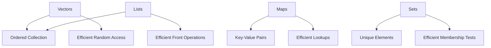

## 4.1.1. Vectors, Lists, Maps, and Sets

In the world of Clojure, understanding the core data structures is crucial for writing efficient and elegant code. Clojure's data structures are designed with immutability and functional programming in mind, providing powerful tools for developers to manage data effectively. In this section, we will explore four fundamental data structures in Clojure: vectors, lists, maps, and sets. We will delve into their properties, typical use cases, and how to manipulate them effectively.

### Vectors

Vectors in Clojure are ordered collections that provide efficient random access and updates. They are similar to arrays in other programming languages but are immutable. Vectors are the go-to data structure when you need to maintain the order of elements and require efficient access by index.

#### Properties of Vectors

- **Order**: Vectors maintain the order of elements.
- **Immutability**: Once created, vectors cannot be changed. Any modification results in a new vector.
- **Performance**: Vectors offer O(1) time complexity for access and update operations, making them efficient for random access.

#### Creating and Manipulating Vectors

To create a vector, you can use the `vector` function or the literal syntax with square brackets.

```clojure
(def my-vector [1 2 3 4 5])
(def another-vector (vector 6 7 8 9 10))
```

Accessing elements in a vector is straightforward using the `nth` function or by using the index directly.

```clojure
(println (nth my-vector 2)) ; Output: 3
(println (my-vector 2))     ; Output: 3
```

Vectors can be manipulated using functions like `conj`, `assoc`, and `subvec`.

```clojure
(def updated-vector (conj my-vector 6)) ; Adds 6 to the end
(def modified-vector (assoc my-vector 1 10)) ; Replaces element at index 1 with 10
(def sub-vector (subvec my-vector 1 3)) ; Creates a subvector from index 1 to 3
```

#### When to Use Vectors

Use vectors when you need:

- Ordered collections.
- Efficient random access and updates.
- To maintain the sequence of elements.

### Lists

Lists in Clojure are linked lists optimized for sequential access. They are ideal for scenarios where you frequently add or remove elements from the front of the collection.

#### Properties of Lists

- **Order**: Lists maintain the order of elements.
- **Immutability**: Lists are immutable, similar to vectors.
- **Performance**: Lists provide O(1) time complexity for adding or removing elements from the front but O(n) for random access.

#### Creating and Manipulating Lists

Lists can be created using the `list` function or the literal syntax with parentheses.

```clojure
(def my-list '(1 2 3 4 5))
(def another-list (list 6 7 8 9 10))
```

Accessing elements in a list is done using the `first`, `rest`, and `nth` functions.

```clojure
(println (first my-list)) ; Output: 1
(println (rest my-list))  ; Output: (2 3 4 5)
(println (nth my-list 2)) ; Output: 3
```

Lists can be manipulated using functions like `conj`, `cons`, and `concat`.

```clojure
(def updated-list (conj my-list 0)) ; Adds 0 to the front
(def extended-list (cons 0 my-list)) ; Also adds 0 to the front
(def combined-list (concat my-list another-list)) ; Combines two lists
```

#### When to Use Lists

Use lists when you need:

- Efficient operations at the front of the collection.
- To process elements sequentially.
- To leverage Clojure's sequence abstraction.

### Maps

Maps in Clojure are collections of key-value pairs, similar to dictionaries or hashmaps in other languages. They are used for associating keys with values and provide efficient lookup operations.

#### Properties of Maps

- **Key-Value Pairs**: Maps store data as key-value pairs.
- **Immutability**: Maps are immutable, ensuring thread safety.
- **Performance**: Maps offer O(1) average time complexity for lookups.

#### Creating and Manipulating Maps

Maps can be created using the `hash-map` function or the literal syntax with curly braces.

```clojure
(def my-map {:a 1 :b 2 :c 3})
(def another-map (hash-map :d 4 :e 5 :f 6))
```

Accessing values in a map is done using the `get` function or by using the key directly.

```clojure
(println (get my-map :a)) ; Output: 1
(println (my-map :b))     ; Output: 2
```

Maps can be manipulated using functions like `assoc`, `dissoc`, and `merge`.

```clojure
(def updated-map (assoc my-map :d 4)) ; Adds or updates key :d with value 4
(def reduced-map (dissoc my-map :a)) ; Removes key :a
(def combined-map (merge my-map another-map)) ; Combines two maps
```

#### When to Use Maps

Use maps when you need:

- To associate keys with values.
- Efficient lookups by key.
- To manage collections of related data.

### Sets

Sets in Clojure are collections of unique elements. They are used when you need to ensure that no duplicates exist in the collection.

#### Properties of Sets

- **Uniqueness**: Sets contain only unique elements.
- **Immutability**: Sets are immutable, like other Clojure collections.
- **Performance**: Sets offer O(1) average time complexity for membership tests.

#### Creating and Manipulating Sets

Sets can be created using the `hash-set` function or the literal syntax with `#`.

```clojure
(def my-set #{1 2 3 4 5})
(def another-set (hash-set 6 7 8 9 10))
```

Checking membership in a set is done using the `contains?` function.

```clojure
(println (contains? my-set 3)) ; Output: true
(println (contains? my-set 6)) ; Output: false
```

Sets can be manipulated using functions like `conj`, `disj`, and `union`.

```clojure
(def updated-set (conj my-set 6)) ; Adds 6 to the set
(def reduced-set (disj my-set 1)) ; Removes 1 from the set
(def combined-set (clojure.set/union my-set another-set)) ; Combines two sets
```

#### When to Use Sets

Use sets when you need:

- To ensure uniqueness of elements.
- Efficient membership tests.
- To perform set operations like union, intersection, and difference.

### Visualizing Clojure Data Structures

To better understand the relationships and operations of Clojure's data structures, let's visualize them using Mermaid.js diagrams.



**Diagram Description**: This diagram illustrates the key properties and operations associated with each of Clojure's core data structures: vectors, lists, maps, and sets.

### Choosing the Right Data Structure

Choosing the right data structure is crucial for optimizing performance and ensuring code clarity. Here are some guidelines:

- **Use Vectors** when you need ordered collections with efficient random access.
- **Use Lists** for sequential processing and efficient operations at the front.
- **Use Maps** to associate keys with values and perform efficient lookups.
- **Use Sets** to ensure uniqueness and perform set operations.

### Try It Yourself

Experiment with the code examples provided in this section. Try modifying the vectors, lists, maps, and sets to see how they behave. For instance, add new elements, remove existing ones, or combine multiple collections. This hands-on practice will help solidify your understanding of Clojure's data structures.

### References and Further Reading

- [Clojure Official Documentation](https://clojure.org/reference/data_structures)
- [Clojure for the Brave and True](https://www.braveclojure.com/)
- [Clojure Programming by Chas Emerick, Brian Carper, and Christophe Grand](https://www.oreilly.com/library/view/clojure-programming/9781449310387/)

### Knowledge Check

To reinforce your understanding, let's test your knowledge with some questions.

## **Ready to Test Your Knowledge?**



### What is the time complexity for accessing an element in a Clojure vector?

- [x] O(1)
- [ ] O(n)
- [ ] O(log n)
- [ ] O(n^2)

> **Explanation:** Vectors in Clojure provide O(1) time complexity for accessing elements due to their underlying implementation.

### Which data structure is best for ensuring uniqueness of elements?

- [ ] Vector
- [ ] List
- [ ] Map
- [x] Set

> **Explanation:** Sets in Clojure are designed to contain only unique elements, making them ideal for ensuring uniqueness.

### How do you add an element to the front of a list in Clojure?

- [ ] `conj`
- [x] `cons`
- [ ] `assoc`
- [ ] `merge`

> **Explanation:** The `cons` function adds an element to the front of a list in Clojure.

### What function is used to combine two maps in Clojure?

- [ ] `conj`
- [ ] `assoc`
- [x] `merge`
- [ ] `concat`

> **Explanation:** The `merge` function is used to combine two maps in Clojure.

### Which function checks for membership in a set?

- [ ] `get`
- [ ] `assoc`
- [ ] `nth`
- [x] `contains?`

> **Explanation:** The `contains?` function checks if an element is present in a set.

### What is the primary advantage of using lists over vectors?

- [ ] Random access
- [x] Efficient front operations
- [ ] Key-value storage
- [ ] Uniqueness

> **Explanation:** Lists provide efficient operations at the front, such as adding or removing elements.

### Which data structure is used for key-value associations?

- [ ] Vector
- [ ] List
- [x] Map
- [ ] Set

> **Explanation:** Maps in Clojure are used to store key-value pairs, similar to dictionaries in other languages.

### How do you create a vector in Clojure?

- [ ] `(list 1 2 3)`
- [x] `[1 2 3]`
- [ ] `#{1 2 3}`
- [ ] `{:a 1 :b 2}`

> **Explanation:** Vectors can be created using the literal syntax with square brackets, e.g., `[1 2 3]`.

### What is the time complexity for adding an element to a set?

- [x] O(1)
- [ ] O(n)
- [ ] O(log n)
- [ ] O(n^2)

> **Explanation:** Adding an element to a set in Clojure typically has O(1) time complexity due to its hash-based implementation.

### True or False: Maps in Clojure are mutable.

- [ ] True
- [x] False

> **Explanation:** Maps in Clojure are immutable, meaning they cannot be changed once created. Any modification results in a new map.



Remember, this is just the beginning. As you progress, you'll build more complex and interactive applications using these data structures. Keep experimenting, stay curious, and enjoy the journey!
