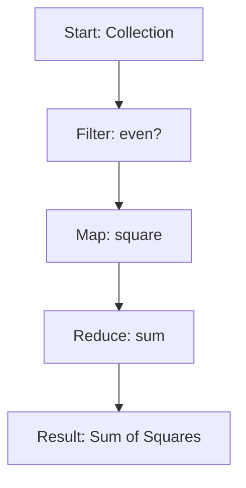

## 4.1.2. Manipulating Collections with Core Functions

Clojure's rich set of core functions provides a powerful toolkit for manipulating collections, enabling developers to perform complex data transformations with ease. In this section, we will explore some of the most commonly used core functions, demonstrate their usage through examples, and discuss how to chain these functions for more sophisticated operations. We will also highlight the importance of polymorphism across different collection types, encouraging you to practice with examples to build familiarity and confidence.

### Introduction to Core Functions

Clojure collections are immutable and persistent, meaning that operations on collections do not modify the original collection but instead return a new collection. This immutability is a cornerstone of functional programming and allows for safe concurrent programming. Clojure provides a variety of core functions that operate on collections, such as `map`, `reduce`, `filter`, `assoc`, and `conj`. These functions are designed to be polymorphic, meaning they work seamlessly across different types of collections, including lists, vectors, maps, and sets.

### Commonly Used Core Functions

Let's dive into some of the most commonly used core functions for manipulating collections in Clojure.

#### `map`

The `map` function applies a given function to each element of a collection, returning a new collection of the results. It is a fundamental tool for transforming data.

```clojure
;; Example: Increment each number in a vector
(def numbers [1 2 3 4 5])
(def incremented (map inc numbers))
;; => (2 3 4 5 6)

;; Example: Convert a list of strings to uppercase
(def strings ["hello" "world"])
(def uppercased (map clojure.string/upper-case strings))
;; => ("HELLO" "WORLD")
```

#### `reduce`

The `reduce` function processes elements of a collection to produce a single accumulated result. It is often used for summing numbers, concatenating strings, or combining data in some way.

```clojure
;; Example: Sum all numbers in a list
(def numbers [1 2 3 4 5])
(def sum (reduce + numbers))
;; => 15

;; Example: Concatenate a list of strings
(def strings ["hello" "world"])
(def concatenated (reduce str strings))
;; => "helloworld"
```

#### `filter`

The `filter` function returns a new collection containing only the elements that satisfy a given predicate function.

```clojure
;; Example: Filter even numbers from a vector
(def numbers [1 2 3 4 5 6])
(def evens (filter even? numbers))
;; => (2 4 6)

;; Example: Filter strings longer than 3 characters
(def strings ["hi" "hello" "world"])
(def long-strings (filter #(> (count %) 3) strings))
;; => ("hello" "world")
```

#### `assoc`

The `assoc` function is used to associate a key with a value in a map, returning a new map with the updated association.

```clojure
;; Example: Add a key-value pair to a map
(def person {:name "Alice" :age 30})
(def updated-person (assoc person :city "New York"))
;; => {:name "Alice", :age 30, :city "New York"}
```

#### `conj`

The `conj` function adds an element to a collection, returning a new collection with the element added. The behavior of `conj` depends on the type of collection.

```clojure
;; Example: Add an element to a vector
(def numbers [1 2 3])
(def updated-numbers (conj numbers 4))
;; => [1 2 3 4]

;; Example: Add an element to a set
(def fruits #{"apple" "banana"})
(def updated-fruits (conj fruits "orange"))
;; => #{"apple" "banana" "orange"}
```

### Chaining Functions for Complex Transformations

Clojure's core functions can be chained together to perform complex data transformations in a concise and readable manner. By combining functions like `map`, `filter`, and `reduce`, you can express sophisticated operations on collections.

```clojure
;; Example: Sum of squares of even numbers
(def numbers [1 2 3 4 5 6])
(def sum-of-squares (->> numbers
                         (filter even?)
                         (map #(* % %))
                         (reduce +)))
;; => 56
```

In this example, we first filter the even numbers, then map each number to its square, and finally reduce the collection by summing the squares. The `->>` threading macro is used to pass the result of each function to the next, creating a clear and linear flow of data.

### Polymorphism Across Collection Types

One of the strengths of Clojure's core functions is their polymorphic nature. Functions like `map`, `reduce`, and `filter` work across different collection types, allowing you to write generic code that can handle lists, vectors, maps, and sets without modification.

```clojure
;; Example: Using `map` with different collection types
(def list-numbers '(1 2 3))
(def vector-numbers [1 2 3])
(def set-numbers #{1 2 3})

(def incremented-list (map inc list-numbers))
(def incremented-vector (map inc vector-numbers))
(def incremented-set (map inc set-numbers))

;; => (2 3 4)
;; => (2 3 4)
;; => (2 3 4)
```

This polymorphism simplifies code and reduces the need for type-specific logic, making your programs more flexible and easier to maintain.

### Encouragement to Practice

To master the manipulation of collections with Clojure's core functions, it's essential to practice with examples and experiment with different combinations of functions. Try modifying the code examples provided, or create your own scenarios to explore the capabilities of these functions.

### Try It Yourself

Here are some exercises to help you practice manipulating collections with core functions:

1. **Exercise 1**: Create a function that takes a collection of numbers and returns a new collection with each number doubled.

2. **Exercise 2**: Write a function that filters out all strings that do not contain the letter "a" from a list of strings.

3. **Exercise 3**: Implement a function that takes a map and a key-value pair, and returns a new map with the key-value pair added.

4. **Exercise 4**: Use `reduce` to find the product of all numbers in a vector.

5. **Exercise 5**: Chain `map`, `filter`, and `reduce` to find the sum of all odd numbers in a list, each multiplied by 3.

### Visualizing Function Chaining

To better understand how function chaining works, let's visualize the process using a flowchart. This diagram illustrates the flow of data through a series of transformations.



**Figure 1**: Flowchart of chaining `filter`, `map`, and `reduce` to compute the sum of squares of even numbers.

### References and Links

For further reading on Clojure's core functions and collection manipulation, consider the following resources:

- [Clojure Documentation on Collections](https://clojure.org/reference/data_structures)
- [ClojureDocs: Examples and Documentation](https://clojuredocs.org/)
- [Functional Programming in Clojure](https://www.braveclojure.com/)

### Knowledge Check

To reinforce your understanding of manipulating collections with core functions, try answering the following questions:

## **Ready to Test Your Knowledge?**



### Which function is used to apply a function to each element of a collection?

- [x] map
- [ ] reduce
- [ ] filter
- [ ] assoc

> **Explanation:** The `map` function applies a given function to each element of a collection, returning a new collection of the results.

### What does the `reduce` function do?

- [x] Processes elements of a collection to produce a single accumulated result
- [ ] Filters elements based on a predicate
- [ ] Associates a key with a value in a map
- [ ] Adds an element to a collection

> **Explanation:** The `reduce` function processes elements of a collection to produce a single accumulated result, often used for summing numbers or combining data.

### How does the `filter` function work?

- [x] Returns a new collection containing only the elements that satisfy a given predicate
- [ ] Applies a function to each element of a collection
- [ ] Associates a key with a value in a map
- [ ] Adds an element to a collection

> **Explanation:** The `filter` function returns a new collection containing only the elements that satisfy a given predicate function.

### What is the purpose of the `assoc` function?

- [x] Associates a key with a value in a map
- [ ] Adds an element to a collection
- [ ] Filters elements based on a predicate
- [ ] Processes elements to produce a single result

> **Explanation:** The `assoc` function is used to associate a key with a value in a map, returning a new map with the updated association.

### Which function is used to add an element to a collection?

- [x] conj
- [ ] map
- [ ] reduce
- [ ] filter

> **Explanation:** The `conj` function adds an element to a collection, returning a new collection with the element added.

### What is the benefit of function polymorphism in Clojure?

- [x] Allows functions to work seamlessly across different collection types
- [ ] Increases code complexity
- [ ] Limits function usage to specific types
- [ ] Requires type-specific logic

> **Explanation:** Function polymorphism in Clojure allows functions to work seamlessly across different collection types, simplifying code and reducing the need for type-specific logic.

### How can you chain functions for complex transformations?

- [x] By using threading macros like `->>` to pass results between functions
- [ ] By writing separate functions for each transformation
- [ ] By using only one function at a time
- [ ] By avoiding function chaining

> **Explanation:** Functions can be chained for complex transformations by using threading macros like `->>` to pass results between functions, creating a clear and linear flow of data.

### What does the `->>` threading macro do?

- [x] Passes the result of each function to the next in a chain
- [ ] Applies a function to each element of a collection
- [ ] Filters elements based on a predicate
- [ ] Adds an element to a collection

> **Explanation:** The `->>` threading macro passes the result of each function to the next in a chain, facilitating function chaining for complex transformations.

### Which function would you use to sum all numbers in a list?

- [x] reduce
- [ ] map
- [ ] filter
- [ ] conj

> **Explanation:** The `reduce` function is used to sum all numbers in a list by processing elements to produce a single accumulated result.

### True or False: Clojure's core functions modify the original collection.

- [x] False
- [ ] True

> **Explanation:** False. Clojure's core functions do not modify the original collection; they return a new collection with the desired transformation.



Remember, this is just the beginning. As you progress, you'll build more complex and interactive programs using Clojure's powerful collection manipulation capabilities. Keep experimenting, stay curious, and enjoy the journey!
