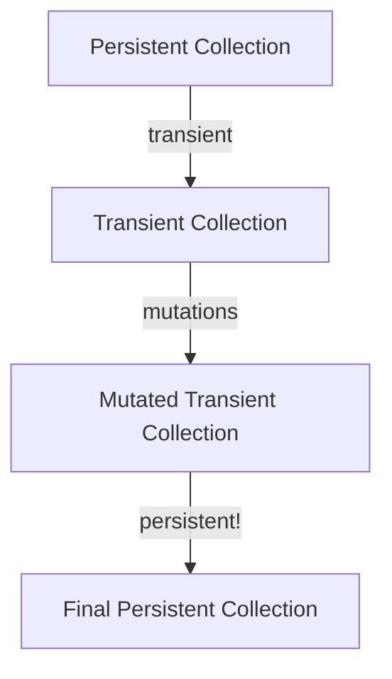

## 4.1.3. Transients for Performance Optimization

In the world of functional programming, immutability is often hailed as a cornerstone principle, providing benefits such as thread safety and predictability. However, immutability can sometimes come at the cost of performance, especially when dealing with large data structures that require frequent updates. This is where Clojure's transients come into play, offering a way to perform efficient, temporary mutations for performance-critical code.

### Understanding Transients

**Transients** are a feature in Clojure that allows for temporary, mutable operations on data structures. They are designed to provide a performance boost by enabling in-place modifications of collections, which are then converted back to immutable structures. This approach is particularly useful in scenarios where a series of transformations need to be applied to a collection before it is finalized.

#### Why Transients Exist

The primary motivation behind transients is to bridge the gap between the immutability of Clojure's persistent data structures and the need for high-performance operations. By allowing temporary mutability, transients reduce the overhead associated with creating new versions of data structures after each modification.

### Performance Benefits of Using Transients

Transients can significantly improve performance in scenarios where multiple updates are applied to a collection. By allowing in-place modifications, transients reduce the need for copying and reallocating memory, which is a common performance bottleneck in immutable data structures.

#### Key Performance Advantages:

- **Reduced Overhead**: Transients minimize the overhead of creating new data structures by allowing in-place updates.
- **Improved Speed**: Operations on transients are generally faster than their persistent counterparts due to reduced memory allocation.
- **Efficient Bulk Operations**: Transients are particularly beneficial for bulk operations where multiple changes are made to a collection before it is finalized.

### Converting Persistent Collections to Transients and Back

To leverage transients, you first convert a persistent collection into a transient one, perform the necessary mutations, and then convert it back to a persistent collection. This process ensures that the final result remains immutable, preserving the functional programming paradigm.

#### Example: Using Transients with Vectors

```clojure
;; Start with a persistent vector
(def my-vector [1 2 3 4 5])

;; Convert to a transient vector
(def transient-vector (transient my-vector))

;; Perform mutations
(def updated-transient-vector (conj! transient-vector 6))
(def final-transient-vector (assoc! updated-transient-vector 0 10))

;; Convert back to a persistent vector
(def final-vector (persistent! final-transient-vector))

;; Output the final vector
(println final-vector) ;; => [10 2 3 4 5 6]
```

In this example, we start with a persistent vector, convert it to a transient, perform some mutations, and then convert it back to a persistent vector. This approach allows us to efficiently update the vector without incurring the overhead of creating new versions at each step.

### Limitations and Precautions When Using Transients

While transients offer significant performance benefits, they come with certain limitations and precautions that developers must be aware of:

- **Single-threaded Use**: Transients are not thread-safe and should only be used within a single thread. Using them across multiple threads can lead to unpredictable behavior.
- **Ephemeral Nature**: Transients are meant for temporary use and should not be stored or passed around like persistent collections.
- **Conversion Requirement**: Always convert transients back to persistent collections before returning them from functions or storing them in data structures.
- **Limited API**: The API for transients is more limited compared to persistent collections, focusing on essential operations like `conj!`, `assoc!`, and `dissoc!`.

### When to Use Transients

Transients should be used judiciously, primarily in performance-critical sections of code where the overhead of immutability is a bottleneck. They are particularly useful in scenarios involving:

- **Batch Updates**: When applying a series of updates to a collection before finalizing it.
- **Performance Bottlenecks**: In code paths where performance profiling indicates that immutable operations are a limiting factor.
- **Algorithm Optimization**: In algorithms that require frequent modifications to data structures, such as certain graph algorithms or simulations.

### Visualizing Transients in Clojure

To better understand how transients work, let's visualize the process of converting a persistent collection to a transient, performing mutations, and converting it back.



**Diagram Explanation**: The diagram illustrates the flow of converting a persistent collection to a transient, applying mutations, and converting it back to a persistent collection. This process ensures that the final result remains immutable while benefiting from the performance gains of temporary mutability.

### Try It Yourself

To gain a deeper understanding of transients, try modifying the code example provided earlier. Experiment with different operations, such as `dissoc!` or `pop!`, and observe how they affect the performance and behavior of the collection.

### References and Further Reading

- [Clojure Transients Documentation](https://clojure.org/reference/transients)
- [Functional Programming in Clojure](https://www.braveclojure.com/)
- [Understanding Immutability in Clojure](https://clojure.org/about/functional_programming)

### Knowledge Check

Before we wrap up, let's test your understanding of transients with a few questions.

## **Ready to Test Your Knowledge?**



### What is the primary purpose of transients in Clojure?

- [x] To provide efficient, temporary mutations for performance-critical code
- [ ] To replace persistent data structures
- [ ] To enable multi-threaded access to collections
- [ ] To simplify the Clojure API

> **Explanation:** Transients are designed to offer efficient, temporary mutations to improve performance in scenarios where persistent data structures are a bottleneck.

### Which of the following operations is NOT supported by transients?

- [ ] `conj!`
- [ ] `assoc!`
- [x] `map!`
- [ ] `dissoc!`

> **Explanation:** Transients support operations like `conj!`, `assoc!`, and `dissoc!`, but not `map!`, as mapping functions are not part of the transient API.

### Can transients be safely used across multiple threads?

- [ ] Yes
- [x] No

> **Explanation:** Transients are not thread-safe and should only be used within a single thread to avoid unpredictable behavior.

### What must be done after performing mutations on a transient collection?

- [ ] Store it as is
- [x] Convert it back to a persistent collection
- [ ] Pass it to another thread
- [ ] Use it as a global variable

> **Explanation:** After performing mutations, transients should be converted back to persistent collections before being returned or stored.

### Which function is used to convert a persistent collection to a transient?

- [x] `transient`
- [ ] `mutable`
- [ ] `convert`
- [ ] `temporary`

> **Explanation:** The `transient` function is used to convert a persistent collection to a transient one.

### What is a key limitation of transients?

- [ ] They are slower than persistent collections
- [x] They are not thread-safe
- [ ] They cannot be converted back to persistent collections
- [ ] They are immutable

> **Explanation:** A key limitation of transients is that they are not thread-safe and should only be used within a single thread.

### Which of the following is a valid use case for transients?

- [x] Batch updates to a collection
- [ ] Storing data in a database
- [ ] Multi-threaded data processing
- [ ] Long-term data storage

> **Explanation:** Transients are ideal for batch updates to a collection where performance is critical.

### What is the result of calling `persistent!` on a transient collection?

- [x] It converts the transient back to a persistent collection
- [ ] It makes the transient thread-safe
- [ ] It deletes the transient
- [ ] It locks the transient for further mutations

> **Explanation:** Calling `persistent!` on a transient collection converts it back to a persistent collection.

### Which of the following is a benefit of using transients?

- [x] Reduced overhead of creating new data structures
- [ ] Increased memory usage
- [ ] Simplified code syntax
- [ ] Enhanced multi-threading capabilities

> **Explanation:** Transients reduce the overhead of creating new data structures by allowing in-place updates.

### True or False: Transients can be used for long-term data storage.

- [ ] True
- [x] False

> **Explanation:** Transients are meant for temporary use and should not be used for long-term data storage.



Remember, transients are a powerful tool in Clojure's arsenal for performance optimization. Use them wisely, and you'll be able to harness the full potential of Clojure's immutable data structures without sacrificing speed. Keep experimenting, stay curious, and enjoy the journey!
