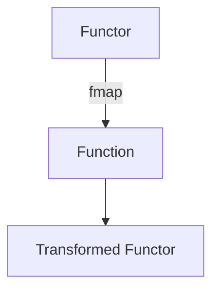

## 4.1 Functor Pattern in Clojure

### Introduction

In the realm of functional programming, the concept of a functor is fundamental. A functor is essentially a type that can be mapped over, allowing you to apply a function to values wrapped within a context or container. This pattern is prevalent in many functional programming languages, including Clojure, where sequences and collections naturally exhibit functor-like behavior through the use of the `map` function.

### Detailed Explanation

#### Understanding the Functor Concept

At its core, a functor implements a `map` function that applies a given function to the wrapped value, producing a new functor. This abstraction allows for a uniform way to transform data within a context, such as a list, option, or custom data structure.

In Clojure, the `map` function is a quintessential example of this pattern. It takes a function and a collection, applying the function to each element of the collection, and returns a new collection with the transformed elements.

```clojure
(map inc [1 2 3]) ; => (2 3 4)
```

#### Creating Custom Functor-Like Structures

While Clojure's built-in sequences and collections already behave like functors, you can define custom functor-like structures by implementing a protocol that defines the `fmap` function.

##### Defining a Functor Protocol

First, define a protocol for mapping over a structure:

```clojure
(defprotocol Functor
  (fmap [this f]))
```

##### Implementing the Protocol for a Custom Type

Next, create a custom type and implement the `Functor` protocol for it. Consider a simple `Box` type that wraps a value:

```clojure
(defrecord Box [value]
  Functor
  (fmap [this f]
    (->Box (f value))))
```

This implementation allows you to apply a function to the value inside the `Box`, returning a new `Box` with the transformed value.

##### Using the `fmap` Function

You can now use the `fmap` function to apply transformations to the `Box`:

```clojure
(def box (->Box 10))
(fmap box inc) ; => #user.Box{:value 11}
```

### Ensuring Functor Laws Are Respected

To ensure that your functor implementation is correct, it should adhere to two fundamental laws: the Identity Law and the Composition Law.

#### Identity Law

Mapping the identity function over a functor should not change it. This law ensures that the functor behaves predictably when no transformation is applied.

```clojure
(= (fmap box identity) box)
```

#### Composition Law

Mapping a composition of functions over a functor should be the same as composing two maps. This law ensures that function composition works as expected within the functor context.

```clojure
(def f inc)
(def g #(* % 2))
(= (fmap (fmap box f) g)
   (fmap box (comp g f)))
```

### Visualizing the Functor Pattern

To better understand the functor pattern, consider the following conceptual diagram illustrating how a function is applied to a wrapped value:



### Use Cases

The functor pattern is widely applicable in scenarios where you need to apply transformations to data within a context. Common use cases include:

- **Data Transformation:** Applying transformations to elements within a collection.
- **Option Handling:** Transforming values within optional types without unwrapping them.
- **Custom Data Structures:** Implementing functor-like behavior for custom types to enable flexible data manipulation.

### Advantages and Disadvantages

#### Advantages

- **Abstraction:** Provides a uniform interface for applying functions to wrapped values.
- **Composability:** Facilitates function composition and chaining within a context.
- **Reusability:** Encourages code reuse by abstracting the mapping logic.

#### Disadvantages

- **Complexity:** Implementing custom functors can introduce complexity, especially when ensuring adherence to functor laws.
- **Overhead:** May introduce additional overhead if not used judiciously, particularly in performance-critical applications.

### Best Practices

- **Adhere to Functor Laws:** Ensure that your functor implementations respect the Identity and Composition laws for predictable behavior.
- **Leverage Built-In Functions:** Utilize Clojure's built-in `map` function for sequences and collections whenever possible.
- **Use Protocols for Custom Types:** Define protocols to implement functor-like behavior for custom data structures, promoting consistency and reusability.

### Conclusion

The functor pattern is a powerful abstraction in functional programming, enabling the application of functions over wrapped values in a consistent and predictable manner. By leveraging Clojure's sequences, collections, and custom structures, you can effectively implement and utilize functors in your applications, enhancing code reusability and composability.

## Quiz Time!



### What is a functor in functional programming?

- [x] A type that can be mapped over
- [ ] A function that takes two arguments
- [ ] A data structure that holds multiple values
- [ ] A method for optimizing performance

> **Explanation:** A functor is a type that can be mapped over, allowing functions to be applied to wrapped values.

### Which Clojure function exemplifies the functor pattern?

- [x] map
- [ ] reduce
- [ ] filter
- [ ] apply

> **Explanation:** The `map` function in Clojure applies a function to each element of a collection, exemplifying the functor pattern.

### What is the purpose of the `fmap` function in a functor?

- [x] To apply a function to the wrapped value and produce a new functor
- [ ] To reduce a collection to a single value
- [ ] To filter elements based on a predicate
- [ ] To concatenate two collections

> **Explanation:** The `fmap` function applies a function to the wrapped value, producing a new functor.

### What does the Identity Law state for functors?

- [x] Mapping the identity function should not change the functor
- [ ] Mapping a function should always return a new functor
- [ ] Mapping a function should reduce the functor's size
- [ ] Mapping a function should increase the functor's size

> **Explanation:** The Identity Law states that mapping the identity function over a functor should not change it.

### What does the Composition Law state for functors?

- [x] Mapping a composition of functions should be the same as composing two maps
- [ ] Mapping a function should always return a new functor
- [ ] Mapping a function should reduce the functor's size
- [ ] Mapping a function should increase the functor's size

> **Explanation:** The Composition Law states that mapping a composition of functions should be the same as composing two maps.

### How can you define a functor protocol in Clojure?

- [x] (defprotocol Functor (fmap [this f]))
- [ ] (defn Functor [this f])
- [ ] (defrecord Functor [this f])
- [ ] (defmacro Functor [this f])

> **Explanation:** A functor protocol can be defined using `defprotocol` with the `fmap` function.

### What is the result of `(fmap (->Box 10) inc)` in the provided example?

- [x] #user.Box{:value 11}
- [ ] #user.Box{:value 10}
- [ ] #user.Box{:value 12}
- [ ] #user.Box{:value 9}

> **Explanation:** The `fmap` function applies `inc` to the value inside the `Box`, resulting in `#user.Box{:value 11}`.

### Which of the following is NOT a use case for functors?

- [ ] Data Transformation
- [ ] Option Handling
- [ ] Custom Data Structures
- [x] Performance Optimization

> **Explanation:** Functors are used for data transformation, option handling, and custom data structures, not specifically for performance optimization.

### What is a disadvantage of using functors?

- [x] Complexity in implementation
- [ ] Lack of abstraction
- [ ] Inability to compose functions
- [ ] Reduced code reusability

> **Explanation:** Implementing custom functors can introduce complexity, especially when ensuring adherence to functor laws.

### True or False: The `map` function in Clojure can be considered a functor.

- [x] True
- [ ] False

> **Explanation:** True, the `map` function in Clojure applies a function to each element of a collection, exemplifying the functor pattern.


