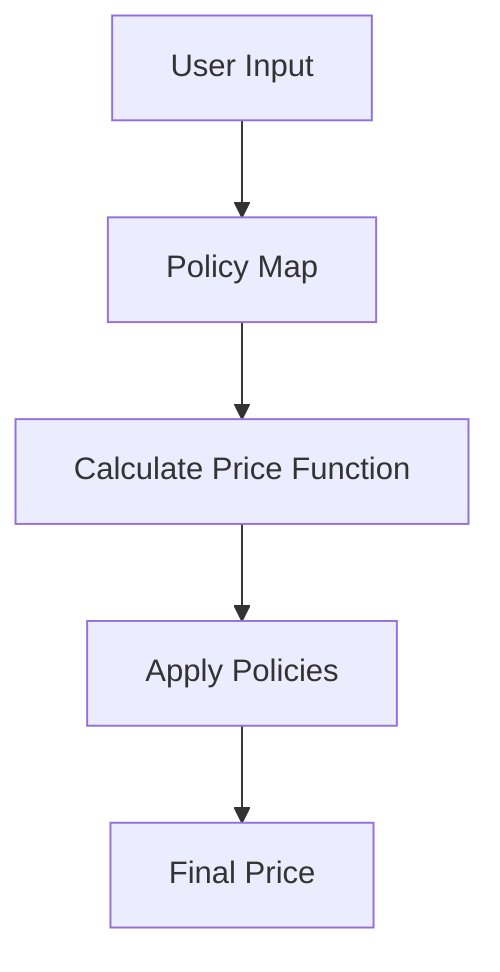

## 4.10 Policy-Based Design in Clojure

In the realm of software design, flexibility and adaptability are paramount. Policy-Based Design is a powerful paradigm that encapsulates business rules and decisions as separate, interchangeable components. This approach allows for dynamic configuration and swapping of policies, promoting a clean separation of concerns. In Clojure, we can leverage higher-order functions and data-driven approaches to implement these flexible policies effectively.

### Introduction

Policy-Based Design is a strategy that decouples business logic from the rules that govern it. By defining policies as independent components, we can easily modify, replace, or extend them without altering the core logic of our application. This design pattern is particularly useful in scenarios where business rules frequently change or vary across different contexts.

### Detailed Explanation

At its core, Policy-Based Design involves defining policies as functions or data structures that encapsulate specific business rules. These policies can then be composed, applied, or swapped dynamically, allowing for a high degree of flexibility.

#### Defining Policies as Functions or Data Structures

In Clojure, policies can be elegantly represented as functions. This functional approach aligns well with Clojure's emphasis on immutability and first-class functions.

```clojure
;; Define policy functions
(defn age-based-discount [user amount]
  (if (>= (:age user) 65)
    (* amount 0.9) ; 10% discount for seniors
    amount))

(defn membership-discount [user amount]
  (case (:membership-level user)
    :gold (* amount 0.8)   ; 20% discount
    :silver (* amount 0.9) ; 10% discount
    amount))
```

In this example, we define two policies: `age-based-discount` and `membership-discount`. Each function takes a `user` and an `amount`, applying a discount based on the user's age or membership level.

#### Creating a Map of Policies

To manage multiple policies, we can store them in a map. This allows for easy access and manipulation of policies.

```clojure
(def discount-policies
  {:age-discount age-based-discount
   :membership-discount membership-discount})
```

#### Implementing a Function Utilizing Policies

We can create a function that applies a series of policies to calculate a final price. This function uses `reduce` to apply each policy in sequence.

```clojure
(defn calculate-price [user amount policies]
  (reduce (fn [amt policy]
            (policy user amt))
          amount
          (vals policies)))
```

#### Applying Policies Dynamically

With our `calculate-price` function, we can dynamically apply policies to a given user and amount.

```clojure
(calculate-price {:name "John Doe" :age 70 :membership-level :silver}
                 100
                 discount-policies)
; => 81.0
```

In this example, John Doe receives both an age-based and a membership discount, resulting in a final price of 81.0.

#### Adding or Removing Policies Without Changing Core Logic

One of the key benefits of Policy-Based Design is the ability to add or remove policies without modifying the core logic.

```clojure
;; Add a new policy
(defn seasonal-discount [user amount]
  (* amount 0.95)) ; 5% seasonal discount

(def updated-policies
  (assoc discount-policies :seasonal-discount seasonal-discount))

(calculate-price {:name "John Doe" :age 70 :membership-level :silver}
                 100
                 updated-policies)
```

Here, we introduce a `seasonal-discount` policy and update our policies map. The core logic of `calculate-price` remains unchanged.

#### Externalizing Policies for Flexibility

For even greater flexibility, policies can be externalized to configuration files or databases. This allows for runtime changes based on environment or user preferences.

#### Using Higher-Order Functions to Compose Policies

Higher-order functions enable us to compose multiple policies into a single, cohesive policy.

```clojure
(defn compose-policies [& policies]
  (fn [user amount]
    (reduce (fn [amt policy]
              (policy user amt))
            amount
            policies)))

(def combined-policy
  (compose-policies age-based-discount membership-discount))

(combined-policy {:age 70 :membership-level :gold} 100)
; => 72.0
```

### Visual Aids

To better understand the flow of Policy-Based Design, consider the following conceptual diagram:



### Use Cases

Policy-Based Design is particularly useful in domains where business rules are complex and subject to change, such as:

- **E-commerce:** Dynamic pricing strategies based on user demographics, purchase history, and seasonal promotions.
- **Insurance:** Risk assessment policies that vary based on user profiles and external factors.
- **Finance:** Interest rate calculations that depend on market conditions and customer tiers.

### Advantages and Disadvantages

**Advantages:**

- **Flexibility:** Easily swap or modify policies without altering core logic.
- **Separation of Concerns:** Decouples business rules from application logic.
- **Reusability:** Policies can be reused across different parts of the application.

**Disadvantages:**

- **Complexity:** Managing a large number of policies can become complex.
- **Performance:** Applying multiple policies may impact performance if not optimized.

### Best Practices

- **Keep Policies Simple:** Ensure each policy addresses a single concern.
- **Document Policies:** Clearly document the purpose and behavior of each policy.
- **Test Policies Independently:** Write unit tests for individual policies to ensure correctness.

### Comparisons

Policy-Based Design can be compared to Strategy Pattern, where strategies are interchangeable algorithms. However, Policy-Based Design focuses more on business rules and decisions rather than algorithms.

### Conclusion

Policy-Based Design in Clojure offers a robust framework for managing dynamic business rules. By encapsulating policies as functions and leveraging Clojure's functional capabilities, developers can create flexible, adaptable systems that respond to changing requirements with ease.

## Quiz Time!



### What is the primary purpose of Policy-Based Design?

- [x] To encapsulate business rules as separate, interchangeable components
- [ ] To optimize performance by reducing computation time
- [ ] To enforce strict type checking in functional programming
- [ ] To simplify user interface design

> **Explanation:** Policy-Based Design focuses on encapsulating business rules as separate, interchangeable components, allowing for flexibility and adaptability.

### How are policies typically represented in Clojure?

- [x] As functions or data structures
- [ ] As classes and objects
- [ ] As XML configurations
- [ ] As SQL queries

> **Explanation:** In Clojure, policies are typically represented as functions or data structures, aligning with the language's functional programming paradigm.

### What is a key benefit of using Policy-Based Design?

- [x] It allows adding or removing policies without changing core logic
- [ ] It guarantees faster execution times
- [ ] It simplifies database schema design
- [ ] It ensures compatibility with all programming languages

> **Explanation:** One of the key benefits of Policy-Based Design is the ability to add or remove policies without modifying the core logic of the application.

### Which Clojure feature is leveraged to compose multiple policies?

- [x] Higher-order functions
- [ ] Macros
- [ ] Atoms
- [ ] Refs

> **Explanation:** Higher-order functions in Clojure are used to compose multiple policies, enabling flexible and dynamic policy management.

### What is a potential disadvantage of Policy-Based Design?

- [x] Managing a large number of policies can become complex
- [ ] It limits the use of functional programming
- [ ] It requires extensive use of global variables
- [ ] It enforces a monolithic architecture

> **Explanation:** A potential disadvantage of Policy-Based Design is that managing a large number of policies can become complex.

### How can policies be externalized for greater flexibility?

- [x] By storing them in configuration files or databases
- [ ] By hardcoding them into the application
- [ ] By using global variables
- [ ] By embedding them in HTML

> **Explanation:** Policies can be externalized by storing them in configuration files or databases, allowing for runtime changes and greater flexibility.

### What is the result of applying the `combined-policy` to a user with age 70 and membership level gold, with an amount of 100?

- [x] 72.0
- [ ] 80.0
- [ ] 90.0
- [ ] 100.0

> **Explanation:** The `combined-policy` applies both age-based and membership discounts, resulting in a final amount of 72.0.

### Which pattern is similar to Policy-Based Design but focuses on interchangeable algorithms?

- [x] Strategy Pattern
- [ ] Observer Pattern
- [ ] Singleton Pattern
- [ ] Factory Pattern

> **Explanation:** The Strategy Pattern is similar to Policy-Based Design but focuses on interchangeable algorithms rather than business rules.

### What is a best practice when implementing policies?

- [x] Keep policies simple and focused on a single concern
- [ ] Use global variables to store policy states
- [ ] Embed policies directly in the user interface
- [ ] Avoid documenting policies to reduce overhead

> **Explanation:** A best practice when implementing policies is to keep them simple and focused on a single concern, ensuring clarity and maintainability.

### True or False: Policy-Based Design can only be used in e-commerce applications.

- [ ] True
- [x] False

> **Explanation:** False. Policy-Based Design can be applied in various domains, including e-commerce, insurance, finance, and more, wherever dynamic business rules are needed.


