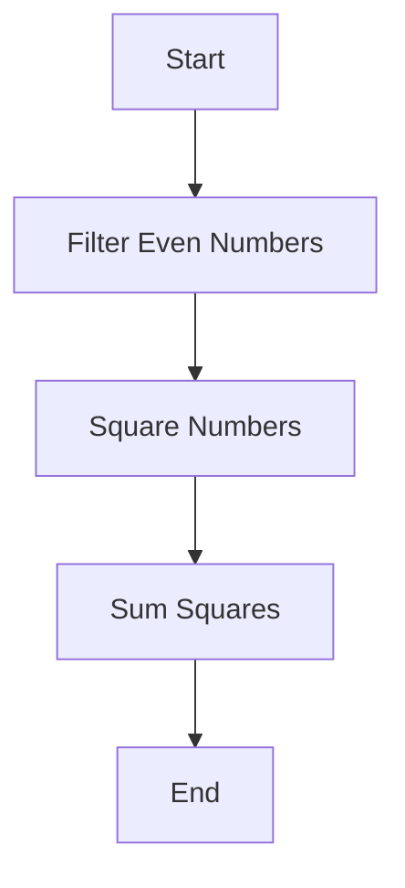

## 4.11. Coding Style and Conventions

Writing clean, idiomatic Clojure code is essential for maintaining readability, consistency, and ease of collaboration within teams. In this section, we will explore the recommended coding styles and conventions that help Clojure developers produce high-quality code. We will cover naming conventions, indentation, formatting, and tools that can enforce these styles. By adhering to these guidelines, you can ensure that your Clojure code is both efficient and elegant.

### Why Coding Style Matters

Coding style is not just about aesthetics; it plays a crucial role in the maintainability and readability of code. Consistent style helps developers understand code quickly, reduces the likelihood of errors, and facilitates collaboration. In Clojure, where the language's expressiveness can lead to diverse coding styles, following a common set of conventions becomes even more important.

### Naming Conventions

Naming conventions are vital for conveying the purpose and usage of variables, functions, and namespaces. Here are some guidelines to follow:

- **Variables and Functions**: Use lowercase words separated by hyphens (e.g., `calculate-total`, `user-name`). This is a common Lisp convention and helps distinguish Clojure code from other languages that use camelCase or snake_case.

- **Namespaces**: Use a reverse domain name notation, similar to Java packages, to avoid naming conflicts (e.g., `com.example.project`). Within a project, use meaningful names that reflect the module's purpose (e.g., `project.core`, `project.utils`).

- **Constants**: Use uppercase letters with underscores to separate words (e.g., `MAX_CONNECTIONS`, `DEFAULT_TIMEOUT`).

- **Macros**: Name macros with a trailing exclamation mark if they perform side effects (e.g., `defmacro!`).

#### Example

```clojure
;; Good Naming
(defn calculate-total [prices]
  (reduce + prices))

(def MAX_CONNECTIONS 100)

;; Bad Naming
(defn calcTotal [prices]
  (reduce + prices))

(def maxConnections 100)
```

### Indentation and Formatting

Proper indentation and formatting enhance code readability and help developers quickly understand the structure and flow of the code.

- **Indentation**: Use two spaces for indentation. Avoid using tabs, as they can lead to inconsistent formatting across different editors.

- **Line Length**: Keep lines to a maximum of 80 characters. This ensures that code is easily readable on different devices and editors.

- **Function Definitions**: Align function arguments vertically for clarity.

- **Let Bindings**: Align the bindings in a `let` form vertically.

#### Example

```clojure
;; Good Indentation
(defn example-function
  [arg1 arg2]
  (let [result (+ arg1 arg2)
        doubled (* 2 result)]
    (println "The doubled result is:" doubled)))

;; Bad Indentation
(defn example-function [arg1 arg2]
(let [result (+ arg1 arg2)
doubled (* 2 result)]
(println "The doubled result is:" doubled)))
```

### Formatting Expressions

Clojure's syntax allows for expressive and concise code, but it also requires careful formatting to maintain readability.

- **Threading Macros**: Use threading macros (`->`, `->>`) to improve readability when chaining multiple operations.

- **Destructuring**: Use destructuring to extract values from collections, improving code clarity.

- **Whitespace**: Use whitespace to separate logical sections of code, making it easier to read.

#### Example

```clojure
;; Good Formatting with Threading Macros
(->> (range 10)
     (map inc)
     (filter even?)
     (reduce +))

;; Bad Formatting
(reduce + (filter even? (map inc (range 10))))
```

### Community Style Guide

The Clojure community has developed a style guide that provides comprehensive recommendations for writing idiomatic Clojure code. This guide is a valuable resource for both new and experienced developers. You can find it on [GitHub](https://github.com/bbatsov/clojure-style-guide).

### Tools for Enforcing Style

Several tools can help enforce coding style and conventions in Clojure projects:

- **cljfmt**: A tool for formatting Clojure code according to community standards. It can be integrated into your build process to automatically format code.

- **Eastwood**: A linting tool that checks for common errors and style issues in Clojure code.

- **Kibit**: A static code analyzer that suggests idiomatic Clojure code improvements.

#### Example of Using cljfmt

```shell
# Install cljfmt
lein install cljfmt

# Format a Clojure file
lein cljfmt fix src/my_project/core.clj
```

### Consistency and Readability

Consistency is key to maintaining a codebase that is easy to read and understand. Encourage team members to follow the same conventions and use tools to automate style checks. Consistent code is easier to review, debug, and extend.

### Common Pitfalls and How to Avoid Them

- **Inconsistent Naming**: Stick to the naming conventions outlined above to avoid confusion.

- **Overly Complex Expressions**: Break down complex expressions into smaller, more manageable functions.

- **Ignoring Community Standards**: Familiarize yourself with the community style guide and adhere to it.

### Try It Yourself

Experiment with the following code examples by modifying them to see how different styles affect readability:

```clojure
;; Original Code
(defn process-data [data]
  (let [filtered (filter even? data)
        squared (map #(* % %) filtered)]
    (reduce + squared)))

;; Try changing the indentation and naming conventions
```

### Visualizing Clojure Code Structure

To better understand how Clojure code is structured, let's visualize a simple function using a flowchart:



This flowchart represents the process of filtering, squaring, and summing numbers in a collection, as shown in the code example above.

### References and Further Reading

- [Clojure Style Guide on GitHub](https://github.com/bbatsov/clojure-style-guide)
- [Clojure Documentation](https://clojure.org/reference/documentation)
- [Effective Clojure](https://github.com/technomancy/effective-clojure)

### Knowledge Check

To reinforce your understanding of Clojure coding style and conventions, try answering the following questions:

## **Ready to Test Your Knowledge?**



### What is the recommended naming convention for functions in Clojure?

- [x] Lowercase words separated by hyphens
- [ ] CamelCase
- [ ] snake_case
- [ ] Uppercase words separated by underscores

> **Explanation:** In Clojure, functions are typically named using lowercase words separated by hyphens, following Lisp conventions.

### How many spaces should be used for indentation in Clojure?

- [x] Two spaces
- [ ] Four spaces
- [ ] One tab
- [ ] Eight spaces

> **Explanation:** Clojure code is typically indented using two spaces to maintain consistency and readability.

### What tool can be used to automatically format Clojure code?

- [x] cljfmt
- [ ] Prettier
- [ ] ESLint
- [ ] Black

> **Explanation:** cljfmt is a tool specifically designed for formatting Clojure code according to community standards.

### Which of the following is a common pitfall in Clojure coding style?

- [x] Inconsistent naming conventions
- [ ] Using threading macros
- [ ] Proper indentation
- [ ] Following community standards

> **Explanation:** Inconsistent naming conventions can lead to confusion and reduce code readability.

### What is the purpose of threading macros in Clojure?

- [x] To improve readability by chaining operations
- [ ] To execute code in parallel
- [ ] To handle errors
- [ ] To define new functions

> **Explanation:** Threading macros like `->` and `->>` are used to chain operations in a readable manner.

### Which tool suggests idiomatic Clojure code improvements?

- [x] Kibit
- [ ] JSLint
- [ ] RuboCop
- [ ] PyLint

> **Explanation:** Kibit is a static code analyzer that suggests idiomatic Clojure code improvements.

### What is the maximum recommended line length in Clojure?

- [x] 80 characters
- [ ] 100 characters
- [ ] 120 characters
- [ ] 60 characters

> **Explanation:** Keeping lines to a maximum of 80 characters ensures code is easily readable on different devices and editors.

### What is the recommended way to name constants in Clojure?

- [x] Uppercase letters with underscores
- [ ] Lowercase words separated by hyphens
- [ ] CamelCase
- [ ] snake_case

> **Explanation:** Constants in Clojure are typically named using uppercase letters with underscores.

### Which of the following is a benefit of consistent coding style?

- [x] Easier code review and debugging
- [ ] Faster code execution
- [ ] Reduced memory usage
- [ ] Increased code complexity

> **Explanation:** Consistent coding style makes code easier to review, debug, and extend.

### True or False: Tabs are recommended for indentation in Clojure.

- [ ] True
- [x] False

> **Explanation:** Tabs are not recommended for indentation in Clojure; use two spaces instead to maintain consistency.



Remember, this is just the beginning. As you progress, you'll build more complex and interactive Clojure applications. Keep experimenting, stay curious, and enjoy the journey!
