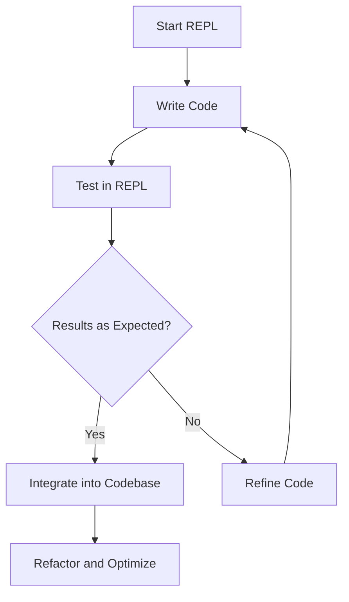

## 4.12. Effective Use of the REPL

The Read-Eval-Print Loop (REPL) is a cornerstone of Clojure development, offering a dynamic and interactive environment that enhances productivity and code quality. By leveraging the REPL, developers can experiment, debug, and refine their code in real-time. This section delves into advanced REPL usage patterns, REPL-driven development workflows, and tools that can elevate your Clojure programming experience.

### Understanding the REPL

The REPL is an interactive programming environment that reads user inputs, evaluates them, and prints the results. This cycle allows for immediate feedback and iterative development, making it an invaluable tool for Clojure developers.

#### Key Features of the REPL

- **Immediate Feedback**: Execute code snippets and see results instantly.
- **Interactive Exploration**: Test functions and data structures on the fly.
- **Incremental Development**: Build and refine code iteratively.
- **Debugging**: Inspect and modify code in real-time.

### Advanced REPL Usage Patterns

To fully harness the power of the REPL, it's essential to adopt advanced usage patterns that streamline development and debugging processes.

#### REPL-Driven Development

REPL-driven development is a workflow that emphasizes writing and testing code interactively within the REPL. This approach encourages experimentation and rapid prototyping, allowing developers to explore ideas and solutions dynamically.

**Steps for REPL-Driven Development:**

1. **Start with a Problem Statement**: Clearly define the problem or feature you want to implement.
2. **Break Down the Problem**: Decompose the problem into smaller, manageable tasks.
3. **Iteratively Develop and Test**: Write small code snippets, test them in the REPL, and refine as needed.
4. **Integrate and Refactor**: Once satisfied with the solution, integrate it into your codebase and refactor for clarity and performance.

#### Using the REPL for Debugging

The REPL is an excellent tool for debugging, allowing you to inspect and modify code in real-time. Here are some techniques to enhance your debugging process:

- **Evaluate Expressions**: Test individual expressions to understand their behavior.
- **Inspect Variables**: Use the REPL to check the values of variables and data structures.
- **Modify State**: Change the state of your application directly from the REPL to test different scenarios.
- **Trace Execution**: Use tracing functions to follow the execution flow and identify issues.

### Code Examples

Let's explore some practical examples of using the REPL for development and debugging.

#### Example 1: Exploring a Function

Suppose we have a function that calculates the factorial of a number. We can use the REPL to test and refine this function.

```clojure
(defn factorial [n]
  (if (<= n 1)
    1
    (* n (factorial (dec n)))))

;; Test the function in the REPL
(factorial 5) ; => 120
```

**Try It Yourself**: Modify the function to handle negative inputs gracefully.

#### Example 2: Debugging with the REPL

Imagine a scenario where a function is not returning the expected result. Use the REPL to inspect and debug the function.

```clojure
(defn add-numbers [a b]
  (+ a b))

;; Unexpected result
(add-numbers 2 "3") ; => Error

;; Debugging in the REPL
(try
  (add-numbers 2 "3")
  (catch Exception e
    (println "Caught exception:" (.getMessage e))))
```

**Try It Yourself**: Modify the function to handle string inputs by converting them to numbers.

### Enhancing the REPL Experience

Several tools and plugins can enhance the REPL experience, making it more powerful and user-friendly.

#### Integrating the REPL into Your Editor or IDE

Many editors and IDEs support REPL integration, allowing you to execute code directly from your development environment. This integration streamlines the workflow and reduces context switching.

- **CIDER**: A powerful Clojure development environment for Emacs, offering seamless REPL integration.
- **Cursive**: A popular Clojure plugin for IntelliJ IDEA, providing robust REPL support.
- **Calva**: A Visual Studio Code extension that brings Clojure and ClojureScript development features, including REPL integration.

#### Plugins and Tools

- **REBL**: A data visualization tool that enhances the REPL experience by providing rich data exploration capabilities.
- **Clojure CLI Tools**: Use the Clojure CLI to start a REPL with specific dependencies and configurations.
- **nREPL**: A networked REPL that allows remote connections and advanced features like code completion and debugging.

### Visualizing the REPL Workflow

To better understand the REPL workflow, let's visualize the process using a flowchart.



**Caption**: This flowchart illustrates the iterative process of REPL-driven development, emphasizing testing and refinement.

### Best Practices for Using the REPL

- **Keep Sessions Short**: Regularly restart the REPL to ensure a clean environment and avoid stale state.
- **Document Experiments**: Keep track of successful experiments and code snippets for future reference.
- **Use Namespaces**: Organize code into namespaces to avoid conflicts and improve readability.
- **Leverage History**: Use the REPL's history feature to revisit previous commands and results.

### Knowledge Check

Before we conclude, let's reinforce our understanding with some questions and exercises.

- **What are the benefits of REPL-driven development?**
- **How can you use the REPL to debug a function?**
- **List some tools that enhance the REPL experience.**

### Summary

The REPL is a powerful tool that can significantly enhance your Clojure development experience. By adopting REPL-driven development workflows and leveraging advanced usage patterns, you can improve productivity, code quality, and debugging efficiency. Remember to integrate the REPL into your editor or IDE and explore plugins and tools that can further enhance your workflow.

### Ready to Test Your Knowledge?



### What is the primary benefit of using the REPL in Clojure development?

- [x] Immediate feedback and interactive exploration
- [ ] Automated testing
- [ ] Code compilation
- [ ] Version control

> **Explanation:** The REPL provides immediate feedback and allows for interactive exploration, making it a powerful tool for Clojure development.

### Which tool is commonly used for REPL integration in Emacs?

- [x] CIDER
- [ ] Calva
- [ ] IntelliJ IDEA
- [ ] REBL

> **Explanation:** CIDER is a powerful Clojure development environment for Emacs, offering seamless REPL integration.

### How can the REPL be used for debugging?

- [x] By evaluating expressions and inspecting variables
- [ ] By compiling code
- [ ] By running automated tests
- [ ] By managing dependencies

> **Explanation:** The REPL allows you to evaluate expressions, inspect variables, and modify state, making it an excellent tool for debugging.

### What is a key feature of REPL-driven development?

- [x] Iterative development and testing
- [ ] Automated deployment
- [ ] Code obfuscation
- [ ] Static analysis

> **Explanation:** REPL-driven development emphasizes iterative development and testing, allowing developers to experiment and refine code dynamically.

### Which plugin is used for Clojure development in Visual Studio Code?

- [x] Calva
- [ ] CIDER
- [ ] Cursive
- [ ] REBL

> **Explanation:** Calva is a Visual Studio Code extension that brings Clojure and ClojureScript development features, including REPL integration.

### What is the purpose of using namespaces in the REPL?

- [x] To organize code and avoid conflicts
- [ ] To compile code
- [ ] To manage dependencies
- [ ] To automate testing

> **Explanation:** Namespaces help organize code and avoid conflicts, improving readability and maintainability.

### Which tool provides data visualization capabilities for the REPL?

- [x] REBL
- [ ] CIDER
- [ ] Calva
- [ ] Cursive

> **Explanation:** REBL is a data visualization tool that enhances the REPL experience by providing rich data exploration capabilities.

### What should you do to ensure a clean REPL environment?

- [x] Regularly restart the REPL
- [ ] Use automated testing
- [ ] Compile code
- [ ] Use static analysis

> **Explanation:** Regularly restarting the REPL ensures a clean environment and avoids stale state.

### Which of the following is NOT a benefit of using the REPL?

- [ ] Immediate feedback
- [ ] Interactive exploration
- [ ] Incremental development
- [x] Automated deployment

> **Explanation:** While the REPL offers immediate feedback, interactive exploration, and incremental development, it does not handle automated deployment.

### True or False: The REPL can be used to modify the state of an application in real-time.

- [x] True
- [ ] False

> **Explanation:** The REPL allows you to modify the state of an application in real-time, making it a powerful tool for testing different scenarios.



Remember, mastering the REPL is just the beginning. As you continue your journey with Clojure, keep experimenting, stay curious, and enjoy the process of discovery and learning!
