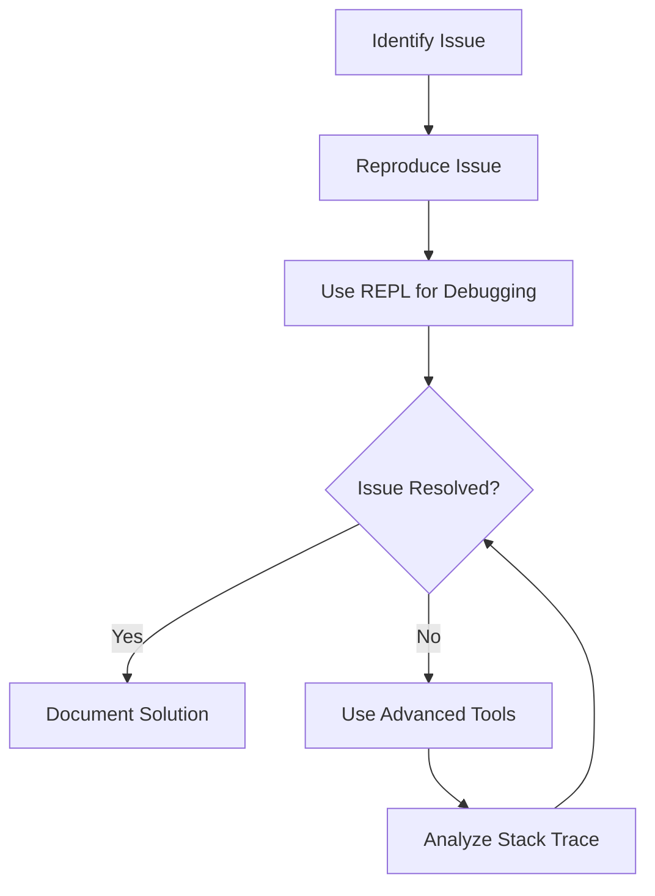

## 4.13. Debugging Techniques

Debugging is an essential skill for any developer, and in the world of Clojure, it takes on unique characteristics due to the language's functional nature and its powerful REPL (Read-Eval-Print Loop). In this section, we will explore various debugging techniques that can help you effectively troubleshoot and resolve issues in your Clojure code. We'll cover common debugging challenges, the use of the REPL and `println`, and delve into advanced tools like CIDER and nREPL. By the end of this guide, you'll be equipped with a robust set of strategies to tackle any debugging task in Clojure.

### Common Debugging Challenges in Clojure

Before diving into specific techniques, it's important to understand some of the common challenges developers face when debugging Clojure code:

1. **Immutable Data Structures**: Clojure's emphasis on immutability can make it difficult to track changes in state over time.
2. **Lazy Evaluation**: Lazy sequences can defer computation, leading to unexpected behavior when debugging.
3. **Macros and Metaprogramming**: The use of macros can obscure the flow of execution, making it harder to trace code paths.
4. **Concurrency**: Clojure's concurrency primitives can introduce complexity when debugging multi-threaded applications.

### Using the REPL for Debugging

The REPL is one of Clojure's most powerful tools, allowing for interactive development and immediate feedback. Here's how you can leverage the REPL for debugging:

#### Evaluating Expressions

The REPL allows you to evaluate expressions in isolation, making it easy to test small pieces of code. This can be particularly useful for debugging functions:

```clojure
(defn add [a b]
  (+ a b))

;; Evaluate in REPL
(add 2 3) ;; => 5
```

#### Experimenting with Code

You can use the REPL to experiment with different inputs and observe the outputs, helping you identify where things might be going wrong.

#### Inspecting Data Structures

The REPL can be used to inspect complex data structures, providing insights into their contents:

```clojure
(def my-map {:a 1 :b 2 :c 3})

;; Inspect in REPL
my-map ;; => {:a 1, :b 2, :c 3}
```

### Debugging with `println`

A simple yet effective debugging technique is using `println` to output values at various points in your code. This can help you trace the flow of execution and identify where things might be going awry:

```clojure
(defn process-data [data]
  (println "Processing data:" data)
  ;; Process data
  )

(process-data [1 2 3])
```

### Advanced Debugging Tools

While the REPL and `println` are great for quick debugging, more complex issues may require advanced tools. Let's explore some of these tools:

#### CIDER

[CIDER](https://docs.cider.mx) is an interactive development environment for Clojure, providing powerful debugging capabilities. It integrates with Emacs and offers features like:

- **Interactive Evaluation**: Evaluate code directly within your editor.
- **Stack Traces**: View detailed stack traces to understand errors.
- **Debugging**: Set breakpoints and step through code execution.

#### nREPL

[nREPL](https://nrepl.org/) is a networked REPL server that allows you to connect to a running Clojure process. It provides a foundation for tools like CIDER and offers features such as:

- **Remote Debugging**: Connect to remote Clojure processes for debugging.
- **Middleware Support**: Extend nREPL with custom middleware for additional functionality.

### Tracing and Inspecting Code Execution

Tracing code execution can help you understand the flow of your program and identify where issues might be occurring. Here are some techniques for tracing:

#### Using `trace` and `trace-ns`

The `clojure.tools.trace` library provides functions like `trace` and `trace-ns` to trace function calls:

```clojure
(require '[clojure.tools.trace :refer [trace]])

(defn add [a b]
  (trace (+ a b)))

(add 2 3)
```

#### Inspecting Stack Traces

Understanding stack traces is crucial for debugging errors. A stack trace provides a snapshot of the call stack at the point where an error occurred. Here's how to interpret a stack trace:

- **Identify the Error**: Look for the error message and the line number where it occurred.
- **Trace the Call Stack**: Follow the stack trace to see the sequence of function calls leading to the error.

### Logging for Debugging

Logging is an essential part of debugging, providing a record of events that can help diagnose issues. Clojure offers several logging libraries, such as `clojure.tools.logging` and `log4j`. Here's how you can use logging for debugging:

```clojure
(require '[clojure.tools.logging :as log])

(defn process-data [data]
  (log/info "Processing data:" data)
  ;; Process data
  )
```

### Understanding Stack Traces

Stack traces are invaluable for debugging, providing insights into the sequence of function calls that led to an error. Here's how to effectively use stack traces:

- **Locate the Error**: Identify the error message and the line number where it occurred.
- **Analyze the Call Stack**: Examine the call stack to understand the sequence of function calls leading to the error.
- **Identify Patterns**: Look for patterns or recurring issues in stack traces to identify common problems.

### Try It Yourself

To get hands-on experience with these debugging techniques, try modifying the following code examples:

1. **Experiment with the REPL**: Change the inputs to the `add` function and observe the outputs.
2. **Use `println` for Debugging**: Add `println` statements to trace the execution of a function.
3. **Explore CIDER**: Set up CIDER in Emacs and try setting breakpoints in your code.
4. **Trace Code Execution**: Use `trace` to trace function calls and observe the output.

### Visualizing Debugging Workflows

To better understand the debugging process, let's visualize a typical debugging workflow using a flowchart:



**Figure 1**: A typical debugging workflow in Clojure, illustrating the steps from identifying an issue to resolving it.

### References and Further Reading

- [CIDER Documentation](https://docs.cider.mx)
- [nREPL Documentation](https://nrepl.org/)
- [Clojure Tools Trace](https://github.com/clojure/tools.trace)
- [Clojure Tools Logging](https://github.com/clojure/tools.logging)

### Knowledge Check

To reinforce your understanding of debugging techniques in Clojure, try answering the following questions:

## **Ready to Test Your Knowledge?**



### What is one of the main challenges when debugging Clojure code?

- [x] Immutable Data Structures
- [ ] Lack of Libraries
- [ ] Poor Documentation
- [ ] Limited Community Support

> **Explanation:** Clojure's emphasis on immutability can make it difficult to track changes in state over time, posing a challenge for debugging.

### Which tool is commonly used for interactive development in Clojure?

- [x] CIDER
- [ ] Eclipse
- [ ] Visual Studio
- [ ] IntelliJ IDEA

> **Explanation:** CIDER is an interactive development environment for Clojure, providing powerful debugging capabilities.

### What is the purpose of using `println` in debugging?

- [x] To output values at various points in code
- [ ] To compile the code
- [ ] To format the code
- [ ] To execute the code

> **Explanation:** `println` is used to output values at various points in code, helping trace the flow of execution.

### What does nREPL stand for?

- [x] Networked Read-Eval-Print Loop
- [ ] New Read-Eval-Print Loop
- [ ] Nested Read-Eval-Print Loop
- [ ] None of the above

> **Explanation:** nREPL stands for Networked Read-Eval-Print Loop, allowing remote connections to a Clojure process.

### Which library provides functions like `trace` and `trace-ns`?

- [x] clojure.tools.trace
- [ ] clojure.tools.logging
- [ ] clojure.core.async
- [ ] clojure.java.io

> **Explanation:** The `clojure.tools.trace` library provides functions like `trace` and `trace-ns` to trace function calls.

### What is the primary benefit of using stack traces?

- [x] To understand the sequence of function calls leading to an error
- [ ] To improve code performance
- [ ] To enhance code readability
- [ ] To refactor code

> **Explanation:** Stack traces provide insights into the sequence of function calls that led to an error, aiding in debugging.

### Which logging library is commonly used in Clojure?

- [x] clojure.tools.logging
- [ ] logback
- [ ] slf4j
- [ ] log4j

> **Explanation:** `clojure.tools.logging` is a commonly used logging library in Clojure for recording events.

### What is the role of the REPL in debugging?

- [x] To evaluate expressions and test code interactively
- [ ] To compile code
- [ ] To deploy applications
- [ ] To manage dependencies

> **Explanation:** The REPL allows for interactive evaluation of expressions and testing of code, making it a powerful debugging tool.

### True or False: CIDER can be used to set breakpoints in Clojure code.

- [x] True
- [ ] False

> **Explanation:** CIDER allows setting breakpoints and stepping through code execution, enhancing debugging capabilities.

### What is a common debugging challenge related to Clojure's concurrency primitives?

- [x] Complexity in debugging multi-threaded applications
- [ ] Lack of concurrency support
- [ ] Poor performance
- [ ] Limited library support

> **Explanation:** Clojure's concurrency primitives can introduce complexity when debugging multi-threaded applications.



Remember, debugging is an iterative process. As you become more familiar with these techniques, you'll find yourself resolving issues more efficiently. Keep experimenting, stay curious, and enjoy the journey of mastering debugging in Clojure!
