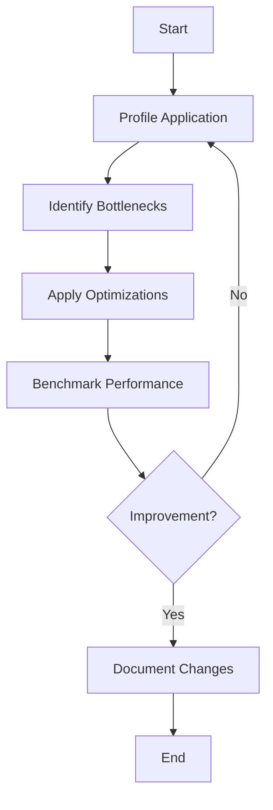

## 4.14. Performance Optimization Tips

In the world of software development, performance optimization is a critical aspect that can significantly impact the efficiency and responsiveness of applications. Clojure, with its functional programming paradigm and immutable data structures, offers unique challenges and opportunities for performance tuning. This section delves into practical tips for optimizing the performance of Clojure applications, focusing on common bottlenecks and efficient coding practices.

### Understanding the Importance of Measuring Performance

Before diving into optimization, it's crucial to understand the current performance of your application. This involves identifying bottlenecks and understanding where the application spends most of its time. 

**Key Steps:**

1. **Profiling**: Use profiling tools to gather data on your application's performance. Profilers like [YourKit](https://www.yourkit.com/) and [VisualVM](https://visualvm.github.io/) can provide insights into CPU and memory usage.

2. **Benchmarking**: Establish benchmarks to measure performance improvements. Use libraries like [Criterium](https://github.com/hugoduncan/criterium) for accurate benchmarking in Clojure.

3. **Monitoring**: Implement monitoring to track performance over time. This helps in identifying trends and potential issues before they become critical.

### Common Areas of Performance Issues

Performance issues in Clojure applications often arise in the following areas:

- **Data Structures**: Inefficient use of data structures can lead to performance bottlenecks.
- **Algorithm Complexity**: Suboptimal algorithms can degrade performance, especially with large data sets.
- **Concurrency**: Mismanagement of concurrency primitives can lead to contention and slowdowns.
- **I/O Operations**: Blocking I/O operations can significantly impact performance.

### Optimizing Data Structures and Algorithms

Choosing the right data structures and algorithms is fundamental to performance optimization. Clojure provides a rich set of immutable data structures, each with its own performance characteristics.

#### Vectors vs. Lists

- **Vectors**: Offer efficient random access and are generally preferred for collections where frequent access by index is required.
- **Lists**: Provide efficient sequential access and are suitable for operations that require frequent additions to the front of the collection.

**Example:**

```clojure
;; Using vectors for random access
(def my-vector [1 2 3 4 5])
(println (nth my-vector 2)) ; Accessing the third element

;; Using lists for sequential access
(def my-list '(1 2 3 4 5))
(println (first my-list)) ; Accessing the first element
```

#### Maps and Sets

- **Maps**: Ideal for key-value associations. Use hash maps for general-purpose use and sorted maps for ordered keys.
- **Sets**: Efficient for membership tests and eliminating duplicates.

**Example:**

```clojure
;; Using maps for key-value pairs
(def my-map {:a 1 :b 2 :c 3})
(println (get my-map :b)) ; Accessing value for key :b

;; Using sets for membership tests
(def my-set #{1 2 3 4 5})
(println (contains? my-set 3)) ; Checking if 3 is in the set
```

### Leveraging Transients for Performance

Transients provide a way to perform mutable operations on immutable data structures, offering significant performance improvements in scenarios where multiple updates are required.

**When to Use Transients:**

- When performing a large number of updates to a collection.
- When the collection is not shared across threads during the mutation phase.

**Example:**

```clojure
;; Using transients for efficient updates
(defn build-large-vector []
  (persistent!
    (reduce conj! (transient []) (range 1000000))))

(println (count (build-large-vector))) ; Efficiently builds a large vector
```

### Utilizing Type Hints

Type hints can help the Clojure compiler generate more efficient bytecode by avoiding reflection, which can be a performance bottleneck.

**Example:**

```clojure
;; Using type hints to avoid reflection
(defn add [^long a ^long b]
  (+ a b))

(println (add 1 2)) ; Type hints improve performance by avoiding reflection
```

### Profiling and Iterative Improvements

Performance optimization is an iterative process. Regular profiling and benchmarking help in identifying new bottlenecks as the application evolves.

**Steps for Iterative Improvement:**

1. **Profile**: Identify the current bottlenecks.
2. **Optimize**: Apply targeted optimizations.
3. **Benchmark**: Measure the impact of optimizations.
4. **Repeat**: Continue the cycle to achieve incremental improvements.

### Visualizing Performance Optimization

To better understand the flow of performance optimization, let's visualize the process using a flowchart.



**Caption**: This flowchart illustrates the iterative process of performance optimization, highlighting the importance of profiling, identifying bottlenecks, applying optimizations, and benchmarking.

### Encouraging Experimentation

Performance optimization is as much an art as it is a science. Encourage experimentation by trying different approaches and measuring their impact.

**Try It Yourself:**

- Modify the vector and list examples to include larger datasets and measure the performance differences.
- Experiment with transients by converting a large map to a transient and performing bulk updates.
- Add type hints to functions in your existing codebase and measure the impact on performance.

### Key Takeaways

- **Measure Before Optimizing**: Always profile and benchmark before making changes.
- **Choose the Right Data Structures**: Understand the performance characteristics of Clojure's data structures.
- **Leverage Transients and Type Hints**: Use transients for bulk updates and type hints to avoid reflection.
- **Iterate and Improve**: Performance optimization is an ongoing process that requires regular attention.

### References and Further Reading

- [Clojure Performance Tips](https://clojure.org/reference/performance)
- [Criterium Benchmarking Library](https://github.com/hugoduncan/criterium)
- [YourKit Java Profiler](https://www.yourkit.com/)
- [VisualVM](https://visualvm.github.io/)

## **Ready to Test Your Knowledge?**



### What is the first step in performance optimization?

- [x] Profiling the application
- [ ] Applying optimizations
- [ ] Benchmarking performance
- [ ] Documenting changes

> **Explanation:** Profiling helps identify where the application spends most of its time, which is crucial before applying any optimizations.

### Which data structure is preferred for random access in Clojure?

- [x] Vectors
- [ ] Lists
- [ ] Maps
- [ ] Sets

> **Explanation:** Vectors provide efficient random access, making them suitable for collections where frequent access by index is required.

### What is the primary benefit of using transients in Clojure?

- [x] Improved performance for bulk updates
- [ ] Enhanced readability
- [ ] Simplified syntax
- [ ] Better concurrency management

> **Explanation:** Transients allow mutable operations on immutable data structures, offering performance improvements for bulk updates.

### How can type hints improve performance in Clojure?

- [x] By avoiding reflection
- [ ] By simplifying code
- [ ] By enhancing readability
- [ ] By reducing memory usage

> **Explanation:** Type hints help the Clojure compiler generate more efficient bytecode by avoiding reflection.

### What tool can be used for accurate benchmarking in Clojure?

- [x] Criterium
- [ ] YourKit
- [ ] VisualVM
- [ ] Leiningen

> **Explanation:** Criterium is a library specifically designed for accurate benchmarking in Clojure.

### What should you do if no improvement is observed after optimization?

- [x] Re-profile the application
- [ ] Document the changes
- [ ] Stop further optimization
- [ ] Increase hardware resources

> **Explanation:** Re-profiling helps identify if there are new bottlenecks or if the applied optimizations were ineffective.

### Which of the following is NOT a common area of performance issues?

- [ ] Data Structures
- [ ] Algorithm Complexity
- [ ] Concurrency
- [x] Syntax Errors

> **Explanation:** Syntax errors are not related to performance issues; they are compile-time errors.

### What is the role of monitoring in performance optimization?

- [x] Tracking performance over time
- [ ] Applying optimizations
- [ ] Simplifying code
- [ ] Enhancing readability

> **Explanation:** Monitoring helps in identifying trends and potential issues before they become critical.

### Which Clojure data structure is ideal for key-value associations?

- [x] Maps
- [ ] Vectors
- [ ] Lists
- [ ] Sets

> **Explanation:** Maps are designed for key-value associations, providing efficient access and updates.

### True or False: Performance optimization is a one-time process.

- [ ] True
- [x] False

> **Explanation:** Performance optimization is an iterative process that requires regular attention and improvements.



Remember, this is just the beginning. As you progress, you'll discover more advanced techniques and strategies for optimizing Clojure applications. Keep experimenting, stay curious, and enjoy the journey!
