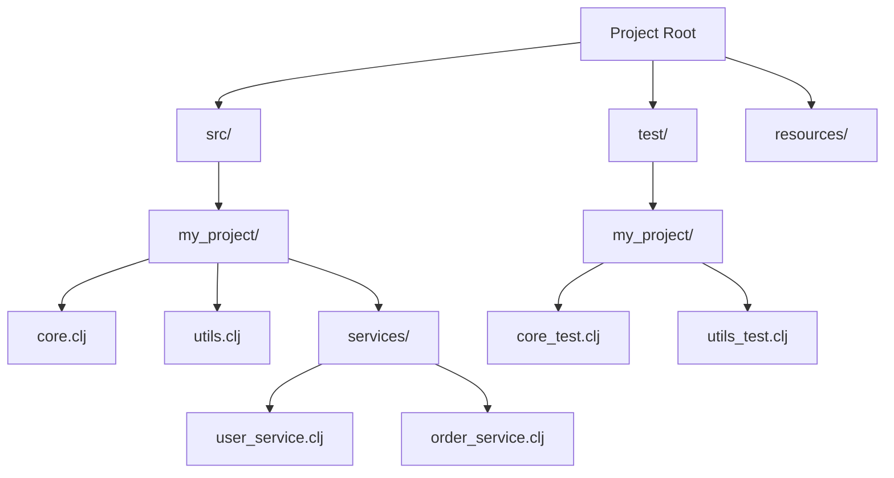

## 4.15. Best Practices in Code Organization

Organizing code effectively is crucial for maintaining a scalable and efficient codebase, especially in a language like Clojure, which emphasizes simplicity and functional programming. In this section, we will explore best practices for organizing Clojure code, focusing on structuring projects with clear namespaces, encouraging modular design, and ensuring separation of concerns. We'll also provide practical examples and discuss considerations for managing large codebases.

### Structuring Projects with Clear Namespaces

Namespaces in Clojure are akin to packages in other languages, providing a way to group related functions and data structures. They help avoid name collisions and make code easier to navigate.

#### Creating and Using Namespaces

To define a namespace, use the `ns` macro at the top of your Clojure file:

```clojure
(ns my-project.core
  (:require [clojure.string :as str]
            [my-project.utils :as utils]))

(defn greet [name]
  (str "Hello, " name "!"))
```

- **`ns` Macro**: Defines the namespace and optionally requires other namespaces.
- **Aliases**: Use `:as` to create shorter aliases for required namespaces, improving readability.

#### Best Practices for Namespaces

1. **Logical Grouping**: Group related functions and data structures within the same namespace. For example, all utility functions can reside in a `utils` namespace.

2. **Consistent Naming**: Use consistent naming conventions for namespaces, typically mirroring the directory structure. For instance, `my-project.core` should be located in `src/my_project/core.clj`.

3. **Avoid Circular Dependencies**: Ensure that namespaces do not depend on each other in a circular manner, which can lead to complex and hard-to-debug issues.

4. **Use Aliases Wisely**: When requiring namespaces, use aliases to avoid long namespace references and improve code readability.

### Modular Design and Separation of Concerns

Modular design involves breaking down a program into smaller, manageable, and interchangeable modules. This approach enhances code reuse, simplifies testing, and improves maintainability.

#### Principles of Modular Design

- **Single Responsibility Principle**: Each module or function should have a single responsibility or purpose.
- **Separation of Concerns**: Different aspects of the application should be separated into distinct modules. For example, data access logic should be separate from business logic.

#### Implementing Modular Design in Clojure

1. **Use Protocols and Multimethods**: Clojure's protocols and multimethods allow for polymorphic behavior, enabling modular design by separating interface definitions from implementations.

2. **Leverage Higher-Order Functions**: Use higher-order functions to create reusable and composable code blocks.

3. **Encapsulate State**: Use atoms, refs, and agents to manage state changes in a controlled manner, keeping state management separate from business logic.

### Organizing Files and Directories

A well-organized file and directory structure is essential for navigating and maintaining a codebase, especially as it grows.

#### Recommended Directory Structure

```plaintext
my-project/
├── src/
│   ├── my_project/
│   │   ├── core.clj
│   │   ├── utils.clj
│   │   └── services/
│   │       ├── user_service.clj
│   │       └── order_service.clj
├── test/
│   ├── my_project/
│   │   ├── core_test.clj
│   │   └── utils_test.clj
├── resources/
├── doc/
└── project.clj
```

- **`src/` Directory**: Contains all source code files, organized by namespaces.
- **`test/` Directory**: Mirrors the `src/` structure for test files, ensuring tests are easy to locate.
- **`resources/` Directory**: Stores static resources like configuration files and templates.
- **`doc/` Directory**: Contains documentation files.

#### Best Practices for File Organization

1. **Mirror Namespace Structure**: Ensure the directory structure mirrors the namespace hierarchy for consistency and ease of navigation.

2. **Separate Concerns**: Keep different concerns in separate directories or files. For example, place all service-related code in a `services` directory.

3. **Use Descriptive File Names**: File names should clearly indicate their purpose or the functionality they provide.

### Importance of Code Reuse and Avoiding Duplication

Code reuse is a fundamental principle in software development, promoting efficiency and reducing errors. Avoiding code duplication is crucial for maintaining a clean and manageable codebase.

#### Strategies for Code Reuse

1. **Create Utility Functions**: Identify common patterns or operations and encapsulate them in utility functions.

2. **Use Libraries**: Leverage existing libraries for common tasks instead of reinventing the wheel.

3. **Parameterize Functions**: Write functions that accept parameters to handle different scenarios, reducing the need for duplicate code.

### Considerations for Large Codebases

As a codebase grows, maintaining organization and readability becomes increasingly challenging. Here are some strategies to manage large Clojure projects effectively:

1. **Modularize Code**: Break down large modules into smaller, more manageable components.

2. **Document Thoroughly**: Use docstrings and comments to explain complex logic and module interactions.

3. **Regular Refactoring**: Continuously refactor code to improve structure and readability.

4. **Automate Testing**: Implement automated tests to ensure code changes do not introduce regressions.

5. **Use Version Control**: Leverage version control systems like Git to track changes and collaborate effectively.

### Try It Yourself

To solidify your understanding of Clojure code organization, try restructuring an existing project using the principles discussed. Experiment with creating namespaces, organizing files, and modularizing code. Consider how these changes impact the maintainability and scalability of your project.

### Visualizing Code Organization

Below is a diagram illustrating a typical Clojure project structure, highlighting the separation of concerns and modular design:



This diagram shows how different components of a project are organized, emphasizing the separation of source code, tests, and resources.

### Knowledge Check

- What are the benefits of using namespaces in Clojure?
- How does modular design improve code maintainability?
- Why is it important to avoid code duplication?
- What strategies can be used to manage large codebases?

### Conclusion

Effective code organization is vital for building scalable and maintainable Clojure applications. By following best practices such as using clear namespaces, adopting modular design, and organizing files logically, you can enhance the readability and efficiency of your codebase. Remember, this is just the beginning. As you progress, you'll refine your approach and develop more sophisticated organizational strategies. Keep experimenting, stay curious, and enjoy the journey!

## **Ready to Test Your Knowledge?**



### What is the primary purpose of using namespaces in Clojure?

- [x] To group related functions and data structures
- [ ] To execute code in parallel
- [ ] To improve performance
- [ ] To handle exceptions

> **Explanation:** Namespaces in Clojure help group related functions and data structures, avoiding name collisions and improving code organization.

### Which principle is key to modular design?

- [x] Single Responsibility Principle
- [ ] Global State Management
- [ ] Circular Dependencies
- [ ] Code Duplication

> **Explanation:** The Single Responsibility Principle states that each module or function should have a single responsibility, which is key to modular design.

### How can you avoid code duplication in Clojure?

- [x] Create utility functions
- [ ] Use global variables
- [ ] Write inline code
- [ ] Ignore code reuse

> **Explanation:** Creating utility functions helps encapsulate common patterns, reducing code duplication.

### What is a recommended directory for storing static resources in a Clojure project?

- [x] `resources/`
- [ ] `src/`
- [ ] `test/`
- [ ] `doc/`

> **Explanation:** The `resources/` directory is typically used to store static resources like configuration files and templates.

### What is a benefit of using higher-order functions in Clojure?

- [x] They enable code reuse and composition
- [ ] They increase memory usage
- [ ] They complicate code
- [ ] They slow down execution

> **Explanation:** Higher-order functions allow for code reuse and composition, making code more modular and maintainable.

### How can you manage state changes in a modular way in Clojure?

- [x] Use atoms, refs, and agents
- [ ] Use global variables
- [ ] Use inline state management
- [ ] Use circular dependencies

> **Explanation:** Atoms, refs, and agents provide controlled state management, keeping state changes modular and separate from business logic.

### What is a common practice for organizing test files in a Clojure project?

- [x] Mirror the `src/` directory structure
- [ ] Place all tests in a single file
- [ ] Use random file names
- [ ] Ignore test organization

> **Explanation:** Organizing test files to mirror the `src/` directory structure ensures tests are easy to locate and manage.

### Why is it important to document code thoroughly in large codebases?

- [x] To explain complex logic and module interactions
- [ ] To increase file size
- [ ] To make code harder to read
- [ ] To reduce performance

> **Explanation:** Thorough documentation helps explain complex logic and module interactions, making large codebases easier to understand and maintain.

### What is a benefit of using version control systems like Git?

- [x] They track changes and facilitate collaboration
- [ ] They increase code execution speed
- [ ] They reduce memory usage
- [ ] They automatically fix bugs

> **Explanation:** Version control systems like Git help track changes and facilitate collaboration among developers.

### True or False: Circular dependencies are recommended in Clojure projects.

- [ ] True
- [x] False

> **Explanation:** Circular dependencies are not recommended as they can lead to complex and hard-to-debug issues.


