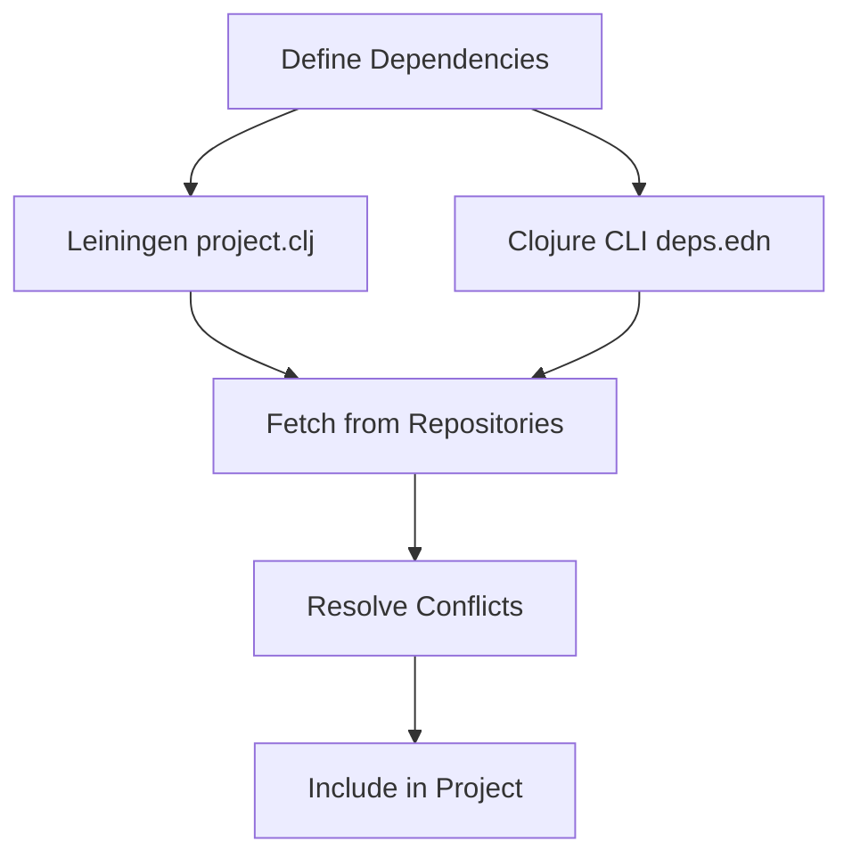

## 4.16. Dependency Management with Leiningen and Deps.edn

Dependency management is a crucial aspect of software development, ensuring that your project has access to the necessary libraries and tools it needs to function correctly. In the Clojure ecosystem, two primary tools facilitate this process: Leiningen and the Clojure CLI with `deps.edn`. This section will guide you through the intricacies of managing dependencies in Clojure projects, offering insights into best practices, versioning, conflict resolution, and more.

### Overview of Dependency Management in Clojure

Clojure, being a JVM language, leverages the vast ecosystem of Java libraries. Dependency management in Clojure involves specifying which libraries your project depends on, their versions, and how they should be fetched and included in your project. This is typically done through configuration files that define these dependencies and their respective repositories.

#### Key Concepts

- **Dependencies**: External libraries or modules that your project requires.
- **Repositories**: Locations where dependencies are stored, such as Maven Central or Clojars.
- **Versioning**: Specifying which version of a dependency to use.
- **Conflict Resolution**: Handling situations where different dependencies require different versions of the same library.

### Leiningen: The Traditional Tool for Clojure Projects

Leiningen is a build automation tool for Clojure, similar to Maven for Java. It uses a `project.clj` file to define project settings, including dependencies.

#### Declaring Dependencies in `project.clj`

The `project.clj` file is the heart of a Leiningen project. Here's a basic example:

```clojure
(defproject my-clojure-project "0.1.0-SNAPSHOT"
  :description "A sample Clojure project"
  :url "http://example.com/my-clojure-project"
  :license {:name "Eclipse Public License"
            :url "http://www.eclipse.org/legal/epl-v10.html"}
  :dependencies [[org.clojure/clojure "1.10.3"]
                 [cheshire "5.10.0"]])
```

- **Project Definition**: The `defproject` macro defines the project name, version, and metadata.
- **Dependencies**: Listed under the `:dependencies` key as vectors of `[group/artifact version]`.

#### Versioning and Conflict Resolution

Leiningen handles version conflicts by using the latest version specified across all dependencies. However, this can lead to unexpected behavior if not managed carefully.

- **Version Ranges**: You can specify version ranges to allow flexibility.
- **Exclusions**: Use the `:exclusions` key to prevent certain transitive dependencies from being included.

```clojure
:dependencies [[org.clojure/clojure "1.10.3"]
               [cheshire "5.10.0" :exclusions [org.clojure/tools.reader]]]
```

#### Best Practices with Leiningen

- **Lock Dependencies**: Use a `lein deps :tree` to visualize dependency trees and identify conflicts.
- **Profiles**: Define different profiles for development, testing, and production to manage environment-specific dependencies.

### Clojure CLI and `deps.edn`: A Modern Approach

The Clojure CLI tool offers a more flexible and lightweight approach to dependency management using the `deps.edn` file.

#### Declaring Dependencies in `deps.edn`

The `deps.edn` file is a map that defines dependencies and other project configurations.

```clojure
{:deps {org.clojure/clojure {:mvn/version "1.10.3"}
        cheshire {:mvn/version "5.10.0"}}}
```

- **Dependencies Map**: Each dependency is a key-value pair, with the key being the library and the value specifying the version.
- **Aliases**: Use aliases to define different configurations or profiles.

```clojure
{:aliases {:dev {:extra-deps {cider/cider-nrepl {:mvn/version "0.25.9"}}}}}
```

#### Versioning and Conflict Resolution

The Clojure CLI tool resolves conflicts by selecting the highest version of a dependency. It provides tools like `clj -Stree` to visualize dependency trees.

#### Best Practices with `deps.edn`

- **Use Aliases**: Organize your project configurations using aliases for different environments.
- **Keep it Simple**: `deps.edn` encourages simplicity and minimalism, focusing on dependencies rather than build automation.

### Tools for Analyzing Dependencies

Several tools can help you analyze and manage dependencies in Clojure projects:

- **lein-ancient**: A Leiningen plugin to check for outdated dependencies.
- **clj-kondo**: A linter for Clojure that can also analyze dependencies.
- **depstar**: A tool for building uberjars with the Clojure CLI.

### Visualizing Dependency Management

To better understand how dependencies are managed in Clojure, let's visualize the process using a Mermaid.js diagram.



**Diagram Description**: This flowchart illustrates the dependency management process in Clojure, starting from defining dependencies in either `project.clj` or `deps.edn`, fetching them from repositories, resolving conflicts, and finally including them in the project.

### Knowledge Check

Before we conclude, let's reinforce what we've learned with some questions and exercises.

1. **What is the primary purpose of the `project.clj` file in a Leiningen project?**
2. **How does the Clojure CLI tool resolve version conflicts?**
3. **Try modifying a `deps.edn` file to include a new dependency and run `clj -Stree` to visualize the dependency tree.**

### Summary and Key Takeaways

- **Leiningen** is a comprehensive build tool for Clojure, using `project.clj` for dependency management.
- **Clojure CLI** offers a lightweight alternative with `deps.edn`, focusing on simplicity and flexibility.
- **Versioning and Conflict Resolution** are crucial for maintaining a stable project environment.
- **Best Practices** include using profiles and aliases, locking dependencies, and regularly checking for updates.

Remember, mastering dependency management is a journey. As you continue to work with Clojure, you'll develop a deeper understanding of how to efficiently manage your project's dependencies. Keep experimenting, stay curious, and enjoy the journey!

## **Ready to Test Your Knowledge?**



### What file does Leiningen use to manage dependencies?

- [x] project.clj
- [ ] deps.edn
- [ ] pom.xml
- [ ] build.gradle

> **Explanation:** Leiningen uses the `project.clj` file to manage dependencies and project configurations.

### How does the Clojure CLI tool specify dependency versions?

- [x] Using the `:mvn/version` key in `deps.edn`
- [ ] Directly in the `project.clj` file
- [ ] Through a separate version file
- [ ] Using environment variables

> **Explanation:** The Clojure CLI tool specifies dependency versions using the `:mvn/version` key in the `deps.edn` file.

### What is a common tool for checking outdated dependencies in Leiningen projects?

- [x] lein-ancient
- [ ] clj-kondo
- [ ] depstar
- [ ] lein-uberjar

> **Explanation:** `lein-ancient` is a Leiningen plugin used to check for outdated dependencies.

### Which tool provides a lightweight approach to dependency management in Clojure?

- [x] Clojure CLI
- [ ] Leiningen
- [ ] Maven
- [ ] Gradle

> **Explanation:** The Clojure CLI provides a lightweight and flexible approach to dependency management using `deps.edn`.

### What is the purpose of the `:exclusions` key in `project.clj`?

- [x] To prevent certain transitive dependencies from being included
- [ ] To specify additional dependencies
- [ ] To define project metadata
- [ ] To lock dependency versions

> **Explanation:** The `:exclusions` key is used to prevent certain transitive dependencies from being included in the project.

### How can you visualize the dependency tree in a Clojure CLI project?

- [x] By running `clj -Stree`
- [ ] By using `lein deps :tree`
- [ ] By checking the `project.clj` file
- [ ] By using a graphical tool

> **Explanation:** You can visualize the dependency tree in a Clojure CLI project by running `clj -Stree`.

### What is a best practice for managing dependencies in Clojure projects?

- [x] Regularly check for updates and lock dependencies
- [ ] Avoid using third-party libraries
- [ ] Use only the latest versions of libraries
- [ ] Manually download and include libraries

> **Explanation:** Regularly checking for updates and locking dependencies is a best practice to ensure stability and security.

### Which file format encourages simplicity and minimalism in Clojure projects?

- [x] deps.edn
- [ ] project.clj
- [ ] pom.xml
- [ ] build.gradle

> **Explanation:** The `deps.edn` file format encourages simplicity and minimalism, focusing on dependencies rather than build automation.

### True or False: Leiningen and Clojure CLI can be used interchangeably without any differences.

- [ ] True
- [x] False

> **Explanation:** While both tools manage dependencies, they have different approaches and features, making them not entirely interchangeable.

### What is the role of aliases in `deps.edn`?

- [x] To define different configurations or profiles
- [ ] To specify dependency versions
- [ ] To exclude certain dependencies
- [ ] To manage project metadata

> **Explanation:** Aliases in `deps.edn` are used to define different configurations or profiles for a project.




