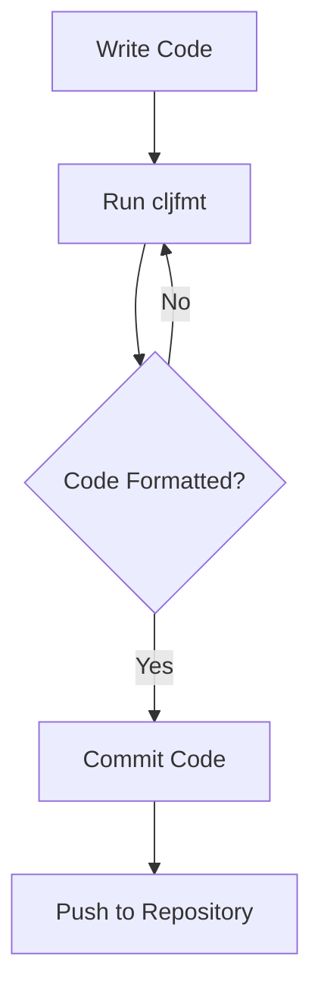

## 4.17. Automated Code Formatting with `cljfmt`

In the world of software development, maintaining a consistent code style is crucial for readability, maintainability, and collaboration. Clojure, with its unique syntax and functional programming paradigm, benefits greatly from automated code formatting tools. One such tool is `cljfmt`, which helps developers adhere to style conventions effortlessly. In this section, we will explore what `cljfmt` is, why it's useful, how to install and configure it, and how to integrate it into your development workflow.

### What is `cljfmt`?

`cljfmt` is a code formatting tool specifically designed for Clojure. It automatically formats your Clojure code to conform to a set of style conventions, ensuring consistency across your codebase. By automating the formatting process, `cljfmt` allows developers to focus on writing code rather than worrying about stylistic details.

#### Why Use `cljfmt`?

- **Consistency**: Ensures that all code adheres to a uniform style, making it easier to read and understand.
- **Efficiency**: Saves time by automating the tedious task of manual formatting.
- **Collaboration**: Reduces friction in code reviews by eliminating debates over code style.
- **Integration**: Easily integrates with various editors and build tools, streamlining the development process.

### Installing `cljfmt`

To start using `cljfmt`, you need to install it. `cljfmt` can be installed as a Leiningen plugin or as a standalone tool.

#### Installing as a Leiningen Plugin

1. **Add `cljfmt` to your `project.clj`**:

   ```clojure
   :plugins [[lein-cljfmt "0.6.8"]]
   ```

2. **Run the formatter**:

   ```bash
   lein cljfmt fix
   ```

This command will format all the Clojure files in your project according to the default style rules.

#### Installing as a Standalone Tool

You can also install `cljfmt` as a standalone tool using Clojure CLI tools:

1. **Add `cljfmt` to your `deps.edn`**:

   ```clojure
   {:deps {cljfmt/cljfmt {:mvn/version "0.6.8"}}}
   ```

2. **Run the formatter**:

   ```bash
   clojure -m cljfmt.main fix
   ```

### Configuring `cljfmt`

`cljfmt` is highly configurable, allowing you to tailor the formatting rules to suit your project's needs. Configuration is typically done in a `.cljfmt.edn` file in the root of your project.

#### Example Configuration

Here's an example `.cljfmt.edn` file:

```clojure
{:indents {#".*" [[:inner 0]]}
 :remove-consecutive-blank-lines? true
 :insert-missing-whitespace? true
 :remove-trailing-whitespace? true}
```

- **`:indents`**: Customizes indentation rules.
- **`:remove-consecutive-blank-lines?`**: Removes consecutive blank lines.
- **`:insert-missing-whitespace?`**: Inserts missing whitespace where necessary.
- **`:remove-trailing-whitespace?`**: Removes trailing whitespace from lines.

### Formatting Code with `cljfmt`

Once installed and configured, using `cljfmt` is straightforward. Simply run the formatter command, and it will automatically apply the specified formatting rules to your code.

#### Before and After Example

Consider the following unformatted Clojure code:

```clojure
(defn example [x y]
  (if (> x y)
    (println "x is greater")
    (println "y is greater")))
```

After running `cljfmt`, the code might be formatted as follows:

```clojure
(defn example [x y]
  (if (> x y)
    (println "x is greater")
    (println "y is greater")))
```

Notice how `cljfmt` ensures consistent indentation and spacing.

### Integration with Editors and Build Tools

To maximize productivity, integrate `cljfmt` with your preferred code editor or build tool.

#### Editor Integration

- **Emacs**: Use the `cljfmt` Emacs package to format code on save.
- **Vim**: Integrate `cljfmt` with Vim using plugins like `vim-fireplace`.
- **IntelliJ/Cursive**: Configure `cljfmt` as an external tool to format code within the IDE.

#### Build Tool Integration

- **Leiningen**: Add `lein-cljfmt` to your `project.clj` to format code as part of your build process.
- **Clojure CLI**: Use `cljfmt` in your `deps.edn` to format code during CI/CD pipelines.

### Encouraging Automated Formatting in Teams

Automated code formatting should be a standard practice in any development team. Here are some tips to encourage its adoption:

- **Set Up Pre-Commit Hooks**: Use tools like `pre-commit` to automatically format code before commits.
- **Include Formatting in CI/CD**: Ensure that code is formatted as part of your continuous integration pipeline.
- **Educate Team Members**: Conduct workshops or share resources to help team members understand the benefits of automated formatting.
- **Establish Style Guidelines**: Create a shared document outlining your team's preferred style rules and `cljfmt` configuration.

### Visualizing the Workflow

To better understand how `cljfmt` fits into the development workflow, consider the following diagram:



**Diagram Description**: This flowchart illustrates the process of writing code, running `cljfmt` to ensure formatting, and then committing and pushing the code to a repository.

### External Resources

For more information on `cljfmt`, visit the [cljfmt GitHub repository](https://github.com/weavejester/cljfmt).

### Knowledge Check

To reinforce your understanding of `cljfmt`, consider the following questions:

1. What are the benefits of using `cljfmt` in a Clojure project?
2. How can you install `cljfmt` as a Leiningen plugin?
3. What is the purpose of the `.cljfmt.edn` file?
4. How can you integrate `cljfmt` with your code editor?
5. Why is automated code formatting important in a team setting?

### Embrace the Journey

Remember, adopting automated code formatting is just the beginning. As you continue to develop your skills in Clojure, you'll find that tools like `cljfmt` not only improve your code quality but also enhance your overall development experience. Keep experimenting, stay curious, and enjoy the journey!

## **Ready to Test Your Knowledge?**



### What is the primary purpose of `cljfmt`?

- [x] To automatically format Clojure code according to style conventions
- [ ] To compile Clojure code into Java bytecode
- [ ] To debug Clojure applications
- [ ] To manage Clojure project dependencies

> **Explanation:** `cljfmt` is a tool designed to automatically format Clojure code to adhere to style conventions, ensuring consistency and readability.

### How can `cljfmt` be installed as a Leiningen plugin?

- [x] By adding `[lein-cljfmt "0.6.8"]` to the `:plugins` vector in `project.clj`
- [ ] By downloading it from the Clojure website
- [ ] By installing it via npm
- [ ] By configuring it in the `.cljfmt.edn` file

> **Explanation:** To install `cljfmt` as a Leiningen plugin, you need to add it to the `:plugins` vector in your `project.clj` file.

### What is the role of the `.cljfmt.edn` file?

- [x] To configure formatting rules for `cljfmt`
- [ ] To store project dependencies
- [ ] To compile Clojure code
- [ ] To manage version control settings

> **Explanation:** The `.cljfmt.edn` file is used to configure the formatting rules that `cljfmt` will apply to your Clojure code.

### Which of the following editors can `cljfmt` integrate with?

- [x] Emacs
- [x] Vim
- [x] IntelliJ/Cursive
- [ ] Microsoft Word

> **Explanation:** `cljfmt` can be integrated with popular code editors like Emacs, Vim, and IntelliJ/Cursive to format code automatically.

### Why is automated code formatting important in a team setting?

- [x] It ensures consistency and reduces code review friction
- [ ] It increases the size of the codebase
- [ ] It makes code harder to read
- [ ] It prevents code from running

> **Explanation:** Automated code formatting ensures consistency across the codebase, making it easier for team members to read and review code without debating style issues.

### What command is used to run `cljfmt` with Clojure CLI tools?

- [x] `clojure -m cljfmt.main fix`
- [ ] `lein cljfmt fix`
- [ ] `npm run cljfmt`
- [ ] `java -jar cljfmt.jar`

> **Explanation:** The command `clojure -m cljfmt.main fix` is used to run `cljfmt` with Clojure CLI tools to format code.

### What is a benefit of integrating `cljfmt` with CI/CD pipelines?

- [x] It ensures code is consistently formatted before deployment
- [ ] It increases the build time
- [ ] It decreases code quality
- [ ] It adds security vulnerabilities

> **Explanation:** Integrating `cljfmt` with CI/CD pipelines ensures that code is consistently formatted before it is deployed, maintaining code quality and readability.

### How can `cljfmt` help in code reviews?

- [x] By eliminating style debates and focusing on logic
- [ ] By increasing the number of lines to review
- [ ] By making code reviews longer
- [ ] By hiding code changes

> **Explanation:** `cljfmt` helps in code reviews by eliminating debates over code style, allowing reviewers to focus on the logic and functionality of the code.

### What is the purpose of the `:indents` key in `.cljfmt.edn`?

- [x] To customize indentation rules for specific forms
- [ ] To specify project dependencies
- [ ] To define variable names
- [ ] To manage user authentication

> **Explanation:** The `:indents` key in `.cljfmt.edn` is used to customize indentation rules for specific forms in Clojure code.

### True or False: `cljfmt` can only be used with Leiningen.

- [ ] True
- [x] False

> **Explanation:** False. `cljfmt` can be used as a standalone tool with Clojure CLI tools, not just with Leiningen.


