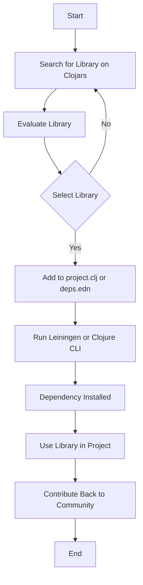

## 4.18. Managing External Dependencies from Clojars

In the vibrant ecosystem of Clojure, leveraging external libraries is a common practice that enhances productivity and code quality. Clojars, the community repository for Clojure libraries, plays a pivotal role in this ecosystem by providing a platform for sharing and discovering reusable code. In this section, we will explore how to effectively manage external dependencies from Clojars, ensuring that your Clojure projects are robust and maintainable.

### Understanding Clojars

Clojars is a community-driven repository that hosts a plethora of Clojure libraries. It serves as a central hub where developers can publish and share their libraries, making it easier for others to find and use them. Clojars is akin to npm for JavaScript or PyPI for Python, providing a streamlined way to manage dependencies in Clojure projects.

#### Key Features of Clojars

- **Community-Driven**: Clojars is maintained by the Clojure community, fostering collaboration and innovation.
- **Open Source**: Libraries on Clojars are open source, allowing developers to contribute, fork, and modify code.
- **Versioning**: Clojars supports semantic versioning, helping developers manage library updates and compatibility.
- **Searchable**: The Clojars website provides a search interface to find libraries based on keywords, categories, and tags.

### Searching for Libraries on Clojars

Finding the right library for your project is crucial. Clojars offers a user-friendly search interface that allows you to explore available libraries. Here’s how you can search for libraries:

1. **Visit the Clojars Website**: Navigate to [Clojars](https://clojars.org/).
2. **Use the Search Bar**: Enter keywords related to the functionality you need. For example, if you are looking for a JSON parsing library, you might search for "JSON".
3. **Filter Results**: Use filters to narrow down results based on categories, tags, or popularity.
4. **Review Library Details**: Click on a library to view its details, including version history, documentation, and source code repository.

### Selecting the Right Library

When selecting a library from Clojars, consider the following factors:

- **Maturity**: Check the library’s version history and release notes to assess its maturity and stability.
- **Maintenance**: Look at the frequency of updates and the responsiveness of maintainers to issues.
- **Community Support**: A library with a large user base and active community is more likely to be reliable.
- **Documentation**: Good documentation is essential for understanding how to use the library effectively.
- **Compatibility**: Ensure the library is compatible with your Clojure version and other dependencies.

### Adding Dependencies to Your Project

Once you have selected a library, the next step is to add it to your Clojure project. Clojure projects typically use either Leiningen or the Clojure CLI tools for dependency management.

#### Using Leiningen (`project.clj`)

Leiningen is a popular build automation tool for Clojure. To add a dependency using Leiningen, follow these steps:

1. **Open `project.clj`**: Locate the `project.clj` file in your project’s root directory.
2. **Add the Dependency**: Under the `:dependencies` vector, add the library in the format `[group-id/artifact-id "version"]`.

   ```clojure
   (defproject my-project "0.1.0-SNAPSHOT"
     :dependencies [[org.clojure/clojure "1.10.3"]
                    [cheshire "5.10.0"]]) ; Example dependency
   ```

3. **Run Leiningen**: Execute `lein deps` to download and install the specified dependencies.

#### Using Clojure CLI Tools (`deps.edn`)

The Clojure CLI tools offer a more flexible way to manage dependencies using the `deps.edn` file. Here’s how to add a dependency:

1. **Open `deps.edn`**: Locate or create a `deps.edn` file in your project’s root directory.
2. **Add the Dependency**: Under the `:deps` map, specify the library in the format `group-id/artifact-id {:mvn/version "version"}`.

   ```clojure
   {:deps {org.clojure/clojure {:mvn/version "1.10.3"}
           cheshire {:mvn/version "5.10.0"}}} ; Example dependency
   ```

3. **Run Clojure CLI**: Use `clj` or `clojure` commands to run your project, which will automatically resolve and download dependencies.

### Considerations for Managing Dependencies

Managing dependencies effectively is crucial for maintaining a healthy codebase. Here are some best practices:

- **Version Pinning**: Pin dependencies to specific versions to avoid unexpected changes due to updates.
- **Regular Updates**: Periodically update dependencies to benefit from bug fixes and new features.
- **Dependency Conflicts**: Be aware of potential conflicts between libraries and resolve them by adjusting versions or using exclusions.
- **Security**: Monitor dependencies for known vulnerabilities and apply patches promptly.

### Contributing to Open Source

Clojars thrives on community contributions. Here’s how you can contribute:

- **Publish Your Libraries**: Share your libraries on Clojars to contribute to the community.
- **Report Issues**: Help maintainers by reporting bugs and suggesting improvements.
- **Submit Pull Requests**: Contribute code improvements or bug fixes to existing libraries.
- **Participate in Discussions**: Engage with the community through forums and mailing lists.

### Visualizing Dependency Management Workflow

To better understand the workflow of managing dependencies from Clojars, let's visualize the process using a flowchart.



### Try It Yourself

To get hands-on experience, try adding a new library to your Clojure project. Experiment with different versions and observe how they affect your project. Consider contributing a small utility library to Clojars and share it with the community.

### External Resources

For further reading and exploration, visit the following resources:

- [Clojars](https://clojars.org/)
- [Leiningen Documentation](https://leiningen.org/)
- [Clojure CLI Tools Guide](https://clojure.org/guides/deps_and_cli)

### Knowledge Check

Before moving on, let's test your understanding of managing dependencies from Clojars.

## **Ready to Test Your Knowledge?**



### What is Clojars?

- [x] A community-driven repository for Clojure libraries
- [ ] A build tool for Clojure projects
- [ ] A Clojure IDE
- [ ] A version control system

> **Explanation:** Clojars is a community-driven repository for Clojure libraries, similar to npm for JavaScript or PyPI for Python.

### How do you add a dependency using Leiningen?

- [x] By adding it to the `:dependencies` vector in `project.clj`
- [ ] By adding it to the `:deps` map in `deps.edn`
- [ ] By downloading the library manually
- [ ] By using the `clj` command

> **Explanation:** In Leiningen, dependencies are added to the `:dependencies` vector in the `project.clj` file.

### What format is used to specify dependencies in `deps.edn`?

- [x] `group-id/artifact-id {:mvn/version "version"}`
- [ ] `[group-id/artifact-id "version"]`
- [ ] `group-id:artifact-id:version`
- [ ] `artifact-id:version`

> **Explanation:** In `deps.edn`, dependencies are specified using the format `group-id/artifact-id {:mvn/version "version"}`.

### What should you consider when selecting a library from Clojars?

- [x] Maturity and maintenance
- [x] Community support and documentation
- [x] Compatibility with your project
- [ ] The color of the library's logo

> **Explanation:** Important considerations include maturity, maintenance, community support, documentation, and compatibility.

### How can you contribute to the Clojure community?

- [x] By publishing your libraries on Clojars
- [x] By reporting issues and submitting pull requests
- [ ] By keeping your code private
- [ ] By ignoring community discussions

> **Explanation:** Contributing involves publishing libraries, reporting issues, submitting pull requests, and engaging in community discussions.

### What is a potential risk of not pinning dependency versions?

- [x] Unexpected changes due to updates
- [ ] Improved performance
- [ ] Increased security
- [ ] Better compatibility

> **Explanation:** Not pinning dependency versions can lead to unexpected changes when libraries are updated.

### Which tool is used to manage dependencies with `deps.edn`?

- [x] Clojure CLI tools
- [ ] Leiningen
- [ ] Maven
- [ ] Gradle

> **Explanation:** The Clojure CLI tools are used to manage dependencies with `deps.edn`.

### What is the purpose of the `lein deps` command?

- [x] To download and install specified dependencies
- [ ] To compile the project
- [ ] To run tests
- [ ] To create a new project

> **Explanation:** The `lein deps` command is used to download and install the dependencies specified in `project.clj`.

### True or False: Clojars supports semantic versioning.

- [x] True
- [ ] False

> **Explanation:** Clojars supports semantic versioning, which helps manage library updates and compatibility.

### What is one way to avoid dependency conflicts?

- [x] Adjusting versions or using exclusions
- [ ] Ignoring the conflicts
- [ ] Using only one library
- [ ] Manually editing library code

> **Explanation:** Dependency conflicts can be resolved by adjusting versions or using exclusions.



Remember, managing dependencies is a crucial aspect of software development. As you continue your journey with Clojure, keep exploring, stay curious, and contribute to the vibrant open-source community.
