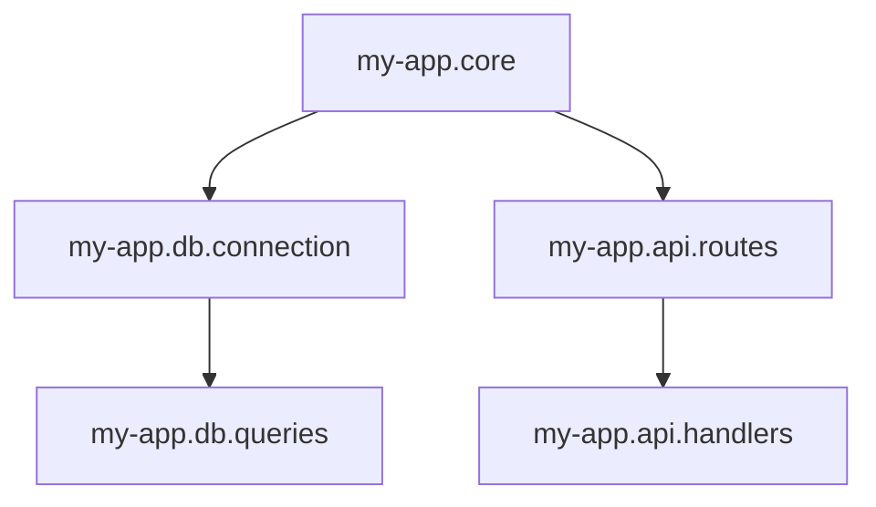

## 4.2. Namespaces and Code Organization

In the world of Clojure, namespaces play a crucial role in organizing code, managing dependencies, and ensuring that our codebases remain clean and maintainable. As we dive into this topic, we'll explore best practices for naming conventions, structuring namespaces in larger projects, and using aliasing and referring to manage dependencies effectively. We'll also highlight tools and practices that help maintain clean namespace definitions.

### The Role of Namespaces in Clojure

Namespaces in Clojure serve as containers for functions, variables, and other definitions. They help avoid naming conflicts by providing a context for each definition. This is especially important in larger projects where multiple developers might work on different parts of the codebase.

#### Key Functions of Namespaces

- **Isolation**: Namespaces isolate code, preventing naming conflicts and allowing for modular design.
- **Organization**: They help organize code logically, making it easier to navigate and understand.
- **Dependency Management**: Namespaces manage dependencies between different parts of a codebase, allowing for clear and explicit references.

### Naming Conventions for Namespaces

Adhering to consistent naming conventions is vital for readability and maintainability. Here are some guidelines:

- **Use Lowercase and Dashes**: Namespaces should be lowercase and use dashes to separate words. For example, `my-app.core` or `data-processing.utils`.
- **Reflect Directory Structure**: The namespace name should reflect the directory structure of the project. For example, a file located at `src/my_app/core.clj` should have the namespace `my-app.core`.
- **Descriptive Names**: Choose descriptive names that convey the purpose of the namespace. Avoid overly generic names like `utils` or `helpers`.

### Structuring Namespaces in Larger Projects

As projects grow, organizing namespaces becomes increasingly important. Here are some strategies:

#### Modular Design

- **Feature-Based Organization**: Group related functionalities into separate namespaces. For example, a web application might have namespaces like `auth`, `db`, `api`, and `ui`.
- **Layered Architecture**: Use a layered approach where each layer has its own namespace. Common layers include `domain`, `service`, `repository`, and `controller`.

#### Example Project Structure

```plaintext
src/
├── my_app/
│   ├── core.clj
│   ├── auth/
│   │   ├── login.clj
│   │   └── register.clj
│   ├── db/
│   │   ├── connection.clj
│   │   └── queries.clj
│   ├── api/
│   │   ├── routes.clj
│   │   └── handlers.clj
│   └── ui/
│       ├── components.clj
│       └── views.clj
```

In this structure, each directory represents a feature or layer, and each file corresponds to a specific aspect of that feature.

### Aliasing and Referring for Dependency Management

Managing dependencies between namespaces is crucial for maintaining a clean codebase. Clojure provides mechanisms like aliasing and referring to handle this.

#### Aliasing

Aliasing allows you to create a shorthand for a namespace, making your code more concise and readable.

```clojure
(ns my-app.core
  (:require [my-app.db.connection :as db-conn]
            [my-app.api.routes :as routes]))

(defn start-app []
  (db-conn/connect)
  (routes/init))
```

In this example, `db-conn` and `routes` are aliases for `my-app.db.connection` and `my-app.api.routes`, respectively.

#### Referring

Referring allows you to bring specific functions or variables from another namespace into the current namespace.

```clojure
(ns my-app.core
  (:require [my-app.db.connection :refer [connect]]
            [my-app.api.routes :refer [init]]))

(defn start-app []
  (connect)
  (init))
```

While referring can make code more concise, it should be used sparingly to avoid cluttering the namespace with too many imported symbols.

### Tools and Practices for Clean Namespace Definitions

Maintaining clean namespace definitions is essential for readability and maintainability. Here are some tools and practices:

#### Tools

- **Leiningen**: A build automation tool for Clojure that helps manage dependencies and project structure.
- **Clojure CLI Tools**: Provides a way to manage dependencies and run Clojure programs.
- **Eastwood**: A linting tool that can help identify issues in namespace definitions.

#### Practices

- **Minimal Imports**: Only require the namespaces you need. Avoid importing entire namespaces if only a few functions are needed.
- **Consistent Aliasing**: Use consistent aliases across the codebase to avoid confusion.
- **Regular Refactoring**: Regularly review and refactor namespace definitions to keep them clean and organized.

### Visualizing Namespace Relationships

Understanding the relationships between namespaces can be challenging in larger projects. Visual diagrams can help clarify these relationships.



This diagram illustrates the dependencies between different namespaces in a hypothetical project.

### Try It Yourself

Experiment with the following code examples to get a better understanding of namespaces and code organization in Clojure. Try modifying the aliases or referring different functions to see how it affects the code.

```clojure
(ns my-app.core
  (:require [my-app.db.connection :as db]
            [my-app.api.routes :refer [init]]))

(defn start []
  (db/connect)
  (init))
```

### Knowledge Check

- **What are the benefits of using namespaces in Clojure?**
- **How do you decide on naming conventions for namespaces?**
- **What are the advantages of aliasing over referring?**

### Summary

Namespaces are a fundamental part of organizing Clojure code. By following best practices for naming conventions, structuring namespaces, and managing dependencies, we can create maintainable and scalable codebases. Remember to use tools and practices that help keep namespace definitions clean and organized.

## **Ready to Test Your Knowledge?**



### What is the primary role of namespaces in Clojure?

- [x] To organize code and manage dependencies
- [ ] To execute code faster
- [ ] To provide a user interface
- [ ] To compile code into machine language

> **Explanation:** Namespaces in Clojure are used to organize code and manage dependencies, helping to avoid naming conflicts and maintain modularity.

### Which of the following is a recommended naming convention for Clojure namespaces?

- [x] Use lowercase and dashes
- [ ] Use uppercase and underscores
- [ ] Use camelCase
- [ ] Use numbers and symbols

> **Explanation:** Clojure namespaces should be lowercase and use dashes to separate words, reflecting the directory structure.

### How can you create a shorthand for a namespace in Clojure?

- [x] By using aliasing
- [ ] By using macros
- [ ] By using loops
- [ ] By using recursion

> **Explanation:** Aliasing allows you to create a shorthand for a namespace, making code more concise and readable.

### What is the purpose of referring in Clojure?

- [x] To bring specific functions or variables into the current namespace
- [ ] To execute code in parallel
- [ ] To compile code
- [ ] To create user interfaces

> **Explanation:** Referring allows you to bring specific functions or variables from another namespace into the current namespace.

### Which tool can help identify issues in namespace definitions?

- [x] Eastwood
- [ ] Leiningen
- [ ] ClojureScript
- [ ] Ring

> **Explanation:** Eastwood is a linting tool that can help identify issues in namespace definitions.

### What is a key benefit of using minimal imports in namespace definitions?

- [x] It keeps the namespace clean and organized
- [ ] It speeds up code execution
- [ ] It increases memory usage
- [ ] It allows for more complex code

> **Explanation:** Using minimal imports keeps the namespace clean and organized, avoiding unnecessary clutter.

### Why is consistent aliasing important in a codebase?

- [x] To avoid confusion and maintain readability
- [ ] To increase code execution speed
- [ ] To reduce memory usage
- [ ] To allow for more complex algorithms

> **Explanation:** Consistent aliasing helps avoid confusion and maintain readability across the codebase.

### What is a common practice for maintaining clean namespace definitions?

- [x] Regular refactoring
- [ ] Increasing the number of imports
- [ ] Using more global variables
- [ ] Avoiding comments

> **Explanation:** Regular refactoring helps maintain clean and organized namespace definitions.

### Which of the following is a strategy for structuring namespaces in larger projects?

- [x] Feature-based organization
- [ ] Random organization
- [ ] Alphabetical organization
- [ ] Numerical organization

> **Explanation:** Feature-based organization groups related functionalities into separate namespaces, making the codebase more modular.

### True or False: Referring should be used extensively to make code more concise.

- [ ] True
- [x] False

> **Explanation:** Referring should be used sparingly to avoid cluttering the namespace with too many imported symbols.



Remember, mastering namespaces and code organization is a journey. As you continue to develop your skills, you'll find new ways to structure and manage your code effectively. Keep experimenting, stay curious, and enjoy the process!
