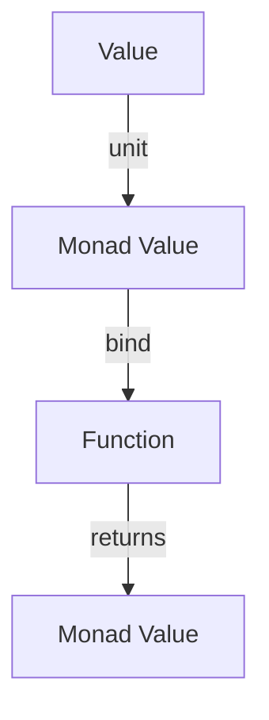

## 4.2 Monad Pattern in Clojure

### Introduction

The Monad pattern is a powerful concept in functional programming that allows for the elegant chaining of operations while managing side effects. In Clojure, monads provide a structured way to handle computations that might include operations like error handling, state management, or dealing with optional values. This section delves into the Monad pattern, its components, and its application in Clojure using the `cats` library.

### Detailed Explanation

#### Understanding Monad Components

A monad is essentially a design pattern that wraps values and provides a mechanism to sequence operations on those values. The two fundamental components of a monad are:

- **`unit` (or `return`):** This function takes a value and wraps it into the monad context. In Clojure, this is often represented by functions like `just` or `right`.
  
- **`bind` (or `>>=`):** This function is used to chain monadic operations. It takes a monadic value and a function that returns a monadic value, unwraps the initial value, applies the function, and re-wraps the result.

#### Common Monads in Clojure

- **`Maybe` Monad:** Used for computations that might fail or return nothing. It helps in handling null or undefined values gracefully.
  
- **`Either` Monad:** Used for computations that might result in an error. It encapsulates a value that can be either a success (`Right`) or a failure (`Left`).

### Using the `Maybe` Monad

The `Maybe` monad is useful for operations that might not return a value. It provides two constructors: `just` for wrapping a value and `nothing` for representing the absence of a value.

#### Installing the `cats` Library

To work with monads in Clojure, we can use the `cats` library, which provides a rich set of monadic abstractions.

Add the following dependency to your `project.clj`:

```clojure
;; Add to project.clj dependencies:
[funcool/cats "2.3.0"]
```

#### Requiring Necessary Namespaces

```clojure
(ns your-namespace
  (:require [cats.core :as m]
            [cats.monad.maybe :as maybe]))
```

#### Example: Safe Division with `Maybe`

```clojure
(defn safe-div [num denom]
  (if (zero? denom)
    (maybe/nothing)
    (maybe/just (/ num denom))))

(m/mlet [a (safe-div 10 2)
         b (safe-div a 0)]
  (m/return b))
; => #<Nothing>
```

In this example, `safe-div` returns a `Maybe` monad. The `m/mlet` function chains these operations, and if any division results in `nothing`, the entire computation short-circuits to `nothing`.

### Using the `Either` Monad for Error Handling

The `Either` monad is ideal for handling computations that might fail, providing a way to encapsulate success or failure.

#### Example: Parsing Integers with `Either`

```clojure
(require '[cats.monad.either :as either])

(defn parse-int [s]
  (try
    (either/right (Integer/parseInt s))
    (catch Exception e
      (either/left "Invalid number"))))

(m/mlet [a (parse-int "10")
         b (parse-int "0")]
  (safe-div a b))
; => #<Left "Invalid number">
```

Here, `parse-int` attempts to parse a string into an integer, returning `right` on success and `left` on failure. The `m/mlet` function chains these operations, propagating errors through the computation.

### Chaining Operations Using `mlet` or `>>=`

The `m/mlet` function is used to sequence monadic operations, allowing for clean and readable code. It abstracts away the boilerplate of unwrapping and re-wrapping values.

### Implementing a Custom Monad

If needed, you can implement a custom monad by defining `bind` and `return` for your type. This involves creating a type that adheres to the monadic laws and implementing the necessary functions to support chaining and wrapping.

### Visualizing Monadic Operations

To better understand how monads work, let's visualize the flow of operations using a conceptual diagram.



This diagram illustrates how a value is wrapped into a monad, passed through a function using `bind`, and results in another monadic value.

### Advantages and Disadvantages

#### Advantages

- **Composability:** Monads allow for the composition of complex operations in a clean and modular way.
- **Error Handling:** They provide a structured approach to error handling and managing optional values.
- **Side Effect Management:** Monads encapsulate side effects, making code more predictable and easier to reason about.

#### Disadvantages

- **Complexity:** Understanding and implementing monads can be complex for those new to functional programming.
- **Overhead:** There can be a performance overhead due to the additional abstraction layer.

### Best Practices

- **Use Libraries:** Leverage libraries like `cats` to simplify monadic operations and avoid reinventing the wheel.
- **Keep It Simple:** Use monads where they provide clear benefits, but avoid overcomplicating code with unnecessary abstractions.
- **Understand Monadic Laws:** Ensure that custom monads adhere to the monadic laws of identity and associativity for predictable behavior.

### Conclusion

The Monad pattern in Clojure offers a powerful way to manage side effects and chain operations in a functional style. By using libraries like `cats`, developers can harness the full potential of monads to write clean, modular, and maintainable code. Whether handling optional values with `Maybe` or managing errors with `Either`, monads provide a robust framework for functional programming in Clojure.

## Quiz Time!



### What is the primary purpose of the Monad pattern in functional programming?

- [x] To allow for function chaining while managing side effects
- [ ] To provide a way to handle concurrency
- [ ] To optimize performance of recursive functions
- [ ] To simplify the syntax of functional languages

> **Explanation:** The Monad pattern is primarily used to chain functions while managing side effects, making it easier to handle operations like error handling and state management.

### Which function in a monad is responsible for wrapping a value into the monadic context?

- [x] `unit` (or `return`)
- [ ] `bind` (or `>>=`)
- [ ] `map`
- [ ] `filter`

> **Explanation:** The `unit` (or `return`) function is used to wrap a value into the monadic context, preparing it for further operations.

### What does the `bind` function do in the context of monads?

- [x] Chains monadic operations by unwrapping and re-wrapping values
- [ ] Initializes a monadic value
- [ ] Filters values within a monad
- [ ] Maps a function over a monadic value

> **Explanation:** The `bind` function is responsible for chaining operations by unwrapping a monadic value, applying a function, and re-wrapping the result.

### Which Clojure library provides monadic abstractions like `Maybe` and `Either`?

- [x] `cats`
- [ ] `core.async`
- [ ] `clojure.spec`
- [ ] `ring`

> **Explanation:** The `cats` library in Clojure provides monadic abstractions such as `Maybe` and `Either`, facilitating functional programming patterns.

### How does the `Maybe` monad handle computations that might not return a value?

- [x] It uses `just` to wrap values and `nothing` to represent absence
- [ ] It throws an exception when a value is absent
- [ ] It returns `nil` for absent values
- [ ] It logs an error message

> **Explanation:** The `Maybe` monad uses `just` to wrap existing values and `nothing` to represent the absence of a value, avoiding exceptions or `nil` values.

### What is the purpose of the `Either` monad in Clojure?

- [x] To handle computations that might result in an error
- [ ] To manage state transitions
- [ ] To perform asynchronous operations
- [ ] To optimize recursive functions

> **Explanation:** The `Either` monad is used to handle computations that might result in an error, encapsulating success as `Right` and failure as `Left`.

### In the `Either` monad, what does the `left` constructor represent?

- [x] A failure or error state
- [ ] A successful computation
- [ ] An optional value
- [ ] A concurrent operation

> **Explanation:** In the `Either` monad, the `left` constructor represents a failure or error state, while `right` represents success.

### What is the role of `m/mlet` in the `cats` library?

- [x] To sequence monadic operations
- [ ] To initialize a monadic value
- [ ] To filter values within a monad
- [ ] To map a function over a monadic value

> **Explanation:** The `m/mlet` function in the `cats` library is used to sequence monadic operations, allowing for clean and readable chaining of computations.

### Which of the following is a disadvantage of using monads?

- [x] Complexity in understanding and implementation
- [ ] Lack of composability
- [ ] Inability to handle errors
- [ ] Poor performance in all scenarios

> **Explanation:** A disadvantage of using monads is the complexity involved in understanding and implementing them, especially for those new to functional programming.

### True or False: Monads can encapsulate side effects, making code more predictable.

- [x] True
- [ ] False

> **Explanation:** True. Monads encapsulate side effects, which helps in making code more predictable and easier to reason about.


