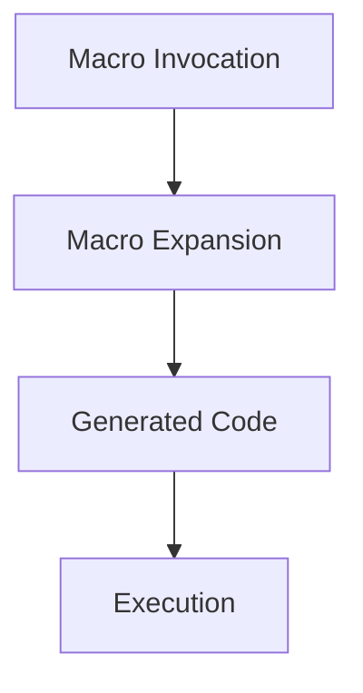

## 4.3. Using Macros Effectively

Macros are one of the most powerful features of Clojure, allowing developers to extend the language and create domain-specific languages (DSLs). In this section, we will explore advanced macro techniques, focusing on effective usage, macro expansion, debugging, and best practices to avoid common pitfalls. By the end of this guide, you'll be equipped to harness the full potential of macros in your Clojure projects.

### Introduction to Macros

Before diving into advanced techniques, let's briefly revisit what macros are. Macros in Clojure are a way to perform code transformations at compile time. They allow you to write code that writes code, enabling you to create new syntactic constructs and abstractions that are not possible with functions alone.

#### Key Concepts

- **Code as Data**: Clojure's homoiconicity means that code is represented as data structures, making it easy to manipulate.
- **Macro Expansion**: Macros are expanded at compile time, transforming input forms into executable code.
- **Hygiene**: Ensuring that macros do not unintentionally capture or interfere with variables in the surrounding code.

### When to Use Macros

Macros should be used judiciously, as they can introduce complexity and obscure the intent of the code. Here are some scenarios where macros are appropriate:

- **Creating New Control Structures**: When you need custom control flow that cannot be achieved with existing constructs.
- **Code Generation**: When repetitive code patterns can be abstracted into a macro.
- **DSLs**: When building a domain-specific language that requires custom syntax.

### Writing Effective Macros

#### Basic Macro Structure

Let's start with a simple macro example to illustrate the basic structure:

```clojure
(defmacro unless [condition & body]
  `(if (not ~condition)
     (do ~@body)))

;; Usage
(unless false
  (println "This will print because the condition is false."))
```

- **Backquote (`)**: Used to create a template for the code transformation.
- **Unquote (~)**: Used to insert evaluated expressions into the template.
- **Unquote-splicing (~@)**: Used to insert a sequence of expressions.

#### Advanced Macro Techniques

##### 1. Macro Expansion and Debugging

Understanding macro expansion is crucial for debugging and ensuring your macros work as intended. You can use the `macroexpand` function to see the expanded form of a macro:

```clojure
(macroexpand '(unless false (println "Hello, World!")))
```

This will show you the code that the macro generates, helping you identify any issues.

##### 2. Macro Hygiene

Macro hygiene refers to the practice of avoiding variable capture and unintended interactions with the surrounding code. Use `gensym` to generate unique symbols:

```clojure
(defmacro with-temp [bindings & body]
  (let [temp-sym (gensym "temp")]
    `(let [~temp-sym ~bindings]
       ~@body)))
```

This ensures that the temporary variable does not clash with existing variables.

##### 3. Complex Macros for Real Problems

Let's explore a more complex macro that solves a real problem: creating a simple state machine.

```clojure
(defmacro defstate [name & transitions]
  `(def ~name
     (fn [state# event#]
       (case [state# event#]
         ~@transitions
         :default))))

;; Usage
(defstate traffic-light
  [:red :timer] :green
  [:green :timer] :yellow
  [:yellow :timer] :red)

(traffic-light :red :timer) ;; => :green
```

This macro defines a state machine with transitions, allowing you to encapsulate state logic in a concise way.

### Guidelines for Using Macros

- **Prefer Functions Over Macros**: Use functions when possible, as they are simpler and more predictable.
- **Keep Macros Simple**: Avoid complex logic within macros; delegate to functions when necessary.
- **Document Macros Thoroughly**: Provide clear documentation and examples to explain the macro's purpose and usage.
- **Test Macros Extensively**: Ensure that macros behave correctly in various contexts and edge cases.

### Visualizing Macro Expansion

To better understand macro expansion, let's visualize the process using a flowchart:



This diagram illustrates the stages from macro invocation to execution, highlighting the transformation process.

### Common Pitfalls and How to Avoid Them

- **Variable Capture**: Use `gensym` to avoid capturing variables unintentionally.
- **Overuse of Macros**: Reserve macros for situations where they provide significant benefits.
- **Complexity**: Keep macros simple and delegate complex logic to functions.

### Try It Yourself

Experiment with the following macro and modify it to suit your needs:

```clojure
(defmacro when-not [condition & body]
  `(if (not ~condition)
     (do ~@body)))

;; Modify the macro to include an else clause
```

### Further Reading

For more information on macros and metaprogramming in Clojure, consider exploring the following resources:

- [Clojure Official Documentation](https://clojure.org/reference/macros)
- [Clojure Programming by Chas Emerick](https://www.oreilly.com/library/view/clojure-programming/9781449310387/)
- [Clojure for the Brave and True](https://www.braveclojure.com/)

### Summary

In this section, we've explored the effective use of macros in Clojure, covering advanced techniques, macro expansion, debugging, and best practices. Remember, macros are a powerful tool, but with great power comes great responsibility. Use them wisely to create elegant and efficient code.

## **Ready to Test Your Knowledge?**



### What is the primary purpose of macros in Clojure?

- [x] To perform code transformations at compile time
- [ ] To execute code at runtime
- [ ] To manage state in applications
- [ ] To handle errors in functions

> **Explanation:** Macros in Clojure are used to perform code transformations at compile time, allowing developers to create new syntactic constructs.

### Which function can you use to see the expanded form of a macro?

- [x] `macroexpand`
- [ ] `expandmacro`
- [ ] `macro-debug`
- [ ] `expand`

> **Explanation:** The `macroexpand` function is used to view the expanded form of a macro, helping in debugging and understanding the transformation.

### What is macro hygiene?

- [x] Avoiding variable capture and unintended interactions with surrounding code
- [ ] Ensuring macros are well-documented
- [ ] Writing macros that are easy to read
- [ ] Using macros only when necessary

> **Explanation:** Macro hygiene involves avoiding variable capture and unintended interactions with the surrounding code, often using techniques like `gensym`.

### When should you prefer functions over macros?

- [x] When the task can be accomplished without code transformation
- [ ] When you need to create new control structures
- [ ] When you want to generate repetitive code
- [ ] When building a domain-specific language

> **Explanation:** Functions should be preferred over macros when the task can be accomplished without code transformation, as they are simpler and more predictable.

### What is the role of `gensym` in macros?

- [x] To generate unique symbols and avoid variable capture
- [ ] To expand macros at runtime
- [ ] To document macros
- [ ] To execute macros

> **Explanation:** `gensym` is used in macros to generate unique symbols, preventing variable capture and ensuring macro hygiene.

### Which of the following is a common pitfall when using macros?

- [x] Overuse of macros
- [ ] Underuse of macros
- [ ] Using macros for code generation
- [ ] Creating new control structures

> **Explanation:** Overuse of macros is a common pitfall, as they can introduce complexity and obscure code intent.

### What is the purpose of the `unquote` (~) operator in macros?

- [x] To insert evaluated expressions into the macro template
- [ ] To create a template for code transformation
- [ ] To generate unique symbols
- [ ] To expand macros at compile time

> **Explanation:** The `unquote` (~) operator is used to insert evaluated expressions into the macro template during code transformation.

### How can you ensure that a macro does not interfere with existing variables?

- [x] Use `gensym` to generate unique symbols
- [ ] Use `macroexpand` to debug
- [ ] Use `unquote` to insert expressions
- [ ] Use `defmacro` to define the macro

> **Explanation:** Using `gensym` to generate unique symbols ensures that a macro does not interfere with existing variables, maintaining macro hygiene.

### What is a scenario where macros are appropriate?

- [x] Creating new control structures
- [ ] Managing application state
- [ ] Handling errors in functions
- [ ] Performing runtime calculations

> **Explanation:** Macros are appropriate for creating new control structures, allowing for custom syntax and abstractions.

### True or False: Macros are executed at runtime.

- [ ] True
- [x] False

> **Explanation:** Macros are expanded at compile time, not executed at runtime. They transform code before it is executed.



Remember, this is just the beginning. As you progress, you'll build more complex and interactive macros. Keep experimenting, stay curious, and enjoy the journey!
