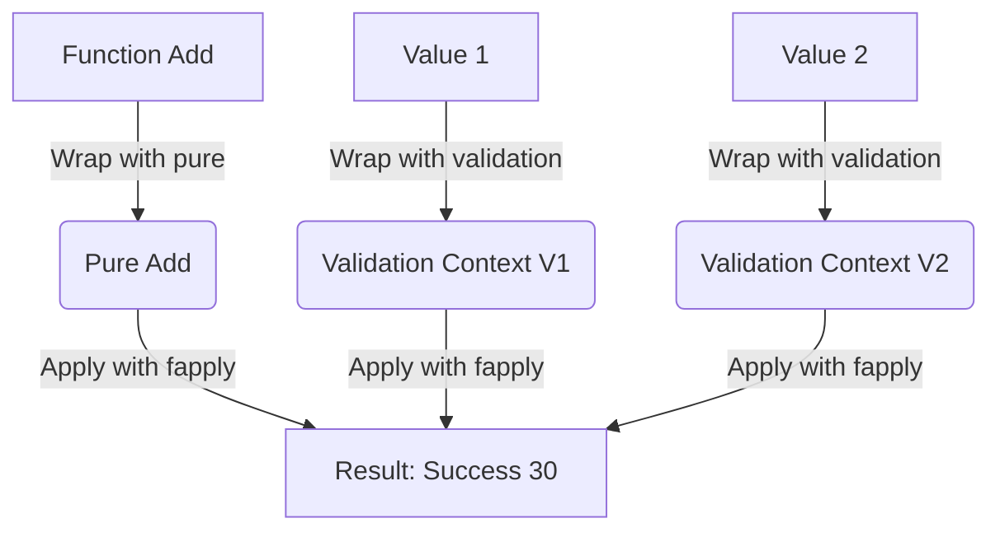

## 4.3 Applicative Functor in Clojure

In the realm of functional programming, Applicative Functors play a crucial role by allowing functions wrapped in a context to be applied to values also wrapped in a context. This pattern is particularly useful in scenarios where operations need to be performed over multiple monadic or functorial values simultaneously. Applicative Functors are less powerful than monads but more general than functors, providing a middle ground that balances simplicity and capability.

### Understanding Applicative Operations

To effectively utilize Applicative Functors, it's essential to understand their core operations:

- **`pure` (or `return`):** This operation wraps a value into the applicative functor. It serves as a way to lift a value into the functorial context.
  
- **`fapply` (or `<*>`):** This operation applies a function wrapped in a context to a value wrapped in a context. It allows for the combination of multiple applicative values.

### Applicative Functors with the `cats` Library

Clojure's `cats` library provides a robust framework for working with functional abstractions, including Applicative Functors. Let's explore how to use Applicative Functors with `cats`, particularly focusing on the `validation` context.

#### Setting Up

First, ensure you have the `cats` library included in your project. You can add it to your `project.clj` dependencies:

```clojure
[funcool/cats "2.3.0"]
```

Then, require the necessary namespaces:

```clojure
(require '[cats.applicative.validation :as validation]
         '[cats.context :as context])
```

#### Basic Example

Consider the following example where we have two validation contexts:

```clojure
(def v1 (validation/validation :error1 10))
(def v2 (validation/validation :error2 20))
```

Here, `v1` and `v2` are values wrapped in a validation context. We can define a simple function to add two numbers:

```clojure
(defn add [a b] (+ a b))
```

Using the applicative operations, we can apply this function over the two validation contexts:

```clojure
(context/with-context validation/context
  (validation/apply (validation/pure add) v1 v2))
; => #<Success 30>
```

In this example, the `add` function is lifted into the validation context using `validation/pure`, and then applied to `v1` and `v2` using `validation/apply`.

#### Handling Multiple Errors

One of the powerful features of Applicative Functors is their ability to handle multiple errors gracefully. Consider the following scenario:

```clojure
(def v1 (validation/failure [:error1]))
(def v2 (validation/failure [:error2]))
```

When we attempt to apply the `add` function over these contexts:

```clojure
(context/with-context validation/context
  (validation/apply (validation/pure add) v1 v2))
; => #<Failure [:error1 :error2]>
```

The result is a combined failure containing both errors, demonstrating how Applicative Functors can aggregate errors from multiple sources.

#### Using the `ap` Function

The `ap` function is another way to apply a wrapped function to a wrapped value. Here's how it can be used:

```clojure
(def vf (validation/pure inc))
(validation/ap vf (validation/validation :error 10))
; => #<Success 11>
```

In this case, the `inc` function is lifted into the validation context and applied to the value `10`, resulting in a successful increment operation.

### Visualizing Applicative Functors

To better understand the flow of Applicative Functors, consider the following diagram:



This diagram illustrates how values and functions are wrapped in their respective contexts and combined using applicative operations to produce a result.

### Use Cases

Applicative Functors are particularly useful in scenarios such as:

- **Validation:** Aggregating multiple validation errors without short-circuiting.
- **Parallel Computation:** Applying functions over multiple independent computations.
- **Configuration Management:** Combining configuration values from different sources.

### Advantages and Disadvantages

**Advantages:**

- **Composability:** Applicative Functors allow for the composition of independent computations.
- **Error Handling:** They provide a mechanism for aggregating errors from multiple sources.
- **Simplicity:** Less complex than monads, making them easier to reason about.

**Disadvantages:**

- **Limited Power:** Cannot handle dependent computations like monads.
- **Complexity in Understanding:** May require a learning curve for those new to functional programming.

### Best Practices

- **Use Applicative Functors for Independent Computations:** When computations do not depend on each other, Applicative Functors are a suitable choice.
- **Combine with Monads When Necessary:** For dependent computations, consider using monads in conjunction with Applicative Functors.
- **Leverage Libraries:** Utilize libraries like `cats` to simplify the implementation of Applicative Functors.

### Conclusion

Applicative Functors provide a powerful abstraction for applying functions over multiple contexts, offering a balance between simplicity and capability. By leveraging the `cats` library, Clojure developers can effectively utilize Applicative Functors to handle complex validation scenarios, parallel computations, and more.

## Quiz Time!



### What is the primary purpose of Applicative Functors in functional programming?

- [x] To apply functions wrapped in a context to values wrapped in a context.
- [ ] To manage stateful computations.
- [ ] To handle asynchronous operations.
- [ ] To provide a mechanism for error handling.

> **Explanation:** Applicative Functors allow functions wrapped in a context to be applied to values also wrapped in a context, facilitating operations over multiple functorial values.

### Which operation is used to wrap a value into an Applicative Functor?

- [x] `pure`
- [ ] `bind`
- [ ] `map`
- [ ] `flatMap`

> **Explanation:** The `pure` operation is used to wrap a value into an Applicative Functor, lifting it into the functorial context.

### What is the role of the `fapply` operation in Applicative Functors?

- [x] To apply a wrapped function to a wrapped value.
- [ ] To unwrap a value from its context.
- [ ] To transform a value within a context.
- [ ] To combine two contexts into one.

> **Explanation:** The `fapply` operation applies a function wrapped in a context to a value wrapped in a context, enabling the combination of multiple applicative values.

### How does the `cats` library facilitate the use of Applicative Functors in Clojure?

- [x] By providing a framework for functional abstractions, including Applicative Functors.
- [ ] By offering a set of macros for concurrency.
- [ ] By simplifying state management.
- [ ] By enhancing error handling capabilities.

> **Explanation:** The `cats` library provides a robust framework for working with functional abstractions, including Applicative Functors, in Clojure.

### In the context of Applicative Functors, what does the `validation/apply` function do?

- [x] It applies a function wrapped in a context to multiple validation contexts.
- [ ] It validates a single value.
- [ ] It combines two validation contexts into one.
- [ ] It unwraps a value from its validation context.

> **Explanation:** The `validation/apply` function applies a function wrapped in a context to multiple validation contexts, combining their results.

### What is a key advantage of using Applicative Functors for error handling?

- [x] They can aggregate errors from multiple sources.
- [ ] They provide detailed error messages.
- [ ] They prevent errors from occurring.
- [ ] They simplify error logging.

> **Explanation:** Applicative Functors can aggregate errors from multiple sources, allowing for comprehensive error handling without short-circuiting.

### Which of the following is a disadvantage of Applicative Functors compared to Monads?

- [x] They cannot handle dependent computations.
- [ ] They are more complex to implement.
- [ ] They require more memory.
- [ ] They are slower in execution.

> **Explanation:** Applicative Functors cannot handle dependent computations, which is a limitation compared to the more powerful Monads.

### What is the result of applying the `add` function over two validation failures using Applicative Functors?

- [x] A combined failure containing both errors.
- [ ] A successful computation with a default value.
- [ ] An exception is thrown.
- [ ] The first error is returned.

> **Explanation:** When applying a function over two validation failures using Applicative Functors, the result is a combined failure containing both errors.

### How does the `ap` function differ from `fapply` in the context of Applicative Functors?

- [x] It is an alternative way to apply a wrapped function to a wrapped value.
- [ ] It unwraps a value from its context.
- [ ] It combines two contexts into one.
- [ ] It transforms a value within a context.

> **Explanation:** The `ap` function is an alternative way to apply a wrapped function to a wrapped value, similar to `fapply`.

### True or False: Applicative Functors are more powerful than Monads.

- [ ] True
- [x] False

> **Explanation:** False. Applicative Functors are less powerful than Monads, as they cannot handle dependent computations.


