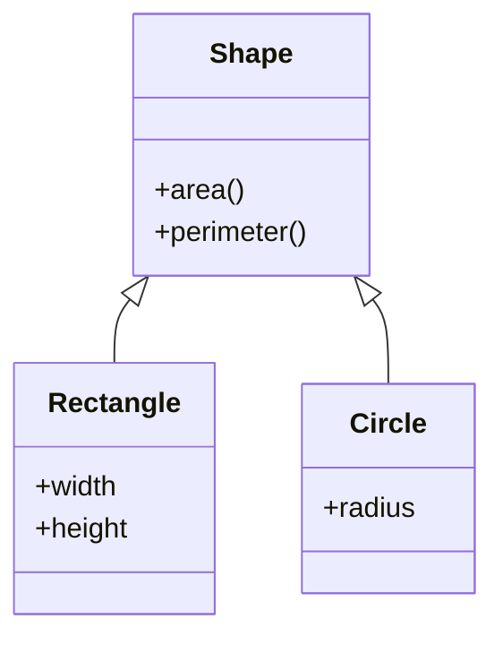
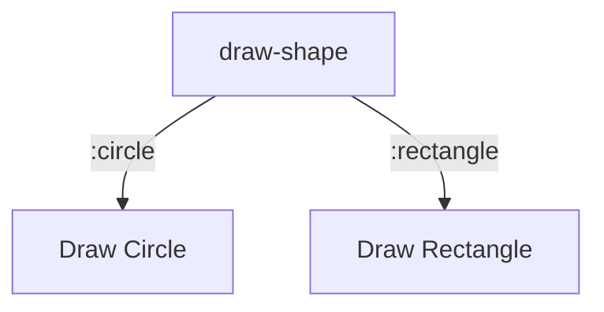

## 4.4. Protocols and Multimethods

In the world of Clojure, protocols and multimethods are two powerful constructs that enable polymorphism and dynamic dispatch. These features allow developers to write flexible and extensible code, accommodating various data types and behaviors. In this section, we will delve into the intricacies of protocols and multimethods, exploring their definitions, implementations, and use cases. We will also compare and contrast these two constructs to understand their unique roles in Clojure programming.

### Understanding Protocols

Protocols in Clojure provide a mechanism for defining a set of functions that can be implemented by different data types. They are akin to interfaces in object-oriented languages, allowing for polymorphic behavior across disparate types. Protocols enable you to define a common set of operations that can be performed on various data structures, promoting code reuse and modularity.

#### Defining Protocols

To define a protocol in Clojure, you use the `defprotocol` macro. This macro allows you to specify a set of functions that any implementing type must provide. Here's a simple example:

```clojure
(defprotocol Shape
  "A protocol for geometric shapes."
  (area [this] "Calculate the area of the shape.")
  (perimeter [this] "Calculate the perimeter of the shape."))
```

In this example, we define a `Shape` protocol with two functions: `area` and `perimeter`. Any type that implements this protocol must provide concrete implementations for these functions.

#### Implementing Protocols

Once a protocol is defined, you can implement it for specific data types using the `extend-type` or `extend-protocol` macros. Here's how you might implement the `Shape` protocol for a `Rectangle` type:

```clojure
(defrecord Rectangle [width height])

(extend-type Rectangle
  Shape
  (area [this]
    (* (:width this) (:height this)))
  (perimeter [this]
    (* 2 (+ (:width this) (:height this)))))
```

In this implementation, we define a `Rectangle` type using `defrecord` and then use `extend-type` to provide implementations for the `area` and `perimeter` functions. The `this` parameter refers to the instance of the `Rectangle` being operated on.

#### Using Protocols

Once a protocol is implemented, you can use it to perform operations on instances of the implementing types:

```clojure
(let [rect (->Rectangle 10 5)]
  (println "Area:" (area rect))
  (println "Perimeter:" (perimeter rect)))
```

This code creates a `Rectangle` instance and calculates its area and perimeter using the protocol functions.

### Exploring Multimethods

Multimethods in Clojure offer a more dynamic approach to polymorphism, allowing you to define functions that dispatch on the basis of arbitrary criteria. Unlike protocols, which are tied to specific types, multimethods can dispatch based on the values of their arguments, enabling more flexible and context-sensitive behavior.

#### Defining Multimethods

To define a multimethod, you use the `defmulti` macro, specifying a dispatch function that determines which implementation to invoke. Here's an example:

```clojure
(defmulti draw-shape
  "Draw a shape based on its type."
  (fn [shape] (:type shape)))
```

In this example, `draw-shape` is a multimethod that dispatches based on the `:type` key of the `shape` argument.

#### Implementing Multimethods

Once a multimethod is defined, you can provide implementations for different dispatch values using the `defmethod` macro:

```clojure
(defmethod draw-shape :circle
  [shape]
  (println "Drawing a circle with radius" (:radius shape)))

(defmethod draw-shape :rectangle
  [shape]
  (println "Drawing a rectangle with width" (:width shape) "and height" (:height shape)))
```

Here, we define two methods for the `draw-shape` multimethod: one for circles and one for rectangles. Each method handles a specific type of shape.

#### Using Multimethods

To use a multimethod, simply call it with an argument that matches one of the dispatch values:

```clojure
(draw-shape {:type :circle :radius 5})
(draw-shape {:type :rectangle :width 10 :height 5})
```

This code will invoke the appropriate method based on the `:type` key of the shape.

### Comparing Protocols and Multimethods

While both protocols and multimethods enable polymorphic behavior, they serve different purposes and have distinct characteristics:

- **Protocols** are more static and type-oriented, providing a way to define a set of operations that can be implemented by various types. They are ideal for scenarios where you have a fixed set of types and operations.

- **Multimethods** are more dynamic and value-oriented, allowing for dispatch based on arbitrary criteria. They are suitable for situations where you need flexible and context-sensitive behavior, such as handling different types of events or commands.

#### Key Differences

- **Dispatch Mechanism**: Protocols dispatch based on the type of the first argument, while multimethods can dispatch based on any criteria, including the values of arguments.

- **Flexibility**: Multimethods offer greater flexibility due to their ability to dispatch on arbitrary criteria, making them suitable for complex and dynamic scenarios.

- **Performance**: Protocols are generally more performant than multimethods, as their dispatch mechanism is simpler and more direct.

#### When to Use Each

- Use **protocols** when you have a well-defined set of operations that need to be implemented by multiple types, and when performance is a concern.

- Use **multimethods** when you need to dispatch based on complex or dynamic criteria, such as the values of arguments or external conditions.

### Code Examples

Let's explore some code examples to solidify our understanding of protocols and multimethods.

#### Protocol Example: Shape Protocol

```clojure
(defprotocol Shape
  "A protocol for geometric shapes."
  (area [this] "Calculate the area of the shape.")
  (perimeter [this] "Calculate the perimeter of the shape."))

(defrecord Circle [radius])

(extend-type Circle
  Shape
  (area [this]
    (* Math/PI (:radius this) (:radius this)))
  (perimeter [this]
    (* 2 Math/PI (:radius this))))

(let [circle (->Circle 5)]
  (println "Circle Area:" (area circle))
  (println "Circle Perimeter:" (perimeter circle)))
```

In this example, we define a `Circle` type and implement the `Shape` protocol for it. We then create a `Circle` instance and calculate its area and perimeter.

#### Multimethod Example: Drawing Shapes

```clojure
(defmulti draw-shape
  "Draw a shape based on its type."
  (fn [shape] (:type shape)))

(defmethod draw-shape :circle
  [shape]
  (println "Drawing a circle with radius" (:radius shape)))

(defmethod draw-shape :rectangle
  [shape]
  (println "Drawing a rectangle with width" (:width shape) "and height" (:height shape)))

(draw-shape {:type :circle :radius 5})
(draw-shape {:type :rectangle :width 10 :height 5})
```

In this example, we define a `draw-shape` multimethod that dispatches based on the `:type` key of the shape. We provide implementations for circles and rectangles and then use the multimethod to draw different shapes.

### Visualizing Protocols and Multimethods

To better understand the relationship between protocols, multimethods, and their implementations, let's visualize these concepts using Mermaid.js diagrams.

#### Protocols and Implementations



This diagram illustrates the `Shape` protocol and its implementations for `Rectangle` and `Circle`.

#### Multimethod Dispatch



This flowchart shows the dispatch mechanism of the `draw-shape` multimethod, directing to different implementations based on the shape type.

### Try It Yourself

Now that we've explored protocols and multimethods, it's time to experiment with these concepts. Try modifying the code examples to add new shapes or dispatch criteria. For instance, you could:

- Add a `Triangle` type and implement the `Shape` protocol for it.
- Extend the `draw-shape` multimethod to handle additional shape types or properties.

### References and Further Reading

- [Clojure Protocols](https://clojure.org/reference/protocols)
- [Clojure Multimethods](https://clojure.org/reference/multimethods)
- [Clojure Documentation](https://clojure.org/documentation)

### Knowledge Check

To reinforce your understanding of protocols and multimethods, let's test your knowledge with some quiz questions.

## **Ready to Test Your Knowledge?**



### What is the primary purpose of protocols in Clojure?

- [x] To define a set of functions that can be implemented by different data types.
- [ ] To provide a mechanism for dynamic dispatch based on arbitrary criteria.
- [ ] To manage state changes in a functional program.
- [ ] To handle asynchronous programming tasks.

> **Explanation:** Protocols in Clojure are used to define a set of functions that can be implemented by different data types, similar to interfaces in object-oriented languages.

### How do you define a protocol in Clojure?

- [x] Using the `defprotocol` macro.
- [ ] Using the `defmulti` macro.
- [ ] Using the `defmethod` macro.
- [ ] Using the `defrecord` macro.

> **Explanation:** Protocols are defined using the `defprotocol` macro, which specifies a set of functions that implementing types must provide.

### Which macro is used to implement a protocol for a specific type?

- [x] `extend-type`
- [ ] `defmulti`
- [ ] `defmethod`
- [ ] `defrecord`

> **Explanation:** The `extend-type` macro is used to implement a protocol for a specific type, providing concrete implementations for the protocol's functions.

### What is the main advantage of using multimethods in Clojure?

- [x] They allow for dispatch based on arbitrary criteria, not just type.
- [ ] They provide a more performant dispatch mechanism than protocols.
- [ ] They simplify the implementation of stateful operations.
- [ ] They enforce strict type checking at compile time.

> **Explanation:** Multimethods allow for dispatch based on arbitrary criteria, making them suitable for dynamic and context-sensitive scenarios.

### Which of the following is a key difference between protocols and multimethods?

- [x] Protocols dispatch based on type, while multimethods can dispatch based on any criteria.
- [ ] Protocols are more flexible than multimethods.
- [ ] Multimethods are more performant than protocols.
- [ ] Protocols are used for asynchronous programming, while multimethods are not.

> **Explanation:** Protocols dispatch based on the type of the first argument, while multimethods can dispatch based on any criteria, including the values of arguments.

### How do you define a multimethod in Clojure?

- [x] Using the `defmulti` macro.
- [ ] Using the `defprotocol` macro.
- [ ] Using the `extend-type` macro.
- [ ] Using the `defrecord` macro.

> **Explanation:** Multimethods are defined using the `defmulti` macro, which specifies a dispatch function to determine which implementation to invoke.

### What is the role of the `defmethod` macro in multimethods?

- [x] To provide implementations for different dispatch values.
- [ ] To define the dispatch function for a multimethod.
- [ ] To implement a protocol for a specific type.
- [ ] To create a new record type.

> **Explanation:** The `defmethod` macro is used to provide implementations for different dispatch values in a multimethod.

### Which of the following scenarios is best suited for using protocols?

- [x] When you have a well-defined set of operations that need to be implemented by multiple types.
- [ ] When you need to dispatch based on complex or dynamic criteria.
- [ ] When you are dealing with asynchronous programming tasks.
- [ ] When you need to manage state changes in a functional program.

> **Explanation:** Protocols are best suited for scenarios where you have a well-defined set of operations that need to be implemented by multiple types.

### Can multimethods dispatch based on the values of arguments?

- [x] Yes
- [ ] No

> **Explanation:** Multimethods can dispatch based on arbitrary criteria, including the values of arguments, making them highly flexible.

### True or False: Protocols are generally more performant than multimethods.

- [x] True
- [ ] False

> **Explanation:** Protocols are generally more performant than multimethods because their dispatch mechanism is simpler and more direct.



Remember, this is just the beginning. As you progress, you'll build more complex and interactive applications using Clojure's powerful features. Keep experimenting, stay curious, and enjoy the journey!
