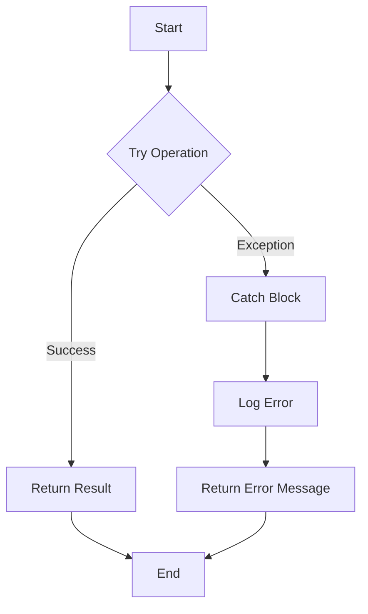

## 4.5. Error Handling Strategies

Error handling is a critical aspect of software development, ensuring that applications can gracefully handle unexpected situations and maintain robustness. In Clojure, a functional programming language that runs on the Java Virtual Machine (JVM), error handling can be approached in several ways. This section will explore traditional exception handling, the use of assertions and pre/post conditions, and functional error handling techniques such as Result monads. By understanding these strategies, you can write more reliable and maintainable Clojure code.

### Traditional Exception Handling in Clojure

Clojure, being a JVM language, inherits Java's exception handling mechanisms. The `try-catch` block is the primary construct for handling exceptions. Here's how it works in Clojure:

```clojure
(defn divide [numerator denominator]
  (try
    (/ numerator denominator)
    (catch ArithmeticException e
      (str "Cannot divide by zero: " (.getMessage e)))
    (catch Exception e
      (str "An error occurred: " (.getMessage e)))))
```

In this example, the `divide` function attempts to divide two numbers. If a division by zero occurs, an `ArithmeticException` is caught, and a custom error message is returned. The `catch` block can handle specific exceptions or a general `Exception` for broader error handling.

#### Best Practices for Exception Handling

1. **Catch Specific Exceptions**: Always catch the most specific exception possible to avoid masking other errors.
2. **Avoid Overuse**: Use exceptions for truly exceptional conditions, not for regular control flow.
3. **Log Errors**: Ensure that errors are logged for debugging and monitoring purposes.
4. **Provide Meaningful Messages**: Return or log messages that help in diagnosing the issue.

### Assertions and Pre/Post Conditions

Clojure provides a mechanism for asserting conditions using `:pre` and `:post` conditions in function definitions. These are used to enforce invariants and validate inputs and outputs.

```clojure
(defn safe-divide [numerator denominator]
  {:pre [(not= denominator 0)]
   :post [(number? %)]}
  (/ numerator denominator))
```

In the `safe-divide` function, the `:pre` condition ensures that the denominator is not zero, preventing a division by zero error. The `:post` condition checks that the result is a number.

#### Benefits of Using Assertions

- **Early Error Detection**: Catch errors at the point of failure, making debugging easier.
- **Documentation**: Serve as documentation for function contracts.
- **Improved Reliability**: Ensure that functions behave as expected under specified conditions.

### Functional Error Handling with Result Monads

Functional programming encourages handling errors without exceptions, using constructs like Result monads. This approach treats errors as values, allowing functions to return either a success or an error.

#### Introducing Result Monads

A Result monad can be represented as a data structure with two variants: `Success` and `Failure`. Here's a simple implementation:

```clojure
(defn success [value]
  {:status :success, :value value})

(defn failure [error]
  {:status :failure, :error error})

(defn divide-safe [numerator denominator]
  (if (zero? denominator)
    (failure "Cannot divide by zero")
    (success (/ numerator denominator))))
```

In this example, `divide-safe` returns a `Success` or `Failure` based on the input. Consumers of this function can pattern match on the result to handle success or failure cases.

#### Handling Results

```clojure
(let [result (divide-safe 10 0)]
  (case (:status result)
    :success (println "Result:" (:value result))
    :failure (println "Error:" (:error result))))
```

This pattern allows for clear separation of success and error handling logic.

### Libraries for Functional Error Handling

Several libraries in the Clojure ecosystem provide advanced error handling capabilities:

- **`cats`**: A library for category theory abstractions, including monads.
- **`manifold`**: Provides deferreds and streams for asynchronous programming with error handling.

#### Example with `cats`

```clojure
(require '[cats.monad.either :as either])

(defn divide-either [numerator denominator]
  (if (zero? denominator)
    (either/left "Cannot divide by zero")
    (either/right (/ numerator denominator))))

(let [result (divide-either 10 0)]
  (either/branch result
    (fn [error] (println "Error:" error))
    (fn [value] (println "Result:" value))))
```

### Best Practices for Robust Error Management

1. **Use Functional Constructs**: Prefer functional error handling for predictable and composable code.
2. **Validate Inputs**: Use assertions to validate inputs and outputs.
3. **Graceful Degradation**: Design systems to degrade gracefully in the presence of errors.
4. **Centralized Error Handling**: Consider a centralized error handling strategy for consistency.
5. **Testing**: Write tests to cover both success and error scenarios.

### Visualizing Error Handling Strategies

To better understand the flow of error handling in Clojure, let's visualize the process using a flowchart:



**Figure 1**: Flowchart illustrating traditional error handling with `try-catch`.

### Try It Yourself

Experiment with the provided code examples by modifying the input values or adding new error conditions. Try implementing a custom Result monad or using the `cats` library for more complex scenarios.

### References and Links

- [Clojure Documentation on Exception Handling](https://clojure.org/reference/reader#_exception_handling)
- [Cats Library on GitHub](https://github.com/funcool/cats)
- [Functional Programming in Clojure](https://www.braveclojure.com/functional-programming/)

### Knowledge Check

To reinforce your understanding of error handling strategies in Clojure, try answering the following questions.

## **Ready to Test Your Knowledge?**



### What is the primary construct for handling exceptions in Clojure?

- [x] try-catch
- [ ] if-else
- [ ] loop-recur
- [ ] defn

> **Explanation:** The `try-catch` block is used for handling exceptions in Clojure, similar to Java.

### What is the purpose of `:pre` conditions in Clojure functions?

- [x] To validate input arguments
- [ ] To log errors
- [ ] To handle exceptions
- [ ] To optimize performance

> **Explanation:** `:pre` conditions are used to assert that input arguments meet certain criteria before executing the function body.

### Which library provides monads for functional error handling in Clojure?

- [x] cats
- [ ] manifold
- [ ] core.async
- [ ] clojure.test

> **Explanation:** The `cats` library provides abstractions for monads, including Result monads for error handling.

### How does a Result monad represent errors?

- [x] As a value
- [ ] As an exception
- [ ] As a log message
- [ ] As a side effect

> **Explanation:** Result monads represent errors as values, allowing functions to return either a success or an error.

### What is a best practice for exception handling?

- [x] Catch specific exceptions
- [ ] Catch all exceptions
- [ ] Ignore exceptions
- [ ] Use exceptions for control flow

> **Explanation:** Catching specific exceptions helps avoid masking other errors and provides more precise error handling.

### Which of the following is NOT a benefit of using assertions?

- [x] Improved performance
- [ ] Early error detection
- [ ] Documentation
- [ ] Improved reliability

> **Explanation:** Assertions do not improve performance; they are used for error detection and documentation.

### What does the `either/branch` function do in the `cats` library?

- [x] It handles both success and error cases of a Result monad.
- [ ] It logs errors.
- [ ] It retries failed operations.
- [ ] It optimizes performance.

> **Explanation:** The `either/branch` function allows handling both success and error cases of a Result monad.

### What should you do to ensure robust error management?

- [x] Use functional constructs
- [ ] Ignore errors
- [ ] Use global variables
- [ ] Avoid testing

> **Explanation:** Using functional constructs and testing are key to robust error management.

### Which of the following is a centralized error handling strategy?

- [x] Logging errors in a single location
- [ ] Using multiple try-catch blocks
- [ ] Ignoring minor errors
- [ ] Using global variables

> **Explanation:** Centralized error handling involves logging errors in a single location for consistency.

### True or False: Functional error handling treats errors as exceptions.

- [ ] True
- [x] False

> **Explanation:** Functional error handling treats errors as values, not exceptions.



Remember, mastering error handling in Clojure is a journey. As you explore different strategies, you'll develop a deeper understanding of how to build resilient and maintainable applications. Keep experimenting and refining your approach!
