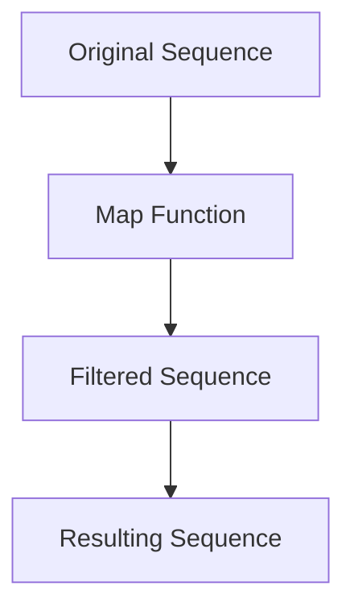

## 4.6. Working with Sequences and Collections

In Clojure, sequences are a central abstraction that unify the handling of collections, providing a powerful and flexible way to manipulate data. Understanding sequences and collections is crucial for mastering Clojure's functional programming paradigm. In this section, we'll explore what sequences are, how they work, and how to use them effectively in your Clojure programs.

### Understanding Sequences in Clojure

#### What Are Sequences?

In Clojure, a sequence is an abstraction that represents a logical list of elements. Sequences provide a uniform interface for accessing and manipulating collections, regardless of their underlying data structure. This abstraction allows you to work with lists, vectors, maps, and sets in a consistent manner.

#### The Sequence Abstraction

The sequence abstraction in Clojure is built around a set of core functions that operate on any collection that can be viewed as a sequence. These functions include `first`, `rest`, `cons`, `seq`, and `conj`, among others. By using these functions, you can perform a wide range of operations on collections without needing to know their specific implementation details.

```clojure
;; Example of sequence functions
(def my-list '(1 2 3 4 5))

;; Get the first element
(first my-list) ;=> 1

;; Get the rest of the elements
(rest my-list) ;=> (2 3 4 5)

;; Add an element to the front
(cons 0 my-list) ;=> (0 1 2 3 4 5)

;; Convert a collection to a sequence
(seq [1 2 3]) ;=> (1 2 3)
```

### Working with Sequence Functions

Clojure provides a rich set of functions for working with sequences. These functions allow you to filter, map, reduce, and transform data in powerful ways.

#### Mapping and Filtering

The `map` and `filter` functions are two of the most commonly used sequence functions. `map` applies a function to each element of a sequence, while `filter` selects elements based on a predicate.

```clojure
;; Example of map and filter
(def numbers [1 2 3 4 5])

;; Double each number
(map #(* 2 %) numbers) ;=> (2 4 6 8 10)

;; Filter out even numbers
(filter odd? numbers) ;=> (1 3 5)
```

#### Reducing and Folding

The `reduce` function is used to accumulate values from a sequence into a single result. It takes a function and an initial value, then applies the function to each element of the sequence and the accumulated result.

```clojure
;; Example of reduce
(def numbers [1 2 3 4 5])

;; Sum all numbers
(reduce + 0 numbers) ;=> 15

;; Find the maximum number
(reduce max numbers) ;=> 5
```

### Performance Considerations

When working with sequences, it's important to consider performance implications. Sequences in Clojure are often lazy, meaning they are not evaluated until needed. This can lead to significant performance improvements, especially when working with large datasets.

#### Laziness in Sequences

Laziness allows you to work with potentially infinite sequences without running out of memory. Functions like `map`, `filter`, and `take` are lazy, meaning they produce a sequence that is only evaluated as needed.

```clojure
;; Example of lazy sequences
(def infinite-nums (iterate inc 0))

;; Take the first 10 numbers
(take 10 infinite-nums) ;=> (0 1 2 3 4 5 6 7 8 9)
```

#### Eager Evaluation

While laziness is powerful, there are times when you need eager evaluation. Functions like `doall` and `dorun` can be used to force the evaluation of a lazy sequence.

```clojure
;; Example of eager evaluation
(def lazy-seq (map #(do (println %) %) [1 2 3]))

;; Force evaluation
(doall lazy-seq) ; Prints 1 2 3 and returns (1 2 3)
```

### The Importance of Laziness

Laziness is a key feature of Clojure's sequence abstraction, enabling efficient computation and memory usage. By deferring computation until necessary, lazy sequences allow you to work with large or infinite datasets without incurring the cost of immediate evaluation.

### Visualizing Sequence Operations

To better understand how sequence operations work, let's visualize the process of mapping and filtering a sequence.



In this diagram, we start with an original sequence, apply a map function to transform each element, filter the transformed elements based on a predicate, and finally obtain the resulting sequence.

### Best Practices for Working with Sequences

1. **Leverage Laziness**: Use lazy sequences to handle large datasets efficiently.
2. **Use Core Functions**: Familiarize yourself with Clojure's core sequence functions for common operations.
3. **Consider Performance**: Be mindful of the performance implications of sequence operations, especially when dealing with large collections.
4. **Embrace Immutability**: Take advantage of Clojure's immutable data structures to avoid side effects and ensure thread safety.

### Try It Yourself

Experiment with the following code examples to deepen your understanding of sequences and collections in Clojure. Try modifying the functions and observing the results.

```clojure
;; Experiment with map and filter
(defn square [x] (* x x))
(def numbers [1 2 3 4 5])

;; Square each number and filter out those greater than 10
(->> numbers
     (map square)
     (filter #(> % 10))) ;=> (16 25)

;; Experiment with reduce
(defn product [coll]
  (reduce * 1 coll))

(product [1 2 3 4]) ;=> 24
```

### Knowledge Check

- What is the primary benefit of using lazy sequences in Clojure?
- How does the `map` function differ from `filter`?
- Why is immutability important when working with sequences?

### Summary

In this section, we've explored the powerful sequence abstraction in Clojure, learning how to work with sequences and collections effectively. We've seen how laziness plays a crucial role in efficient computation and how to use core sequence functions to manipulate data. By understanding these concepts, you'll be well-equipped to harness the full potential of Clojure's functional programming paradigm.

## **Ready to Test Your Knowledge?**



### What is a sequence in Clojure?

- [x] An abstraction representing a logical list of elements
- [ ] A mutable list of elements
- [ ] A data structure unique to Clojure
- [ ] A type of loop in Clojure

> **Explanation:** In Clojure, a sequence is an abstraction that represents a logical list of elements, providing a uniform interface for accessing and manipulating collections.

### Which function is used to apply a function to each element of a sequence?

- [x] map
- [ ] filter
- [ ] reduce
- [ ] conj

> **Explanation:** The `map` function applies a given function to each element of a sequence, returning a new sequence of results.

### What does the `filter` function do?

- [x] Selects elements based on a predicate
- [ ] Applies a function to each element
- [ ] Accumulates values into a single result
- [ ] Converts a collection to a sequence

> **Explanation:** The `filter` function selects elements from a sequence based on a predicate, returning a new sequence of elements that satisfy the predicate.

### How does laziness benefit sequence operations?

- [x] By deferring computation until necessary
- [ ] By making sequences mutable
- [ ] By increasing memory usage
- [ ] By forcing immediate evaluation

> **Explanation:** Laziness defers computation until necessary, allowing efficient handling of large or infinite datasets without immediate evaluation.

### Which function forces the evaluation of a lazy sequence?

- [x] doall
- [ ] map
- [ ] filter
- [ ] reduce

> **Explanation:** The `doall` function forces the evaluation of a lazy sequence, ensuring that all elements are computed.

### What is the result of `(reduce + 0 [1 2 3 4 5])`?

- [x] 15
- [ ] 10
- [ ] 20
- [ ] 5

> **Explanation:** The `reduce` function accumulates values from a sequence, and in this case, it sums the numbers 1 through 5, resulting in 15.

### Why is immutability important in Clojure?

- [x] It avoids side effects and ensures thread safety
- [ ] It allows for mutable state
- [ ] It increases performance
- [ ] It simplifies syntax

> **Explanation:** Immutability avoids side effects and ensures thread safety, which is crucial for reliable and predictable code in Clojure.

### What does the `cons` function do?

- [x] Adds an element to the front of a sequence
- [ ] Removes an element from a sequence
- [ ] Filters elements based on a predicate
- [ ] Applies a function to each element

> **Explanation:** The `cons` function adds an element to the front of a sequence, creating a new sequence with the added element.

### Which of the following is a lazy sequence function?

- [x] map
- [ ] reduce
- [ ] doall
- [ ] conj

> **Explanation:** The `map` function is lazy, meaning it produces a sequence that is only evaluated as needed.

### True or False: Sequences in Clojure are always evaluated eagerly.

- [ ] True
- [x] False

> **Explanation:** Sequences in Clojure are often lazy, meaning they are not evaluated until needed, allowing for efficient computation and memory usage.



Remember, this is just the beginning. As you progress, you'll build more complex and interactive applications using Clojure's powerful sequence abstraction. Keep experimenting, stay curious, and enjoy the journey!

---
