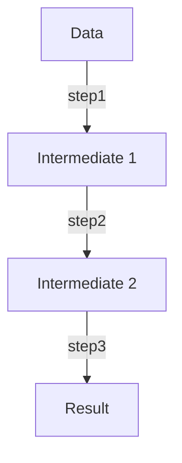

## 4.6 Pipeline Processing

In the realm of functional programming, pipeline processing is a powerful paradigm that allows developers to transform data through a series of composable steps. Clojure, with its emphasis on immutability and functional composition, provides elegant tools to implement pipeline processing using threading macros. This section delves into the intricacies of pipeline processing in Clojure, showcasing how threading macros can enhance code readability and maintainability.

### Introduction to Pipeline Processing

Pipeline processing involves passing data through a sequence of transformation steps, where each step takes the output of the previous one as its input. This approach mirrors the natural flow of data, making the code more intuitive and easier to understand. In Clojure, threading macros such as `->`, `->>`, and `as->` are instrumental in constructing these pipelines.

### Threading Macros: Enhancing Code Readability

Clojure's threading macros are syntactic sugar that simplifies the chaining of function calls. They allow you to express a series of transformations in a linear, top-to-bottom manner, which is often more readable than deeply nested function calls.

#### Thread-First Macro (`->`)

The `->` macro, also known as the thread-first macro, is used when the data to be transformed is the first argument in the function calls. It rewrites nested function calls into a more readable sequence.

```clojure
(-> data
    step1
    step2
    step3)
```

This is equivalent to:

```clojure
(step3 (step2 (step1 data)))
```

**Example:**

```clojure
(defn process-user [user]
  (-> user
      (assoc :processed true)
      (update :name clojure.string/upper-case)
      (dissoc :password)))
```

In this example, `process-user` takes a `user` map, marks it as processed, converts the name to uppercase, and removes the password field.

#### Thread-Last Macro (`->>`)

The `->>` macro, or thread-last macro, is used when the data is the last argument in the function calls. This is particularly useful for functions that operate on collections.

```clojure
(->> data
     step1
     step2
     step3)
```

This is equivalent to:

```clojure
(step3 (step2 (step1 data)))
```

**Example:**

```clojure
(->> (range 10)
     (map inc)
     (filter even?)
     (reduce +))
; => 30
```

Here, the numbers from 0 to 9 are incremented, filtered to keep only even numbers, and then summed up.

#### Complex Pipelines with `as->`

The `as->` macro is used for more complex pipelines where the position of the data in the function calls varies. It allows you to bind the intermediate result to a symbol, which can be used flexibly in subsequent steps.

```clojure
(as-> data $
  (step1 $ param1)
  (step2 param2 $)
  (step3 $))
```

**Example:**

```clojure
(as-> 5 $
  (* $ 2)
  (+ $ 10)
  (/ $ 3))
; => 10
```

In this example, the number 5 is doubled, 10 is added, and the result is divided by 3.

### Creating Reusable Pipeline Functions

Clojure's functional nature allows you to create reusable pipeline functions using `comp` and `partial`. This promotes code reuse and modularity.

**Example:**

```clojure
(def process-data
  (comp
   (partial filter even?)
   (partial map inc)))

(reduce + (process-data (range 10)))
; => 30
```

Here, `process-data` is a composed function that increments numbers and filters even ones. It is then used in a `reduce` operation to sum the numbers.

### Visualizing Pipeline Processing

To better understand the flow of data through a pipeline, consider the following diagram that illustrates a simple pipeline using threading macros:



This diagram shows how data is transformed step by step, with each step producing an intermediate result that is passed to the next.

### Use Cases for Pipeline Processing

Pipeline processing is particularly useful in scenarios involving data transformation and analysis, such as:

- **Data Cleaning:** Transforming raw data into a clean, usable format.
- **ETL Processes:** Extracting, transforming, and loading data in data pipelines.
- **Functional Composition:** Building complex operations from simpler functions.

### Advantages and Disadvantages

**Advantages:**

- **Readability:** Linear flow of transformations enhances code readability.
- **Modularity:** Encourages the creation of small, reusable functions.
- **Maintainability:** Simplifies the process of modifying or extending pipelines.

**Disadvantages:**

- **Debugging Complexity:** Debugging can be challenging if intermediate results are not inspected.
- **Performance Overhead:** Excessive use of intermediate collections can impact performance.

### Best Practices for Pipeline Processing

- **Use Descriptive Function Names:** Ensure each transformation step is clearly named to convey its purpose.
- **Limit Pipeline Length:** Avoid overly long pipelines to maintain readability and manageability.
- **Inspect Intermediate Results:** Use logging or debugging tools to inspect intermediate results during development.

### Conclusion

Pipeline processing in Clojure, facilitated by threading macros, offers a powerful way to transform data through a series of steps. By leveraging these macros, developers can write code that is both readable and maintainable, aligning with the principles of functional programming. As you explore pipeline processing, consider the best practices and potential pitfalls to maximize the effectiveness of your Clojure applications.

## Quiz Time!



### What is the primary purpose of pipeline processing in Clojure?

- [x] To process data through a sequence of transformation steps
- [ ] To execute functions in parallel
- [ ] To manage state changes
- [ ] To handle exceptions

> **Explanation:** Pipeline processing involves passing data through a series of transformation steps, enhancing readability and maintainability.

### Which threading macro is used when the data is the first argument in function calls?

- [x] `->`
- [ ] `->>`
- [ ] `as->`
- [ ] `comp`

> **Explanation:** The `->` macro, or thread-first macro, is used when the data is the first argument in function calls.

### What is the equivalent of `(-> data step1 step2 step3)`?

- [x] `(step3 (step2 (step1 data)))`
- [ ] `(step1 (step2 (step3 data)))`
- [ ] `(step2 (step1 (step3 data)))`
- [ ] `(step1 (step3 (step2 data)))`

> **Explanation:** The `->` macro rewrites nested function calls into a linear sequence, equivalent to `(step3 (step2 (step1 data)))`.

### Which macro allows for flexible data positioning in complex pipelines?

- [ ] `->`
- [ ] `->>`
- [x] `as->`
- [ ] `comp`

> **Explanation:** The `as->` macro allows for flexible data positioning by binding the intermediate result to a symbol.

### What is the result of `(->> (range 10) (map inc) (filter even?) (reduce +))`?

- [x] 30
- [ ] 20
- [ ] 40
- [ ] 50

> **Explanation:** The numbers from 0 to 9 are incremented, filtered to keep only even numbers, and then summed up, resulting in 30.

### How can you create reusable pipeline functions in Clojure?

- [x] Using `comp` and `partial`
- [ ] Using `let` and `def`
- [ ] Using `loop` and `recur`
- [ ] Using `if` and `cond`

> **Explanation:** Clojure's `comp` and `partial` functions allow you to create reusable pipeline functions by composing and partially applying functions.

### What is a disadvantage of pipeline processing?

- [ ] Enhanced readability
- [ ] Modularity
- [x] Debugging complexity
- [ ] Maintainability

> **Explanation:** Debugging can be challenging in pipeline processing if intermediate results are not inspected.

### Which threading macro is used when the data is the last argument in function calls?

- [ ] `->`
- [x] `->>`
- [ ] `as->`
- [ ] `comp`

> **Explanation:** The `->>` macro, or thread-last macro, is used when the data is the last argument in function calls.

### What is the purpose of the `as->` macro?

- [ ] To execute functions in parallel
- [x] To handle complex pipelines with flexible data positioning
- [ ] To manage state changes
- [ ] To handle exceptions

> **Explanation:** The `as->` macro is used for complex pipelines where the position of the data in function calls varies.

### True or False: Pipeline processing in Clojure can improve code readability.

- [x] True
- [ ] False

> **Explanation:** Pipeline processing improves code readability by expressing transformations in a linear, top-to-bottom manner.


