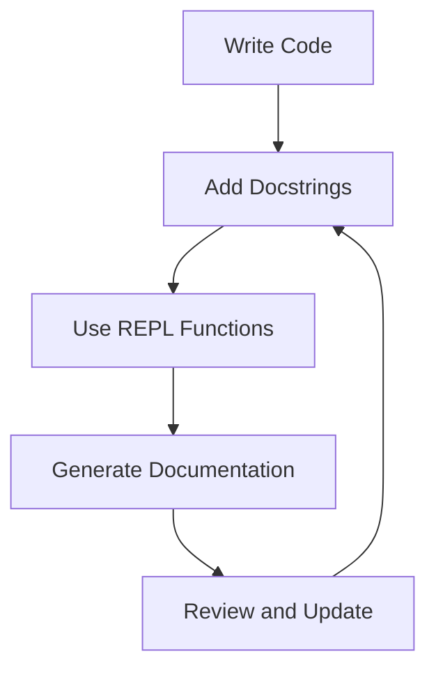

## 4.7. Documentation with `clojure.repl` and Docstrings

In the world of software development, documentation is a cornerstone of maintainable and understandable code. Clojure, with its emphasis on simplicity and expressiveness, provides powerful tools for documenting code effectively. In this section, we will explore how to leverage docstrings and the `clojure.repl` namespace to create comprehensive documentation for your Clojure projects. We'll delve into best practices for writing clear and helpful documentation and discuss tools that can generate documentation from your code.

### The Importance of Documentation in Clojure

Documentation serves as a bridge between the code and its users, providing insights into the purpose, usage, and behavior of functions and modules. In Clojure, documentation is not just an afterthought but an integral part of the development process. By embedding documentation directly within the code, developers can ensure that it remains up-to-date and relevant.

### Adding Docstrings to Functions and Namespaces

Docstrings in Clojure are a simple yet powerful way to document functions, macros, and namespaces. They are string literals placed immediately after the function or namespace declaration and are accessible through the REPL.

#### Adding Docstrings to Functions

To add a docstring to a function, simply include a string literal immediately after the function's argument vector. Here's an example:

```clojure
(defn add
  "Adds two numbers together."
  [a b]
  (+ a b))
```

In this example, the docstring `"Adds two numbers together."` provides a concise description of what the `add` function does.

#### Adding Docstrings to Namespaces

Namespaces can also have docstrings, which are placed immediately after the `ns` declaration:

```clojure
(ns myapp.core
  "Core functions for the MyApp application.")

(defn greet
  "Greets a user by name."
  [name]
  (str "Hello, " name "!"))
```

Here, the namespace `myapp.core` is documented with a brief description of its purpose.

### Using REPL Functions for Documentation

The Clojure REPL (Read-Eval-Print Loop) provides several functions that make it easy to access and explore documentation. Let's look at some of the most useful ones.

#### The `doc` Function

The `doc` function displays the docstring of a given symbol, making it easy to understand what a function or macro does without leaving the REPL.

```clojure
(doc add)
```

This command will output:

```
-------------------------
myapp.core/add
([a b])
  Adds two numbers together.
```

#### The `find-doc` Function

The `find-doc` function searches for documentation containing a specific keyword. This is particularly useful when you know what you want to do but can't remember the exact function name.

```clojure
(find-doc "add")
```

This will return a list of functions and macros whose docstrings contain the word "add".

#### The `source` Function

The `source` function displays the source code of a given function or macro. This can be invaluable for understanding how a function works under the hood.

```clojure
(source add)
```

This will output the source code for the `add` function.

### Best Practices for Writing Clear and Helpful Documentation

Writing effective documentation is an art. Here are some best practices to keep in mind:

- **Be Concise**: Keep docstrings short and to the point. Focus on what the function does, its parameters, and its return value.
- **Use Clear Language**: Avoid jargon and technical terms unless necessary. Use simple language that can be understood by someone new to the codebase.
- **Document Edge Cases**: Mention any edge cases or special behaviors that users should be aware of.
- **Include Examples**: Where possible, include examples of how to use the function. This can be especially helpful for complex functions.
- **Keep It Up-to-Date**: Regularly review and update documentation to reflect changes in the code.

### Encouraging Documentation of All Public APIs

Public APIs are the interfaces through which users interact with your code. As such, they should be thoroughly documented. This includes:

- **Function Signatures**: Describe the purpose of each parameter and the expected return value.
- **Usage Examples**: Provide examples of typical use cases.
- **Error Handling**: Explain how errors are handled and what exceptions might be thrown.

### Tools for Generating Documentation from Code

Several tools can generate documentation from your Clojure code, making it easier to maintain and share with others.

#### Codox

Codox is a popular tool for generating HTML documentation from Clojure source code. It parses docstrings and produces a user-friendly website that can be easily shared.

To use Codox, add it to your `project.clj`:

```clojure
:plugins [[lein-codox "0.10.7"]]
```

Then run:

```bash
lein codox
```

This will generate HTML documentation in the `target/doc` directory.

#### Marginalia

Marginalia is another tool that generates documentation from Clojure source code. It creates annotated source listings, which can be helpful for understanding the code in context.

To use Marginalia, add it to your `project.clj`:

```clojure
:plugins [[lein-marginalia "0.9.1"]]
```

Then run:

```bash
lein marg
```

This will generate documentation in the `docs` directory.

### Try It Yourself

Let's put these concepts into practice. Here's a simple Clojure function with a docstring:

```clojure
(defn multiply
  "Multiplies two numbers."
  [x y]
  (* x y))
```

Try using the `doc` function in the REPL to view the documentation for `multiply`. Then, modify the docstring to include an example of usage.

### Visualizing Documentation Workflow

To better understand the workflow of documenting Clojure code, let's visualize the process using a flowchart.



**Figure 1**: This flowchart illustrates the iterative process of writing code, adding docstrings, using REPL functions to explore documentation, generating documentation, and reviewing/updating it as needed.

### References and Links

For further reading on Clojure documentation, consider the following resources:

- [Clojure Official Documentation](https://clojure.org/reference/documentation)
- [Codox Documentation](https://github.com/weavejester/codox)
- [Marginalia Documentation](https://github.com/gdeer81/marginalia)

### Knowledge Check

To reinforce your understanding of documenting Clojure code, try answering the following questions.

## **Ready to Test Your Knowledge?**



### What is the primary purpose of docstrings in Clojure?

- [x] To provide inline documentation for functions and namespaces.
- [ ] To execute code at runtime.
- [ ] To define variable types.
- [ ] To optimize code performance.

> **Explanation:** Docstrings are used to provide inline documentation for functions and namespaces, making it easier to understand their purpose and usage.

### Which REPL function is used to display the docstring of a given symbol?

- [x] `doc`
- [ ] `find-doc`
- [ ] `source`
- [ ] `print`

> **Explanation:** The `doc` function is used to display the docstring of a given symbol in the REPL.

### How can you search for documentation containing a specific keyword in Clojure?

- [x] Using the `find-doc` function.
- [ ] Using the `doc` function.
- [ ] Using the `source` function.
- [ ] Using the `print` function.

> **Explanation:** The `find-doc` function searches for documentation containing a specific keyword, helping you locate relevant functions and macros.

### What is the benefit of using tools like Codox and Marginalia?

- [x] They generate user-friendly documentation from Clojure source code.
- [ ] They compile Clojure code into machine code.
- [ ] They optimize Clojure code for performance.
- [ ] They provide real-time code execution.

> **Explanation:** Tools like Codox and Marginalia generate user-friendly documentation from Clojure source code, making it easier to share and maintain.

### Which of the following is a best practice for writing docstrings?

- [x] Be concise and clear.
- [ ] Use complex technical jargon.
- [ ] Include unrelated information.
- [ ] Avoid examples.

> **Explanation:** Best practices for writing docstrings include being concise and clear, avoiding jargon, and including relevant examples.

### What should be documented in public APIs?

- [x] Function signatures, usage examples, and error handling.
- [ ] Only the function names.
- [ ] Internal implementation details.
- [ ] Unrelated code snippets.

> **Explanation:** Public APIs should be thoroughly documented, including function signatures, usage examples, and error handling.

### How do you add a docstring to a Clojure function?

- [x] Place a string literal immediately after the function's argument vector.
- [ ] Use a special `docstring` keyword.
- [ ] Include it in a separate file.
- [ ] Use a comment block.

> **Explanation:** To add a docstring to a Clojure function, place a string literal immediately after the function's argument vector.

### What is the role of the `source` function in the REPL?

- [x] To display the source code of a given function or macro.
- [ ] To execute a function.
- [ ] To compile Clojure code.
- [ ] To optimize code performance.

> **Explanation:** The `source` function displays the source code of a given function or macro, helping you understand its implementation.

### True or False: Docstrings can only be added to functions in Clojure.

- [ ] True
- [x] False

> **Explanation:** False. Docstrings can be added to both functions and namespaces in Clojure.

### What is the iterative process of documenting Clojure code?

- [x] Write code, add docstrings, use REPL functions, generate documentation, review and update.
- [ ] Write code, compile, execute, debug, deploy.
- [ ] Plan, design, implement, test, release.
- [ ] Brainstorm, prototype, develop, test, launch.

> **Explanation:** The iterative process of documenting Clojure code involves writing code, adding docstrings, using REPL functions, generating documentation, and reviewing/updating it as needed.



Remember, mastering documentation in Clojure is an ongoing journey. As you continue to develop your skills, you'll find that well-documented code not only benefits others but also enhances your own understanding and efficiency. Keep experimenting, stay curious, and enjoy the journey!
