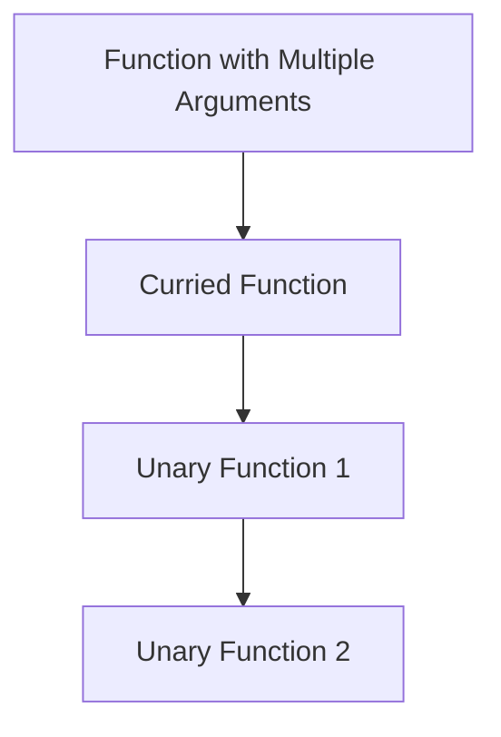
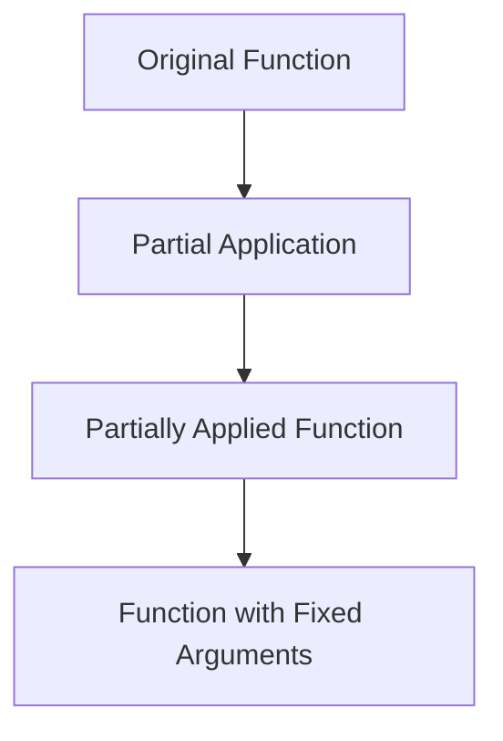

## 4.7 Currying and Partial Application in Clojure

In the realm of functional programming, currying and partial application are powerful techniques that enhance the flexibility and reusability of functions. These concepts allow developers to transform functions and create new ones with fixed arguments, leading to more modular and expressive code. In this section, we will delve into how currying and partial application are implemented in Clojure, providing practical examples and insights into their use.

### Introduction to Currying and Partial Application

**Currying** is a technique that transforms a function with multiple arguments into a sequence of functions, each taking a single argument. This allows for more granular control over function application and can lead to more reusable and composable code.

**Partial Application**, on the other hand, involves fixing a few arguments of a function, producing another function with a smaller arity. This is particularly useful in scenarios where you want to pre-configure a function with certain parameters and reuse it in different contexts.

### Detailed Explanation

#### Currying in Clojure

Currying is not built into Clojure by default, but it can be implemented manually or with the help of libraries. The idea is to break down a function that takes multiple arguments into a series of unary functions.

**Manual Currying Implementation:**

```clojure
(defn curry [f]
  (fn [a]
    (fn [b]
      (f a b))))

(def add (fn [a b] (+ a b)))
(def curried-add (curry add))
((curried-add 5) 10) ; => 15
```

In this example, `curry` is a function that takes a binary function `f` and returns a curried version of it. The `curried-add` function is then used by applying arguments one at a time.

**Using Libraries for Currying:**

The `funs` library in Clojure provides utilities for currying functions.

```clojure
;; Add to project.clj dependencies:
[funcool/funs "0.4.0"]

(require '[funs.core :as funs])

(def curried-add (funs/curry add))
((curried-add 5) 10) ; => 15
```

By using the `funs` library, you can easily curry functions without manually defining the currying logic.

#### Partial Application in Clojure

Clojure provides the `partial` function to facilitate partial application. This function allows you to fix some arguments of a function, creating a new function with fewer arguments.

**Using `partial` for Partial Application:**

```clojure
(def add (fn [a b] (+ a b)))
(def add5 (partial add 5))
(add5 10) ; => 15
```

In this example, `partial` is used to create a new function `add5` that adds 5 to its argument. This is a simple yet powerful way to create specialized functions from more general ones.

**Applying Partially Applied Functions in Pipelines:**

Partial application is particularly useful in data processing pipelines, where you can pre-configure functions to operate on data streams.

```clojure
(map (partial * 2) [1 2 3]) ; => (2 4 6)
```

Here, `partial` is used to create a function that doubles its input, which is then applied to each element in the list using `map`.

### Visual Aids

To better understand the flow of currying and partial application, let's visualize these concepts using diagrams.

#### Currying Process



#### Partial Application Process



### Use Cases

Currying and partial application are widely used in functional programming for various purposes:

- **Configuration:** Pre-configure functions with specific parameters for reuse in different contexts.
- **Composition:** Compose functions in a modular way, enabling more expressive and readable code.
- **Pipelines:** Simplify data processing pipelines by creating specialized functions for specific tasks.

### Advantages and Disadvantages

**Advantages:**

- **Modularity:** Enhances code modularity by allowing functions to be broken down into smaller, reusable components.
- **Readability:** Improves code readability by reducing the number of arguments passed around.
- **Flexibility:** Provides flexibility in function application, enabling dynamic function creation.

**Disadvantages:**

- **Complexity:** Can introduce complexity if overused, making code harder to follow.
- **Performance:** May incur a slight performance overhead due to the creation of additional functions.

### Best Practices

- **Use Sparingly:** Apply currying and partial application judiciously to avoid unnecessary complexity.
- **Combine with Other Patterns:** Leverage these techniques alongside other functional patterns for maximum benefit.
- **Optimize for Readability:** Ensure that the use of currying and partial application enhances, rather than detracts from, code readability.

### Comparisons

Currying and partial application are often compared with other function transformation techniques like closures and higher-order functions. While closures capture the environment in which they are created, currying and partial application focus on transforming the function's argument structure.

### Conclusion

Currying and partial application are essential tools in the functional programming toolkit, offering powerful ways to transform and reuse functions. By understanding and applying these techniques, Clojure developers can write more expressive, modular, and maintainable code.

## Quiz Time!



### What is currying in functional programming?

- [x] Transforming a function with multiple arguments into a sequence of functions each with a single argument.
- [ ] Fixing a few arguments of a function to produce another function of smaller arity.
- [ ] Combining multiple functions into a single function.
- [ ] Creating a new function by composing two or more functions.

> **Explanation:** Currying transforms a function with multiple arguments into a sequence of unary functions.

### How does partial application differ from currying?

- [x] Partial application fixes some arguments of a function, while currying transforms it into unary functions.
- [ ] Partial application and currying are the same.
- [ ] Currying fixes some arguments of a function, while partial application transforms it into unary functions.
- [ ] Partial application is used only in object-oriented programming.

> **Explanation:** Partial application fixes some arguments, creating a new function with fewer arguments, whereas currying transforms a function into a series of unary functions.

### Which Clojure function is used for partial application?

- [x] `partial`
- [ ] `curry`
- [ ] `apply`
- [ ] `compose`

> **Explanation:** The `partial` function in Clojure is used to fix some arguments of a function, creating a new function with fewer arguments.

### How can currying be implemented manually in Clojure?

- [x] By creating a function that returns another function for each argument.
- [ ] By using the `partial` function.
- [ ] By using the `map` function.
- [ ] By using the `reduce` function.

> **Explanation:** Currying can be implemented manually by creating a function that returns another function for each argument.

### What library can be used for currying in Clojure?

- [x] `funs`
- [ ] `core.async`
- [ ] `clojure.set`
- [ ] `clojure.string`

> **Explanation:** The `funs` library provides utilities for currying functions in Clojure.

### What is the result of `(map (partial * 2) [1 2 3])` in Clojure?

- [x] `(2 4 6)`
- [ ] `(1 2 3)`
- [ ] `(4 8 12)`
- [ ] `(0 2 4)`

> **Explanation:** The `partial` function creates a new function that doubles its input, which is then applied to each element in the list using `map`.

### What is a potential disadvantage of using currying and partial application?

- [x] It can introduce complexity if overused.
- [ ] It always improves performance.
- [ ] It is not supported in Clojure.
- [ ] It makes code less modular.

> **Explanation:** While currying and partial application enhance modularity, they can introduce complexity if overused.

### Which of the following is an advantage of currying?

- [x] Enhances code modularity.
- [ ] Reduces code readability.
- [ ] Increases the number of arguments passed around.
- [ ] Decreases code flexibility.

> **Explanation:** Currying enhances code modularity by allowing functions to be broken down into smaller, reusable components.

### Can currying be used in conjunction with other functional patterns?

- [x] Yes
- [ ] No

> **Explanation:** Currying can be combined with other functional patterns to enhance code expressiveness and modularity.

### True or False: Currying and partial application are only applicable in Clojure.

- [ ] True
- [x] False

> **Explanation:** Currying and partial application are concepts in functional programming and are applicable in many programming languages, not just Clojure.


