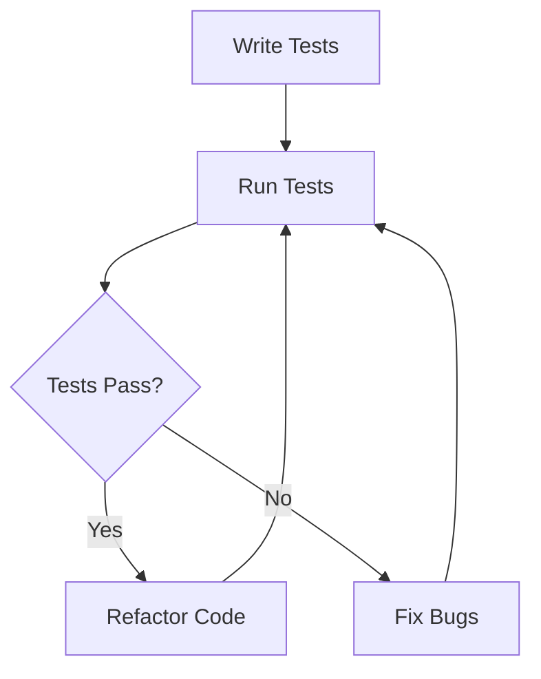

## 4.8. Testing with `clojure.test` and `test.check`

In the realm of software development, testing is a cornerstone practice that ensures the reliability and correctness of code. In Clojure, testing is facilitated by the built-in `clojure.test` framework and the powerful property-based testing library, `test.check`. This section will guide you through the essentials of testing in Clojure, from writing unit tests to leveraging generative testing for more comprehensive test coverage.

### The Importance of Testing

Testing is crucial for several reasons:

- **Ensures Code Correctness**: Tests verify that your code behaves as expected.
- **Facilitates Refactoring**: With a robust test suite, you can confidently refactor code, knowing that tests will catch regressions.
- **Improves Code Quality**: Writing tests encourages better design and documentation.
- **Supports Continuous Integration**: Automated tests are integral to CI/CD pipelines, ensuring that changes do not break existing functionality.

### Types of Tests

Before diving into Clojure-specific testing tools, let's briefly overview the types of tests commonly used in software development:

- **Unit Tests**: Focus on individual functions or components, ensuring they work in isolation.
- **Integration Tests**: Verify that different parts of the system work together as expected.
- **Functional Tests**: Test the application from the user's perspective, often involving end-to-end scenarios.
- **Property-Based Tests**: Check that certain properties hold true for a wide range of inputs, often uncovering edge cases.

### Writing Unit Tests with `clojure.test`

`clojure.test` is the built-in testing framework in Clojure, providing a simple and effective way to write unit tests.

#### Setting Up `clojure.test`

To start using `clojure.test`, include it in your namespace:

```clojure
(ns myproject.core-test
  (:require [clojure.test :refer :all]
            [myproject.core :refer :all]))
```

#### Writing Your First Test

Let's write a simple test for a function that adds two numbers:

```clojure
(deftest test-add
  (testing "Addition of two numbers"
    (is (= 4 (add 2 2)))
    (is (= 5 (add 2 3)))))
```

- **`deftest`**: Defines a test function.
- **`testing`**: Provides a description for a group of assertions.
- **`is`**: Asserts that an expression evaluates to true.

#### Running Tests

You can run tests using the REPL or command line. In the REPL, use:

```clojure
(run-tests 'myproject.core-test)
```

For command-line execution, use Leiningen:

```bash
lein test
```

### Introducing `test.check` for Property-Based Testing

`test.check` is a library for generative testing, where tests are defined by properties that should hold true for a wide range of inputs.

#### Setting Up `test.check`

Add `test.check` to your project dependencies:

```clojure
:dependencies [[org.clojure/test.check "1.1.0"]]
```

#### Writing Property-Based Tests

Let's write a property-based test for a sorting function:

```clojure
(ns myproject.core-test
  (:require [clojure.test :refer :all]
            [clojure.test.check :refer [quick-check]]
            [clojure.test.check.properties :as prop]))

(defn sorted? [coll]
  (apply <= coll))

(def sort-property
  (prop/for-all [v (gen/vector gen/int)]
    (sorted? (sort v))))

(deftest test-sort
  (testing "Sorting property"
    (is (quick-check 100 sort-property))))
```

- **`prop/for-all`**: Defines a property that should hold for all generated inputs.
- **`gen/vector`**: Generates a vector of integers.
- **`quick-check`**: Runs the property test with a specified number of iterations.

### Best Practices for Effective Testing

1. **Write Tests First**: Adopt Test-Driven Development (TDD) to guide your design.
2. **Keep Tests Small and Focused**: Each test should verify a single behavior.
3. **Use Descriptive Names**: Clearly describe what each test is verifying.
4. **Test Edge Cases**: Consider boundary conditions and unusual inputs.
5. **Leverage Property-Based Testing**: Use `test.check` to uncover hidden bugs.
6. **Automate Test Execution**: Integrate tests into your CI/CD pipeline.

### Setting Up Test Suites

Organize your tests into suites for better management and execution:

- **Namespace Organization**: Group related tests in the same namespace.
- **Test Fixtures**: Use `use-fixtures` to set up and tear down state before and after tests.

```clojure
(use-fixtures :each setup-fixture)
```

### Running Tests

Ensure your tests are run regularly:

- **Continuous Integration**: Integrate with CI tools like Jenkins or Travis CI.
- **Local Execution**: Run tests locally before committing changes.

### Visualizing the Testing Workflow

Below is a diagram illustrating the typical workflow of testing in Clojure:



### Try It Yourself

Experiment with the following code:

- Modify the `add` function to handle more complex operations.
- Create a new property-based test for a different function.
- Explore different generators in `test.check`.

### References and Links

- [Clojure Official Documentation](https://clojure.org/)
- [clojure.test API](https://clojure.github.io/clojure/clojure.test-api.html)
- [test.check GitHub Repository](https://github.com/clojure/test.check)

### Knowledge Check

To reinforce your understanding, try answering the following questions:

## **Ready to Test Your Knowledge?**



### What is the primary purpose of `clojure.test`?

- [x] To provide a framework for writing unit tests in Clojure.
- [ ] To generate random data for testing.
- [ ] To compile Clojure code.
- [ ] To manage dependencies in a Clojure project.

> **Explanation:** `clojure.test` is the built-in framework for writing unit tests in Clojure.

### Which function in `clojure.test` is used to define a test?

- [x] `deftest`
- [ ] `defn`
- [ ] `defmacro`
- [ ] `defvar`

> **Explanation:** `deftest` is used to define a test function in `clojure.test`.

### What is `test.check` primarily used for?

- [x] Property-based testing
- [ ] Unit testing
- [ ] Integration testing
- [ ] Functional testing

> **Explanation:** `test.check` is a library for property-based testing in Clojure.

### How do you run tests in the REPL using `clojure.test`?

- [x] `(run-tests 'namespace)`
- [ ] `(test 'namespace)`
- [ ] `(execute-tests 'namespace)`
- [ ] `(run 'namespace)`

> **Explanation:** `(run-tests 'namespace)` is the correct way to run tests in the REPL.

### What does `quick-check` do in `test.check`?

- [x] Runs a property test with a specified number of iterations.
- [ ] Compiles Clojure code.
- [ ] Generates random data.
- [ ] Defines a new test case.

> **Explanation:** `quick-check` runs a property test with a specified number of iterations.

### Which of the following is a best practice for writing tests?

- [x] Write tests first (TDD).
- [ ] Write tests after deployment.
- [ ] Avoid testing edge cases.
- [ ] Use non-descriptive test names.

> **Explanation:** Writing tests first (TDD) is a best practice for guiding design and ensuring code correctness.

### What is the role of `use-fixtures` in `clojure.test`?

- [x] To set up and tear down state before and after tests.
- [ ] To define a new test case.
- [ ] To generate random data for tests.
- [ ] To compile Clojure code.

> **Explanation:** `use-fixtures` is used to set up and tear down state before and after tests.

### What is a key benefit of property-based testing?

- [x] It can uncover hidden bugs by testing a wide range of inputs.
- [ ] It simplifies code compilation.
- [ ] It reduces the need for unit tests.
- [ ] It automates code deployment.

> **Explanation:** Property-based testing can uncover hidden bugs by testing a wide range of inputs.

### Which command is used to run tests from the command line with Leiningen?

- [x] `lein test`
- [ ] `lein run`
- [ ] `lein compile`
- [ ] `lein deploy`

> **Explanation:** `lein test` is used to run tests from the command line with Leiningen.

### True or False: `test.check` can only be used for unit testing.

- [ ] True
- [x] False

> **Explanation:** False. `test.check` is used for property-based testing, not limited to unit testing.



Remember, this is just the beginning. As you progress, you'll build more complex and interactive test suites. Keep experimenting, stay curious, and enjoy the journey!
