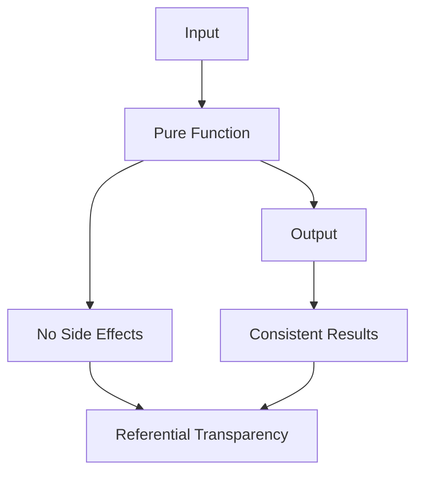

## 4.8 Pure Functions and Referential Transparency

In the realm of functional programming, pure functions and referential transparency are foundational concepts that significantly enhance the predictability, maintainability, and efficiency of code. Clojure, as a functional language, embraces these principles, allowing developers to write code that is both elegant and robust. This section delves into the intricacies of pure functions and referential transparency, illustrating their importance and application in Clojure.

### Introduction to Pure Functions

A pure function is a function where the output is determined solely by its input values, without observable side effects. This means that for any given input, a pure function will always produce the same output, making it predictable and easy to reason about.

#### Characteristics of Pure Functions

1. **Deterministic Output:** Given the same input, a pure function will always return the same output.
2. **No Side Effects:** Pure functions do not modify any external state or perform I/O operations. They rely entirely on their input parameters and produce results without altering the environment.

#### Example of a Pure Function

```clojure
(defn add [a b]
  (+ a b))
```

In the example above, the `add` function is pure because it simply returns the sum of `a` and `b` without affecting any external state.

### Referential Transparency

Referential transparency is a property of expressions in programming languages. An expression is referentially transparent if it can be replaced with its value without changing the program's behavior. This property is a direct consequence of using pure functions.

#### Benefits of Referential Transparency

- **Predictability:** Code becomes easier to understand and predict, as expressions can be substituted with their evaluated results.
- **Optimization:** Compilers and interpreters can optimize code by caching results of referentially transparent expressions.
- **Ease of Testing:** Testing becomes straightforward as functions are deterministic and do not depend on external state.

### Writing Pure Functions in Clojure

To write pure functions in Clojure, follow these guidelines:

#### Depend Only on Inputs

Ensure that your functions rely solely on their input parameters to produce results.

```clojure
(defn multiply [x y]
  (* x y))
```

#### Avoid Modifying External State

Refrain from altering atoms, refs, or other mutable structures within your functions. Also, avoid performing I/O operations.

```clojure
(defn pure-function [x]
  (* x 2)) ; Pure, as it does not modify external state

(defn impure-function [x]
  (println x)) ; Impure, as it performs I/O
```

#### Ensure Consistent Outputs

Functions should consistently produce the same result when called with the same arguments.

```clojure
(defn square [x]
  (* x x))
```

### Leveraging Pure Functions in Composition

Pure functions can be composed to build more complex operations, enhancing code reusability and readability.

```clojure
(defn square [x] (* x x))

(defn sum-of-squares [a b]
  (+ (square a) (square b)))
```

In the example above, `sum-of-squares` composes the `square` function to calculate the sum of squares of two numbers.

### Testing Pure Functions

Pure functions are inherently easy to test due to their deterministic nature. Unit tests can be written to verify that the function produces the expected output for given inputs.

```clojure
(deftest test-add
  (is (= 5 (add 2 3)))
  (is (= 0 (add 0 0))))
```

### Benefits from Memoization and Optimization

Pure functions, being referentially transparent, can benefit from memoization, where results of expensive function calls are cached to avoid redundant computations.

```clojure
(def memoized-square (memoize square))
```

### Visualizing Pure Functions and Referential Transparency

To better understand the flow and impact of pure functions and referential transparency, consider the following diagram:



### Use Cases of Pure Functions

- **Data Transformation:** Pure functions are ideal for transforming data structures, as they do not alter the original data.
- **Mathematical Computations:** Functions performing calculations without side effects are naturally pure.
- **Functional Composition:** Building complex operations from simpler pure functions enhances modularity.

### Advantages and Disadvantages

#### Advantages

- **Predictability:** Pure functions provide consistent and predictable results.
- **Ease of Testing:** Testing is simplified due to the deterministic nature of pure functions.
- **Optimization Opportunities:** Referential transparency allows for caching and other optimizations.

#### Disadvantages

- **No Side Effects:** While generally beneficial, the inability to perform side effects can be limiting in certain scenarios, requiring alternative approaches for I/O operations.

### Best Practices

- **Embrace Immutability:** Use immutable data structures to ensure functions remain pure.
- **Compose Functions:** Build complex logic through the composition of simple pure functions.
- **Leverage Clojure's Functional Features:** Utilize Clojure's rich set of functional programming tools to write clean and efficient pure functions.

### Conclusion

Pure functions and referential transparency are cornerstones of functional programming in Clojure. By adhering to these principles, developers can write code that is not only predictable and easy to test but also optimized for performance. Embracing these concepts leads to cleaner, more maintainable codebases, ultimately enhancing the overall quality of software projects.

## Quiz Time!



### What is a pure function?

- [x] A function that always produces the same output for the same input and has no side effects.
- [ ] A function that can modify external state.
- [ ] A function that performs I/O operations.
- [ ] A function that depends on global variables.

> **Explanation:** A pure function is defined by its deterministic output and lack of side effects.

### What does referential transparency allow?

- [x] Substitution of expressions with their values without changing program behavior.
- [ ] Modifying expressions in place.
- [ ] Changing the program's output based on external state.
- [ ] Performing side effects within expressions.

> **Explanation:** Referential transparency allows expressions to be replaced with their evaluated results without altering the program's behavior.

### Which of the following is a characteristic of pure functions?

- [x] No side effects.
- [ ] Dependence on external state.
- [ ] Variable output for the same input.
- [ ] Performing I/O operations.

> **Explanation:** Pure functions do not have side effects and produce consistent output for the same input.

### Why are pure functions easy to test?

- [x] They are deterministic and produce the same output for the same input.
- [ ] They modify external state.
- [ ] They perform I/O operations.
- [ ] They depend on global variables.

> **Explanation:** Pure functions are deterministic, making them straightforward to test.

### How can pure functions benefit from memoization?

- [x] By caching results to avoid redundant computations.
- [ ] By modifying external state.
- [ ] By performing I/O operations.
- [ ] By depending on global variables.

> **Explanation:** Memoization leverages the deterministic nature of pure functions to cache results and improve efficiency.

### What is a disadvantage of pure functions?

- [x] Inability to perform side effects directly.
- [ ] They are unpredictable.
- [ ] They depend on external state.
- [ ] They produce variable output for the same input.

> **Explanation:** Pure functions cannot perform side effects directly, which can be limiting in certain scenarios.

### Which of the following is NOT a benefit of referential transparency?

- [ ] Predictability
- [ ] Optimization
- [ ] Ease of Testing
- [x] Dependence on external state

> **Explanation:** Referential transparency enhances predictability, optimization, and ease of testing, but it does not involve dependence on external state.

### What is the result of composing pure functions?

- [x] Enhanced modularity and reusability.
- [ ] Increased side effects.
- [ ] Dependence on external state.
- [ ] Variable output for the same input.

> **Explanation:** Composing pure functions enhances modularity and reusability without introducing side effects.

### Which of the following is an example of a pure function in Clojure?

- [x] `(defn add [a b] (+ a b))`
- [ ] `(defn print-value [x] (println x))`
- [ ] `(defn update-atom [a] (swap! a inc))`
- [ ] `(defn read-file [path] (slurp path))`

> **Explanation:** The `add` function is pure as it produces a consistent output without side effects.

### True or False: Pure functions can modify atoms, refs, or other mutable structures.

- [ ] True
- [x] False

> **Explanation:** Pure functions cannot modify mutable structures as they must not have side effects.


