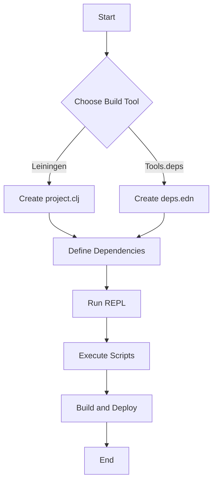

## 4.9. The Build Tools: Leiningen and Tools.deps

In the Clojure ecosystem, managing dependencies and building projects efficiently are crucial tasks that can significantly impact the development workflow. Two primary tools facilitate these tasks: **Leiningen** and **Tools.deps**. Each offers unique features and capabilities, catering to different needs and preferences. In this section, we'll explore these tools in detail, compare their functionalities, and guide you on choosing the right tool for your project.

### Introduction to Leiningen

Leiningen is a popular build automation tool for Clojure, designed to simplify the management of projects, dependencies, and tasks. It provides a comprehensive set of features that streamline the development process, making it a go-to choice for many Clojure developers.

#### Key Features of Leiningen

- **Dependency Management**: Leiningen uses a `project.clj` file to specify project dependencies, which are automatically resolved and downloaded.
- **Task Automation**: It supports a wide range of tasks, such as compiling code, running tests, and packaging applications.
- **Plugin Ecosystem**: Leiningen boasts a rich ecosystem of plugins that extend its functionality, allowing developers to customize their build processes.
- **REPL Integration**: It offers seamless integration with the Clojure REPL, enhancing interactive development.
- **Profiles**: Leiningen supports profiles, enabling different configurations for various environments (e.g., development, testing, production).

#### Common Leiningen Commands

Here are some of the most frequently used Leiningen commands:

- `lein new app <project-name>`: Creates a new Clojure application project.
- `lein deps`: Downloads and installs project dependencies.
- `lein run`: Runs the main function of the project.
- `lein test`: Executes the project's test suite.
- `lein uberjar`: Packages the project into a standalone JAR file.

#### Setting Up a Project with Leiningen

To create a new Clojure project using Leiningen, follow these steps:

1. **Install Leiningen**: Follow the instructions on the [Leiningen website](https://leiningen.org/) to install Leiningen on your system.

2. **Create a New Project**: Use the `lein new` command to generate a new project structure.

   ```bash
   lein new app my-clojure-app
   ```

   This command creates a directory named `my-clojure-app` with the necessary files and folders.

3. **Navigate to the Project Directory**: Change into the newly created project directory.

   ```bash
   cd my-clojure-app
   ```

4. **Run the Project**: Use the `lein run` command to execute the main function.

   ```bash
   lein run
   ```

5. **Add Dependencies**: Edit the `project.clj` file to include any additional dependencies your project requires.

   ```clojure
   (defproject my-clojure-app "0.1.0-SNAPSHOT"
     :description "A simple Clojure application"
     :dependencies [[org.clojure/clojure "1.10.3"]
                    [compojure "1.6.2"]])
   ```

6. **Download Dependencies**: Run `lein deps` to download and install the specified dependencies.

   ```bash
   lein deps
   ```

### Introduction to Tools.deps

Tools.deps, also known as the Clojure CLI, is a lightweight tool for managing dependencies and running Clojure programs. It emphasizes simplicity and flexibility, making it an excellent choice for developers who prefer a more hands-on approach to dependency management.

#### Key Features of Tools.deps

- **Dependency Management**: Tools.deps uses a `deps.edn` file to define dependencies, allowing for fine-grained control over dependency versions and sources.
- **Simplicity**: It provides a minimalistic approach, focusing on dependency resolution and execution without additional build automation features.
- **Interoperability**: Tools.deps integrates seamlessly with other tools and libraries, making it easy to incorporate into existing workflows.
- **Customizable Classpaths**: It allows developers to define custom classpaths, enabling precise control over the runtime environment.

#### Setting Up a Project with Tools.deps

To create a new Clojure project using Tools.deps, follow these steps:

1. **Install the Clojure CLI**: Follow the instructions on the [Clojure website](https://clojure.org/guides/deps_and_cli) to install the Clojure CLI tools.

2. **Create a Project Directory**: Manually create a directory for your project.

   ```bash
   mkdir my-clojure-app
   cd my-clojure-app
   ```

3. **Create a `deps.edn` File**: Define your project's dependencies in a `deps.edn` file.

   ```clojure
   {:deps {org.clojure/clojure {:mvn/version "1.10.3"}
           compojure {:mvn/version "1.6.2"}}}
   ```

4. **Run the REPL**: Use the `clj` command to start a Clojure REPL with the specified dependencies.

   ```bash
   clj
   ```

5. **Run a Script**: Create a Clojure script file (e.g., `main.clj`) and execute it using the `clj` command.

   ```bash
   clj -M -m my-clojure-app.core
   ```

### Comparing Leiningen and Tools.deps

Both Leiningen and Tools.deps serve the purpose of managing dependencies and facilitating project development, but they differ in their approach and capabilities.

#### Leiningen vs. Tools.deps

| Feature                  | Leiningen                                    | Tools.deps                                 |
|--------------------------|----------------------------------------------|--------------------------------------------|
| **Configuration File**   | `project.clj`                                | `deps.edn`                                 |
| **Build Automation**     | Comprehensive task automation                | Minimalistic, focuses on dependencies      |
| **Plugin Support**       | Extensive plugin ecosystem                   | No built-in plugin system                  |
| **Profiles**             | Supports profiles for different environments | No native profile support                  |
| **REPL Integration**     | Integrated REPL support                      | REPL via `clj` command                     |
| **Community Adoption**   | Widely adopted with extensive documentation  | Growing adoption, simpler configuration    |

### Choosing the Right Tool for Your Project

Selecting the appropriate build tool depends on your project's requirements and your personal preferences. Here are some considerations to help you decide:

- **Complexity**: If your project requires extensive build automation and task management, Leiningen may be the better choice due to its comprehensive feature set and plugin support.

- **Simplicity**: For projects that prioritize simplicity and flexibility, Tools.deps offers a lightweight alternative that focuses on dependency management without additional overhead.

- **Community and Support**: Consider the level of community support and documentation available for each tool. Leiningen has a larger user base and more extensive documentation, while Tools.deps is gaining traction with its straightforward approach.

- **Integration with Other Tools**: Evaluate how each tool integrates with your existing development workflow and other tools you use.

### Try It Yourself

To deepen your understanding of Leiningen and Tools.deps, try setting up a simple Clojure project using both tools. Experiment with adding dependencies, running the REPL, and executing scripts. Consider modifying the project structure or configuration to see how each tool handles changes.

### Visualizing the Workflow

To better understand the workflow of using Leiningen and Tools.deps, let's visualize the process using a flowchart.



**Description**: This flowchart illustrates the general workflow for setting up and managing a Clojure project using either Leiningen or Tools.deps. It highlights the key steps involved in defining dependencies, running the REPL, executing scripts, and building the project.

### External Links

For more information on Leiningen and Tools.deps, refer to the following resources:

- [Leiningen](https://leiningen.org/)
- [Clojure CLI and Deps.edn](https://clojure.org/guides/deps_and_cli)

### Knowledge Check

To reinforce your understanding of Leiningen and Tools.deps, consider the following questions and challenges:

- What are the main differences between Leiningen and Tools.deps?
- How do you add a new dependency in a Leiningen project?
- What command do you use to start a REPL with Tools.deps?
- Try setting up a project with both tools and compare the experience.

### Summary

In this section, we've explored the two primary build tools in the Clojure ecosystem: Leiningen and Tools.deps. We've discussed their features, common commands, and how to set up projects using each tool. By understanding the strengths and limitations of each tool, you can make informed decisions about which one to use for your projects. Remember, the choice between Leiningen and Tools.deps ultimately depends on your project's needs and your personal preferences. Keep experimenting, stay curious, and enjoy the journey of mastering Clojure's build tools!

## **Ready to Test Your Knowledge?**



### What is the primary configuration file for Leiningen?

- [x] `project.clj`
- [ ] `deps.edn`
- [ ] `build.gradle`
- [ ] `pom.xml`

> **Explanation:** Leiningen uses `project.clj` as its primary configuration file to manage dependencies and project settings.

### Which tool is known for its minimalistic approach to dependency management?

- [ ] Leiningen
- [x] Tools.deps
- [ ] Maven
- [ ] Gradle

> **Explanation:** Tools.deps is known for its minimalistic approach, focusing primarily on dependency management without additional build automation features.

### How do you start a REPL using Tools.deps?

- [ ] `lein repl`
- [x] `clj`
- [ ] `mvn repl`
- [ ] `gradle repl`

> **Explanation:** The `clj` command is used to start a REPL with Tools.deps, leveraging the dependencies specified in the `deps.edn` file.

### Which tool provides extensive plugin support?

- [x] Leiningen
- [ ] Tools.deps
- [ ] Ant
- [ ] SBT

> **Explanation:** Leiningen offers extensive plugin support, allowing developers to extend its functionality with a wide range of plugins.

### What command is used to create a new Clojure project with Leiningen?

- [x] `lein new app <project-name>`
- [ ] `clj new <project-name>`
- [ ] `mvn new <project-name>`
- [ ] `gradle new <project-name>`

> **Explanation:** The `lein new app <project-name>` command is used to create a new Clojure application project with Leiningen.

### Which file is used to define dependencies in a Tools.deps project?

- [ ] `project.clj`
- [x] `deps.edn`
- [ ] `build.gradle`
- [ ] `pom.xml`

> **Explanation:** Tools.deps uses the `deps.edn` file to define project dependencies and manage the classpath.

### Which tool supports profiles for different environments?

- [x] Leiningen
- [ ] Tools.deps
- [ ] Gradle
- [ ] Ant

> **Explanation:** Leiningen supports profiles, allowing developers to define different configurations for various environments such as development, testing, and production.

### What is a key advantage of using Tools.deps over Leiningen?

- [ ] Extensive plugin ecosystem
- [x] Simplicity and flexibility
- [ ] Built-in task automation
- [ ] Profile support

> **Explanation:** Tools.deps offers simplicity and flexibility, focusing on dependency management without the additional overhead of task automation and plugins.

### Which command is used to download and install dependencies in a Leiningen project?

- [x] `lein deps`
- [ ] `clj deps`
- [ ] `mvn install`
- [ ] `gradle dependencies`

> **Explanation:** The `lein deps` command is used to download and install the dependencies specified in the `project.clj` file for a Leiningen project.

### True or False: Tools.deps has a built-in plugin system.

- [ ] True
- [x] False

> **Explanation:** Tools.deps does not have a built-in plugin system. It focuses on dependency management and execution without additional build automation features.


