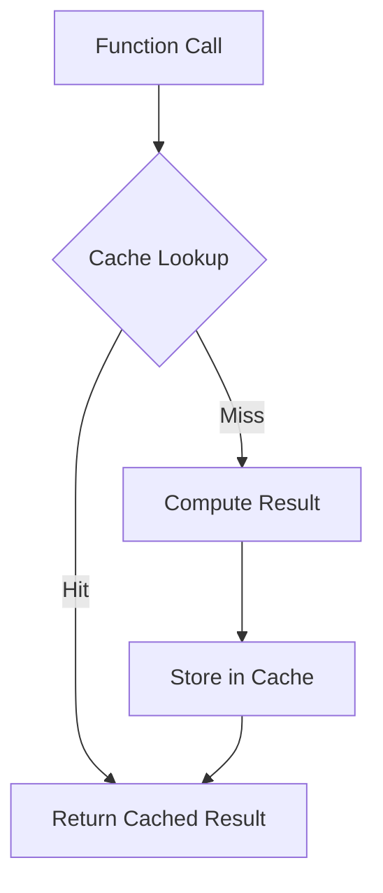

## 4.9 Function Memoization in Clojure

In the realm of functional programming, efficiency is often achieved through clever use of immutable data structures and pure functions. However, even with these tools, some computations can be resource-intensive and repetitive. This is where function memoization comes into play. In this section, we will delve into the concept of memoization, its implementation in Clojure, and how it can be leveraged to optimize performance by caching function results.

### Introduction to Memoization

Memoization is a technique used to improve the performance of functions by storing the results of expensive function calls and returning the cached result when the same inputs occur again. This is particularly beneficial for pure functions, where the output is consistent for the same input, ensuring that cached results remain valid.

### Detailed Explanation

Memoization works by maintaining a cache of previously computed results. When a memoized function is called, it first checks if the result for the given input is already in the cache. If it is, the cached result is returned immediately, bypassing the need for recomputation. If not, the function computes the result, stores it in the cache, and then returns it.

#### Key Components of Memoization

1. **Cache Storage:** A data structure to store input-output mappings.
2. **Cache Lookup:** A mechanism to check if the result for a given input is already cached.
3. **Cache Insertion:** A process to store new results in the cache after computation.

### Visualizing Memoization

To better understand memoization, consider the following conceptual diagram:



### Using Clojure's Built-in `memoize` Function

Clojure provides a straightforward way to memoize functions using the `memoize` function. This function wraps a given function with a caching layer, automatically handling cache storage and retrieval.

#### Example: Memoizing a Fibonacci Function

The Fibonacci sequence is a classic example where memoization can significantly reduce computation time.

```clojure
(def slow-fib
  (fn [n]
    (if (<= n 1)
      n
      (+ (slow-fib (- n 1))
         (slow-fib (- n 2))))))

(def fib (memoize slow-fib))

(fib 40) ; Computation is cached for each n
```

In this example, `slow-fib` is a naive recursive implementation of the Fibonacci sequence. By wrapping it with `memoize`, we create `fib`, a memoized version that caches results, drastically improving performance for large inputs.

### Custom Memoization with Cache Management

While Clojure's `memoize` is effective for many use cases, there are scenarios where custom caching strategies are necessary, such as when dealing with time-sensitive data or limited cache sizes.

#### Implementing a Custom Memoization Function with TTL

A Time-To-Live (TTL) cache invalidates entries after a specified duration, ensuring that stale data is not used.

```clojure
(defn memoize-with-ttl [f ttl]
  (let [cache (atom {})]
    (fn [& args]
      (let [now (System/currentTimeMillis)
            key args
            entry (@cache key)]
        (if (and entry (< (- now (:timestamp entry)) ttl))
          (:value entry)
          (let [result (apply f args)]
            (swap! cache assoc key {:value result :timestamp now})
            result))))))
```

In this implementation, `memoize-with-ttl` creates a memoized function with a TTL. The cache is stored in an atom, allowing for concurrent updates. Each cache entry includes a timestamp to determine its validity.

### Best Practices for Memoization

- **Purity:** Ensure the function is pure, meaning it has no side effects and returns consistent results for the same inputs. This guarantees that cached results remain valid.
- **Cache Invalidation:** Provide mechanisms to clear or invalidate the cache when necessary, especially for custom memoization solutions.
- **Memory Management:** Be mindful of memory usage, as excessive caching can lead to memory bloat. Consider using eviction policies or size limits for large caches.

### Use Cases for Memoization

Memoization is particularly useful in scenarios where:

- **Expensive Computations:** Functions involve costly operations, such as complex calculations or data processing.
- **Repetitive Calls:** The same function is called multiple times with the same inputs, common in recursive algorithms or iterative processes.
- **Predictable Inputs:** Inputs are predictable and limited, making it feasible to cache results without excessive memory consumption.

### Advantages and Disadvantages

#### Advantages

- **Performance Improvement:** Reduces redundant computations, leading to faster execution times.
- **Resource Efficiency:** Minimizes CPU usage by avoiding repeated calculations.

#### Disadvantages

- **Memory Overhead:** Caching results can increase memory usage, especially for functions with a large input space.
- **Stale Data:** Cached results may become outdated if the function's logic changes or if external dependencies affect the output.

### Conclusion

Function memoization in Clojure is a powerful tool for optimizing performance, particularly for pure functions with expensive computations. By leveraging Clojure's built-in `memoize` function or implementing custom caching strategies, developers can significantly enhance the efficiency of their applications. As with any optimization technique, it is essential to balance performance gains with memory usage and ensure that memoization is applied judiciously.

## Quiz Time!



### What is the primary purpose of function memoization?

- [x] To cache the results of function calls to avoid redundant computations
- [ ] To optimize memory usage by reducing data storage
- [ ] To enhance the readability of code by simplifying function definitions
- [ ] To ensure that functions are executed in parallel

> **Explanation:** Function memoization is primarily used to cache the results of function calls, thereby avoiding redundant computations and improving performance.

### Which Clojure function is used for simple memoization?

- [x] `memoize`
- [ ] `cache`
- [ ] `store`
- [ ] `remember`

> **Explanation:** Clojure provides the `memoize` function for simple memoization, which wraps a function with a caching layer.

### What is a key requirement for a function to be effectively memoized?

- [x] The function must be pure
- [ ] The function must be recursive
- [ ] The function must have side effects
- [ ] The function must return a collection

> **Explanation:** For effective memoization, a function must be pure, meaning it has no side effects and returns consistent results for the same inputs.

### What is a potential disadvantage of memoization?

- [x] Increased memory usage
- [ ] Slower execution times
- [ ] Reduced code readability
- [ ] Increased CPU usage

> **Explanation:** A potential disadvantage of memoization is increased memory usage due to caching results.

### How can you clear the cache of a memoized function in Clojure?

- [x] Reset the function
- [ ] Use the `clear-cache` function
- [ ] Call `memoize` again on the function
- [ ] Use the `invalidate` function

> **Explanation:** For built-in `memoize`, resetting the function is the simplest way to clear the cache.

### What does TTL stand for in the context of custom memoization?

- [x] Time-To-Live
- [ ] Total-Time-Logged
- [ ] Time-To-Load
- [ ] Total-Time-Lapsed

> **Explanation:** TTL stands for Time-To-Live, which is a cache invalidation strategy based on time duration.

### Why is it important to ensure a memoized function is pure?

- [x] To prevent caching inconsistent results
- [ ] To allow parallel execution
- [ ] To reduce memory usage
- [ ] To simplify function definitions

> **Explanation:** Ensuring a memoized function is pure prevents caching inconsistent results, maintaining the validity of cached data.

### What is a common use case for memoization?

- [x] Expensive computations
- [ ] Simple arithmetic operations
- [ ] String concatenation
- [ ] File I/O operations

> **Explanation:** Memoization is commonly used for expensive computations to avoid redundant processing.

### What is the effect of memoization on function execution time?

- [x] It reduces execution time for repeated calls
- [ ] It increases execution time for all calls
- [ ] It has no effect on execution time
- [ ] It only affects execution time for the first call

> **Explanation:** Memoization reduces execution time for repeated calls by returning cached results.

### True or False: Memoization is only beneficial for recursive functions.

- [ ] True
- [x] False

> **Explanation:** False. While memoization is beneficial for recursive functions, it can be applied to any function where caching results can improve performance.


