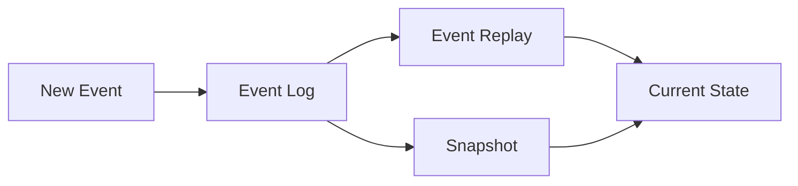

## 5.1 Event Sourcing in Clojure

Event Sourcing is a powerful design pattern that records all changes to the application state as a sequence of events. This approach not only provides a robust audit trail and the ability to perform temporal queries but also allows for the reconstruction of past states. In Clojure, Event Sourcing aligns seamlessly with the language's immutable data structures and emphasis on pure functions, making it an ideal choice for applications requiring precise state management and historical data analysis.

### Introduction

Event Sourcing captures every change to the state of an application as a distinct event. Instead of storing only the current state, it maintains a comprehensive log of all state transitions. This log can be used to reconstruct any past state, providing a complete history of changes. This pattern is particularly beneficial for applications that require auditability, such as financial systems, or those that need to support complex temporal queries.

### Detailed Explanation

#### Core Concepts of Event Sourcing

- **Event Log:** A central repository where all events are stored in the order they occurred. This log serves as the single source of truth for the application's state.
- **Event Replay:** The process of reconstructing the current state by replaying all events from the log.
- **Snapshots:** Periodic captures of the state to optimize the replay process by reducing the number of events that need to be processed.

#### Event Structures in Clojure

In Clojure, events can be represented using records, which provide a convenient way to define structured data. Here's how you can define events for an order processing system:

```clojure
(defrecord OrderPlaced [order-id items timestamp])
(defrecord OrderShipped [order-id shipping-info timestamp])
```

These records encapsulate the data associated with each event, such as the order ID, items, and timestamp.

#### Creating and Managing an Event Log

An event log can be implemented using an atom, which provides a thread-safe way to manage mutable state in Clojure:

```clojure
(def event-log (atom []))
```

To append events to the log, you can define a function that updates the atom:

```clojure
(defn record-event [event]
  (swap! event-log conj event))

(record-event (->OrderPlaced 12345 [{:item-id 1 :quantity 2}] (System/currentTimeMillis)))
```

This function uses `swap!` to atomically update the event log by adding new events.

#### Reconstructing State from Events

To derive the current state from the event log, you can define a function that applies each event to an initial state:

```clojure
(defn apply-event [state event]
  (cond
    (instance? OrderPlaced event)
    (assoc state (:order-id event) {:status :placed :items (:items event)})
    
    (instance? OrderShipped event)
    (update-in state [(:order-id event)] assoc :status :shipped :shipping-info (:shipping-info event))
    
    :else state))

(defn reconstruct-state [events]
  (reduce apply-event {} events))

(def current-state (reconstruct-state @event-log))
```

This approach uses `reduce` to apply each event in sequence, building up the current state from an initial empty map.

#### Querying Past States

One of the key benefits of Event Sourcing is the ability to query past states. You can implement a function to reconstruct the state at a specific point in time:

```clojure
(defn state-at [timestamp]
  (let [events (filter #(<= (:timestamp %) timestamp) @event-log)]
    (reconstruct-state events)))
```

This function filters the event log to include only events that occurred before the specified timestamp, then reconstructs the state from those events.

#### Implementing Snapshots for Optimization

To optimize state reconstruction, especially in systems with a large number of events, you can periodically save snapshots of the state:

- **Snapshot Creation:** Capture the state at regular intervals and store it alongside the event log.
- **State Reconstruction with Snapshots:** When reconstructing the state, start from the most recent snapshot and apply only the events that occurred after it.

### Visual Aids

#### Conceptual Diagram of Event Sourcing



> **Explanation:** This diagram illustrates the flow of events into the event log, the replay of events to reconstruct the current state, and the use of snapshots to optimize this process.

### Code Examples

Let's explore a practical example of Event Sourcing in Clojure, focusing on an order processing system:

```clojure
(defrecord OrderPlaced [order-id items timestamp])
(defrecord OrderShipped [order-id shipping-info timestamp])

(def event-log (atom []))

(defn record-event [event]
  (swap! event-log conj event))

(defn apply-event [state event]
  (cond
    (instance? OrderPlaced event)
    (assoc state (:order-id event) {:status :placed :items (:items event)})
    
    (instance? OrderShipped event)
    (update-in state [(:order-id event)] assoc :status :shipped :shipping-info (:shipping-info event))
    
    :else state))

(defn reconstruct-state [events]
  (reduce apply-event {} events))

(defn state-at [timestamp]
  (let [events (filter #(<= (:timestamp %) timestamp) @event-log)]
    (reconstruct-state events)))

;; Example usage
(record-event (->OrderPlaced 12345 [{:item-id 1 :quantity 2}] (System/currentTimeMillis)))
(record-event (->OrderShipped 12345 {:address "123 Main St"} (System/currentTimeMillis)))

(def current-state (reconstruct-state @event-log))
```

### Use Cases

Event Sourcing is particularly useful in scenarios where:

- **Auditability is Crucial:** Systems that require a detailed audit trail of all changes, such as financial applications.
- **Complex Temporal Queries:** Applications that need to query historical data or reconstruct past states.
- **Event-Driven Architectures:** Systems that benefit from decoupling state changes from the current state representation.

### Advantages and Disadvantages

#### Advantages

- **Complete Audit Trail:** Every change is recorded, providing a comprehensive history.
- **Temporal Flexibility:** Ability to reconstruct any past state or query historical data.
- **Alignment with Functional Programming:** Fits well with Clojure's immutable data structures and pure functions.

#### Disadvantages

- **Complexity:** Managing an ever-growing event log can be complex.
- **Performance Overhead:** Replaying events can be resource-intensive without optimization strategies like snapshots.

### Best Practices

- **Use Immutable Data Structures:** Leverage Clojure's strengths in immutability to ensure consistency and reliability.
- **Implement Snapshots:** Regularly capture snapshots to optimize state reconstruction.
- **Design for Scalability:** Consider the growth of the event log and plan for efficient storage and retrieval.

### Comparisons

Event Sourcing can be compared to traditional state management approaches, such as CRUD operations on a database. Unlike CRUD, which only maintains the current state, Event Sourcing provides a complete history of changes, enabling richer functionality at the cost of increased complexity.

### Conclusion

Event Sourcing in Clojure offers a powerful paradigm for managing state changes with precision and flexibility. By leveraging immutable data structures and pure functions, it provides a robust foundation for applications that require detailed audit trails and complex temporal queries. As you explore Event Sourcing, consider the trade-offs and best practices to effectively harness its capabilities in your Clojure projects.

## Quiz Time!



### What is the primary benefit of Event Sourcing?

- [x] It provides a complete audit trail of all state changes.
- [ ] It simplifies the application architecture.
- [ ] It reduces the need for database storage.
- [ ] It eliminates the need for testing.

> **Explanation:** Event Sourcing records every change to the application state, providing a comprehensive audit trail.

### How does Event Sourcing align with Clojure's principles?

- [x] It leverages immutable data structures and pure functions.
- [ ] It relies on mutable state for efficiency.
- [ ] It uses side effects to manage state changes.
- [ ] It requires complex object-oriented designs.

> **Explanation:** Clojure's emphasis on immutability and pure functions aligns well with the principles of Event Sourcing.

### What is a snapshot in the context of Event Sourcing?

- [x] A periodic capture of the state to optimize event replay.
- [ ] A backup of the entire event log.
- [ ] A visualization of the event flow.
- [ ] A temporary storage of events.

> **Explanation:** Snapshots are used to capture the state at intervals, reducing the number of events needed for state reconstruction.

### Which Clojure construct is used to manage the event log?

- [x] Atom
- [ ] Ref
- [ ] Agent
- [ ] Var

> **Explanation:** An atom is used to manage the event log, providing a thread-safe way to handle mutable state.

### What is the purpose of the `apply-event` function?

- [x] To update the state based on a given event.
- [ ] To delete events from the log.
- [ ] To visualize the event flow.
- [ ] To create new events.

> **Explanation:** The `apply-event` function updates the state by applying each event in sequence.

### How can past states be queried in an Event Sourcing system?

- [x] By filtering events up to a specific timestamp and reconstructing the state.
- [ ] By directly accessing the current state.
- [ ] By deleting older events.
- [ ] By using a separate database for past states.

> **Explanation:** Past states can be queried by filtering events up to a given timestamp and reconstructing the state from those events.

### What is a potential disadvantage of Event Sourcing?

- [x] Complexity in managing an ever-growing event log.
- [ ] Lack of auditability.
- [ ] Inability to query past states.
- [ ] Dependence on mutable state.

> **Explanation:** Managing a growing event log can be complex and resource-intensive.

### What is the role of `record-event` in the example?

- [x] To append new events to the event log.
- [ ] To delete events from the log.
- [ ] To visualize the event flow.
- [ ] To create snapshots.

> **Explanation:** The `record-event` function appends new events to the event log.

### Which of the following is NOT a benefit of Event Sourcing?

- [ ] Complete audit trail
- [ ] Temporal flexibility
- [x] Simplified architecture
- [ ] Alignment with functional programming

> **Explanation:** While Event Sourcing provides many benefits, it can add complexity to the architecture.

### True or False: Event Sourcing eliminates the need for testing.

- [ ] True
- [x] False

> **Explanation:** Event Sourcing does not eliminate the need for testing; it requires thorough testing to ensure the correctness of event handling and state reconstruction.


