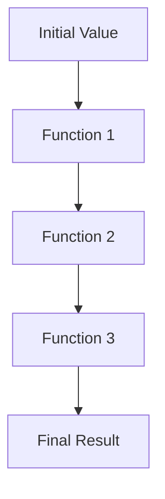

## 5.1. The Threading Macros: `->` and `->>`

In the world of Clojure, threading macros `->` (thread-first) and `->>` (thread-last) are indispensable tools for enhancing code readability and maintainability. These macros allow developers to transform deeply nested function calls into a linear sequence of operations, making the code easier to understand and work with. In this section, we will explore the purpose and usage of these threading macros, illustrate their application with examples, and discuss best practices and common pitfalls.

### Understanding Threading Macros

Threading macros are syntactic constructs in Clojure that help in organizing code by threading an initial value through a series of transformations. They are particularly useful in functional programming, where functions are often composed together to process data. The threading macros `->` and `->>` simplify this process by allowing you to express the sequence of transformations in a clear and linear manner.

#### The Purpose of Threading Macros

The primary purpose of threading macros is to improve code readability by reducing the complexity of nested function calls. In functional programming, it's common to apply multiple functions to a piece of data, often resulting in deeply nested expressions. Threading macros help flatten these expressions, making the flow of data transformations more apparent.

Consider the following example of nested function calls:

```clojure
(defn process-data [data]
  (filter even?
    (map inc
      (reduce + 0 data))))
```

This code is functional but can be difficult to read due to the nesting. By using threading macros, we can transform this into a more readable form:

```clojure
(defn process-data [data]
  (->> data
       (reduce + 0)
       (map inc)
       (filter even?)))
```

### The `->` Macro: Thread-First

The `->` macro, also known as the thread-first macro, is used when the initial value should be passed as the first argument to each function in the sequence. It is particularly useful when dealing with functions that expect their primary input as the first parameter.

#### How `->` Works

The `->` macro takes an initial expression and threads it through a series of forms. Each form is a function call where the result of the previous expression is inserted as the first argument. This is particularly useful for functions that are designed to take their main input as the first parameter.

Here's a simple example:

```clojure
(-> 5
    (+ 3)
    (* 2)
    (- 4))
```

This expression is equivalent to:

```clojure
(- (* (+ 5 3) 2) 4)
```

#### Practical Example of `->`

Let's consider a practical example where we need to process a map of user data:

```clojure
(def user {:name "Alice" :age 30 :email "alice@example.com"})

(defn process-user [user]
  (-> user
      (assoc :age (+ (:age user) 1))
      (update :name str " Smith")
      (dissoc :email)))

(process-user user)
```

In this example, we start with a user map and apply a series of transformations: incrementing the age, appending a surname to the name, and removing the email. The `->` macro makes it easy to follow the sequence of transformations.

### The `->>` Macro: Thread-Last

The `->>` macro, or thread-last macro, is used when the initial value should be passed as the last argument to each function in the sequence. This is often the case with functions that operate on collections, where the collection is typically the last argument.

#### How `->>` Works

The `->>` macro threads the initial expression through a series of forms, inserting it as the last argument in each function call. This is particularly useful for functions that expect their primary input as the last parameter.

Here's a simple example:

```clojure
(->> [1 2 3 4]
     (map inc)
     (filter even?)
     (reduce +))
```

This expression is equivalent to:

```clojure
(reduce + (filter even? (map inc [1 2 3 4])))
```

#### Practical Example of `->>`

Consider a scenario where we need to process a list of numbers:

```clojure
(def numbers [1 2 3 4 5 6])

(defn process-numbers [numbers]
  (->> numbers
       (map inc)
       (filter odd?)
       (reduce +)))

(process-numbers numbers)
```

In this example, we start with a list of numbers and apply a series of transformations: incrementing each number, filtering out even numbers, and summing the remaining odd numbers. The `->>` macro makes the sequence of operations clear and concise.

### Choosing Between `->` and `->>`

The choice between `->` and `->>` depends on the position of the argument in the functions you are working with. Use `->` when the initial value should be the first argument, and `->>` when it should be the last argument. This decision is often guided by the nature of the functions involved in the transformation.

#### When to Use `->`

- Use `->` when working with functions that expect their main input as the first parameter.
- Ideal for transforming maps or when chaining functions that modify a single data structure.

#### When to Use `->>`

- Use `->>` when working with functions that expect their main input as the last parameter.
- Ideal for processing sequences or collections, where the collection is often the last argument.

### Best Practices for Using Threading Macros

- **Maintain Readability**: Use threading macros to enhance readability, not obscure it. Avoid overly complex chains that become difficult to follow.
- **Limit Side Effects**: Threading macros work best with pure functions. Avoid using them with functions that have significant side effects.
- **Consistent Use**: Stick to a consistent style when using threading macros to make your codebase easier to understand.
- **Avoid Overuse**: While threading macros are powerful, they should not be overused. Sometimes, breaking down transformations into smaller, named functions can improve clarity.

### Common Pitfalls to Avoid

- **Incorrect Argument Position**: Ensure that the initial value is correctly positioned in each function call. Misplacing the argument can lead to runtime errors.
- **Complex Chains**: Avoid creating overly complex chains of transformations. If a sequence becomes difficult to understand, consider breaking it into smaller functions.
- **Mixing `->` and `->>`**: Be cautious when mixing `->` and `->>` in the same transformation sequence, as it can lead to confusion.

### Try It Yourself

To get a better understanding of threading macros, try modifying the examples provided. Experiment with different functions and see how the threading macros affect the readability and functionality of your code. Consider creating your own data transformations and see how threading macros can simplify the process.

### Visualizing Threading Macros

To better understand how threading macros work, let's visualize the transformation process using a flowchart. This diagram represents the flow of data through a series of transformations using the `->` macro.



In this flowchart, the initial value is passed through a series of functions, each transforming the data in some way, until the final result is obtained.

### References and Further Reading

- [Clojure Documentation on Threading Macros](https://clojure.org/guides/threading_macros)
- [Functional Programming in Clojure](https://www.braveclojure.com/)
- [Clojure for the Brave and True](https://www.braveclojure.com/)

### Ready to Test Your Knowledge?



### What is the primary purpose of threading macros in Clojure?

- [x] To improve code readability by reducing the complexity of nested function calls.
- [ ] To increase the execution speed of Clojure programs.
- [ ] To provide a way to handle exceptions in Clojure.
- [ ] To enable parallel processing of data.

> **Explanation:** Threading macros are designed to enhance code readability by transforming nested function calls into a linear sequence of operations.

### Which threading macro should you use when the initial value should be the first argument in each function call?

- [x] `->`
- [ ] `->>`
- [ ] `->>`
- [ ] `->`

> **Explanation:** The `->` macro is used when the initial value should be passed as the first argument to each function in the sequence.

### Which threading macro is ideal for processing sequences or collections?

- [ ] `->`
- [x] `->>`
- [ ] `->`
- [ ] `->`

> **Explanation:** The `->>` macro is ideal for processing sequences or collections, where the collection is often the last argument.

### What is a common pitfall when using threading macros?

- [x] Incorrect argument position in function calls.
- [ ] Using threading macros with pure functions.
- [ ] Limiting the use of side effects.
- [ ] Maintaining code readability.

> **Explanation:** A common pitfall is incorrectly positioning the argument in function calls, which can lead to runtime errors.

### When should you avoid using threading macros?

- [x] When the sequence of transformations becomes overly complex.
- [ ] When working with pure functions.
- [ ] When processing collections.
- [ ] When transforming maps.

> **Explanation:** Avoid using threading macros when the sequence of transformations becomes overly complex, as it can reduce readability.

### What is the equivalent of `(-> 5 (+ 3) (* 2) (- 4))`?

- [x] `(- (* (+ 5 3) 2) 4)`
- [ ] `(+ (* (- 5 3) 2) 4)`
- [ ] `(* (+ (- 5 3) 2) 4)`
- [ ] `(+ (- (* 5 3) 2) 4)`

> **Explanation:** The expression `(- (* (+ 5 3) 2) 4)` is equivalent to the threaded expression using `->`.

### What is the main advantage of using threading macros?

- [x] They enhance code readability by linearizing nested function calls.
- [ ] They increase the performance of Clojure programs.
- [ ] They simplify error handling in Clojure.
- [ ] They enable concurrent execution of functions.

> **Explanation:** The main advantage of threading macros is that they enhance code readability by transforming nested function calls into a linear sequence.

### Which macro is used for threading the initial value as the last argument?

- [ ] `->`
- [x] `->>`
- [ ] `->`
- [ ] `->`

> **Explanation:** The `->>` macro is used for threading the initial value as the last argument in each function call.

### What should you do if a threading macro sequence becomes difficult to understand?

- [x] Break it into smaller, named functions.
- [ ] Add more functions to the sequence.
- [ ] Use a different programming language.
- [ ] Remove all comments from the code.

> **Explanation:** If a threading macro sequence becomes difficult to understand, consider breaking it into smaller, named functions to improve clarity.

### True or False: Threading macros can be used with functions that have side effects.

- [x] True
- [ ] False

> **Explanation:** While threading macros can technically be used with functions that have side effects, it is best to limit their use to pure functions for clarity and maintainability.



Remember, this is just the beginning. As you progress, you'll build more complex and interactive applications using Clojure's powerful features. Keep experimenting, stay curious, and enjoy the journey!
