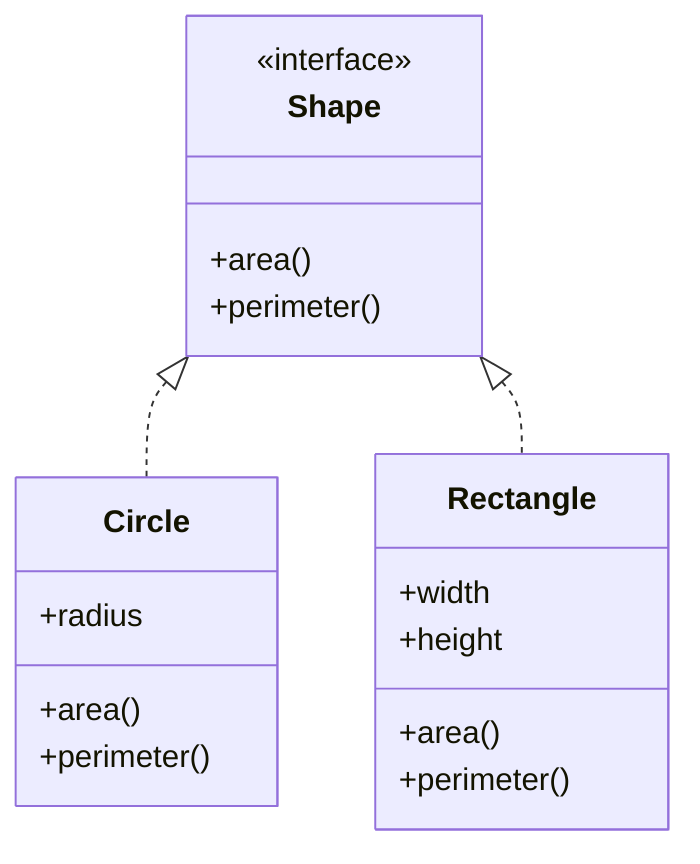

## 5.10. The Use of Protocols for Polymorphism

In the realm of functional programming, Clojure stands out with its unique approach to polymorphism through the use of protocols. Protocols in Clojure provide a powerful mechanism for defining shared interfaces that can be implemented by different data types, offering a flexible alternative to traditional object-oriented inheritance. This section delves into the concept of protocols, their role in Clojure, and how they enable polymorphic behavior.

### Understanding Protocols in Clojure

#### What Are Protocols?

Protocols in Clojure are a way to define a set of functions that can be implemented by different types. They serve as a contract that specifies what functions a type must implement to conform to the protocol. Unlike classes in object-oriented languages, protocols do not dictate how the functions should be implemented, allowing for greater flexibility and abstraction.

#### The Role of Protocols

Protocols play a crucial role in Clojure by providing a means to achieve polymorphism. They allow different data types to implement the same set of functions, enabling code to operate on different types in a uniform way. This is particularly useful in scenarios where you want to define a common interface for disparate types without resorting to inheritance hierarchies.

### Defining and Implementing Protocols

#### Defining a Protocol

To define a protocol in Clojure, you use the `defprotocol` macro. This macro allows you to specify a set of functions that constitute the protocol.

```clojure
(defprotocol Shape
  "A protocol for geometric shapes."
  (area [this] "Calculate the area of the shape.")
  (perimeter [this] "Calculate the perimeter of the shape."))
```

In this example, we define a `Shape` protocol with two functions: `area` and `perimeter`. Any type that implements this protocol must provide implementations for these functions.

#### Implementing a Protocol

To implement a protocol for a specific type, you use the `extend-type` macro. This macro associates the protocol with a type and provides the implementations for the protocol's functions.

```clojure
(defrecord Circle [radius])

(extend-type Circle
  Shape
  (area [this]
    (* Math/PI (* (:radius this) (:radius this))))
  (perimeter [this]
    (* 2 Math/PI (:radius this))))
```

Here, we implement the `Shape` protocol for a `Circle` type. The `area` function calculates the area of the circle, while the `perimeter` function calculates its perimeter.

#### Implementing Protocols for Built-in Types

Clojure also allows you to implement protocols for built-in types using the `extend` function. This is useful when you want to extend the behavior of existing types without modifying their source code.

```clojure
(extend-type java.lang.String
  Shape
  (area [this]
    (count this))  ; Treats the length of the string as its "area"
  (perimeter [this]
    (* 2 (count this))))  ; Arbitrary example for demonstration
```

### Benefits of Using Protocols

#### Flexibility and Abstraction

Protocols provide a high degree of flexibility and abstraction. They allow you to define a common interface without dictating how it should be implemented. This decouples the interface from the implementation, enabling you to change the implementation without affecting the code that depends on the protocol.

#### Avoiding Inheritance Hierarchies

In traditional object-oriented programming, polymorphism is often achieved through inheritance hierarchies. However, this can lead to rigid and complex class structures. Protocols offer a more flexible alternative by allowing types to implement multiple protocols without being tied to a specific inheritance chain.

#### Enhanced Code Reusability

By defining common interfaces through protocols, you can write code that operates on any type that implements the protocol. This enhances code reusability and reduces duplication, as the same code can work with different types.

### Demonstrating Polymorphic Behavior

Let's explore a practical example to demonstrate the polymorphic behavior enabled by protocols.

```clojure
(defrecord Rectangle [width height])

(extend-type Rectangle
  Shape
  (area [this]
    (* (:width this) (:height this)))
  (perimeter [this]
    (* 2 (+ (:width this) (:height this)))))

(defn describe-shape [shape]
  (println "Area:" (area shape))
  (println "Perimeter:" (perimeter shape)))

(let [circle (->Circle 5)
      rectangle (->Rectangle 4 6)]
  (describe-shape circle)
  (describe-shape rectangle))
```

In this example, we define a `Rectangle` type and implement the `Shape` protocol for it. The `describe-shape` function takes any shape that implements the `Shape` protocol and prints its area and perimeter. This function can operate on both `Circle` and `Rectangle` types, demonstrating polymorphic behavior.

### Best Practices for Designing and Using Protocols

#### Keep Protocols Focused

When designing protocols, keep them focused on a specific set of related functions. Avoid creating monolithic protocols with too many functions, as this can lead to complex and unwieldy implementations.

#### Use Protocols for Abstraction

Use protocols to abstract away implementation details and expose a clean, consistent interface. This makes your code more modular and easier to maintain.

#### Leverage Protocols for Extensibility

Protocols are a powerful tool for extending the behavior of existing types. Use them to add new functionality to types without modifying their source code, enhancing the extensibility of your codebase.

#### Avoid Overusing Protocols

While protocols are a powerful feature, avoid overusing them. Not every set of functions needs to be encapsulated in a protocol. Use protocols judiciously to avoid unnecessary complexity.

### Visualizing Protocols and Polymorphism

To better understand how protocols enable polymorphism, let's visualize the relationship between protocols and types using a class diagram.



In this diagram, the `Shape` protocol is represented as an interface with `area` and `perimeter` functions. The `Circle` and `Rectangle` types implement this protocol, providing their own implementations of these functions.

### Try It Yourself

Now that we've explored the concept of protocols and their role in enabling polymorphism, it's time to experiment with the code. Try modifying the `Shape` protocol to include a new function, such as `describe`, that returns a string description of the shape. Implement this function for both `Circle` and `Rectangle` types and update the `describe-shape` function to use it.

### References and Further Reading

- [Clojure Official Documentation on Protocols](https://clojure.org/reference/protocols)
- [Clojure for the Brave and True: Protocols](https://www.braveclojure.com/core-functions-in-depth/)
- [Clojure Design Patterns](https://www.oreilly.com/library/view/clojure-design-patterns/9781785889732/)

### Knowledge Check

To reinforce your understanding of protocols and polymorphism in Clojure, let's test your knowledge with a quiz.

## **Ready to Test Your Knowledge?**



### What is the primary purpose of protocols in Clojure?

- [x] To define a set of functions that can be implemented by different types
- [ ] To enforce strict type checking
- [ ] To replace inheritance hierarchies with classes
- [ ] To provide a mechanism for error handling

> **Explanation:** Protocols in Clojure are used to define a set of functions that can be implemented by different types, enabling polymorphism.

### How do you define a protocol in Clojure?

- [x] Using the `defprotocol` macro
- [ ] Using the `definterface` macro
- [ ] Using the `defclass` macro
- [ ] Using the `defmethod` macro

> **Explanation:** Protocols are defined using the `defprotocol` macro in Clojure.

### Which macro is used to implement a protocol for a specific type?

- [x] `extend-type`
- [ ] `extend-protocol`
- [ ] `implement-type`
- [ ] `defmethod`

> **Explanation:** The `extend-type` macro is used to implement a protocol for a specific type in Clojure.

### What is a key benefit of using protocols over traditional inheritance?

- [x] Flexibility and abstraction without rigid class hierarchies
- [ ] Stronger type enforcement
- [ ] Easier debugging
- [ ] Faster execution speed

> **Explanation:** Protocols provide flexibility and abstraction without the need for rigid class hierarchies, unlike traditional inheritance.

### Can protocols be implemented for built-in types in Clojure?

- [x] Yes
- [ ] No

> **Explanation:** Protocols can be implemented for built-in types using the `extend` function in Clojure.

### What is a best practice when designing protocols?

- [x] Keep protocols focused on a specific set of related functions
- [ ] Include as many functions as possible for flexibility
- [ ] Avoid using protocols for abstraction
- [ ] Use protocols only for built-in types

> **Explanation:** It's best to keep protocols focused on a specific set of related functions to maintain simplicity and clarity.

### What does the `area` function in the `Shape` protocol represent?

- [x] A function to calculate the area of a shape
- [ ] A function to calculate the volume of a shape
- [ ] A function to calculate the density of a shape
- [ ] A function to calculate the weight of a shape

> **Explanation:** The `area` function in the `Shape` protocol is designed to calculate the area of a shape.

### How can you extend the behavior of existing types using protocols?

- [x] By implementing protocols for them using the `extend` function
- [ ] By modifying their source code
- [ ] By creating subclasses
- [ ] By using inheritance

> **Explanation:** You can extend the behavior of existing types by implementing protocols for them using the `extend` function.

### What is the output of the `describe-shape` function when called with a `Circle` of radius 5?

- [x] Area: 78.53981633974483, Perimeter: 31.41592653589793
- [ ] Area: 25, Perimeter: 10
- [ ] Area: 50, Perimeter: 20
- [ ] Area: 100, Perimeter: 40

> **Explanation:** The `describe-shape` function calculates the area and perimeter of a `Circle` with radius 5, resulting in the given values.

### True or False: Protocols in Clojure can only be used with custom types.

- [ ] True
- [x] False

> **Explanation:** Protocols in Clojure can be used with both custom and built-in types.



Remember, mastering protocols is a journey. As you continue to explore Clojure, you'll find that protocols offer a powerful way to achieve polymorphism and abstraction, enabling you to write more flexible and maintainable code. Keep experimenting, stay curious, and enjoy the journey!
