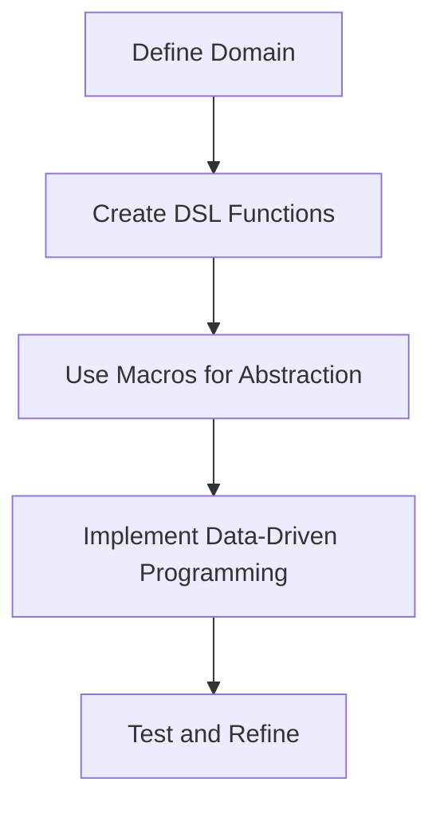

## 5.11. Constructing DSLs (Domain-Specific Languages)

### Introduction to DSLs

Domain-Specific Languages (DSLs) are specialized mini-languages designed to solve problems within a specific domain. Unlike general-purpose programming languages, DSLs offer a higher level of abstraction, allowing developers to express solutions in terms that are closer to the problem domain. This can lead to more readable, maintainable, and efficient code.

#### Advantages of DSLs

1. **Expressiveness**: DSLs allow developers to write code that closely resembles the domain language, making it easier to understand and maintain.
2. **Abstraction**: By abstracting complex logic, DSLs can simplify code and reduce the likelihood of errors.
3. **Productivity**: DSLs can speed up development by providing domain-specific constructs that eliminate boilerplate code.
4. **Collaboration**: DSLs can bridge the gap between developers and domain experts, facilitating better communication and collaboration.

### Clojure's Strengths in DSL Construction

Clojure is particularly well-suited for creating internal DSLs due to its Lisp heritage, which provides a flexible syntax and powerful macro system. These features enable developers to extend the language and create expressive DSLs that integrate seamlessly with Clojure code.

#### Key Features of Clojure for DSLs

- **Homoiconicity**: Clojure code is represented as data structures, making it easy to manipulate and transform code.
- **Macros**: Clojure's macro system allows developers to create new syntactic constructs and extend the language.
- **Functional Paradigm**: Clojure's emphasis on immutability and pure functions supports the creation of reliable and predictable DSLs.
- **Interoperability**: Clojure's seamless integration with the JVM allows DSLs to leverage existing Java libraries and tools.

### Building a Simple DSL in Clojure

Let's explore how to construct a simple DSL in Clojure. We'll create a DSL for defining and manipulating shapes, such as circles and rectangles.

#### Step 1: Define the Domain

First, we need to define the domain concepts. In this case, we'll focus on shapes and their properties.

```clojure
(defn circle [radius]
  {:type :circle
   :radius radius})

(defn rectangle [width height]
  {:type :rectangle
   :width width
   :height height})
```

#### Step 2: Create DSL Functions

Next, we'll create functions that operate on these shapes. These functions will form the core of our DSL.

```clojure
(defn area [shape]
  (case (:type shape)
    :circle (* Math/PI (Math/pow (:radius shape) 2))
    :rectangle (* (:width shape) (:height shape))))

(defn perimeter [shape]
  (case (:type shape)
    :circle (* 2 Math/PI (:radius shape))
    :rectangle (* 2 (+ (:width shape) (:height shape)))))
```

#### Step 3: Use Macros for Abstraction

We can use macros to create more expressive constructs in our DSL. For example, let's create a macro to define shapes with a more natural syntax.

```clojure
(defmacro defshape [name type & args]
  `(def ~name (~type ~@args)))

(defshape my-circle circle 5)
(defshape my-rectangle rectangle 4 6)

(println "Area of my-circle:" (area my-circle))
(println "Perimeter of my-rectangle:" (perimeter my-rectangle))
```

### Real-World Scenarios for DSLs

DSLs are particularly useful in domains where complex logic needs to be expressed concisely and clearly. Here are some real-world scenarios where DSLs can be beneficial:

1. **Configuration Management**: DSLs can simplify the configuration of complex systems by providing a clear and concise syntax.
2. **Data Transformation**: DSLs can express data transformation pipelines in a readable and maintainable way.
3. **Testing**: DSLs can define test cases in a way that is easy to understand and modify.
4. **Financial Modeling**: DSLs can model complex financial calculations and rules in a domain-specific language.

### Guidelines for Designing DSLs

When designing a DSL, it's important to focus on readability and maintainability. Here are some guidelines to consider:

1. **Keep It Simple**: Avoid adding unnecessary complexity to the DSL. Focus on the core concepts of the domain.
2. **Use Consistent Naming**: Choose names that are intuitive and consistent with the domain language.
3. **Provide Clear Documentation**: Document the DSL's syntax and semantics to help users understand how to use it effectively.
4. **Test Thoroughly**: Ensure that the DSL is robust and reliable by writing comprehensive tests.
5. **Iterate and Refine**: Continuously improve the DSL based on feedback from users.

### Data-Driven Programming in DSLs

Clojure's data-driven programming model is a powerful tool for building DSLs. By representing DSL constructs as data, we can easily manipulate and transform them.

#### Example: Data-Driven DSL for Workflow Automation

Let's create a simple DSL for defining workflows using data-driven programming.

```clojure
(def workflow
  [{:task :fetch-data :params {:url "http://example.com/data"}}
   {:task :process-data :params {:algorithm :average}}
   {:task :store-data :params {:location "/tmp/output"}}])

(defn execute-task [task]
  (case (:task task)
    :fetch-data (println "Fetching data from" (:url (:params task)))
    :process-data (println "Processing data with" (:algorithm (:params task)))
    :store-data (println "Storing data at" (:location (:params task)))))

(defn execute-workflow [workflow]
  (doseq [task workflow]
    (execute-task task)))

(execute-workflow workflow)
```

### Visualizing DSL Construction

To better understand how DSLs are constructed in Clojure, let's visualize the process using a flowchart.



### Conclusion

Constructing DSLs in Clojure is a powerful way to create expressive and maintainable code that closely mirrors the problem domain. By leveraging Clojure's syntax, macros, and data-driven programming model, developers can build DSLs that enhance productivity and collaboration.

### Try It Yourself

Experiment with the examples provided in this section. Try modifying the shape DSL to include new shapes or operations. Consider creating a DSL for a domain you're familiar with, such as a simple task management system or a configuration language.

### References and Further Reading

- [Clojure Macros](https://clojure.org/reference/macros)
- [Domain-Specific Languages](https://martinfowler.com/books/dsl.html)
- [Data-Driven Programming](https://en.wikipedia.org/wiki/Data-driven_programming)

## **Ready to Test Your Knowledge?**



### What is a Domain-Specific Language (DSL)?

- [x] A specialized language designed to solve problems within a specific domain.
- [ ] A general-purpose programming language.
- [ ] A type of database query language.
- [ ] A language used for web development.

> **Explanation:** A DSL is a specialized language designed to solve problems within a specific domain, offering higher abstraction and expressiveness.

### Why is Clojure well-suited for creating DSLs?

- [x] Because of its flexible syntax and powerful macro system.
- [ ] Because it is a compiled language.
- [ ] Because it has a large standard library.
- [ ] Because it supports object-oriented programming.

> **Explanation:** Clojure's flexible syntax and powerful macro system make it ideal for creating expressive DSLs.

### What is the primary benefit of using macros in DSLs?

- [x] They allow developers to create new syntactic constructs.
- [ ] They improve the performance of the code.
- [ ] They simplify error handling.
- [ ] They provide built-in security features.

> **Explanation:** Macros allow developers to create new syntactic constructs, extending the language to better fit the domain.

### Which of the following is a real-world scenario where DSLs are beneficial?

- [x] Configuration Management
- [ ] Low-level hardware programming
- [ ] Writing operating systems
- [ ] Developing video games

> **Explanation:** DSLs are beneficial in domains like configuration management, where complex logic needs to be expressed concisely.

### What is the key feature of Clojure that supports data-driven programming?

- [x] Homoiconicity
- [ ] Static typing
- [ ] Object-oriented design
- [ ] Built-in concurrency

> **Explanation:** Homoiconicity, where code is represented as data structures, supports data-driven programming in Clojure.

### What is the purpose of the `defshape` macro in the example?

- [x] To define shapes with a more natural syntax.
- [ ] To calculate the area of shapes.
- [ ] To store shapes in a database.
- [ ] To render shapes on a screen.

> **Explanation:** The `defshape` macro is used to define shapes with a more natural syntax, enhancing the DSL's expressiveness.

### How can DSLs improve collaboration between developers and domain experts?

- [x] By providing a language that closely resembles the domain language.
- [ ] By enforcing strict coding standards.
- [ ] By reducing the need for documentation.
- [ ] By automating code reviews.

> **Explanation:** DSLs improve collaboration by providing a language that closely resembles the domain language, making it easier for domain experts to understand and contribute.

### What is a guideline for designing readable and maintainable DSLs?

- [x] Keep it simple and focus on core concepts.
- [ ] Use complex syntax to impress users.
- [ ] Avoid documentation to keep the DSL concise.
- [ ] Prioritize performance over readability.

> **Explanation:** Keeping the DSL simple and focusing on core concepts ensures readability and maintainability.

### What does the `execute-task` function do in the workflow DSL example?

- [x] It executes a task based on its type and parameters.
- [ ] It defines a new task in the workflow.
- [ ] It stores the task results in a database.
- [ ] It visualizes the workflow as a diagram.

> **Explanation:** The `execute-task` function executes a task based on its type and parameters, forming the core of the workflow DSL.

### True or False: Clojure's interoperability with the JVM is a disadvantage when creating DSLs.

- [ ] True
- [x] False

> **Explanation:** Clojure's interoperability with the JVM is an advantage, allowing DSLs to leverage existing Java libraries and tools.



Remember, this is just the beginning. As you progress, you'll build more complex and interactive DSLs. Keep experimenting, stay curious, and enjoy the journey!


