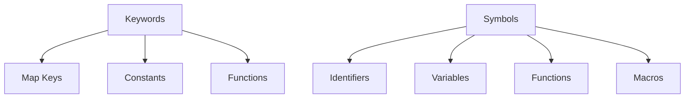

## 5.13. The Use of Keywords and Symbols

In Clojure, keywords and symbols are fundamental constructs that play crucial roles in the language's syntax and semantics. Understanding their differences and uses is essential for writing idiomatic and efficient Clojure code. This section delves into the nature of keywords and symbols, their unique properties, and how they are employed in various programming scenarios.

### Understanding Keywords and Symbols

#### Keywords

Keywords in Clojure are immutable, interned strings that are prefixed with a colon (`:`). They are often used as constants, map keys, and to represent fixed values. Keywords are unique in that they evaluate to themselves, making them ideal for use in situations where identity and immutability are important.

**Example of Keywords:**

```clojure
;; Defining keywords
:username
:password
:status
```

**Characteristics of Keywords:**

- **Immutability**: Keywords are immutable, meaning their value cannot change once defined.
- **Self-evaluating**: Keywords evaluate to themselves, which simplifies their use in code.
- **Interned**: Keywords are interned, ensuring that the same keyword is represented by the same object in memory, which can improve performance.

#### Symbols

Symbols in Clojure are used to represent identifiers. They are typically used to name variables, functions, and other entities in code. Unlike keywords, symbols do not evaluate to themselves; instead, they are resolved to the value they represent in the current context.

**Example of Symbols:**

```clojure
;; Defining symbols
(def x 10)
(defn my-function [a b] (+ a b))
```

**Characteristics of Symbols:**

- **Identifiers**: Symbols are used to name and reference variables, functions, and other entities.
- **Context-dependent**: The meaning of a symbol depends on the context in which it is used.
- **Non-self-evaluating**: Symbols do not evaluate to themselves; they are resolved to the value they represent.

### Using Keywords and Symbols in Clojure

#### Keywords as Map Keys

One of the most common uses of keywords in Clojure is as keys in maps. This is due to their immutability, self-evaluation, and efficient comparison.

**Example of Keywords as Map Keys:**

```clojure
;; Using keywords as map keys
(def user {:username "john_doe" :password "secret" :status :active})

;; Accessing values using keywords
(println (:username user)) ;; Output: john_doe
(println (:status user))   ;; Output: active
```

#### Keywords as Functions

In Clojure, keywords can also be used as functions. When a keyword is used as a function, it takes a map as an argument and returns the value associated with that keyword in the map.

**Example of Keywords as Functions:**

```clojure
;; Keywords as functions
(def user {:username "john_doe" :password "secret" :status :active})

;; Using keywords as functions to access map values
(println (:username user)) ;; Output: john_doe
(println (:status user))   ;; Output: active
```

#### Symbols as Identifiers

Symbols are primarily used to name variables and functions. They are essential for defining and referencing entities in Clojure code.

**Example of Symbols as Identifiers:**

```clojure
;; Defining a symbol for a variable
(def x 42)

;; Defining a symbol for a function
(defn greet [name]
  (str "Hello, " name "!"))

;; Using symbols to reference the variable and function
(println x)            ;; Output: 42
(println (greet "Alice")) ;; Output: Hello, Alice!
```

### Immutability and Uniqueness of Keywords

Keywords are immutable and unique, meaning they cannot be changed once created and the same keyword is represented by the same object in memory. This immutability and uniqueness make keywords ideal for use as constants and map keys, where consistent identity is crucial.

**Example of Keyword Uniqueness:**

```clojure
;; Keywords are unique and immutable
(def k1 :status)
(def k2 :status)

;; Checking if both keywords are the same object
(println (identical? k1 k2)) ;; Output: true
```

### Symbols in Macros

Symbols play a critical role in Clojure macros, where they are used to manipulate code as data. Macros allow for powerful metaprogramming capabilities, enabling developers to extend the language and create domain-specific languages (DSLs).

**Example of Symbols in Macros:**

```clojure
;; Defining a simple macro using symbols
(defmacro unless [condition & body]
  `(if (not ~condition)
     (do ~@body)))

;; Using the macro
(unless false
  (println "This will be printed"))
```

### Common Patterns and Best Practices

#### Use Keywords for Constants and Map Keys

Keywords are ideal for representing constants and map keys due to their immutability and self-evaluation. They provide a clear and efficient way to access values in maps.

#### Use Symbols for Identifiers

Symbols should be used to name and reference variables, functions, and other entities. They provide a flexible way to define and manipulate code.

#### Leverage Keywords as Functions

Take advantage of the ability to use keywords as functions to simplify code and improve readability when accessing map values.

#### Be Mindful of Symbol Resolution

When using symbols, be aware of the context in which they are resolved. Ensure that symbols are defined and used consistently to avoid errors.

### Visualizing Keywords and Symbols

To better understand the relationship between keywords, symbols, and their roles in Clojure, let's visualize their usage in a simple diagram.



**Diagram Description:** This diagram illustrates the roles of keywords and symbols in Clojure. Keywords are used as map keys, constants, and functions, while symbols are used as identifiers for variables, functions, and macros.

### Try It Yourself

Experiment with the following code examples to deepen your understanding of keywords and symbols in Clojure. Try modifying the examples to see how changes affect the behavior of the code.

```clojure
;; Experiment with keywords as map keys
(def book {:title "Clojure for the Brave and True" :author "Daniel Higginbotham" :year 2015})

;; Access values using keywords
(println (:title book))
(println (:author book))

;; Experiment with symbols as identifiers
(defn add [a b]
  (+ a b))

;; Use the function
(println (add 5 7))
```

### References and Further Reading

- [Clojure Documentation on Keywords](https://clojure.org/reference/data_structures#Keywords)
- [Clojure Documentation on Symbols](https://clojure.org/reference/special_forms#Symbols)
- [Clojure Macros Guide](https://clojure.org/guides/macros)

### Knowledge Check

To reinforce your understanding of keywords and symbols in Clojure, consider the following questions and exercises.

- What are the key differences between keywords and symbols in Clojure?
- How can keywords be used as functions in Clojure?
- Why are keywords preferred as map keys over strings?
- What role do symbols play in Clojure macros?

### Embrace the Journey

Remember, mastering the use of keywords and symbols in Clojure is just one step in your journey to becoming a proficient Clojure developer. Keep experimenting, stay curious, and enjoy the process of learning and discovery!

## **Ready to Test Your Knowledge?**



### What is a key characteristic of keywords in Clojure?

- [x] They are immutable and self-evaluating.
- [ ] They are mutable and context-dependent.
- [ ] They evaluate to the value they represent.
- [ ] They are used exclusively for variable names.

> **Explanation:** Keywords in Clojure are immutable and self-evaluating, meaning they evaluate to themselves and cannot be changed once created.

### How do keywords function when used as map keys?

- [x] They provide a consistent and efficient way to access values.
- [ ] They require conversion to strings for access.
- [ ] They are slower than using strings as keys.
- [ ] They can only be used with specific map types.

> **Explanation:** Keywords are ideal for map keys because they are immutable and provide a consistent, efficient way to access values in maps.

### What is the primary use of symbols in Clojure?

- [x] To represent identifiers for variables and functions.
- [ ] To serve as constants in code.
- [ ] To be used as map keys.
- [ ] To evaluate to themselves.

> **Explanation:** Symbols are used to represent identifiers for variables, functions, and other entities in Clojure code.

### How do symbols differ from keywords in terms of evaluation?

- [x] Symbols do not evaluate to themselves; they are resolved to the value they represent.
- [ ] Symbols evaluate to themselves, like keywords.
- [ ] Symbols are immutable and self-evaluating.
- [ ] Symbols can only be used in macros.

> **Explanation:** Unlike keywords, symbols do not evaluate to themselves. They are resolved to the value they represent in the current context.

### Can keywords be used as functions in Clojure?

- [x] Yes, they can be used to access values in maps.
- [ ] No, they cannot be used as functions.
- [ ] Yes, but only in specific contexts.
- [ ] No, they are only used as constants.

> **Explanation:** Keywords can be used as functions to access values in maps, providing a concise and readable way to retrieve data.

### What is a common pattern for using keywords in Clojure?

- [x] Using them as map keys for efficient data access.
- [ ] Using them as variable names.
- [ ] Using them to define functions.
- [ ] Using them exclusively in macros.

> **Explanation:** A common pattern is to use keywords as map keys due to their immutability and efficiency in data access.

### What role do symbols play in Clojure macros?

- [x] They are used to manipulate code as data.
- [ ] They are used to define constants.
- [ ] They are used as map keys.
- [ ] They are used to evaluate expressions.

> **Explanation:** Symbols are used in macros to manipulate code as data, enabling powerful metaprogramming capabilities.

### Why are keywords preferred over strings as map keys?

- [x] Keywords are immutable and provide efficient comparison.
- [ ] Strings are mutable and less efficient.
- [ ] Keywords are mutable and self-evaluating.
- [ ] Strings require conversion for use as keys.

> **Explanation:** Keywords are preferred over strings as map keys because they are immutable and provide efficient comparison.

### What is a key benefit of keyword immutability?

- [x] It ensures consistent identity and efficient comparison.
- [ ] It allows for dynamic changes in code.
- [ ] It enables context-dependent evaluation.
- [ ] It restricts their use to specific contexts.

> **Explanation:** Keyword immutability ensures consistent identity and efficient comparison, making them ideal for use as constants and map keys.

### True or False: Symbols evaluate to themselves in Clojure.

- [ ] True
- [x] False

> **Explanation:** False. Symbols do not evaluate to themselves; they are resolved to the value they represent in the current context.


