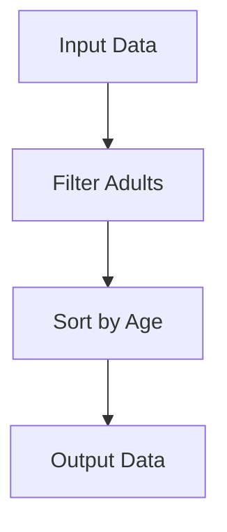

## 5.14. Data-Oriented Programming

In the realm of software development, paradigms shape the way we think about and solve problems. Data-oriented programming (DOP) is a paradigm that emphasizes the use of simple, immutable data structures over complex, custom objects. In Clojure, this approach aligns seamlessly with the language's functional roots, offering a path to more flexible, composable, and interoperable code. Let's delve into the principles of data-oriented programming, explore its benefits, and see how it contrasts with object-oriented programming (OOP).

### What is Data-Oriented Programming?

Data-oriented programming is a paradigm that focuses on representing and manipulating data using simple, immutable data structures. Unlike object-oriented programming, which encapsulates data and behavior within objects, DOP treats data as separate from the functions that operate on it. This separation allows for greater flexibility and composability, as data can be easily transformed, passed around, and reused.

#### Key Principles of Data-Oriented Programming

1. **Data as First-Class Citizens**: In DOP, data is treated as a primary concern. Functions are designed to transform data, rather than being tightly coupled with it.
2. **Immutability**: Data structures are immutable, meaning they cannot be changed once created. This leads to safer and more predictable code.
3. **Simplicity**: By using plain data structures, code becomes simpler and easier to reason about.
4. **Interoperability**: Data-oriented code can easily interoperate with other systems and languages, as data is represented in a universal format.

### Benefits of Using Plain Data Structures

Using plain data structures in Clojure offers several advantages:

- **Flexibility**: Data can be easily transformed and manipulated without being tied to specific behaviors or methods.
- **Composability**: Functions can be composed to create complex data transformations, leading to more reusable and modular code.
- **Interoperability**: Plain data structures can be easily serialized, deserialized, and shared across different systems and languages.
- **Simplicity**: Code becomes easier to read, understand, and maintain when data is represented in a straightforward manner.

### Contrasting Data-Oriented vs. Object-Oriented Approaches

To better understand the differences between data-oriented and object-oriented programming, let's consider an example. Suppose we are modeling a simple `Person` entity.

#### Object-Oriented Approach

In an object-oriented language like Java, we might define a `Person` class with encapsulated data and methods:

```java
public class Person {
    private String name;
    private int age;

    public Person(String name, int age) {
        this.name = name;
        this.age = age;
    }

    public String getName() {
        return name;
    }

    public int getAge() {
        return age;
    }

    public void celebrateBirthday() {
        this.age += 1;
    }
}
```

#### Data-Oriented Approach in Clojure

In Clojure, we would represent a `Person` using a simple map, and define functions to operate on it:

```clojure
(defn create-person [name age]
  {:name name :age age})

(defn get-name [person]
  (:name person))

(defn get-age [person]
  (:age person))

(defn celebrate-birthday [person]
  (update person :age inc))
```

Here, the `Person` is represented as a map, and functions are defined to operate on this data structure. This approach separates data from behavior, allowing for greater flexibility and composability.

### Simplifying Code and Enhancing Interoperability

Data-oriented programming simplifies code by reducing the complexity associated with encapsulating data and behavior within objects. By using plain data structures, we can focus on transforming data rather than managing state and behavior.

#### Example: Transforming Data

Consider a scenario where we need to transform a list of `Person` maps to include only those who are over 18 years old:

```clojure
(defn adults [people]
  (filter #(> (:age %) 18) people))

;; Example usage
(def people [{:name "Alice" :age 20}
             {:name "Bob" :age 17}
             {:name "Charlie" :age 25}])

(adults people)
;; => ({:name "Alice", :age 20} {:name "Charlie", :age 25})
```

In this example, the `adults` function filters the list of `Person` maps, demonstrating how data-oriented programming encourages thinking in terms of data transformation.

### Encouraging Data Transformation Thinking

Data-oriented programming encourages developers to think in terms of data transformation rather than object manipulation. This shift in mindset leads to more declarative and expressive code, where the focus is on what needs to be done with the data rather than how it should be done.

#### Example: Composing Data Transformations

Let's consider a more complex example where we need to transform a list of `Person` maps to include only those who are over 18 years old, and then sort them by age:

```clojure
(defn sort-by-age [people]
  (sort-by :age people))

(defn adults-sorted-by-age [people]
  (->> people
       (filter #(> (:age %) 18))
       (sort-by-age)))

;; Example usage
(adults-sorted-by-age people)
;; => ({:name "Alice", :age 20} {:name "Charlie", :age 25})
```

Here, we use the `->>` threading macro to compose the data transformations, demonstrating the power of data-oriented programming in creating expressive and modular code.

### Visualizing Data-Oriented Programming

To better understand the flow of data in data-oriented programming, let's visualize the process using a flowchart:



This flowchart illustrates how data flows through a series of transformations, highlighting the declarative nature of data-oriented programming.

### Clojure's Unique Features for Data-Oriented Programming

Clojure's design makes it particularly well-suited for data-oriented programming. Here are some unique features that enhance this paradigm:

- **Immutable Data Structures**: Clojure's core data structures (lists, vectors, maps, and sets) are immutable, ensuring that data transformations do not have side effects.
- **Rich Set of Core Functions**: Clojure provides a rich set of core functions for manipulating data, making it easy to perform complex transformations.
- **Homoiconicity**: Clojure's code-as-data philosophy allows for powerful metaprogramming capabilities, enabling developers to create domain-specific languages (DSLs) and macros that operate on data.

### Differences and Similarities with Other Paradigms

While data-oriented programming shares some similarities with functional programming, it differs from object-oriented programming in several key ways:

- **Separation of Data and Behavior**: Unlike OOP, where data and behavior are encapsulated within objects, DOP treats data as separate from the functions that operate on it.
- **Focus on Data Transformation**: DOP emphasizes transforming data through a series of functions, rather than manipulating objects and their state.
- **Immutability**: DOP relies on immutable data structures, whereas OOP often involves mutable objects.

### Design Considerations

When adopting data-oriented programming, consider the following design considerations:

- **Data Representation**: Choose appropriate data structures to represent your data. Clojure's maps, vectors, and sets are versatile and can be used to model a wide range of data.
- **Function Composition**: Leverage function composition to create modular and reusable data transformations.
- **Interoperability**: Ensure that your data structures can be easily serialized and deserialized for interoperability with other systems.

### Try It Yourself

To deepen your understanding of data-oriented programming, try modifying the code examples provided. Experiment with different data transformations, such as filtering by different criteria or sorting by different attributes. Consider how these transformations can be composed to create more complex data processing pipelines.

### Knowledge Check

To reinforce your understanding of data-oriented programming, consider the following questions:

- How does data-oriented programming differ from object-oriented programming?
- What are the benefits of using immutable data structures in Clojure?
- How can function composition enhance the flexibility and reusability of code?
- Why is interoperability an important consideration in data-oriented programming?

### Summary

Data-oriented programming in Clojure offers a powerful paradigm for building flexible, composable, and interoperable software. By focusing on data transformation and leveraging Clojure's immutable data structures, developers can create simpler and more expressive code. As you continue your journey with Clojure, embrace the principles of data-oriented programming and explore the possibilities it offers for building robust and elegant applications.

## **Ready to Test Your Knowledge?**



### What is a key principle of data-oriented programming?

- [x] Data as First-Class Citizens
- [ ] Encapsulation of Data and Behavior
- [ ] Inheritance and Polymorphism
- [ ] Object-Oriented Design

> **Explanation:** Data-oriented programming treats data as a primary concern, focusing on transforming data rather than encapsulating it within objects.

### How does data-oriented programming differ from object-oriented programming?

- [x] Separation of Data and Behavior
- [ ] Use of Classes and Objects
- [ ] Focus on Inheritance
- [ ] Emphasis on Encapsulation

> **Explanation:** Data-oriented programming separates data from behavior, unlike object-oriented programming, which encapsulates data and behavior within objects.

### What is a benefit of using immutable data structures in Clojure?

- [x] Safer and More Predictable Code
- [ ] Easier State Management
- [ ] Faster Execution
- [ ] Simplified Syntax

> **Explanation:** Immutable data structures lead to safer and more predictable code, as they cannot be changed once created.

### How can function composition enhance code flexibility?

- [x] By Creating Modular and Reusable Data Transformations
- [ ] By Encapsulating Data and Behavior
- [ ] By Using Inheritance
- [ ] By Simplifying Syntax

> **Explanation:** Function composition allows for modular and reusable data transformations, enhancing code flexibility and reusability.

### Why is interoperability important in data-oriented programming?

- [x] It Allows Data to be Easily Shared Across Systems
- [ ] It Simplifies Syntax
- [ ] It Enhances Encapsulation
- [ ] It Improves Performance

> **Explanation:** Interoperability is important because it allows data to be easily serialized, deserialized, and shared across different systems and languages.

### What is a unique feature of Clojure that enhances data-oriented programming?

- [x] Immutable Data Structures
- [ ] Class-Based Inheritance
- [ ] Encapsulation
- [ ] Polymorphism

> **Explanation:** Clojure's immutable data structures ensure that data transformations do not have side effects, enhancing data-oriented programming.

### How does data-oriented programming encourage thinking in terms of data transformation?

- [x] By Focusing on What Needs to be Done with the Data
- [ ] By Encapsulating Data and Behavior
- [ ] By Using Classes and Objects
- [ ] By Emphasizing Inheritance

> **Explanation:** Data-oriented programming encourages thinking in terms of data transformation by focusing on what needs to be done with the data, rather than how it should be done.

### What is a design consideration when adopting data-oriented programming?

- [x] Choosing Appropriate Data Structures
- [ ] Using Class-Based Inheritance
- [ ] Encapsulating Data and Behavior
- [ ] Emphasizing Polymorphism

> **Explanation:** Choosing appropriate data structures is a key design consideration in data-oriented programming, as it affects how data is represented and manipulated.

### What is the role of function composition in data-oriented programming?

- [x] To Create Modular and Reusable Data Transformations
- [ ] To Encapsulate Data and Behavior
- [ ] To Use Inheritance
- [ ] To Simplify Syntax

> **Explanation:** Function composition plays a crucial role in data-oriented programming by creating modular and reusable data transformations.

### True or False: Data-oriented programming relies on mutable data structures.

- [ ] True
- [x] False

> **Explanation:** Data-oriented programming relies on immutable data structures, ensuring that data transformations do not have side effects.



Remember, this is just the beginning. As you progress, you'll build more complex and interactive applications. Keep experimenting, stay curious, and enjoy the journey!
