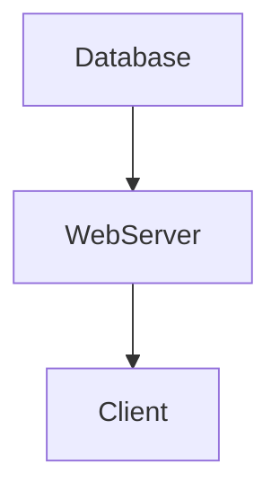

## 5.15. The Component Pattern for System Construction

In the realm of software architecture, managing the lifecycle and dependencies of various components within an application is crucial for maintaining a clean and scalable codebase. The Component pattern in Clojure, facilitated by the [Component library](https://github.com/stuartsierra/component), provides a structured approach to organizing stateful parts of an application. This pattern is particularly beneficial in building systems with manageable complexity, ensuring that each component is well-defined and its interactions are clearly delineated.

### Introduction to the Component Pattern

The Component pattern is a design pattern that focuses on the modularization of system components, each with its own lifecycle and dependencies. This pattern is particularly useful in functional programming languages like Clojure, where immutability and state management are key concerns. By encapsulating state and behavior within components, developers can create systems that are easier to understand, test, and maintain.

#### Purpose of the Component Pattern

The primary purpose of the Component pattern is to manage the lifecycle of stateful components in an application. This includes initializing resources, managing dependencies, and ensuring that components are started and stopped in the correct order. By using this pattern, developers can:

- **Encapsulate State**: Keep stateful logic within well-defined boundaries.
- **Manage Dependencies**: Clearly define and manage dependencies between components.
- **Control Lifecycle**: Ensure components are initialized and terminated properly.

### Organizing System Components

In a typical Clojure application, components might include databases, web servers, configuration settings, and other stateful resources. The Component pattern helps organize these elements into a coherent system. Each component is responsible for its own lifecycle, and the system as a whole is composed of these individual components.

#### Example: Using the Component Library

The [Component library](https://github.com/stuartsierra/component) by Stuart Sierra is a popular choice for implementing the Component pattern in Clojure. It provides a simple API for defining components and assembling them into a system.

Let's explore a basic example of using the Component library to manage a simple web application with a database connection.

```clojure
(ns my-app.core
  (:require [com.stuartsierra.component :as component]))

(defrecord Database [connection]
  component/Lifecycle
  (start [this]
    (println "Starting database connection")
    (assoc this :connection (connect-to-db)))
  (stop [this]
    (println "Stopping database connection")
    (disconnect-from-db (:connection this))
    (assoc this :connection nil)))

(defrecord WebServer [port]
  component/Lifecycle
  (start [this]
    (println "Starting web server on port" port)
    (assoc this :server (start-server port)))
  (stop [this]
    (println "Stopping web server")
    (stop-server (:server this))
    (assoc this :server nil)))

(defn create-system []
  (component/system-map
    :database (map->Database {})
    :web-server (map->WebServer {:port 8080})))

(defn -main []
  (let [system (create-system)]
    (component/start system)))
```

In this example, we define two components: `Database` and `WebServer`. Each component implements the `component/Lifecycle` protocol, which requires `start` and `stop` methods. The `create-system` function assembles these components into a system map, which can be started and stopped as a whole.

### Dependency Injection and System Assembly

One of the key features of the Component pattern is its support for dependency injection. This allows components to declare their dependencies explicitly, making it easier to manage complex systems.

#### Example: Adding Dependencies

Let's extend our previous example by adding a dependency between the `WebServer` and `Database` components.

```clojure
(defrecord WebServer [port database]
  component/Lifecycle
  (start [this]
    (println "Starting web server on port" port "with database" (:connection database))
    (assoc this :server (start-server port)))
  (stop [this]
    (println "Stopping web server")
    (stop-server (:server this))
    (assoc this :server nil)))

(defn create-system []
  (component/system-map
    :database (map->Database {})
    :web-server (component/using
                  (map->WebServer {:port 8080})
                  [:database])))
```

In this updated example, the `WebServer` component now has a dependency on the `Database` component. The `component/using` function is used to declare this dependency, ensuring that the `Database` component is started before the `WebServer`.

### Best Practices for Designing Components

When designing components using the Component pattern, consider the following best practices:

- **Keep Components Focused**: Each component should have a single responsibility. Avoid mixing unrelated concerns within a single component.
- **Define Clear Interfaces**: Components should expose a clear and minimal interface for interaction with other components.
- **Manage State Carefully**: Use Clojure's immutable data structures to manage state within components, minimizing side effects.
- **Test Components Independently**: Write unit tests for individual components, ensuring they behave correctly in isolation.
- **Document Dependencies**: Clearly document the dependencies between components to aid in understanding and maintaining the system.

### Visualizing the Component Pattern

To better understand the relationships and dependencies between components, let's visualize the system using a Mermaid.js diagram.



In this diagram, the `Database` component is a dependency of the `WebServer`, which in turn serves requests from a `Client`.

### Clojure's Unique Features

Clojure's emphasis on immutability and functional programming makes it an ideal language for implementing the Component pattern. The use of immutable data structures ensures that components remain stateless and side-effect-free, while the functional programming paradigm encourages the use of pure functions and composability.

### Differences and Similarities with Other Patterns

The Component pattern shares similarities with other design patterns, such as the Service Locator and Dependency Injection patterns. However, it is distinct in its focus on managing the lifecycle of components and their dependencies in a functional programming context.

### Try It Yourself

To gain a deeper understanding of the Component pattern, try modifying the code examples provided. Experiment with adding new components, introducing additional dependencies, or changing the order in which components are started and stopped. This hands-on approach will help solidify your understanding of the pattern and its applications.

### Summary

The Component pattern is a powerful tool for managing the lifecycle and dependencies of stateful components in a Clojure application. By organizing components into a coherent system, developers can create applications that are easier to understand, test, and maintain. With the help of the Component library, implementing this pattern in Clojure is straightforward and effective.

## **Ready to Test Your Knowledge?**



### What is the primary purpose of the Component pattern in Clojure?

- [x] To manage the lifecycle and dependencies of stateful components.
- [ ] To provide a graphical user interface for applications.
- [ ] To optimize the performance of Clojure applications.
- [ ] To facilitate network communication between services.

> **Explanation:** The Component pattern is designed to manage the lifecycle and dependencies of stateful components within an application.

### Which library is commonly used to implement the Component pattern in Clojure?

- [x] Component library by Stuart Sierra
- [ ] Ring library
- [ ] Compojure library
- [ ] Pedestal library

> **Explanation:** The Component library by Stuart Sierra is widely used for implementing the Component pattern in Clojure.

### What protocol must a Clojure component implement to be part of a system?

- [x] component/Lifecycle
- [ ] clojure.core/Protocol
- [ ] clojure.spec/Spec
- [ ] clojure.test/Test

> **Explanation:** Components must implement the `component/Lifecycle` protocol to define their start and stop behavior.

### How does the Component pattern handle dependencies between components?

- [x] By using the `component/using` function to declare dependencies.
- [ ] By hardcoding dependencies within each component.
- [ ] By using global variables to manage dependencies.
- [ ] By relying on external configuration files.

> **Explanation:** The `component/using` function is used to declare dependencies between components, ensuring proper initialization order.

### What is a key benefit of using the Component pattern in Clojure?

- [x] It encapsulates state and manages dependencies effectively.
- [ ] It automatically generates user interfaces.
- [ ] It increases the execution speed of Clojure code.
- [ ] It simplifies network communication protocols.

> **Explanation:** The Component pattern encapsulates state and manages dependencies, leading to cleaner and more maintainable code.

### Which of the following is a best practice when designing components?

- [x] Keep components focused on a single responsibility.
- [ ] Mix multiple responsibilities within a single component.
- [ ] Avoid documenting dependencies between components.
- [ ] Use mutable data structures for state management.

> **Explanation:** Keeping components focused on a single responsibility is a best practice for clarity and maintainability.

### What is the role of the `start` method in a component?

- [x] To initialize resources and start the component.
- [ ] To stop the component and release resources.
- [ ] To define the component's dependencies.
- [ ] To configure the component's settings.

> **Explanation:** The `start` method initializes resources and starts the component, making it ready for use.

### How can you test components independently?

- [x] Write unit tests for individual components.
- [ ] Test all components together in an integrated system.
- [ ] Use manual testing methods exclusively.
- [ ] Rely on external testing services.

> **Explanation:** Writing unit tests for individual components ensures they behave correctly in isolation.

### What is a common pitfall when using the Component pattern?

- [x] Overcomplicating the system with unnecessary components.
- [ ] Using too few components in the system.
- [ ] Ignoring the lifecycle of components.
- [ ] Relying solely on mutable state.

> **Explanation:** Overcomplicating the system with unnecessary components can make it harder to manage and maintain.

### True or False: The Component pattern is only applicable to web applications.

- [ ] True
- [x] False

> **Explanation:** The Component pattern is applicable to any application that requires managing the lifecycle and dependencies of stateful components, not just web applications.



Remember, mastering the Component pattern is just one step in your journey to becoming a proficient Clojure developer. Keep exploring, experimenting, and building systems that are robust, efficient, and elegant. Happy coding!
