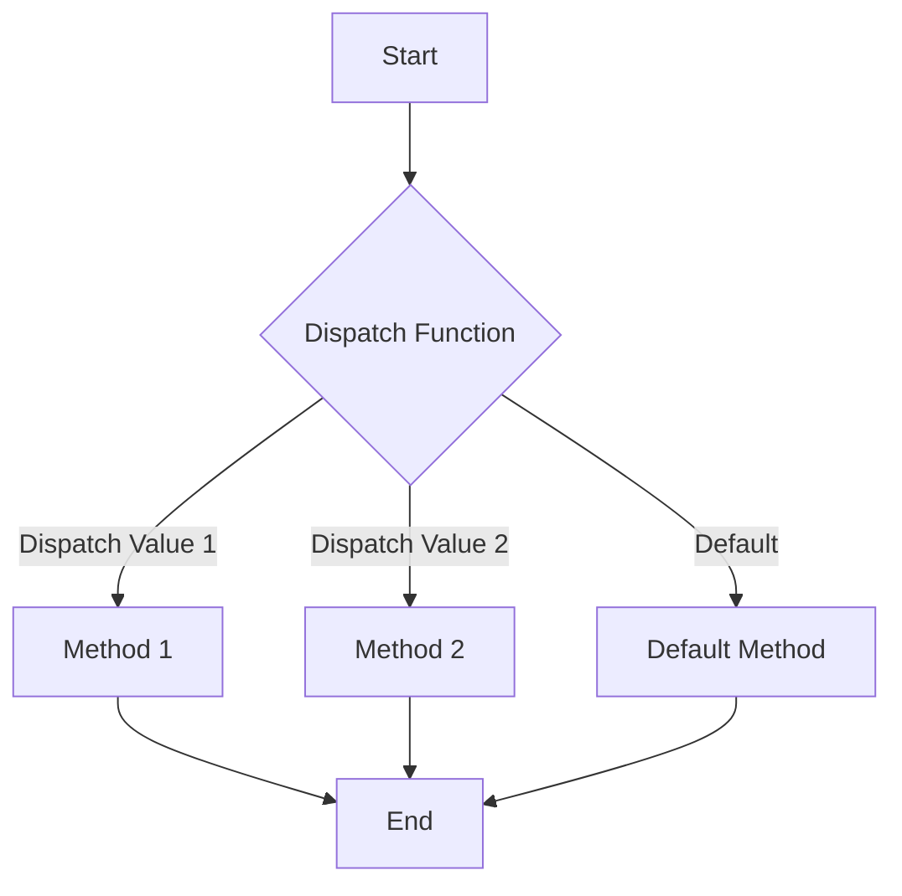

## 5.16. The Use of `defmulti` and `defmethod` for Multimethods

In the world of Clojure, multimethods provide a powerful mechanism for achieving polymorphic behavior. Unlike traditional object-oriented languages that rely on class-based single-dispatch methods, Clojure's multimethods allow for flexible dispatch based on custom criteria. This section delves into the intricacies of `defmulti` and `defmethod`, illustrating how they work together to enable sophisticated dispatching strategies.

### Understanding `defmulti` and `defmethod`

#### What is `defmulti`?

`defmulti` is a Clojure construct used to define a multimethod. A multimethod is a function that can have multiple implementations, each associated with a specific dispatch value. The dispatch value is determined by a dispatch function, which is specified when the multimethod is defined.

```clojure
(defmulti area :shape)
```

In this example, `area` is a multimethod that dispatches on the `:shape` key of its argument.

#### What is `defmethod`?

`defmethod` is used to define an implementation of a multimethod for a specific dispatch value. Each `defmethod` associates a particular dispatch value with a function that handles that case.

```clojure
(defmethod area :circle [shape]
  (* Math/PI (:radius shape) (:radius shape)))

(defmethod area :rectangle [shape]
  (* (:width shape) (:height shape)))
```

Here, we define two methods for the `area` multimethod: one for circles and another for rectangles.

### Creating Multimethods with Different Dispatch Criteria

Multimethods can dispatch based on any criteria, not just simple keys. This flexibility allows for complex decision-making processes.

#### Example: Dispatching Based on Multiple Criteria

```clojure
(defmulti describe-shape (fn [shape] [(:type shape) (:color shape)]))

(defmethod describe-shape [:circle :red] [shape]
  "A red circle")

(defmethod describe-shape [:rectangle :blue] [shape]
  "A blue rectangle")
```

In this example, the dispatch function returns a vector of the shape's type and color, allowing for more granular control over which method is invoked.

### Advantages Over Traditional Single-Dispatch Methods

Multimethods offer several advantages over traditional single-dispatch methods:

- **Flexibility**: Dispatch can be based on any criteria, not just the type of the first argument.
- **Extensibility**: New methods can be added without modifying existing code, adhering to the open/closed principle.
- **Separation of Concerns**: Dispatch logic is separated from implementation logic, leading to cleaner and more maintainable code.

### Using Hierarchies for More Complex Dispatching

Clojure supports hierarchies, which can be used in conjunction with multimethods to enable more sophisticated dispatching strategies.

#### Defining a Hierarchy

```clojure
(derive ::dog ::animal)
(derive ::cat ::animal)
```

Here, we define a hierarchy where `::dog` and `::cat` are subtypes of `::animal`.

#### Using Hierarchies in Multimethods

```clojure
(defmulti make-sound :type)

(defmethod make-sound ::animal [animal]
  "Some generic animal sound")

(defmethod make-sound ::dog [dog]
  "Woof!")

(defmethod make-sound ::cat [cat]
  "Meow!")
```

In this example, if a specific method for `::dog` or `::cat` is not found, the `::animal` method will be used as a fallback.

### Scenarios Where Multimethods Are Particularly Useful

Multimethods are particularly useful in scenarios where:

- **Complex Dispatch Logic**: When dispatch logic cannot be easily captured by simple type-based dispatch.
- **Open Systems**: When the system needs to be extensible and open to new types and behaviors.
- **Cross-Cutting Concerns**: When behavior needs to be shared across different types in a flexible manner.

### Visualizing Multimethod Dispatch

To better understand how multimethods work, let's visualize the dispatch process using a flowchart.



**Figure 1**: Flowchart illustrating the dispatch process of a multimethod.

### Try It Yourself

Experiment with the following code to deepen your understanding of multimethods:

```clojure
(defmulti greet (fn [person] (:language person)))

(defmethod greet :english [person]
  (str "Hello, " (:name person)))

(defmethod greet :spanish [person]
  (str "Hola, " (:name person)))

(defmethod greet :default [person]
  (str "Hi, " (:name person)))

;; Try calling greet with different languages
(greet {:name "Alice" :language :english})
(greet {:name "Bob" :language :spanish})
(greet {:name "Charlie" :language :french})
```

**Exercise**: Add a new method for greeting in French.

### Key Takeaways

- **Multimethods** provide a flexible mechanism for polymorphic dispatch based on custom criteria.
- **`defmulti` and `defmethod`** work together to define and implement multimethods.
- **Hierarchies** can be used to enable more complex dispatching strategies.
- **Extensibility** and **flexibility** are key advantages of using multimethods.

### References and Further Reading

- [Clojure Official Documentation on Multimethods](https://clojure.org/reference/multimethods)
- [Clojure Programming by Chas Emerick, Brian Carper, and Christophe Grand](https://www.oreilly.com/library/view/clojure-programming/9781449310387/)

## **Ready to Test Your Knowledge?**



### What is the primary purpose of `defmulti` in Clojure?

- [x] To define a multimethod with a dispatch function.
- [ ] To define a single method for a specific type.
- [ ] To create a new data structure.
- [ ] To handle exceptions in Clojure.

> **Explanation:** `defmulti` is used to define a multimethod, which includes specifying a dispatch function that determines which method to call based on the dispatch value.

### How does `defmethod` relate to `defmulti`?

- [x] `defmethod` defines a specific implementation for a dispatch value of a multimethod.
- [ ] `defmethod` is used to create a new multimethod.
- [ ] `defmethod` is unrelated to `defmulti`.
- [ ] `defmethod` is used for error handling.

> **Explanation:** `defmethod` is used to define the implementation of a multimethod for a specific dispatch value, complementing the `defmulti` definition.

### What is a key advantage of using multimethods over traditional single-dispatch methods?

- [x] Flexibility in dispatching based on custom criteria.
- [ ] Simplicity in implementation.
- [ ] Reduced code complexity.
- [ ] Improved performance.

> **Explanation:** Multimethods allow for flexible dispatching based on any criteria, not just the type of the first argument, providing greater flexibility.

### Which of the following is a valid use case for multimethods?

- [x] Implementing complex dispatch logic.
- [ ] Simplifying arithmetic operations.
- [ ] Managing database connections.
- [ ] Handling file I/O operations.

> **Explanation:** Multimethods are particularly useful for implementing complex dispatch logic that cannot be easily captured by simple type-based dispatch.

### How can hierarchies enhance multimethod dispatching?

- [x] By allowing methods to inherit behavior from more general methods.
- [ ] By simplifying the dispatch function.
- [ ] By reducing the number of methods needed.
- [ ] By improving performance.

> **Explanation:** Hierarchies allow methods to inherit behavior from more general methods, enabling more sophisticated dispatching strategies.

### What does the dispatch function in a multimethod do?

- [x] Determines the dispatch value used to select the appropriate method.
- [ ] Executes the selected method.
- [ ] Initializes the multimethod.
- [ ] Handles errors during dispatch.

> **Explanation:** The dispatch function determines the dispatch value, which is used to select the appropriate method for execution.

### Which keyword is used to define a default method in a multimethod?

- [x] :default
- [ ] :fallback
- [ ] :base
- [ ] :generic

> **Explanation:** The `:default` keyword is used to define a default method that is called when no specific method matches the dispatch value.

### Can multimethods dispatch based on multiple criteria?

- [x] Yes, by using a dispatch function that returns a composite value.
- [ ] No, they can only dispatch based on a single criterion.
- [ ] Yes, but only with a predefined set of criteria.
- [ ] No, multimethods do not support dispatching.

> **Explanation:** Multimethods can dispatch based on multiple criteria by using a dispatch function that returns a composite value, such as a vector.

### What is the role of `derive` in Clojure hierarchies?

- [x] To establish a parent-child relationship between types.
- [ ] To define a new multimethod.
- [ ] To implement a specific method.
- [ ] To handle errors in dispatching.

> **Explanation:** `derive` is used to establish a parent-child relationship between types, which can be leveraged in multimethod dispatching.

### True or False: Multimethods in Clojure can only dispatch based on the type of the first argument.

- [ ] True
- [x] False

> **Explanation:** False. Multimethods in Clojure can dispatch based on any criteria, not just the type of the first argument, allowing for flexible and complex dispatch logic.


