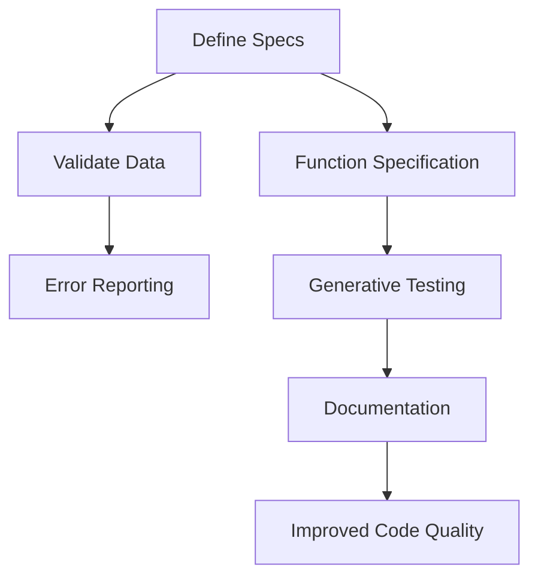

## 5.18. Clojure Spec for Data Validation

In the world of software development, ensuring data integrity and correctness is paramount. Clojure Spec is a powerful library that provides a comprehensive framework for describing the structure of data and functions, performing validation, parsing, and even generative testing. In this section, we will delve into the intricacies of Clojure Spec, exploring its features, benefits, and practical applications.

### What is Clojure Spec?

Clojure Spec is a library introduced in Clojure 1.9 that allows developers to define specifications (specs) for data structures and functions. These specs serve as contracts that describe the expected shape and behavior of data, enabling validation, error reporting, and testing. By leveraging Clojure Spec, developers can ensure that their code adheres to predefined constraints, leading to more robust and reliable applications.

### Key Features of Clojure Spec

- **Data Validation**: Validate data against defined specs to ensure conformance.
- **Function Specification**: Describe the inputs and outputs of functions, enabling runtime checks.
- **Generative Testing**: Automatically generate test data that conforms to specs, facilitating thorough testing.
- **Error Reporting**: Provide detailed error messages when data does not conform to specs.
- **Documentation**: Use specs as a form of documentation, making code more understandable.

### Defining Specs for Data Structures

To define a spec, we use the `s/def` function, which associates a spec with a keyword. Let's start by defining a simple spec for a map representing a user:

```clojure
(require '[clojure.spec.alpha :as s])

(s/def ::name string?)
(s/def ::age pos-int?)
(s/def ::email (s/and string? #(re-matches #".+@.+\..+" %)))

(s/def ::user (s/keys :req [::name ::age ::email]))
```

In this example, we define specs for individual fields (`::name`, `::age`, `::email`) and then combine them into a spec for a user map (`::user`). The `s/keys` function specifies required keys and their corresponding specs.

### Validating Data with Specs

Once we have defined our specs, we can use them to validate data. The `s/valid?` function checks if data conforms to a spec:

```clojure
(def user-data {:name "Alice" :age 30 :email "alice@example.com"})

(println (s/valid? ::user user-data)) ; => true

(def invalid-user-data {:name "Bob" :age -5 :email "bobexample.com"})

(println (s/valid? ::user invalid-user-data)) ; => false
```

In the above code, `s/valid?` returns `true` for valid data and `false` for invalid data.

### Error Reporting with Spec

When data does not conform to a spec, it's crucial to understand why. The `s/explain` function provides detailed error messages:

```clojure
(s/explain ::user invalid-user-data)
```

Output:
```
val: {:name "Bob", :age -5, :email "bobexample.com"} fails spec: :user
  In: [:age] val: -5 fails spec: :age at: [:age] predicate: pos-int?
  In: [:email] val: "bobexample.com" fails spec: :email at: [:email] predicate: (re-matches #".+@.+\..+")
```

This output clearly indicates which parts of the data are invalid and why, making it easier to diagnose and fix issues.

### Function Specification

Clojure Spec also allows us to specify the behavior of functions. We can define specs for function arguments and return values using `s/fdef`:

```clojure
(s/fdef calculate-bmi
  :args (s/cat :weight pos-int? :height pos-int?)
  :ret number?)

(defn calculate-bmi [weight height]
  (/ weight (* height height)))
```

The `s/fdef` function specifies that `calculate-bmi` takes two positive integers as arguments and returns a number. We can then use `s/instrument` to enforce these specs at runtime:

```clojure
(require '[clojure.spec.test.alpha :as stest])

(stest/instrument `calculate-bmi)

(calculate-bmi 70 1.75) ; Valid call
(calculate-bmi -70 1.75) ; Throws an error due to invalid argument
```

### Generative Testing with Spec

One of the most powerful features of Clojure Spec is its support for generative testing. By defining specs, we can automatically generate test data that conforms to these specs, ensuring comprehensive test coverage.

```clojure
(require '[clojure.spec.gen.alpha :as gen])

(defn test-calculate-bmi []
  (stest/check `calculate-bmi))

(test-calculate-bmi)
```

The `stest/check` function uses the specs defined for `calculate-bmi` to generate random test cases, verifying that the function behaves correctly across a wide range of inputs.

### Integrating Spec with Documentation

Specs serve as a form of documentation, providing clear descriptions of data structures and function behavior. By examining the specs, developers can quickly understand the expected inputs and outputs, reducing the need for extensive comments or external documentation.

### Benefits of Using Clojure Spec

- **Improved Data Integrity**: Ensure that data conforms to expected structures, reducing runtime errors.
- **Enhanced Testing**: Leverage generative testing to automatically verify code correctness.
- **Clear Error Reporting**: Receive detailed error messages that facilitate debugging.
- **Self-Documenting Code**: Use specs to document data structures and functions, improving code readability.

### Visualizing Clojure Spec Workflow

To better understand how Clojure Spec fits into the development process, let's visualize its workflow:



**Figure 1**: Clojure Spec Workflow - This diagram illustrates the flow from defining specs to achieving improved code quality through validation, error reporting, function specification, generative testing, and documentation.

### Try It Yourself

Experiment with the provided code examples by modifying the specs and data. Try adding new fields to the user spec or defining specs for different data structures. Observe how changes affect validation and error reporting.

### Knowledge Check

- What is the primary purpose of Clojure Spec?
- How do you define a spec for a map in Clojure?
- What function is used to validate data against a spec?
- How does Clojure Spec enhance error reporting?
- What is generative testing, and how does Clojure Spec facilitate it?

### Conclusion

Clojure Spec is a versatile tool that enhances data validation, testing, and documentation. By defining clear specifications for data and functions, developers can ensure data integrity, improve code quality, and streamline the development process. As you continue your journey with Clojure, embrace the power of Spec to build robust and reliable applications.

For further reading, explore the [Clojure Spec Guide](https://clojure.org/guides/spec).

## **Ready to Test Your Knowledge?**



### What is the primary purpose of Clojure Spec?

- [x] To describe the structure of data and functions for validation and testing
- [ ] To replace all existing testing frameworks
- [ ] To provide a new syntax for Clojure
- [ ] To enhance the performance of Clojure programs

> **Explanation:** Clojure Spec is designed to describe data and function structures, enabling validation, error reporting, and generative testing.

### How do you define a spec for a map in Clojure?

- [x] Using the `s/keys` function with required and optional keys
- [ ] Using the `s/map` function
- [ ] Using the `s/defmap` function
- [ ] Using the `s/structure` function

> **Explanation:** The `s/keys` function is used to define specs for maps, specifying required and optional keys.

### What function is used to validate data against a spec?

- [x] `s/valid?`
- [ ] `s/check`
- [ ] `s/assert`
- [ ] `s/verify`

> **Explanation:** The `s/valid?` function checks if data conforms to a specified spec.

### How does Clojure Spec enhance error reporting?

- [x] By providing detailed error messages that indicate which parts of the data are invalid
- [ ] By logging errors to a file
- [ ] By sending error reports to a server
- [ ] By suppressing error messages

> **Explanation:** Clojure Spec provides detailed error messages that help identify which parts of the data do not conform to the spec.

### What is generative testing, and how does Clojure Spec facilitate it?

- [x] Generative testing involves automatically generating test data, and Clojure Spec facilitates it by using specs to create conforming data
- [ ] Generative testing is a manual testing process
- [ ] Generative testing is unrelated to Clojure Spec
- [ ] Generative testing is only used for performance testing

> **Explanation:** Generative testing uses specs to automatically generate test data, ensuring comprehensive test coverage.

### Which function is used to define specs for function arguments and return values?

- [x] `s/fdef`
- [ ] `s/def`
- [ ] `s/args`
- [ ] `s/returns`

> **Explanation:** The `s/fdef` function is used to define specs for function arguments and return values.

### What is the benefit of using specs as documentation?

- [x] Specs provide clear descriptions of data structures and function behavior, improving code readability
- [ ] Specs replace all comments in the code
- [ ] Specs are only used for internal documentation
- [ ] Specs are not related to documentation

> **Explanation:** Specs serve as a form of documentation, providing clear descriptions of data structures and function behavior.

### How can you enforce function specs at runtime?

- [x] By using `s/instrument`
- [ ] By using `s/enforce`
- [ ] By using `s/validate`
- [ ] By using `s/check`

> **Explanation:** The `s/instrument` function enforces function specs at runtime, checking that arguments and return values conform to the specs.

### What is the role of `s/explain` in Clojure Spec?

- [x] To provide detailed error messages when data does not conform to a spec
- [ ] To generate test data
- [ ] To define new specs
- [ ] To optimize performance

> **Explanation:** The `s/explain` function provides detailed error messages, helping to diagnose and fix issues with data conformance.

### True or False: Clojure Spec can only be used for data validation.

- [ ] True
- [x] False

> **Explanation:** Clojure Spec is used for data validation, function specification, generative testing, error reporting, and documentation.


