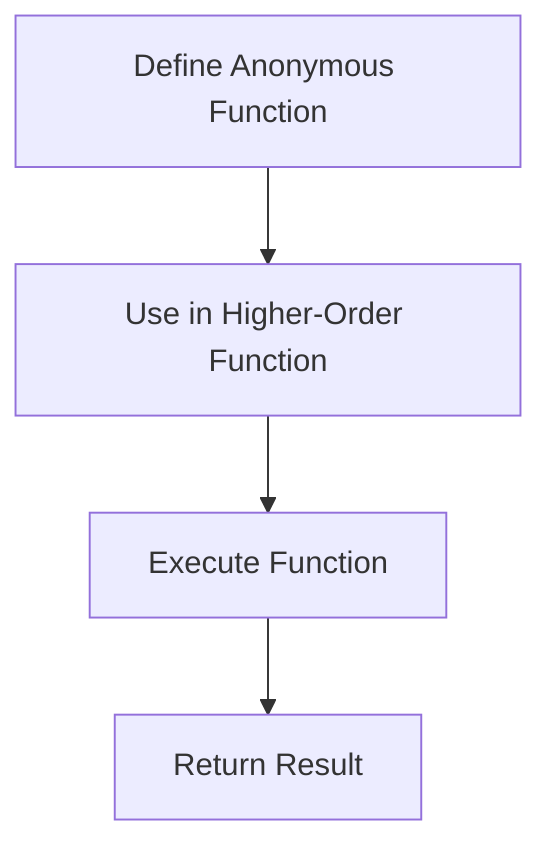

## 5.19. The Use of Anonymous Functions (`fn`, `#()`)

In the world of Clojure, anonymous functions are a powerful tool that allows developers to define functions without naming them. This feature is particularly useful for creating short, inline functions that enhance code brevity and expressiveness. In this section, we will delve into the use of anonymous functions in Clojure, exploring both the `fn` construct and the reader macro `#()`. We will discuss their syntax, use cases, and best practices for maintaining readability and maintainability in your code.

### What Are Anonymous Functions?

Anonymous functions, also known as lambda functions, are functions defined without a name. They are typically used for short-lived operations where defining a named function would be unnecessary or cumbersome. In Clojure, anonymous functions can be created using the `fn` special form or the shorthand reader macro `#()`.

#### When to Use Anonymous Functions

Anonymous functions are ideal for situations where you need a quick, one-off function. They are commonly used in higher-order functions like `map`, `filter`, and `reduce`, where the function is passed as an argument. By using anonymous functions, you can keep your code concise and focused on the task at hand.

### Creating Anonymous Functions with `fn`

The `fn` special form is the most explicit way to define an anonymous function in Clojure. It allows you to specify parameters and the function body clearly.

#### Syntax of `fn`

The basic syntax of `fn` is as follows:

```clojure
(fn [parameters] (function-body))
```

Here's a simple example of using `fn` to create an anonymous function that adds two numbers:

```clojure
(def add (fn [x y] (+ x y)))
(println (add 2 3)) ; Output: 5
```

In this example, `fn` is used to define a function that takes two parameters, `x` and `y`, and returns their sum. The function is then assigned to the variable `add`, which can be used like any other function.

#### Multi-Arity Functions with `fn`

Clojure's `fn` allows for multi-arity functions, where different numbers of arguments can lead to different behaviors. Here's an example:

```clojure
(defn greet
  ([] (println "Hello, World!"))
  ([name] (println (str "Hello, " name "!"))))

(greet) ; Output: Hello, World!
(greet "Alice") ; Output: Hello, Alice!
```

### Using the Reader Macro `#()`

The reader macro `#()` provides a more concise way to define anonymous functions. It is particularly useful for very short functions where brevity is desired.

#### Syntax of `#()`

The `#()` syntax is a shorthand for creating anonymous functions. Within this form, `%` is used to refer to the arguments.

```clojure
#(function-body)
```

Here's an example of using `#()` to create a function that adds two numbers:

```clojure
(def add #(+ %1 %2))
(println (add 2 3)) ; Output: 5
```

In this example, `%1` and `%2` refer to the first and second arguments passed to the function, respectively.

#### Using `%` and `%&`

- `%` refers to the first argument.
- `%1`, `%2`, etc., refer to the first, second, and subsequent arguments.
- `%&` captures any additional arguments as a list.

Here's an example demonstrating `%&`:

```clojure
(def sum-all #(apply + %&))
(println (sum-all 1 2 3 4)) ; Output: 10
```

### Syntax Differences and Use Cases

The choice between `fn` and `#()` often comes down to readability and the complexity of the function being defined.

#### When to Use `fn`

- **Complex Logic**: Use `fn` when the function logic is complex or spans multiple lines.
- **Multi-Arity**: Use `fn` for functions that need to handle different numbers of arguments.
- **Named Parameters**: Use `fn` when you want to give meaningful names to parameters for clarity.

#### When to Use `#()`

- **Simplicity**: Use `#()` for simple, one-liner functions.
- **Inline Use**: Use `#()` when the function is used inline and brevity is more important than explicitness.

### Best Practices for Readability and Maintainability

While anonymous functions are powerful, they can lead to code that is difficult to read and maintain if overused or used inappropriately. Here are some best practices:

- **Keep It Simple**: Use anonymous functions for simple operations. If the logic becomes complex, consider defining a named function.
- **Limit Nesting**: Avoid deeply nested anonymous functions, as they can be hard to follow.
- **Use Descriptive Names**: When using `fn`, give meaningful names to parameters to enhance readability.
- **Avoid Overuse**: Overusing anonymous functions can lead to code that is hard to understand. Use them judiciously.

### Potential Pitfalls

- **Readability**: Overusing `#()` can make code less readable, especially for those unfamiliar with the syntax.
- **Debugging**: Anonymous functions can be harder to debug since they lack names.
- **Complexity**: Avoid using anonymous functions for complex logic that would benefit from a named function.

### Try It Yourself

Experiment with the following code examples to get a feel for using anonymous functions in Clojure:

```clojure
;; Define a function that squares a number using `fn`
(def square-fn (fn [x] (* x x)))
(println (square-fn 4)) ; Output: 16

;; Define a function that squares a number using `#()`
(def square-shorthand #(* % %))
(println (square-shorthand 4)) ; Output: 16

;; Use an anonymous function in a `map` operation
(def numbers [1 2 3 4 5])
(def squares (map #(* % %) numbers))
(println squares) ; Output: (1 4 9 16 25)
```

Try modifying these examples to use different operations or to handle multiple arguments.

### Visualizing Anonymous Functions

To better understand how anonymous functions fit into the flow of a Clojure program, consider the following diagram that illustrates the process of defining and using an anonymous function:



This diagram shows the typical flow of using an anonymous function: defining it, using it in a higher-order function, executing it, and returning the result.

### References and Links

For further reading on anonymous functions in Clojure, consider the following resources:

- [Clojure Official Documentation](https://clojure.org/reference/reader)
- [Clojure for the Brave and True](https://www.braveclojure.com/)
- [Functional Programming in Clojure](https://www.oreilly.com/library/view/functional-programming-in/9781491907947/)

### Knowledge Check

To reinforce your understanding of anonymous functions in Clojure, try answering the following questions.

## **Ready to Test Your Knowledge?**



### What is an anonymous function in Clojure?

- [x] A function defined without a name
- [ ] A function that cannot be executed
- [ ] A function that is always recursive
- [ ] A function that is only used in macros

> **Explanation:** Anonymous functions are defined without a name and are often used for short-lived operations.

### Which syntax is used for creating anonymous functions in Clojure?

- [x] `fn`
- [x] `#()`
- [ ] `defn`
- [ ] `let`

> **Explanation:** `fn` and `#()` are both used to create anonymous functions in Clojure.

### What does `%` represent in the `#()` syntax?

- [x] The first argument
- [ ] The second argument
- [ ] The function body
- [ ] The function name

> **Explanation:** `%` represents the first argument in the `#()` shorthand syntax for anonymous functions.

### When should you prefer using `fn` over `#()`?

- [x] When the function logic is complex
- [ ] When the function is a one-liner
- [ ] When the function is used in a `map`
- [ ] When the function is recursive

> **Explanation:** `fn` is preferred for complex logic or when you need to handle multiple arities.

### What is a potential pitfall of overusing anonymous functions?

- [x] Reduced readability
- [ ] Increased performance
- [ ] Easier debugging
- [ ] Simplified code

> **Explanation:** Overusing anonymous functions can lead to reduced readability and harder-to-maintain code.

### How can you refer to the second argument in a `#()` function?

- [x] `%2`
- [ ] `%`
- [ ] `%&`
- [ ] `%1`

> **Explanation:** `%2` is used to refer to the second argument in the `#()` syntax.

### What is the purpose of `%&` in a `#()` function?

- [x] To capture additional arguments as a list
- [ ] To refer to the first argument
- [ ] To indicate the end of the function
- [ ] To specify a return value

> **Explanation:** `%&` captures any additional arguments passed to the function as a list.

### Which of the following is a best practice for using anonymous functions?

- [x] Keep it simple
- [ ] Use them for all functions
- [ ] Avoid using them in `map`
- [ ] Always use `fn` over `#()`

> **Explanation:** Keeping anonymous functions simple helps maintain readability and clarity.

### What is a common use case for anonymous functions?

- [x] Passing them to higher-order functions
- [ ] Defining global variables
- [ ] Creating complex data structures
- [ ] Implementing recursion

> **Explanation:** Anonymous functions are often used as arguments to higher-order functions like `map`, `filter`, and `reduce`.

### True or False: Anonymous functions can be used for multi-arity functions.

- [x] True
- [ ] False

> **Explanation:** Anonymous functions created with `fn` can handle multiple arities, allowing different behaviors based on the number of arguments.



Remember, mastering anonymous functions in Clojure is just the beginning. As you continue to explore and experiment, you'll find new ways to leverage their power for concise and expressive code. Keep practicing, stay curious, and enjoy the journey!
