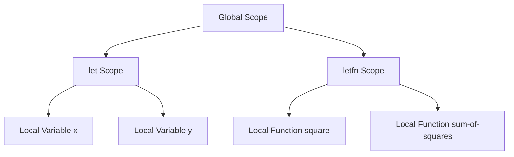

## 5.2. Using `let` and `letfn` for Local Bindings

In the realm of Clojure, local bindings are a fundamental concept that allows developers to create variables and functions with a limited scope. This section delves into the use of `let` and `letfn`, two powerful constructs that facilitate the creation of local bindings, thereby enhancing code clarity, reducing redundancy, and promoting functional programming principles.

### Understanding `let` in Clojure

The `let` construct in Clojure is used to introduce local scope for variables. It allows you to bind values to symbols within a specific block of code, ensuring that these bindings are not accessible outside of this block. This encapsulation is crucial for maintaining clean and modular code.

#### Syntax and Structure of `let`

The basic syntax of a `let` expression is as follows:

```clojure
(let [binding-form1 value1
      binding-form2 value2
      ...]
  body)
```

- **Binding Forms**: These are pairs of symbols and their corresponding values. Each symbol is bound to its value within the scope of the `let` block.
- **Body**: This is the code block where the bindings are used. The body can contain multiple expressions, and the value of the last expression is returned as the result of the `let` block.

#### Example: Using `let` for Variable Bindings

Let's consider a simple example where we use `let` to bind variables:

```clojure
(let [x 10
      y 20]
  (+ x y))
```

In this example, `x` is bound to `10` and `y` to `20`. The `let` block then evaluates the expression `(+ x y)`, which results in `30`.

#### Benefits of Using `let`

- **Encapsulation**: By limiting the scope of variables, `let` helps prevent unintended side effects and name clashes.
- **Clarity**: It makes the code more readable by clearly defining where variables are used.
- **Efficiency**: Avoids redundant computations by storing intermediate results.

### Introducing `letfn` for Local Functions

While `let` is used for variable bindings, `letfn` is designed for defining local functions. This is particularly useful when you need helper functions that are only relevant within a specific context.

#### Syntax and Structure of `letfn`

The syntax for `letfn` is similar to `let`, but it focuses on function definitions:

```clojure
(letfn [(function-name1 [args] body1)
        (function-name2 [args] body2)
        ...]
  body)
```

- **Function Definitions**: Each function is defined with a name, a list of arguments, and a body. These functions are only accessible within the `letfn` block.
- **Body**: The code block where the local functions are utilized.

#### Example: Using `letfn` for Local Functions

Here's an example demonstrating `letfn`:

```clojure
(letfn [(square [x] (* x x))
        (sum-of-squares [a b] (+ (square a) (square b)))]
  (sum-of-squares 3 4))
```

In this example, `square` is a local function that calculates the square of a number, and `sum-of-squares` uses `square` to compute the sum of the squares of two numbers. The result of `(sum-of-squares 3 4)` is `25`.

### Benefits of Local Bindings

Local bindings, whether through `let` or `letfn`, offer several advantages:

- **Code Organization**: By grouping related logic together, local bindings make the codebase more organized and easier to maintain.
- **Avoiding Side Effects**: Local bindings help in maintaining immutability and avoiding side effects, which are core principles of functional programming.
- **Reusability**: They allow for the reuse of logic without polluting the global namespace.

### Best Practices for Using `let` and `letfn`

- **Naming Conventions**: Use descriptive names for bindings to enhance readability.
- **Scope Management**: Keep the scope of bindings as narrow as possible to avoid unintended interactions.
- **Avoid Deep Nesting**: While `let` and `letfn` can be nested, excessive nesting can lead to complex and hard-to-read code. Strive for simplicity.
- **Use `letfn` Sparingly**: Only use `letfn` when the functions are truly local and not needed elsewhere.

### Visualizing Local Bindings

To better understand how `let` and `letfn` work, let's visualize the scope of bindings using a diagram.



**Diagram Description**: This diagram illustrates how `let` and `letfn` create local scopes within the global scope. Variables `x` and `y` are bound within the `let` scope, while functions `square` and `sum-of-squares` are defined within the `letfn` scope.

### Try It Yourself

Experiment with the following code snippets to deepen your understanding of `let` and `letfn`:

1. Modify the `let` example to include more variables and perform different operations.
2. Create a `letfn` block with additional helper functions and see how they interact.
3. Try nesting `let` and `letfn` to observe how scope is managed.

### Knowledge Check

To reinforce your understanding, let's test your knowledge with some questions.

## **Ready to Test Your Knowledge?**



### What is the primary purpose of `let` in Clojure?

- [x] To create local variable bindings
- [ ] To define global variables
- [ ] To perform asynchronous operations
- [ ] To handle exceptions

> **Explanation:** `let` is used to create local variable bindings within a specific scope.

### How does `letfn` differ from `let`?

- [x] `letfn` is used for defining local functions
- [ ] `letfn` is used for creating global functions
- [ ] `letfn` is used for handling errors
- [ ] `letfn` is used for managing state

> **Explanation:** `letfn` is specifically for defining local functions, whereas `let` is for variable bindings.

### What is a key benefit of using local bindings?

- [x] They help avoid side effects
- [ ] They increase global variable usage
- [ ] They make code less readable
- [ ] They slow down execution

> **Explanation:** Local bindings help maintain immutability and avoid side effects, which are crucial in functional programming.

### Which of the following is a best practice for using `let`?

- [x] Use descriptive names for bindings
- [ ] Use short and cryptic names
- [ ] Avoid using `let` altogether
- [ ] Always nest `let` blocks deeply

> **Explanation:** Descriptive names enhance readability and maintainability of the code.

### What does the `let` block return?

- [x] The value of the last expression in the body
- [ ] The first binding value
- [ ] The number of bindings
- [ ] The entire binding list

> **Explanation:** The `let` block returns the value of the last expression evaluated in its body.

### Can `let` and `letfn` be nested?

- [x] Yes
- [ ] No

> **Explanation:** Both `let` and `letfn` can be nested to create complex scopes.

### What should you avoid when using `let`?

- [x] Excessive nesting
- [ ] Using it for local bindings
- [ ] Creating local variables
- [ ] Using descriptive names

> **Explanation:** Excessive nesting can lead to complex and hard-to-read code.

### What is the scope of variables defined in a `let` block?

- [x] Limited to the `let` block
- [ ] Global
- [ ] Limited to the file
- [ ] Limited to the namespace

> **Explanation:** Variables in a `let` block are only accessible within that block.

### What is a common use case for `letfn`?

- [x] Defining helper functions for a specific task
- [ ] Defining global utility functions
- [ ] Handling exceptions
- [ ] Managing global state

> **Explanation:** `letfn` is ideal for defining helper functions that are only needed within a specific context.

### True or False: `let` can be used to define functions.

- [ ] True
- [x] False

> **Explanation:** `let` is used for variable bindings, not function definitions. Use `letfn` for local functions.



### Embrace the Journey

Remember, mastering `let` and `letfn` is just the beginning of your journey in Clojure. As you continue to explore and experiment, you'll discover more ways to write elegant and efficient code. Keep pushing the boundaries, stay curious, and enjoy the process of learning and growing as a developer!
