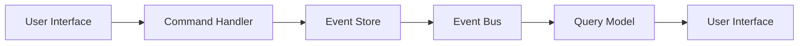

## 5.2 Command Query Responsibility Segregation (CQRS) in Clojure

Command Query Responsibility Segregation (CQRS) is a powerful architectural pattern that separates the responsibilities of reading and writing data into distinct models. This separation allows for optimized performance, scalability, and security by tailoring each model to its specific operations. In this article, we will explore how to implement CQRS in Clojure, leveraging its functional programming paradigms and modern libraries.

### Introduction to CQRS

CQRS is based on the principle that command operations (writes) and query operations (reads) have different requirements and should be handled separately. This separation allows for:

- **Optimized Performance:** By using different models for reading and writing, each can be optimized for its specific use case.
- **Scalability:** Systems can scale independently for read and write operations, allowing for more efficient resource utilization.
- **Security:** Different models can enforce different security policies, ensuring that sensitive operations are protected.

### Detailed Explanation

In Clojure, implementing CQRS involves creating separate namespaces or components for handling commands and queries. This separation is achieved through the use of functional programming constructs, such as functions, atoms, and namespaces.

#### Command Handlers

Command handlers are responsible for processing write operations. They validate input, apply business logic, and record events that represent changes to the system state.

```clojure
(ns orders.commands)

(defn place-order [order-data]
  ;; Validate and process order placement
  (record-event (->OrderPlaced (:order-id order-data) (:items order-data) (System/currentTimeMillis))))
```

In this example, the `place-order` function processes an order by recording an `OrderPlaced` event. This event can then be used to update the system's state.

#### Query Functions

Query functions handle read operations. They retrieve data from the current state, which may be stored in a denormalized or materialized view for efficient access.

```clojure
(ns orders.queries)

(defn get-order [order-id]
  (get current-state order-id))
```

The `get-order` function retrieves an order's details from the current state, which is maintained separately from the command model.

#### Separation of Command and Query Logic

To maintain a clear separation between command and query logic, organize your code into separate namespaces or modules. For example, you might have `orders.commands` for command handlers and `orders.queries` for query functions.

#### Using Separate Data Models

In CQRS, it's common to use different data models for commands and queries. The command model may use events to represent changes, while the query model may use denormalized views for efficient reads.

```clojure
(def materialized-view (atom {}))

(defn update-view [event]
  (swap! materialized-view apply-event event))

;; Update view whenever an event is recorded
(add-watch event-log :update-view
           (fn [_ _ _ events]
             (update-view (last events))))
```

In this example, a materialized view is maintained using an atom. The view is updated whenever an event is recorded, ensuring that queries have access to the latest data.

#### Implementing Messaging or Event Bus

To decouple command and query operations, use a messaging or event bus system. Commands result in events that are published to subscribers, allowing different parts of the system to react independently.

### Visual Aids

To better understand the CQRS pattern, consider the following diagram illustrating the separation of command and query models:



This diagram shows how commands are processed by the command handler, recorded in the event store, and then published to an event bus. The query model subscribes to these events to update its state, which is then used to serve read requests.

### Code Examples

Let's look at a practical example of implementing CQRS in Clojure:

```clojure
(ns cqrs-example.core
  (:require [clojure.core.async :as async]))

(def event-log (atom []))
(def materialized-view (atom {}))

(defn record-event [event]
  (swap! event-log conj event)
  (async/put! event-bus event))

(defn place-order [order-data]
  (let [event {:type :order-placed :order-id (:order-id order-data) :items (:items order-data)}]
    (record-event event)))

(defn get-order [order-id]
  (get @materialized-view order-id))

(defn apply-event [view event]
  (case (:type event)
    :order-placed (assoc view (:order-id event) event)
    view))

(def event-bus (async/chan))

(async/go-loop []
  (when-let [event (async/<! event-bus)]
    (swap! materialized-view apply-event event)
    (recur)))
```

In this example, we use Clojure's `core.async` library to implement an event bus. Events are recorded and published to the event bus, where they are processed to update the materialized view.

### Use Cases

CQRS is particularly useful in scenarios where:

- **High Read/Write Disparity:** Systems with a high volume of read operations compared to write operations can benefit from optimized query models.
- **Complex Business Logic:** Systems with complex business rules can use CQRS to separate concerns and simplify logic.
- **Scalability Requirements:** Systems that need to scale independently for read and write operations can leverage CQRS for efficient resource management.

### Advantages and Disadvantages

**Advantages:**

- Improved performance and scalability by separating read and write operations.
- Enhanced security through tailored models for different operations.
- Simplified business logic by separating concerns.

**Disadvantages:**

- Increased complexity due to maintaining separate models and synchronization.
- Potential for eventual consistency issues if not managed properly.

### Best Practices

- **Use Event Sourcing:** Combine CQRS with event sourcing to maintain a complete history of changes and enable easy state reconstruction.
- **Ensure Consistency:** Implement mechanisms to ensure consistency between command and query models, such as eventual consistency or strong consistency where necessary.
- **Leverage Clojure's Strengths:** Use Clojure's functional programming features, such as immutability and concurrency primitives, to implement CQRS effectively.

### Comparisons

CQRS can be compared to other architectural patterns like:

- **Event Sourcing:** Often used together with CQRS to provide a complete audit trail of changes.
- **Microservices:** CQRS can be applied within microservices to separate concerns and improve scalability.

### Conclusion

CQRS is a powerful pattern for optimizing performance, scalability, and security in Clojure applications. By separating command and query responsibilities, developers can create systems that are more efficient and easier to maintain. With Clojure's functional programming features and modern libraries, implementing CQRS becomes a straightforward and rewarding endeavor.

## Quiz Time!



### What is the primary purpose of CQRS?

- [x] To separate read and write operations into distinct models
- [ ] To combine read and write operations into a single model
- [ ] To enhance security by encrypting data
- [ ] To simplify database schemas

> **Explanation:** CQRS separates read and write operations into distinct models to optimize performance and scalability.

### Which Clojure feature is commonly used to implement an event bus in CQRS?

- [ ] Atoms
- [ ] Refs
- [x] core.async
- [ ] Protocols

> **Explanation:** Clojure's `core.async` library is often used to implement an event bus for asynchronous communication.

### In CQRS, what is the role of a command handler?

- [x] To process write operations and record events
- [ ] To retrieve data from the query model
- [ ] To update the materialized view
- [ ] To manage user authentication

> **Explanation:** Command handlers process write operations and record events that represent changes to the system state.

### What is a materialized view in the context of CQRS?

- [ ] A view that combines command and query logic
- [x] A denormalized view used for efficient reads
- [ ] A view that encrypts data for security
- [ ] A view that logs all system events

> **Explanation:** A materialized view is a denormalized view used in the query model for efficient data retrieval.

### How does CQRS improve scalability?

- [x] By allowing read and write operations to scale independently
- [ ] By combining all operations into a single model
- [ ] By reducing the number of database queries
- [ ] By encrypting all data

> **Explanation:** CQRS allows read and write operations to scale independently, optimizing resource utilization.

### What is a potential disadvantage of CQRS?

- [ ] Simplified business logic
- [x] Increased complexity due to separate models
- [ ] Improved performance
- [ ] Enhanced security

> **Explanation:** CQRS can increase complexity due to the need to maintain and synchronize separate models.

### Which pattern is often used in conjunction with CQRS?

- [ ] Singleton
- [ ] Factory
- [x] Event Sourcing
- [ ] Adapter

> **Explanation:** Event Sourcing is often used with CQRS to maintain a complete history of changes and enable state reconstruction.

### What is a key benefit of using CQRS in systems with complex business logic?

- [x] Simplified logic by separating concerns
- [ ] Increased database queries
- [ ] Combined read and write operations
- [ ] Reduced security

> **Explanation:** CQRS simplifies complex business logic by separating concerns into distinct command and query models.

### How does CQRS enhance security?

- [ ] By encrypting all data
- [x] By allowing different security policies for read and write models
- [ ] By combining all operations into a single model
- [ ] By reducing the number of user interactions

> **Explanation:** CQRS enhances security by allowing different security policies to be applied to read and write models.

### True or False: CQRS is only suitable for large-scale systems.

- [ ] True
- [x] False

> **Explanation:** While CQRS is beneficial for large-scale systems, it can also be applied to smaller systems where separation of concerns and optimization are needed.


