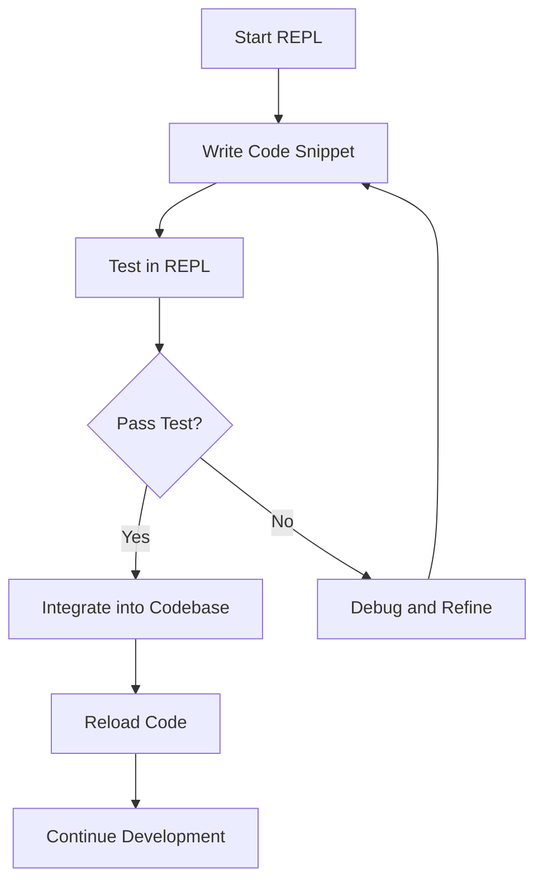

## 5.20. REPL-Driven Development Pattern

### Introduction

The REPL (Read-Eval-Print Loop) is a cornerstone of Clojure development, offering a dynamic and interactive environment that facilitates rapid experimentation and feedback. Embracing the REPL-driven development pattern allows developers to iteratively build, test, and refine their code in real-time, enhancing productivity and creativity. In this section, we will delve into the principles of REPL-driven development, demonstrate how to integrate REPL usage into your workflow, and provide tips for effective utilization. We will also explore the benefits of this approach for debugging and code exploration, encouraging its adoption for increased productivity.

### Principles of REPL-Driven Development

REPL-driven development is a methodology that emphasizes the use of the REPL as an integral part of the development process. The key principles include:

1. **Interactive Exploration**: Use the REPL to explore libraries, functions, and data structures interactively. This allows for immediate feedback and understanding of how components behave.

2. **Incremental Development**: Build your application incrementally by writing small pieces of code and testing them immediately in the REPL. This helps in catching errors early and refining logic continuously.

3. **Rapid Feedback Loop**: The REPL provides instant feedback on code execution, enabling quick iterations and adjustments. This is particularly useful for testing hypotheses and debugging.

4. **Live Coding**: Modify and test code in real-time without restarting the application. This is facilitated by the REPL's ability to evaluate code snippets on-the-fly.

5. **Seamless Integration**: Integrate the REPL into your development environment to streamline the workflow and enhance productivity.

### Integrating REPL Usage into the Development Workflow

To effectively integrate REPL-driven development into your workflow, consider the following steps:

#### Setting Up the REPL Environment

1. **Choose a REPL-Friendly Editor**: Select an editor or IDE that supports REPL integration, such as Emacs with CIDER, IntelliJ with Cursive, or Visual Studio Code with Calva.

2. **Start the REPL**: Launch the REPL from your development environment. This can typically be done with a command or shortcut specific to your setup.

3. **Connect the REPL to Your Project**: Ensure that the REPL is connected to your project, allowing you to evaluate code within the context of your application.

#### Developing with the REPL

1. **Evaluate Code Snippets**: Write and evaluate small code snippets directly in the REPL to test functionality and behavior.

2. **Reload Code**: Use tools like `tools.namespace` to reload modified code without restarting the REPL. This maintains the state and context, allowing for seamless development.

3. **Test Functions**: Define and test functions in the REPL before integrating them into your codebase. This helps in verifying logic and catching errors early.

4. **Experiment with Libraries**: Load and experiment with external libraries in the REPL to understand their APIs and capabilities.

5. **Debugging**: Use the REPL to inspect variables, evaluate expressions, and test fixes in real-time, making debugging more efficient.

### Tips for Effective REPL Usage

To maximize the benefits of REPL-driven development, consider the following tips:

1. **Organize Your Code**: Keep your code organized and modular to facilitate easy evaluation and reloading in the REPL.

2. **Use REPL Shortcuts**: Familiarize yourself with REPL shortcuts and commands to streamline your workflow and increase efficiency.

3. **Leverage REPL History**: Utilize the REPL's command history to quickly access and re-evaluate previous expressions.

4. **Document Your REPL Sessions**: Keep notes of important findings and experiments conducted in the REPL for future reference.

5. **Automate Common Tasks**: Create scripts or functions for repetitive tasks to automate them within the REPL.

### Benefits of REPL-Driven Development

Adopting the REPL-driven development pattern offers several benefits:

1. **Enhanced Productivity**: The rapid feedback loop and interactive nature of the REPL allow for faster development and iteration.

2. **Improved Debugging**: The ability to inspect and modify code in real-time makes debugging more efficient and effective.

3. **Increased Understanding**: Interactive exploration of code and libraries deepens understanding and facilitates learning.

4. **Creative Experimentation**: The REPL encourages experimentation and creativity, allowing developers to test new ideas quickly.

5. **Seamless Integration**: The REPL integrates seamlessly with the development environment, providing a cohesive and efficient workflow.

### Encouraging Adoption of REPL-Driven Development

To encourage the adoption of REPL-driven development, consider the following strategies:

1. **Educate and Train**: Provide training and resources to help developers understand and utilize the REPL effectively.

2. **Promote Best Practices**: Share best practices and tips for REPL usage to enhance productivity and efficiency.

3. **Foster a Collaborative Environment**: Encourage collaboration and knowledge sharing among team members to leverage the collective expertise.

4. **Highlight Success Stories**: Share success stories and case studies that demonstrate the benefits of REPL-driven development.

5. **Continuously Improve**: Encourage continuous improvement and adaptation of REPL-driven practices to meet evolving needs and challenges.

### Try It Yourself

To get hands-on experience with REPL-driven development, try the following exercises:

1. **Experiment with Core Functions**: Load the Clojure core library in the REPL and experiment with various functions to understand their behavior.

2. **Build a Simple Application**: Start with a simple application and incrementally develop it using the REPL, testing each component as you go.

3. **Debug a Sample Code**: Introduce a bug in a sample code and use the REPL to identify and fix it.

4. **Explore a New Library**: Choose a new library and explore its features and capabilities in the REPL.

5. **Automate a Task**: Identify a repetitive task and create a script or function to automate it within the REPL.

### Visualizing REPL-Driven Development Workflow

To better understand the REPL-driven development workflow, let's visualize the process using a flowchart:

**Figure 1**: Visualizing the REPL-driven development workflow, highlighting the iterative process of writing, testing, and refining code.

### Key Takeaways

- **Interactive Exploration**: Use the REPL for interactive exploration and understanding of code and libraries.
- **Incremental Development**: Build applications incrementally, testing each component in the REPL.
- **Rapid Feedback**: Leverage the REPL's rapid feedback loop for efficient development and debugging.
- **Seamless Integration**: Integrate the REPL into your development environment for a cohesive workflow.
- **Encourage Adoption**: Promote the adoption of REPL-driven development through education, best practices, and success stories.

### Ready to Test Your Knowledge?



### What is the primary benefit of REPL-driven development?

- [x] Rapid feedback and iteration
- [ ] Automated testing
- [ ] Code obfuscation
- [ ] Static analysis

> **Explanation:** The primary benefit of REPL-driven development is the rapid feedback and iteration it provides, allowing developers to test and refine code in real-time.

### Which tool is commonly used for reloading code in the REPL?

- [ ] Leiningen
- [x] tools.namespace
- [ ] Ring
- [ ] Compojure

> **Explanation:** `tools.namespace` is commonly used for reloading code in the REPL, allowing developers to update code without restarting the REPL session.

### What is a key principle of REPL-driven development?

- [ ] Code obfuscation
- [x] Interactive exploration
- [ ] Static typing
- [ ] Automated deployment

> **Explanation:** Interactive exploration is a key principle of REPL-driven development, enabling developers to explore and understand code and libraries interactively.

### How can you automate repetitive tasks in the REPL?

- [ ] By using macros
- [x] By creating scripts or functions
- [ ] By using static analysis tools
- [ ] By writing inline comments

> **Explanation:** Repetitive tasks can be automated in the REPL by creating scripts or functions that encapsulate the task logic.

### What is a common practice when using the REPL for debugging?

- [ ] Writing inline comments
- [x] Inspecting variables and evaluating expressions
- [ ] Using static analysis tools
- [ ] Obfuscating code

> **Explanation:** A common practice when using the REPL for debugging is inspecting variables and evaluating expressions to understand and fix issues.

### Which editor is known for its REPL integration with Clojure?

- [ ] Sublime Text
- [x] Emacs with CIDER
- [ ] Notepad++
- [ ] Atom

> **Explanation:** Emacs with CIDER is known for its excellent REPL integration with Clojure, providing a seamless development experience.

### What is the role of the REPL in live coding?

- [ ] To compile code
- [x] To modify and test code in real-time
- [ ] To obfuscate code
- [ ] To perform static analysis

> **Explanation:** The REPL plays a crucial role in live coding by allowing developers to modify and test code in real-time without restarting the application.

### What is a benefit of documenting REPL sessions?

- [ ] Code obfuscation
- [ ] Static analysis
- [x] Future reference and learning
- [ ] Automated deployment

> **Explanation:** Documenting REPL sessions provides a valuable reference for future learning and understanding of experiments conducted in the REPL.

### What is a recommended practice for organizing code in REPL-driven development?

- [ ] Using global variables
- [x] Keeping code organized and modular
- [ ] Writing inline comments
- [ ] Obfuscating code

> **Explanation:** Keeping code organized and modular is a recommended practice in REPL-driven development to facilitate easy evaluation and reloading.

### True or False: The REPL can be used for static analysis of code.

- [ ] True
- [x] False

> **Explanation:** The REPL is not used for static analysis of code; it is an interactive environment for evaluating and testing code in real-time.



Remember, this is just the beginning. As you progress, you'll build more complex and interactive applications using the REPL-driven development pattern. Keep experimenting, stay curious, and enjoy the journey!
