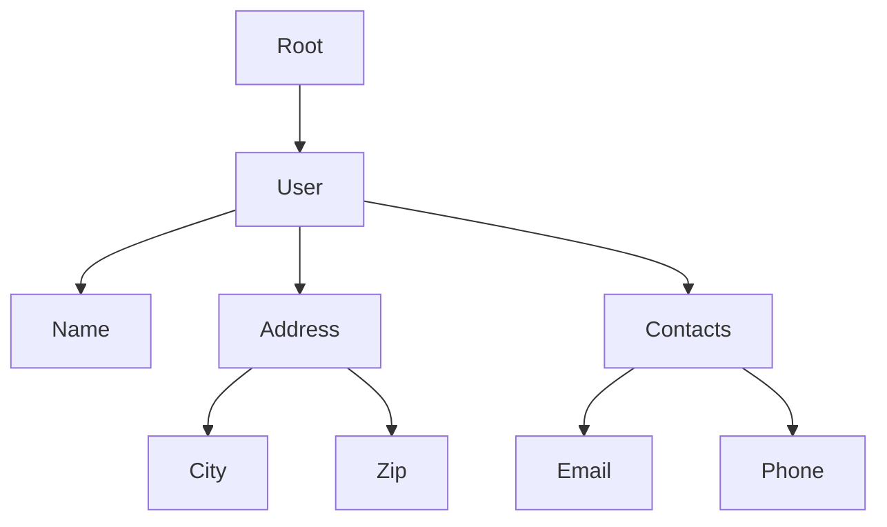

## 5.21. Specter for Navigating and Transforming Data

### Introduction

In the world of functional programming, Clojure stands out with its emphasis on immutability and data-centric design. However, working with deeply nested data structures can be a daunting task. Navigating and transforming such structures often leads to verbose and error-prone code. Enter **Specter**, a powerful Clojure library designed to simplify and optimize these operations. In this section, we will explore how Specter can revolutionize the way you handle nested data, making your code more concise, expressive, and efficient.

### The Challenges of Working with Nested Data

Nested data structures are ubiquitous in software development, especially when dealing with complex JSON responses, configuration files, or hierarchical data models. In Clojure, these structures are typically represented using maps, vectors, and lists. While Clojure provides robust tools for manipulating these data types, the syntax can become cumbersome when dealing with deeply nested elements.

Consider the following nested map:

```clojure
(def data
  {:user {:name "Alice"
          :address {:city "Wonderland"
                    :zip "12345"}
          :contacts [{:type "email" :value "alice@example.com"}
                     {:type "phone" :value "555-1234"}]}})
```

Accessing or updating deeply nested values in such a structure often involves a series of `get` and `assoc` calls, which can be verbose and error-prone:

```clojure
;; Accessing a nested value
(get-in data [:user :address :city])

;; Updating a nested value
(assoc-in data [:user :address :city] "New Wonderland")
```

### Introducing Specter

Specter offers a more elegant solution for navigating and transforming nested data structures. It provides a set of composable navigators that allow you to succinctly express complex queries and updates. Specter's approach is inspired by the concept of lenses in functional programming, which provide a way to focus on specific parts of a data structure.

#### Key Features of Specter

- **Concise Syntax**: Specter reduces boilerplate code by providing a declarative way to specify paths through data structures.
- **Composable Navigators**: Specter allows you to compose navigators to create complex queries and transformations.
- **Performance Optimization**: Specter is designed for efficiency, often outperforming traditional methods for data manipulation.

### Navigating Data with Specter

Specter's core functionality revolves around the concept of **navigators**. Navigators define paths through data structures, allowing you to focus on specific elements. Let's explore some basic navigators and how they can be used.

#### Basic Navigators

- **`ALL`**: Navigates to every element in a collection.
- **`MAP-VALS`**: Navigates to all values in a map.
- **`FIRST`** and **`LAST`**: Navigate to the first and last elements of a collection, respectively.

#### Example: Accessing Nested Data

Let's revisit our nested data example and use Specter to access the city name:

```clojure
(require '[com.rpl.specter :refer [select ALL MAP-VALS]])

(select [:user :address :city] data)
;; => ["Wonderland"]
```

Here, `select` is used to retrieve the value at the specified path. The path is defined using a combination of keywords and navigators.

### Transforming Data with Specter

Specter not only allows you to navigate data but also to transform it efficiently. The `transform` function is used to apply a transformation to the elements at a specified path.

#### Example: Updating Nested Data

Suppose we want to update the city name in our data structure. With Specter, this can be done concisely:

```clojure
(require '[com.rpl.specter :refer [transform]])

(transform [:user :address :city] (constantly "New Wonderland") data)
;; => {:user {:name "Alice", :address {:city "New Wonderland", :zip "12345"}, :contacts [{:type "email", :value "alice@example.com"} {:type "phone", :value "555-1234"}]}}
```

In this example, `transform` applies the function `(constantly "New Wonderland")` to the element at the specified path, effectively updating the city name.

### Composing Navigators

One of Specter's strengths is its ability to compose navigators to perform complex operations. Let's explore some scenarios where this capability shines.

#### Example: Updating All Email Contacts

Suppose we want to update all email contacts in our data structure to a new domain. We can achieve this using a combination of navigators:

```clojure
(transform [:user :contacts ALL (fn [contact] (= (:type contact) "email")) :value]
           #(str/replace % #"@example.com" "@newdomain.com")
           data)
;; => {:user {:name "Alice", :address {:city "Wonderland", :zip "12345"}, :contacts [{:type "email", :value "alice@newdomain.com"} {:type "phone", :value "555-1234"}]}}
```

Here, we use `ALL` to navigate through all contacts, and a custom function to filter email contacts. The `transform` function then updates the email addresses.

### Performance Benefits

Specter is not only about syntactic elegance; it also offers significant performance benefits. Traditional methods of data manipulation often involve creating intermediate copies of data structures, which can be inefficient. Specter optimizes these operations, reducing the overhead associated with data transformations.

#### Benchmarking Specter

To illustrate Specter's performance advantages, consider a scenario where we need to update a deeply nested value in a large data structure. Specter can perform this operation more efficiently than traditional methods, especially as the size and complexity of the data increase.

### Use Cases for Specter

Specter is particularly useful in scenarios involving complex data transformations, such as:

- **Data Cleaning and Transformation**: Specter can be used to clean and transform data in ETL pipelines, making it a valuable tool for data engineering tasks.
- **Configuration Management**: When dealing with complex configuration files, Specter simplifies the process of querying and updating nested settings.
- **JSON Manipulation**: Specter excels in manipulating JSON data, providing a more expressive alternative to traditional methods.

### Try It Yourself

To get hands-on experience with Specter, try modifying the code examples provided in this section. Experiment with different navigators and transformations to see how Specter can simplify your data manipulation tasks.

### Visualizing Specter's Data Navigation

To better understand how Specter navigates and transforms data, let's visualize a simple data structure and the path taken by Specter navigators.



In this diagram, the path `[:user :address :city]` navigates from the root to the city node, illustrating how Specter focuses on specific parts of the data structure.

### Conclusion

Specter is a powerful tool for navigating and transforming nested data structures in Clojure. Its concise syntax, composable navigators, and performance optimizations make it an invaluable addition to any Clojure developer's toolkit. By leveraging Specter, you can write more expressive and efficient code, transforming complex data manipulation tasks into straightforward operations.

### External Resources

For more information on Specter, visit the [Specter GitHub repository](https://github.com/redplanetlabs/specter).

## **Ready to Test Your Knowledge?**



### What is the primary benefit of using Specter in Clojure?

- [x] Simplifies navigation and transformation of nested data structures
- [ ] Provides a new data type for Clojure
- [ ] Replaces all existing Clojure data manipulation functions
- [ ] Offers a graphical interface for data manipulation

> **Explanation:** Specter simplifies the process of navigating and transforming nested data structures, making it more concise and efficient.

### Which function in Specter is used to retrieve data from a nested structure?

- [ ] `assoc`
- [x] `select`
- [ ] `transform`
- [ ] `get-in`

> **Explanation:** The `select` function is used in Specter to retrieve data from a specified path in a nested structure.

### How does Specter improve performance over traditional methods?

- [x] By reducing the creation of intermediate data structure copies
- [ ] By using a different programming language
- [ ] By storing data in a database
- [ ] By using machine learning algorithms

> **Explanation:** Specter optimizes data transformations by reducing the overhead associated with creating intermediate copies of data structures.

### What is a navigator in Specter?

- [x] A component that defines a path through a data structure
- [ ] A new data type in Clojure
- [ ] A function for sorting data
- [ ] A tool for debugging Clojure code

> **Explanation:** A navigator in Specter defines a path through a data structure, allowing you to focus on specific elements for navigation and transformation.

### Which Specter navigator would you use to navigate to every element in a collection?

- [ ] `FIRST`
- [ ] `LAST`
- [x] `ALL`
- [ ] `MAP-VALS`

> **Explanation:** The `ALL` navigator is used to navigate to every element in a collection.

### What is the purpose of the `transform` function in Specter?

- [x] To apply a transformation to elements at a specified path
- [ ] To retrieve data from a nested structure
- [ ] To create a new data structure
- [ ] To delete elements from a data structure

> **Explanation:** The `transform` function in Specter is used to apply a transformation to elements at a specified path in a data structure.

### Which of the following is a use case where Specter excels?

- [x] JSON manipulation
- [ ] Compiling Clojure code
- [ ] Network communication
- [ ] User interface design

> **Explanation:** Specter excels in manipulating JSON data, providing a more expressive alternative to traditional methods.

### What is the role of the `MAP-VALS` navigator in Specter?

- [x] Navigates to all values in a map
- [ ] Navigates to the first element in a collection
- [ ] Navigates to the last element in a collection
- [ ] Navigates to all keys in a map

> **Explanation:** The `MAP-VALS` navigator is used to navigate to all values in a map.

### True or False: Specter can only be used with maps in Clojure.

- [ ] True
- [x] False

> **Explanation:** Specter can be used with various Clojure data structures, including maps, vectors, and lists.

### Which of the following best describes Specter's approach to data manipulation?

- [x] Declarative and composable
- [ ] Imperative and sequential
- [ ] Object-oriented and hierarchical
- [ ] Procedural and linear

> **Explanation:** Specter's approach to data manipulation is declarative and composable, allowing for concise and expressive data transformations.



Remember, this is just the beginning. As you progress, you'll discover more ways to leverage Specter for efficient data manipulation in Clojure. Keep experimenting, stay curious, and enjoy the journey!
